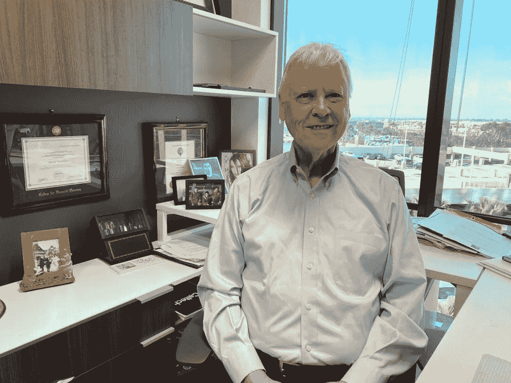
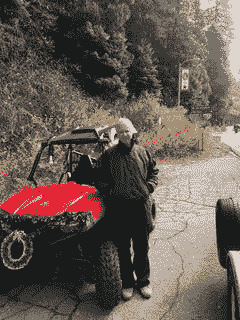

# “社会责任投资(SRI)的 5 大风险”Steven Yamashon 博士和 Breana Patel

> 原文：<https://medium.datadriveninvestor.com/5-risks-in-socially-responsible-investing-sri-dr-steven-yamashon-and-breana-patel-1907de645d77?source=collection_archive---------4----------------------->

> 环境、社会和公司治理投资是未来的趋势，石油股可能会成为传统的烟草股，被大多数投资经理所回避。

在 Bonova Advisory，我们就金融、银行和技术领域的各种话题采访高管、名人、有影响力的人士和行业思想领袖。

我很荣幸地采访了[惠利金融服务集团(BFSG)](http://www.sfpria.com/team/steven-lee-yamshon) 的总经理 Steven Yamshon 博士。他领导福利金融服务集团的环境和社会责任投资工作。

凭借超过 35 年的经验、牛津大学(Said 商学院)的四个硕士学位和加州大学洛杉矶分校的金融、经济和管理博士学位，Steve 为资产配置、投资管理和证券选择提供了深刻的见解。他在雪松西奈医疗中心董事会任职，热衷于环境影响和为社会做好事。

**非常感谢你和我们一起做这件事！你的“背景故事”是什么？**

在我的童年和青少年时期，我一直对户外和环境感兴趣。15 岁那年，在童子军营地，我经历了一个改变人生的时刻。我看见一个穿制服的男人开着一辆绿色卡车，他看起来令人印象深刻。那天晚些时候，我发现他是一名美国护林员。就在那时，我决定自己也成为其中一员。我在加州州立大学萨克拉门托分校学习自然资源管理，在加州理工学院学习工程管理。完美的组合。我的第一份工作是在美国林务局的工程部门，当时我是一个团队的成员，该团队正在研究首批国家环境保护法案(NEPA)报告之一。我对政治有了足够的了解，知道政府工作不适合我，我想在私营企业工作。然而，从那以后，我一直关注自然资源管理和环境问题。从林务局出来后，我一直在投资管理领域工作，并在农田、环境和自然资源投资方面积累了专业知识

**可以分享一下你从业以来，发生在你身上最有趣的故事吗？**

当我在牛津时，我写了一篇关于如何发展一个用于碳封存的植树造林的论文。当时我一点也不知道，这个在南美的雄心勃勃的项目正处于许多政府和非政府机构的前沿，他们正考虑用树木来抵消碳排放。从本质上来说，该项目旨在允许需要碳信用的公司对这个林场进行投资，并利用投资来交易碳信用。早在这个术语流行起来之前，它就是一种社会影响投资。我认为为土著人提供 150 个工作岗位是计划的一部分。不幸的是，我们无法获得资助，但我知道大约三年前，另一个小组开始了一个类似的项目。我认为这类项目有利于绿色工作、环境和当地经济

**成功的投资者正在认识到气候变化和可持续性的重要性。你如何将这些转化为你投资组合的净收益？**

关于气候变化有很多争议。一些人不相信这是真的，而另一些人则相信我们所知的生命即将结束。虽然有充分的证据表明气候变化是人为的，主要是由化石燃料和碳排放造成的，但在我看来，这并没有 100%得到证实。无论如何，地球正在变暖，要么是由于行星系统的自然发展，要么是由于温室气体。

 [## 算法交易的机器学习|数据驱动的投资者

### 当你的一个朋友在脸书上传你的新海滩照，平台建议给你的脸加上标签，这是…

www.datadriveninvestor.com](https://www.datadriveninvestor.com/2019/01/30/machine-learning-for-stock-market-investing/) 

我认为，我们接受气候变化是人为的，并为此做些什么，这是一个很好的保险政策。所有政府都在承诺减少温室气体排放，但实际上做得太少。为什么不把指针移得更远一点，用现实的温室气体减排目标来平衡人类和经济需求呢？

像我这样的投资经理需要认识到气候变化及其对投资的影响。我读过很多关于气候变化对树木、植物、农田和林地影响的研究。我的研究如何影响投资者及其投资组合？有两个很能说明问题的例子来说明我的观点。如果一群投资者在新英格兰各州购买了一大片木材，并将他们的购买建立在这片土地上，拥有某种树木，如樱桃、糖枫、白蜡树和铁杉，难道他或她不想知道这些树木在 50 到 100 年后是否还能存活吗？毕竟，木材生产是一个漫长的过程。问题变成了；气候变化如何影响我提到的那些树。我的模型显示，随着时间的推移，气候变化将改变新英格兰的景观生态和树木构成。

> 第二个例子是加利福尼亚的农田。气候变暖将影响内华达山脉的积雪，导致降雪量减少。更少的雪意味着加州农民可以汲取的水将会更少。自从 2022 年加州对抽取地下水的新的用水限制生效后，农民们可以利用的水将会减少。这可能会导致农田价值大幅下降。哪里有负面，哪里就有机会。在加州购买水权可能会被证明是有利可图的，使用林地作为碳汇也可能是一个机会，而不是砍伐树木。

根据您在这一领域的经验，社会责任投资的最大风险是什么？

环境、社会和治理(ESG)投资对投资领域来说还是一个相当新的领域，尽管一些共同基金公司已经为投资者设立了社会意识基金。ESG 投资的有趣之处在于，ESG 基金并没有固定的定义。一些 ESG 基金拥有“同类最佳”的石油公司。也许一些分析家认为某个特定的石油公司会减少污染。一些 ESG 基金不包括石油，但包括化工和矿业公司。

1.  一个风险是，对于什么是 ESG 基金，没有一个固定的标准？
2.  其次，一个重要的问题是，如何衡量绩效并将其与基准进行比较，或者您使用哪种风险指标。我认为，SEC 正在密切关注投资经理如何推广他们的 ESG 投资。
3.  另一个风险是发现投资者是否愿意接受 ESG 投资相对于标准普尔 500 指数基金可能更低的回报。我怀疑有些人会接受较低回报的可能性。我的直觉是，环境、社会和公司治理投资是未来的趋势，石油股可能会成为传统的烟草股，被大多数投资经理所回避。这些都是小问题，随着时间的推移会自行解决

**你是一个很有影响力的人。如果你能激发一场运动，为最多的人带来最多的好处，那会是什么？你永远不知道你的想法会引发什么。:-)**

我认为，更好地利用和管理我们的森林资源将为最多的人带来最大的好处。这个国家有大量的森林和林地可再生资源。我们的国家森林是世界上无与伦比的。森林提供水、木材、娱乐、野生动物和矿物质。我们需要更明智地管理这些森林。例如，森林需要不时地进行间伐，因为间伐后的森林不太容易遭受虫害和毁灭性的火灾。变薄的木材可以用来建造房屋和低层到中层建筑。被砍伐和加工的木材仍然储存着碳，所以不管是被砍伐还是未被砍伐的木材都是抵消温室气体的巨大碳汇。也许木材使用的增加会减少混凝土的使用，而混凝土在生产过程中是一个很大的温室气体排放源。大片未被砍伐的国家林地可以起到碳抵消的作用。美国南部植树造林的增加可以为建筑提供木材。木材是世界上最大的可再生资源之一

商业、风险投资、体育和娱乐领域的一些知名人士阅读了这篇专栏文章。世界上有没有一个人是你愿意与之共进私人早餐或午餐的，为什么？如果我们标记他们，他或她可能会看到这一点🙂。

在风险投资界，我希望见到汤姆·斯泰尔，因为我认为他在环境方面做了一些伟大的事情。在投资界，我很想和比尔·盖茨谈谈他如何看待气候变化对投资组合的风险。最后，乔阿金·菲尼克斯和莱昂纳多·迪卡普里奥可能会对我关于环境社会影响投资的一些想法感兴趣，这些投资可以为投资者带来良好的回报，同时对人类和环境有益。

**你能给我们讲讲你最喜欢的“人生格言”吗？你能分享一下这和你的生活有什么关系吗？**

当我从哈佛商学院毕业站在讲台上时，马蒂·马歇尔教授在我耳边轻声说道:“回家去做一些重大的、大胆的事情吧。”他的意思是要胸怀大志，不要害怕失败。设定大目标，大多数情况下，你会完成它们，不要忘记跳出框框思考。这些年来，马蒂对我说的那些话让我受益匪浅。

**人们怎样才能关注你，了解你更多？**

[https://www.bfsg.com/our-team/](https://www.bfsg.com/our-team/)

 [## 福利金融服务集团(BFSG 有限责任公司)

### BFSG 有限责任公司(“公司”)是美国证券交易委员会注册投资顾问。请记住不同类型的投资…

www.youtube.com](https://www.youtube.com/channel/UCR4TmgZFTQnGHu67BneScJA)