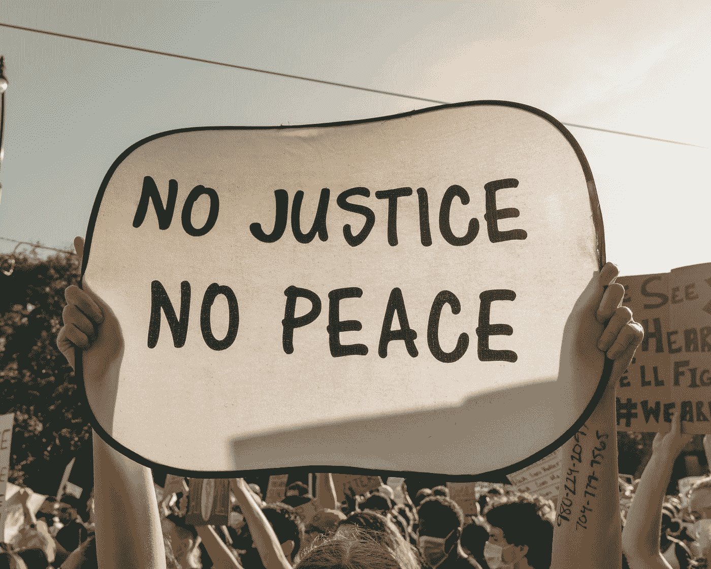
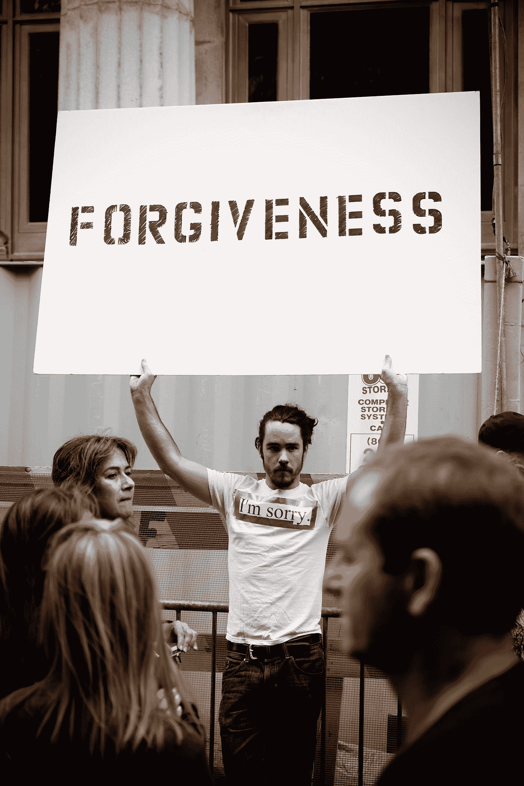
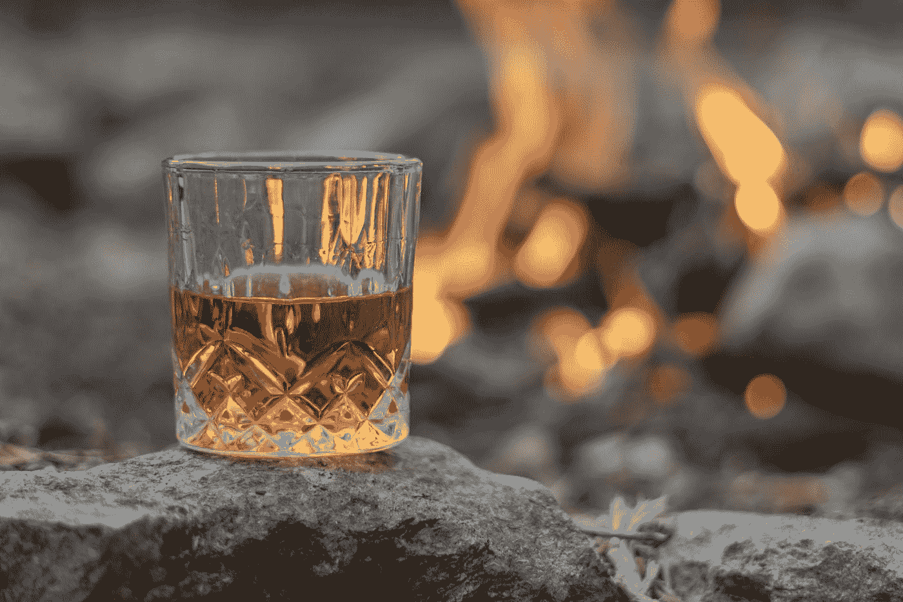

# 改变我生活的 5 种自我修复技术

> 原文：<https://medium.datadriveninvestor.com/5-self-healing-techniques-that-changed-my-life-fdbf15fec2b?source=collection_archive---------11----------------------->

Photo by [SOULSANA](https://unsplash.com/@soulsana?utm_source=medium&utm_medium=referral) on [Unsplash](https://unsplash.com?utm_source=medium&utm_medium=referral)

你有能力成为你想成为的任何人。我坚信这一点，因为我是它的产物。回到 2017 年，我很懒，对工作不满意，有吃垃圾食品的生活方式，不珍惜我拥有的关系。

当我学会自我修复技术时，事情开始发生变化。现在，我吃正确的食物，对我的工作生活极其满意，并且珍惜我所拥有的关系。通过这篇文章，你将了解 5 种神奇的自我修复技术。

# 1.在做出判断之前先学习

Photo by [Clay Banks](https://unsplash.com/@claybanks?utm_source=medium&utm_medium=referral) on [Unsplash](https://unsplash.com?utm_source=medium&utm_medium=referral)

几年前，我很快得出结论。2017 年，我偶然看到一个 Fakebook 帖子，一个女孩指责我的朋友在聚会上让她不舒服。我认识我的朋友，但却信任这个我一生中从未见过的女孩。原因是，我相信女人在这种情况下不会说这种假话。

和其他人一样，我也开始指责他，不知道背景故事。过了几天，事实证明，那个女生是因为我朋友在聚会上不接受她的求婚而生气的。

 [## 如何重新获得更大的成功|数据驱动型投资者

### 梅丽莎·拉姆森，拉姆森咨询公司的首席执行官，和梅根·m·比罗，分析师，品牌战略家…

www.datadriveninvestor.com](https://www.datadriveninvestor.com/2020/07/15/how-to-bounce-back-to-even-greater-success/) 

所以，出于愤怒，她指责我的朋友让她不舒服。为此我恨自己。我本可以打电话给他要求澄清，但是我没有。我的朋友原谅了我，因为他心胸宽广，但我不能带着这个遗憾活着。所以，在没有了解事情的全部之前，永远不要评价一个人。

# 2.进行深度放松

Photo by [Omid Armin](https://unsplash.com/@omidarmin?utm_source=medium&utm_medium=referral) on [Unsplash](https://unsplash.com?utm_source=medium&utm_medium=referral)

为了让这项技术发挥作用，您需要做三件事。首先，总是洗个热水澡，听听舒缓的音乐，当你紧张或生气时深呼吸。温水澡和轻柔的音乐会放松你的身心。深呼吸可以平静你的神经系统。

你会看到人们在生气或承受压力时深呼吸。这是因为深呼吸向你的大脑提供氧气，并唤醒副交感神经系统。一旦这条神经被激活，你的头脑就会达到一种平静的状态。

# 3.学会原谅

Photo by [Felix Koutchinski](https://unsplash.com/@koutchinski?utm_source=medium&utm_medium=referral) on [Unsplash](https://unsplash.com?utm_source=medium&utm_medium=referral)

我分手了。我暴怒，愤怒，崩溃。当她离开我的时候，我希望她的生活是地狱。分离的后果是难以想象的。我不去工作，几乎每天都喝酒，并对除我之外的任何有不同意见的人大喊大叫。

这种仇恨控制了我的生活。我妈妈告诉我宽恕是关键。她对我说如果你爱她，她离开了你，那是她的损失。她应该为失去像你这样的搭档而哭泣，而不是相反。

她告诉我要原谅她，让过去的事成为过去。专注于你的目标，祝福她。尊重你和她在一起的时间、回忆和爱情，继续生活。这个建议救了我的命。

# 4.喝醉时千万不要做决定

Photo by [Thomas Park](https://unsplash.com/@thomascpark?utm_source=medium&utm_medium=referral) on [Unsplash](https://unsplash.com?utm_source=medium&utm_medium=referral)

酒精是一种疯狂的东西。让你在不需要的时候建立自信。有好几次，你和我在酒后打电话给我们的前任或我们讨厌的人，说了一些不该说的话。后来我们后悔了。不要在酒精的影响下采取任何行动。如果你喝多了，就去睡觉。相信我，这会让你免于羞愧。

# 5.保持小圈子

Photo by [Felix Rostig](https://unsplash.com/@felixrstg?utm_source=medium&utm_medium=referral) on [Unsplash](https://unsplash.com?utm_source=medium&utm_medium=referral)

有一群谈论生产力的朋友。这是你成长的方式。不要把时间浪费在那些不准备帮助你或在你最需要的时候给你热情和信心的朋友身上。此外，拥有一群忠实的朋友，对私人谈话保密。你的朋友不应该在你们发生争执的时候把你的机密信息当成森林大火一样传播出去。

# 结果

这些自我修复技术让我的生活变得更好。我的心灵总是很放松，因为我知道如何应对一种情况。专注于这些技巧，并虔诚地遵循它们。你会开始看到自己的改变。

如果你喜欢我的作品，请继续关注 [**媒体**](https://medium.com/@hellogouravdas) ，并通过我的 [**LinkedIn**](https://www.linkedin.com/in/gourav-deep-das-b50a67182/) 进行商务合作。

## 访问专家视图— [订阅 DDI 英特尔](https://datadriveninvestor.com/ddi-intel)