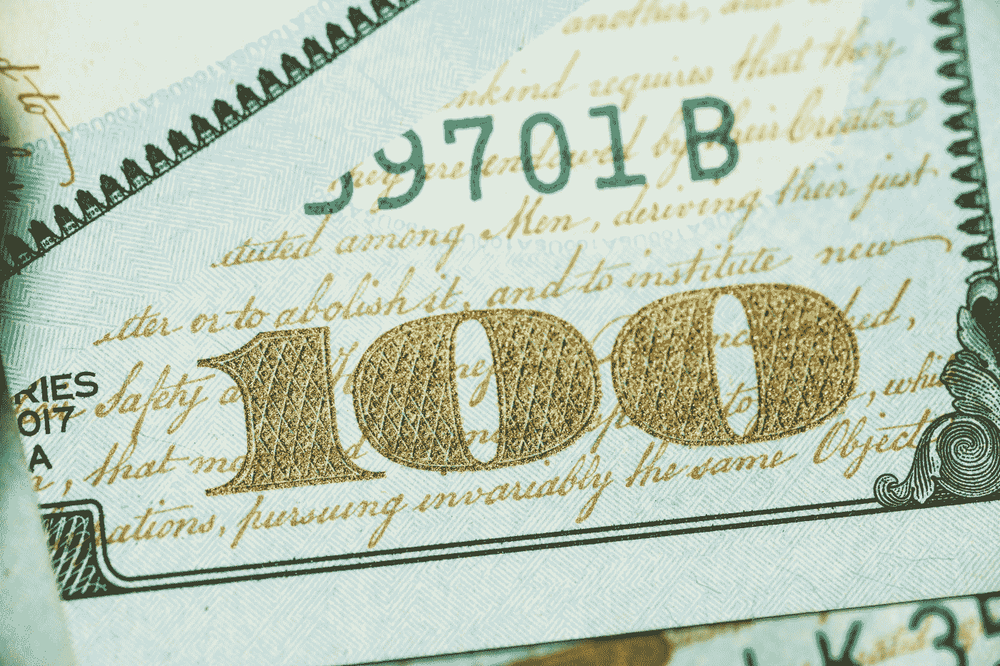

# 在疫情期间，5 方忙于赚取额外的现金

> 原文：<https://medium.datadriveninvestor.com/5-side-hustles-to-earn-extra-cash-during-the-pandemic-286ee2eeb578?source=collection_archive---------13----------------------->

## 总有办法赚更多的钱，我说的不是传销。

Photo by [Giorgio Trovato](https://unsplash.com/@giorgiotrovato?utm_source=medium&utm_medium=referral) on [Unsplash](https://unsplash.com?utm_source=medium&utm_medium=referral)

现在没有人会对额外的现金说不，有很多非金字塔计划的方法来赚额外的钱。

我们都有一些我们没有意识到可以从中受益的技能。例如，我开始画水彩画，向妈妈们出售可爱的动物画，为她们孩子的卧室作画，每月赚 500 美元。

不仅这些机会唾手可得，而且你还可以轻松赚钱。

 [## 后疫情经济中的基本 GTM 变革策略|数据驱动的投资者

### 新冠肺炎以一种新的不可想象的方式开展业务。这个疫情甚至强迫…

www.datadriveninvestor.com](https://www.datadriveninvestor.com/2020/08/11/an-essential-gtm-change-strategies-in-the-post-pandemic-economy/) 

让我们走完 5 条路线来多赚一枚硬币。我用这些方法在几个月内赚了 5000 多美元。

# 第一摄影

我知道不是每个人都有专业摄影师的技能，但这没关系。

当今社会，一部 iPhone 可以拍出高质量的照片；有时，比许多数码相机拍出的照片质量更高。

更重要的是，许多地方都愿意让你在网上出售你的作品。

## 购买你照片的网站

很多在线网站会允许你发布你的摄影作品，这给了人们一个购买你作品的机会。

以下是我使用的一些网站。

*   [**土坯库存**](https://stock.adobe.com)
*   [**Shutterstock**](https://www.shutterstock.com)
*   [**Etsy**](https://www.etsy.com/seller-handbook/)
*   
*   **[**凤头**](http://www.crestock.com)**
*   **[500 px](https://500px.com)**

## **赢得挑战**

**以上这些网站大多都有你可以进入的挑战；根据挑战的不同，您可以赢得$20-$5000 不等的奖金。**

**Twitter 也有摄影挑战；我用 iPhone 6 赢得了 200 美元的推特挑战，获得了最佳“动物照片”如果你搜索#photochallenge 标签，你会发现许多简介和链接，让你有机会在 iPhone 摄影或数码相机摄影中竞争。**

## **本地广告**

**许多人，尤其是在疫情期间，都试图节省资金。然而，我发现很多人都在寻找廉价摄影师或业余摄影师来拍摄自拍或其他简单的照片，报酬从 50 美元到 500 美元不等。我有一台便宜的数码相机，在过去的三个月里，我通过动物摄影和情侣摄影赚了 2500 美元。**

**你可以在这些地方找到当地的广告。**

*   ****脸书市场****
*   ****脸书集团****
*   ****有问必答****
*   ****隔壁 app****
*   ****其他社交媒体网站，如 Twitter 和 Instagram。****

# **第二艺术**

**几乎任何形式的艺术都可以赚钱，你甚至不需要有很高的技巧。例如，我为想要幼儿园艺术的母亲们画动物和设计的水彩画。根据它们是单件还是三件一套，我以 25 到 50 美元的价格出售每件作品。**

**除了水彩，还有许多其他类型的艺术可以让你在经济上受益。**

*   **水彩画、粉彩画或丙烯画。(20-50 美元用于供应。)**
*   **扎染衬衫。(10-20 美元用于供应。我以 25 美元的价格卖掉了每件扎染衬衫，在买了几包 t 恤后，总共赚了 300 美元。)**
*   **珠宝制作。(10-100 美元，取决于材料。)我花了大约 60 美元买珠子和其他必需品来制作彩虹骄傲珠宝。我卖了 20 美元的项链、15 美元的耳环和 10 美元的手镯。不到一个半月，我在 Etsy 和脸书市场卖出股票，赚了将近 400 美元。**

## **脸书集团**

**脸书有很多艺术和手工艺团体，大多数会让你分享你的产品。此外，还有专门针对小企业主的脸书小组，允许你张贴自制产品。**

## **艺术网站**

**一些允许您出售个性化自制艺术品的网站包括:**

*   **Etsy**
*   **通过易趣网购买**
*   **亚马孙**
*   **脸书市场**
*   **克雷格列表（网站名）**
*   **推特**
*   **装艺术的**
*   **萨奇亚特**

# **#3 现金技能**

**人们总是需要帮助，从庭院工作到遛狗。Nextdoor 是一个很棒的简单工作的本地应用程序。**

**这里有一些我赚钱的方法。**

*   **遛狗。在 app [Nextdoor](https://nextdoor.com) 中查询你当地的工作。(就像 Craigslist 只离家近。)我每天遛狗，每小时挣 40 美元。**
*   **庭院工作。你也可以在隔壁找到。我做园艺和必要的园艺工作，每周挣 300-500 美元。**
*   **送货。许多年纪较大的人，或者只是没有时间购物的人，会花一大笔钱让外卖送餐。我每周送食物挣 100-300 美元。**

**这些只是几个例子。在你所在的地区，有无数种方法可以通过使用该应用赚取现金。**

# **#4 卖掉你的东西**

**我有一个浏览旧货店和车库销售寻找酷的发现的习惯。有时，我会发现价值高达 1000 美元以上的物品。**

**这里有几个我用来卖东西的网站:**

*   **通过易趣网购买**
*   **亚马孙**
*   **脸书市场**
*   **时尚标志(服装)**
*   **从… 清理无用之物**
*   **市场升级**
*   **Letgo**
*   **Etsy**
*   **Ebid**

**当你在网上销售你的东西时，你要确保对你的产品做广泛的研究，不管多小。创建一个优秀的详细描述，以及错综复杂的照片，是必须的。**

**有一次我在旧货店发现了一个价值 3500 美元的盘子。我以 2000 美元的价格卖给了易贝的一个收藏家。这完全取决于你如何推销该商品。**

# **#5 创建一个 YouTube 频道**

**虽然创建一个 YouTube 频道很像写博客，但它需要时间来获得追随者和现金流。然而，如果你有一个你擅长的特殊领域，你肯定可以从在线发表意见让数百万人观看中受益。**

**开一个 YouTube 频道很简单；社交是最困难的部分。在线分享你的视频，甚至在你的博客上分享，可以为你带来更多的流量。迄今为止，在发布了 25 个视频并积极分享后，我只赚了不到 1000 美元。**

# **外卖食品**

**除了储蓄和销售美容产品，还有很多赚钱的方法。你只需要看看。**

**尤其是在这些时候，每个人都需要帮助。每个人都想赚外快。**

**只要浏览你当地的广告、社交媒体群，问问家人和朋友。**

**额外的现金就在那里。你只需要看看。**

****进入专家视角—** [**订阅 DDI 英特尔**](https://datadriveninvestor.com/ddi-intel)**