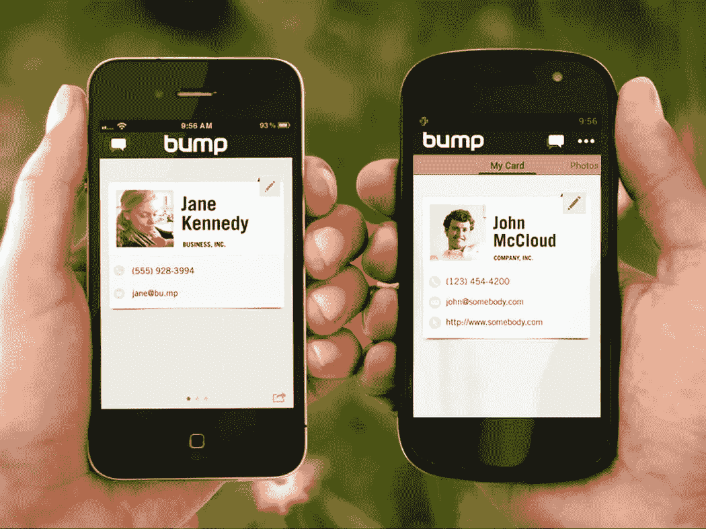
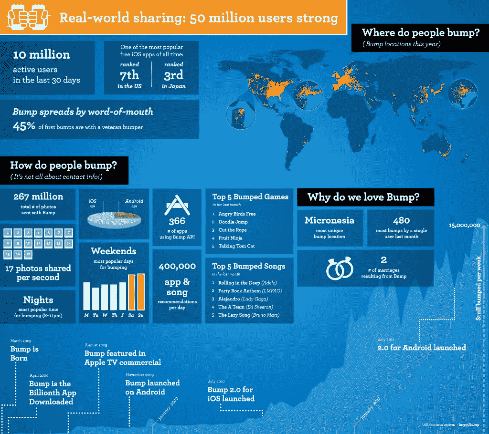
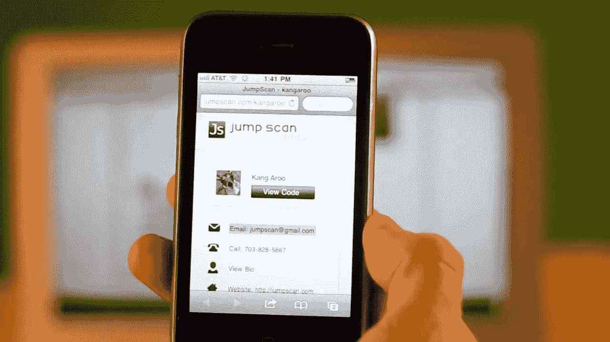
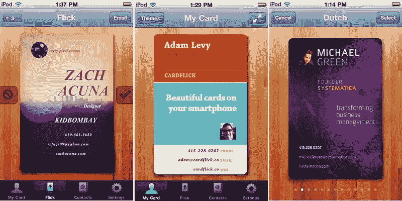

# 5 家未能干掉名片的创业公司

> 原文：<https://medium.datadriveninvestor.com/5-startups-that-failed-to-kill-the-business-card-8b56c1efafa5?source=collection_archive---------2----------------------->

好吧，面对现实吧。这个世界正试图数字化一切！首先，我们看到了 MP3 是如何杀死 CD(光盘)的。然后，电子邮件比普通邮件和传真跑得快。后来，PDF 出现了，它粉碎了纸质文件的未来。现在，智能手机正处于消灭台式机的边缘，但像印刷名片这样不起眼的东西又如何呢？当你第一次见面谈生意时，你经常会给别人一张 3.5×2 英寸的小纸片，有没有一些聪明的数码技术人员来破坏它？也许，你仍然会在钱包或手提包里放几张名片，以防你遇到某个重要人物。

所以，许多人确实试图阻止你这么做，但是许多人已经死了。所以，这就是那些认为自己可以杀死名片先生的创业公司的“如此之近却又如此之远”的案例研究的内幕。

# 撞击

我首先想到的是 Bump，因为它们可能是试图摆脱你的实体名片的最引人注目的初创公司。2008 年，Bump 在硅谷成立，是一款让人们通过“撞”手机来交换业务联系的应用。是的，我把我的手机撞向你的手机(或者更确切地说，把我的手机放在你的手机附近)，如果我们都是 bump 用户，你的联系人将出现在我手机的应用程序中，反之亦然。他们分三轮从红杉资本(Sequoia Capital)和安德森·霍洛维茨(Andreessen Horowitz)等 11 位投资者那里筹集了 1990 万美元，仅仅 5 年后于 2013 年 9 月 16 日被谷歌收购，据报道价格约为 3500 万美元。在它们流行期间，它们登上了 App Store 的 2009 年十大 iPhone 应用榜单，并最终在 2013 年 3 月获得了 1.25 亿次 iOS 和 Android 应用下载。

请理解，作为一家公司，Bump 并没有失败。他们可能只是在尝试更换名片时失败了。如果你读了大多数关于 Bump 的文章，包括[他们自己的博客](http://blog.bu.mp/)，许多人报告说他们成功地发送了数百万张照片，而不是数百万份商业合同。这篇由《创业节拍》报道的[文章称，](http://venturebeat.com/2010/03/08/bump-10-million/)

> “凭直觉，Bump 似乎是交换名片的最佳选择。但事实证明，该公司的**流量在周末达到峰值，这表明它更像是一个休闲或社交应用**。该公司最近推出了一个脸书集成，让用户在现场互相交友，以利用这一点。让你关注一个人的 Twitter 集成将很快推出。”

商务人士周末共享联系人？真的吗？Linkedin 的整合在哪里？这个据说是用来交换商业联系信息的应用程序有些问题。

Tomio Geron 在 Forbes.com 上写道

> “该应用程序旨在让人们只需将手机放在一起就能分享联系信息。该公司还**发展到让人们通过颠簸分享照片等东西**

听起来更像是一个支点。然后，我们有下面这张信息图(由 Bump 提供),显示有 2.67 亿张照片是用 Bump 发送的，同样不是联系人的数量。它确实暗示了碰撞，“不仅仅是联系信息”，正如下面标题“人们如何碰撞？”。

甚至关于如何使用 Bump 的在线教程也强调教你如何使用该应用程序来分享照片，而不是联系人。因此，我有根据的猜测是，Bump 没有杀死名片，但成功地帮助世界方便地共享文件。即使在他们被谷歌收购后，我们也没有听说谷歌有任何类似的产品可以取代 Bump。

# 我的名字是 E

这项服务肯定已经死了，因为如果你访问他们的网站【www.mynameise.com ，就会发现这家公司已经变成了一家日本钱包制造公司(至少谷歌翻译是这么说的)。通过回顾过去，我发现这篇文章介绍他们是一个即将到来的创业公司，赢得了 2009 年的下一届网络朝阳创业大赛。显然，这项服务是由荷兰一家名为 CardCloud(也已倒闭)的公司提供的。这项服务应该是一个一站式商店，收集你所有的社交和联系账户(脸书、LinkedIn、Twitter)，你可以通过一个叫做“连接器”的 USB 设备实时分享它们。Tech Crunch 的 Mike Butcher [怀疑这项服务](http://techcrunch.com/2009/07/30/my-name-is-e-releases-iphone-app-to-kill-the-business-card/)是否可行，但表示这是一个值得关注的有趣产品。我想我们看着它死去。

# 跳跃扫描

这个产品非常简单。它将您的业务联系转换成二维码，句号。它旨在成为你商业生活中的条形码。现在，我们多久从一个人的名片上抓拍一次二维码？虽然这项服务旨在以某种方式补充印刷名片，(因为你仍然需要打印你的个人二维码)，但它失败了，因为二维码技术未能作为交换数字名片的媒介。

# Snapdat

一家在 CrunchBase 上没有个人资料的数字名片初创公司的名字很吸引人。嗯，这是一款 iPhone 应用程序，让你使用其 40 个现有模板创建虚拟名片，当你想分享你的“名片”时，只需要求收件人提供他们的 Snapdat 用户名，然后你就可以通过应用程序发送你的数字名片了。哦，等等，如果收件人不在 Snapdat 上呢？或者再等等，如果他们用的是安卓手机(从来没有生产过安卓版本)呢？鸡和蛋的问题可能是其失败的关键原因。

# CardFlick

一次意外的成功也变成了失败。类似于 Bump，但不同的是你可以使用他们选择的主题来设计你漂亮的电子名片。与 Snapdat 类似，你需要注册才能使用，它只能与拥有相同应用程序的其他人一起使用。虽然 app store 上仍有该应用，但我怀疑是否有人在下载它。

科技世界充满了初创公司和应用程序，它们试图让纸质名片屈服，如 BeamME、BeezCard、Contxts、Dud、DooID(现为 PixelHub)、Fliq、Handshake、TwtBizCard、uME，但它们都面临着同样的命运。

因此，如果有人告诉你，他或她找到了杀死名片先生的银弹，你可能会想与他们分享这篇文章。或许企业家不应该过于牵强附会他们的想法，而是应该尝试创造一种新的数字文化，以补充 300 年历史的名片。

请在下面留下您对其他未能改变企业文化的科技公司的评论。