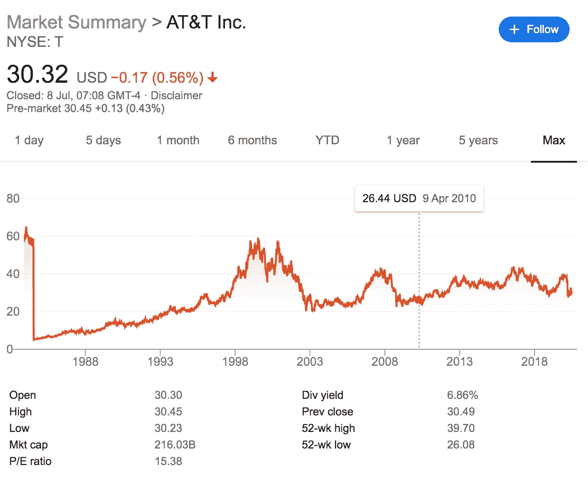
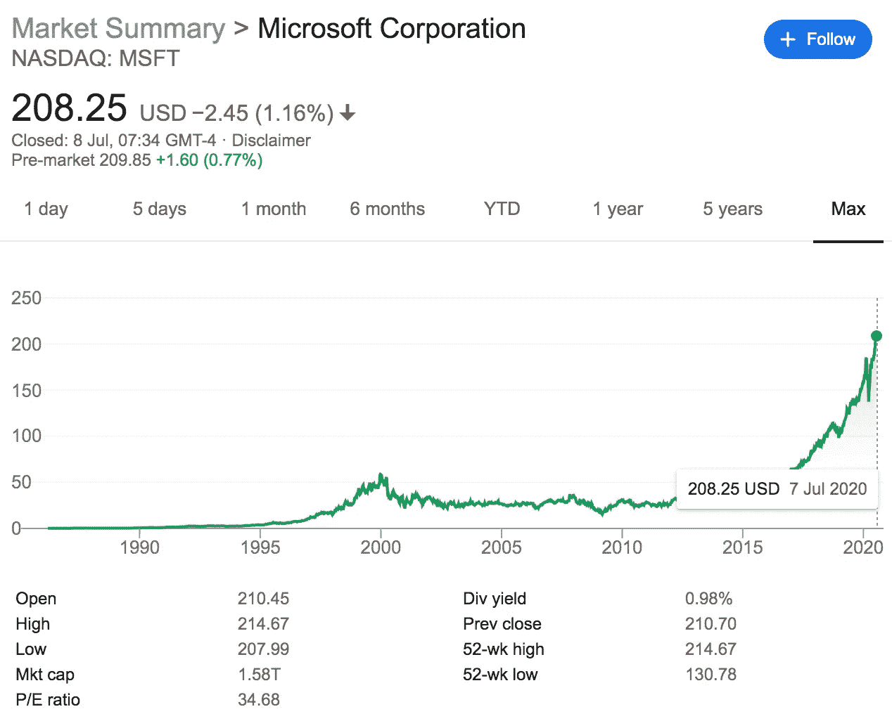
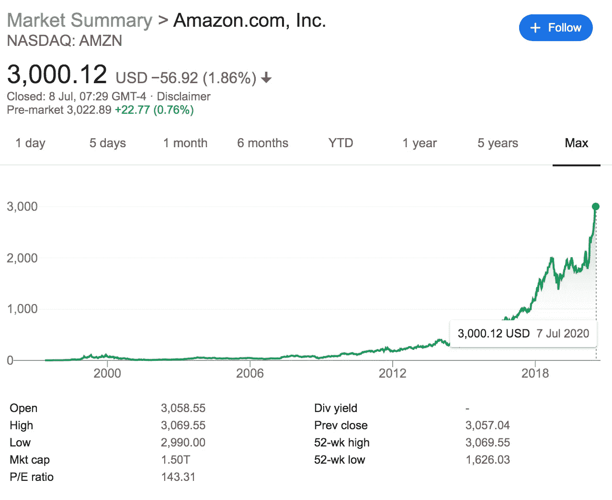
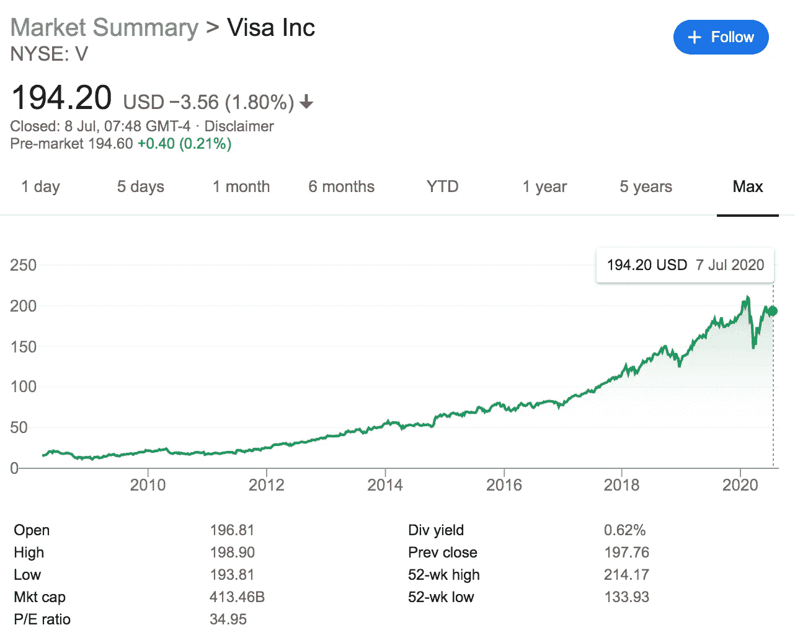
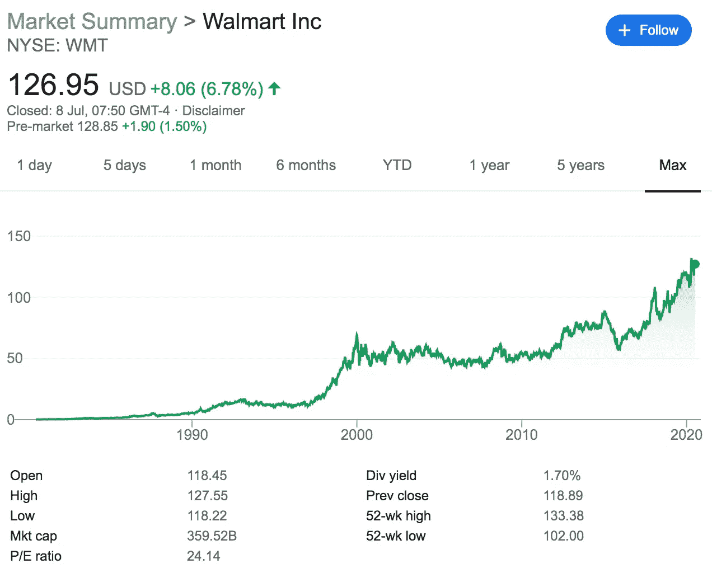

# 永远买入并持有的 5 只股票

> 原文：<https://medium.datadriveninvestor.com/5-stocks-to-buy-and-hold-forever-d87eff9a4023?source=collection_archive---------2----------------------->

Invest in these stocks and sleep well at night — image from [Unsplash](https://unsplash.com/photos/XGC_1eH_ZGI).

随着过去几个月冠状病毒冲击市场，实力较强的公司已经展示了它们的价值。

世界已经变了。依赖人们进门消费的企业受到了打击，需要很长时间才能恢复。作为投资者，这是你应该记下来的。

 [## 股票回购以及为什么我们都要为此买单。数据驱动的投资者

### 我们在创纪录的债务负担、地缘政治紧张局势、选举和气候战争的背景下进入 2020 年。连 3 个都没有…

www.datadriveninvestor.com](https://www.datadriveninvestor.com/2020/04/08/stock-buybacks-and-why-we-all-pay-for-them/) 

消费者信心和支出大幅下降，而且可能会持续一段时间。人们担心离开房子。那么，如何利用这一点呢？请继续阅读，寻找答案。

在这篇文章中，我收录了一些股票，它们不仅经受住了冠状病毒最严重的影响，而且表现强劲。在未来的许多年里，他们很可能会继续这样做。之所以这样，是因为它们是“平台”股票。

贯穿这些股票的共同主题是，它们现在被认为是现代生活的必需品。他们提供服务，让生活、商业和关系得以发生。

> 这是一个机会。

“平台”股票的想法让我想起了美国淘金热时期积累的一些智慧。

> 卖黑桃比挖金子更有利可图。

这意味着，提供给人们挖金子所需要的工具比自己去挖金子要好。

你会问，这是为什么？

一点:规模。

一个企业主可以很容易地把铁锹卖给淘金者。一个淘金者只能挖这么多，但企业主可以无限量出售黑桃。

对我们投资者来说幸运的是，一些公司现在正在这么做，你今天就可以投资。

让你的投资组合经得起未来考验的一个方法是投资那些允许人们过自己生活的公司。这份名单上的所有股票都为人们提供了一个工作、生活和繁荣的平台。

投资者可以在晚上高枕无忧，因为他们知道股票第二天不会倒闭。

如果 30 年后的明天股市收盘，我会很乐意持有以下 5 只股票:

## 美国电话电报公司(American Telephone and Telegraph Company)

AT&T full stock History and Fundamentals. [Image Copyright of Google Finance.](https://www.google.com/search?q=AT%26T+charts&oq=AT%26T+charts+&aqs=chrome..69i57j0l6j69i60.4594j0j4&sourceid=chrome&ie=UTF-8)

首先是通信巨头美国电话电报公司。这是我在我的网站上谈论了很多的一只股票，因为我相信它是一只很棒的股票。该公司每股收益增长强劲，拥有大量可用的自由现金，可以支付非常健康的股息。

美国电话电报公司的吸引力来自于它为人们提供互联网和电话通信这一事实。这些东西在封锁期间变得至关重要。这家公司允许人们交流，这在未来只会越来越多。

## 微软

Microsoft full stock History and Fundamentals. [Image Copyright of Google Finance.](https://www.google.com/search?sxsrf=ALeKk01CglC-nWtuYugSAntnNeV89UInbQ%3A1594209025752&ei=AbMFX5G-LbKO1fAPkZif8AI&q=microsoft+finance+charts&oq=microsoft+finance+charts&gs_lcp=CgZwc3ktYWIQAzIHCCMQsAIQJzoGCAAQBxAeOggIABAIEAcQHlDK1rMBWKvtswFg3O2zAWgBcAB4AoAB9weIAfkgkgEJNS4xLjYtMy4xmAEAoAEBqgEHZ3dzLXdpeg&sclient=psy-ab&ved=0ahUKEwjRwrW1y73qAhUyRxUIHRHMBy4Q4dUDCAw&uact=5)

微软是美国最大的股票，理由很充分:它的产品是必不可少的。你可能会说，考虑到该公司为世界增加的价值，它的估值很低。微软产品帮助人们达成交易。微软产品帮助人们获得工作机会。微软产品允许人们经营他们的生意。

用过 Excel、Powerpoint 或者 Teams 的人都会知道。苹果可能制造最好的硬件，但就软件而言，没有什么能打败微软。

微软的产品允许人们交流、开展业务并使生活变得更简单。正是因为这个原因，他们是一个很好的投资。

不太可能有另一家公司会把微软 Office 系列从电脑首次流行以来的霸主位置上赶下来。

更有希望的是，这并不是唯一的收入来源:他们的资产包括 Xbox 系统、电脑销售、LinkedIn 和 Github。

## 亚马孙

Amazon full stock History and Fundamentals. [Image Copyright of Google Finance.](https://www.google.com/search?sxsrf=ALeKk01SWwwrbH-Z5YlvAL7lDBj09mH8pw%3A1594211974292&ei=hr4FX-CuEdyk1fAPnqis-AI&q=amazon+finance+charts&oq=amazon+finance+charts&gs_lcp=CgZwc3ktYWIQAzIECCMQJzoECAAQRzoHCCMQsAIQJ1DazAlYgdAJYOPRCWgAcAJ4AIABVYgBjAOSAQE2mAEAoAEBqgEHZ3dzLXdpeg&sclient=psy-ab&ved=0ahUKEwjgibKz1r3qAhVcUhUIHR4UCy8Q4dUDCAw&uact=5)

亚马逊的规模和范围几乎不可想象。该公司每年收入超过 2000 亿美元。他们几乎什么都卖，是一个在西方经济体中几乎无可匹敌的商品市场。该公司已经扩展到世界各地的市场，几乎正在与每个人打交道。

他们正在挑战流媒体巨头网飞和 Spotify。他们正在与沃尔玛和好市多竞争。他们在软件和云服务上与谷歌和微软竞争。最重要的是，他们坚持住了，他们有资源继续战斗。

亚马逊股价的增长也是值得注意的。它的创始人杰夫·贝索斯成为了世界上最富有的人。如果亚马逊的增长率继续保持现在的速度。杰夫·贝索斯将成为世界上第一个万亿富翁。

亚马逊覆盖这么多市场的事实意味着它将长期存在。随着冠状病毒迫使世界上更多的人上网，亚马逊处于很好的位置来利用这一点。

## 签证

Visa full stock History and Fundamentals. [Image Copyright of Google Finance.](https://www.google.com/search?sxsrf=ALeKk03X6MNYJW8Zvw7fxPi9xgyEk6nvrg%3A1594212154553&ei=Or8FX9OzIaae1fAP4MaJyAU&q=Visa+finance+charts&oq=Visa+finance+charts&gs_lcp=CgZwc3ktYWIQAzIECCMQJzoECAAQR1DlimhY041oYIqTaGgAcAJ4AIABWIgBugKSAQE0mAEAoAEBqgEHZ3dzLXdpeg&sclient=psy-ab&ved=0ahUKEwjTuKyJ173qAhUmTxUIHWBjAlkQ4dUDCAw&uact=5)

Visa 及其网络覆盖全球。他们在 200 多个国家开展业务，每年处理价值 11.5 万亿美元的电子支付。该公司已经发行了超过 34 亿张信用卡。每一次这些交易通过它的网络发生，它都会抽取 50%的利润率。这就是机会所在。

这项投资如此有意义的原因是，它们允许资金易手。它们为个人和企业之间的支付提供了一个平台。它们使人们能够赚钱，并提供赚钱的工具。

鉴于发展中经济体的扩张，这一领域的增长机会是巨大的。Visa 可以在未来很好地利用这一点。

## 沃尔玛

Walmart full stock History and Fundamentals. Image Copyright of Google Finance.

这家折扣零售商的规模大得惊人。每年销售商品的收入超过 5000 亿美元。除了在美国的大量存在，沃尔玛还在世界各地拥有大量股份。

虽然沃尔玛有一些竞争对手，但零售商的庞大规模意味着他们可以从“规模经济”中受益，以更低的价格从制造商那里获得产品，削弱他们的竞争。沃尔玛也是美国最大的私营雇主，许多州都把沃尔玛作为头号雇主。

沃尔玛在冠状病毒疫情期间也产生了强劲的回报，因为绝大多数美国人在他们的商店购物。

有消息称，沃尔玛计划推出自己的“沃尔玛 Prime ”,向亚马逊发起挑战。该公司为人们提供第二天送货服务，并在其商店提供汽油和杂货折扣，该公司对其增长非常重视，并对在线折扣店进行反击。该公司拥有继续发展的资源和意愿，在可预见的未来不会有任何进展。

# 最后

这些股票具有以下一些或组合特征:

*   它们提供了一个开展业务和交流的平台。
*   他们提供生活中必不可少的服务。
*   丰厚的利润。
*   遍及全球
*   拥有几乎无限扩展的能力。

本文精选的股票(排名不分先后):

*   美国电话电报公司(American Telephone and Telegraph Company)
*   微软
*   亚马孙
*   签证
*   沃尔玛

如果你喜欢读这篇文章，请考虑注册我的邮件列表，这样你就可以及时了解我的写作了:

 [## 时事通讯注册—千禧净值之旅

### 注册我们的邮件列表，了解我们最新的帖子和深入的投资新闻和分析。我们…

millennialnetworthjourney.com](http://millennialnetworthjourney.com/newsletter-sign-up/) 

任何投资都是你自己做的。请不要把这当成理财建议。

**进入专家视角—** [**订阅 DDI 英特尔**](https://datadriveninvestor.com/ddi-intel)