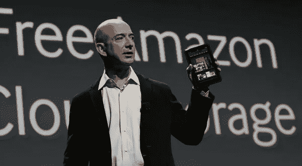
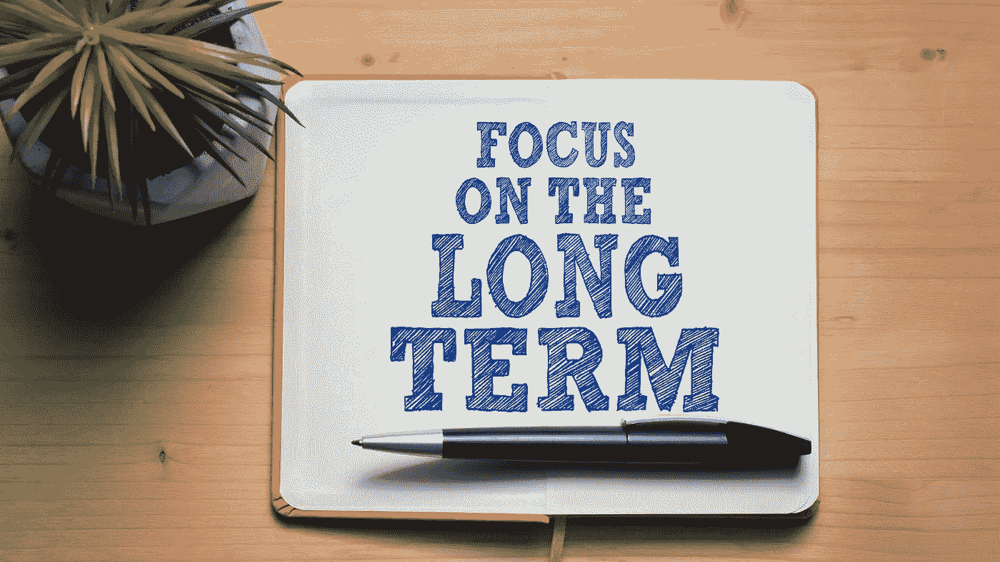

# 亚马逊创始人杰夫·贝索斯的 5 个成功原则

> 原文：<https://medium.datadriveninvestor.com/5-success-principles-of-jeff-bezos-the-founder-of-amazon-7335624b580c?source=collection_archive---------2----------------------->

## 永远向最优秀的人学习

## 让我们让 2021 年成为令人敬畏的一年

Image by [Flickr](https://flic.kr/p/auuYpe)

你还记得 1985 年由迈克尔·J·福克斯主演的《回到未来》吗？在续集中，他穿越到了未来，从 1985 年到 2015 年。

时间旅行是一件伟大的事情。成长是一次时间旅行——以缓慢的步伐从过去走向未来。

当我展望 2020 年的商业世界时，世界上最成功的公司之一是亚马逊。当谈到 1.6 万亿美元的市值时，它在全球前四大公司中是成功的。

我希望我有一台德罗宁 DMC 12——从回到未来的时间机器——可以回到 1994 年 12 月。

当我问他:“你知道你将在 2020 年成为世界上最富有的人，而 Amazon.com 将成为世界上最大的四家公司之一吗？”

我想我永远不会知道，因为时间旅行还没有被发明出来——据我所知。

# 谁是杰夫·贝索斯？

根据维基百科，他是一名美籍美国互联网企业家、实业家、媒体所有者和投资者。

此外，他是这个星球上最富有的人，在 2020 年 8 月积累了 2000 亿美元的财富。

由于亚马逊是他净资产的最大贡献者，所以他的净资产会随着公司股价而上下波动。当你看到他的净资产低于或高于 2000 亿美元时，不要感到惊讶。

如果我在 1994 年 7 月拜访杰夫·贝索斯，他会说什么？那个月，他在父母的车库里创建了亚马逊。

我永远不会知道。我找到的对杰夫·贝索斯的最早采访是在 1997 年。

# 亚马逊是什么？

1994 年 7 月—杰夫在他父母的车库里致力于一项宏大的计划，要建立一家在过去 25 年中定义了经济的公司。

同月，我在奥地利的一家小公司实习，就在我在奥地利军队服役之前。我对互联网知之甚少。

贝佐斯创立这家公司的最初想法是通过互联网卖书。用他的话来说，这是 1994 年世界上拥有最多产品的产品——印刷了超过 300 万本书。

他所做的是让这个星球上的每个人都能进入世界图书馆。一晃 4 年过去了，他开始卖视频和音乐。

世界经济的决定性时刻之一是在 2000 年，当时亚马逊与玩具反斗城签署了一项协议，亚马逊承诺在亚马逊网站上独家销售玩具反斗城的产品。

18 年后，玩具反斗城申请破产。原因？亚马逊培训所有人在网上给孩子们买玩具，而不是去商店。一旦培训结束，亚马逊就不再需要玩具反斗城了。

玩具公司再也无法弥补的错误。

同样，亚马逊也颠覆了很多行业，成为全球最大的网购和数据公司。

当其他老牌经济公司纷纷破产时，杰夫·贝索斯用什么原则将一家初创公司打造成了世界上最重要的经济帝国之一？

Canva Pro Image

# 专注于你的激情

> 你不能选择你的激情，是你的激情选择了你。
> 
> —杰夫·贝索斯

在一次采访中说出了睿智的话。杰夫·贝索斯告诉他的员工，你要么有工作，要么有事业，要么有职业。

如果你想赚钱，很容易找到工作，就是这样。做一点工作可以建立一个职业生涯，这个职业生涯很可能只在某一点上令人满意。

当人们追随内心的召唤时，真正的魔法就会发生。我可以假设，有强烈感召力的人建立了世界上最强大的公司——想想苹果、微软或谷歌。

这位亿万富翁说，大多数人从未意识到自己的使命。我认为原因很简单，你需要花时间和努力去解开包裹在我们内心的东西。

这并不容易，而且直接跳到你的脸上，而且通常，这种召唤不仅仅需要内在星星的排列；它还需要合适的外部环境来成长和成熟。

贝佐斯说，许多人最终都有了自己的事业，而大多数人只有一份工作。

从事你的职业是生活中最重要的职责。

杰夫·贝索斯打来的？遨游太空——这就是他花很多时间陪伴 blueorigin.com 的原因。

# 顾客痴迷

> 第一个也是最重要的一个是顾客至上，而不是竞争对手至上
> 
> —杰夫·贝索斯

这很可能是为什么像苹果、亚马逊、脸书、谷歌和所有其他科技明星这样的公司成功了，而其他以前成功的公司却失败了。

我最喜欢的一个例子是史蒂夫·乔布斯在[的领导下的苹果，原则上，我相信他是他那个时代最痴迷于顾客的领导者之一。](https://youtu.be/afZQGSoU6ns)

杰夫·贝索斯从一开始就在做类似的事情。他没有说他想通过在线销售渠道击败书店，而是让顾客随时都能接触到世界上的纸质书籍。

在他的演讲中，Simon Sinek 也做了类似的陈述，他说“无限玩家”并不反对竞争——他每天都在努力变得更好。

以最好的方式为顾客服务。是的，最初的产品或服务可能不是对客户有利的最佳解决方案。尽管如此，这位企业家仍在不断努力，与客户交谈，寻找缺陷，改进它们，轻松地从版本 1 升级到版本 X。

当其他人试图击败竞争对手时，这是一种胜利的态度，最终输掉了被无限玩家占领的权力游戏。

下次你想证明你比你的竞争对手更优秀的时候，永远记住杰夫·贝索斯和亚马逊或者史蒂夫·乔布斯和苹果。

# 代表某种东西

> 当其他公司看着亚马逊时，他们应该学习如何变得像亚马逊一样以客户为中心
> 
> —杰夫·贝索斯

我记得我在施蒂里亚上商业学校的时候。是宏观经济学，有一天老师回答一个小学生的问题:

“是什么让一个人成功？”

“不要一直改变。没有人能读懂一个每天都有新想法，每隔一周就改变路线的人。代表某些东西。坚持你的路线，不管存在什么趋势，不要人云亦云。”这是他的建议。

杰夫·贝索斯提出了类似的说法，并解释说，每个想到亚马逊的人都应该看到世界上最以客户为中心的公司。

这就是杰夫·贝索斯日以继夜努力实现的目标，以最好的方式为客户服务。

当我看那些失败的公司时，他们中的大多数没有这种宏伟的愿景，不断改变他们的方式，并且总是反对一些事情。

最近，我听了 Tim Ferriss 节目中的一集，他采访了 Shopify 的 CEO。他说，让 Shopify 脱颖而出的不是技术解决方案。

这是向这个星球上的每一个人传授创业精神的动力；每个想建立自己企业的人都应该得到 Shopify 的帮助。

找到你的激情——以客户为中心，知道你代表什么——合理的建议。

Canva Pro Image

# 考虑长远

> “如果(人类)从长计议，我们可以完成我们无法完成的事情……我们人类在技术方面变得非常复杂，很有可能对我们自己非常危险。在我看来，作为一个物种，我们必须开始考虑更长远的问题。”
> 
> —杰夫·贝索斯

90 年代在大学里，我听说欧洲的公司和国家比美国更成功，这是因为他们有长远的想法。相比之下，美国是以利润为导向的，这总是短期思维。

这个绰号是由 1996 年整个北美[的电力中断而产生的。](https://en.wikipedia.org/wiki/1996_Western_North_America_blackouts)

早在 90 年代，欧洲在移动行业就很强大，并以其长远的思维基本上主宰了世界科技。中国把自己建成了世界工厂，而美国，嗯，这个国家正致力于比尔·克林顿对雪茄的热情。

在德罗宁中，时间闪移到 2020 年——一切都变了。中国现在想成为世界创新的领导者——想几十年。

除了 Saudi Aramco，最大的四家公司都在美国——苹果，亚马逊，微软，这四家公司都有一个共同点——长期思考。

 [## 取代你的风投？企业家的 5 条原则|数据驱动的投资者

### 在 Tau Ventures，我们建议所有企业家将融资过程中的勤奋过程视为双向的…

www.datadriveninvestor.com](https://www.datadriveninvestor.com/2020/11/29/replacing-your-vc-5-principles-for-entrepreneurs/) 

# 没有遗憾

> 我知道，当我 80 岁的时候，我绝不会后悔尝试这件事(放弃一份好工作创办亚马逊),这件事让我非常兴奋，但却失败了。
> 
> 如果失败了，没关系。当我 80 岁的时候，我会为我努力过而感到骄傲。
> 
> —杰夫·贝索斯

后悔是一件有趣的事情。今天坐在这里，后悔过去做过或没做过的事情。

我从来没有告诉那个女孩我爱上了她，如果…

我在 1995 年选择了错误的工作，如果…

如果我没有为了获得法律学位而停止学习的话…

后悔。痛苦地坐下来思考生活有多糟糕。

杰夫·贝索斯在做决定时用了自己的方式。他的方法是快进到 80 岁，坐下来和自己讨论下一个决定:

"做出积极的决定和消极的决定，我会更后悔吗？"。

在他的一次演讲中，Jeff 将这个例子与他创建亚马逊的决定联系起来。它在这一段的第一个引语里。

他的方法是做出最小化他生命中遗憾的决定，这种精神当他决定创建亚马逊时，他得出结论，他会后悔没有尝试过，而不是没有使亚马逊成功。

对我们消费者来说，幸运的是，他确实做出了这个决定，否则，我相信今天的世界会有所不同。

追求平均总是容易的；全球有如此多的统计数据可以帮助人们定义平均值。

但是当谈到生活中的成功时，统计学就不管用了。我认为只有少数人获得了成功和充实的生活。

我的观点是，不要试图去适应统计数据，而是要专注于找出这些人的不同之处，接受他们的教导，并将其融入自己的生活，使其成功 1%。

自 1999 年以来，我是各行各业公司的执行官、顾问和教练。我专攻企业发展和金融，从种子轮到 IPO 级别，从 2006 年开始专注于生命科学。

[**加入我的邮件列表，保持联系！**](https://mailchi.mp/5a50875fb5ea/newsletter)

# 读者:

 [## 杰夫·贝索斯十大成功法则

### Amazon.com 成为世界上最大的零售商是杰夫·贝索斯一手打造的，以下是他的十大成功法则。

www.flextalk.org](https://www.flextalk.org/jeff-bezoss-top-10-rules-for-success/)  [## 杰夫·贝索斯的 10 条成功法则

### 杰夫·贝索斯也许是当今世界上最富有的人之一，因为他认为自己是在一个…

moneyinc.com](https://moneyinc.com/10-rules-success-according-jeff-bezos/)  [## 杰夫·贝索斯的生存法则|成功

### 杰夫·贝索斯的第一个 60 分钟形象并不成熟。在 YouTube 上保存的 1999 年专题片段中…

www.success.com](https://www.success.com/jeff-bezos-rules-to-live-by/)  [## 亚马逊网站杰夫·贝索斯的 7 个成功秘诀

### 你做过的最累人、最痛苦的工作是什么？也许你的上司对你的…

www.lifehack.org](https://www.lifehack.org/articles/work/7-habits-you-can-learn-from-jeff-bezos-and-amazon-com.html)  [## 杰夫·贝索斯成功公式的三条规则

### 商业书籍征服了网上零售，亚马逊迅速扩展到云计算、媒体和…

www.inc.com](https://www.inc.com/magazine/202006/brian-dumaine/bezonomics-amazon-jeff-bezos-strategy-growth.html)  [## 按市值排名的公司-CompaniesMarketCap.com

### 公司:4275 家总市值:79.834 美元以下是全球市值最大的公司名单…

companiesmarketcap.com](https://companiesmarketcap.com/)  [## 高级职员和董事

### 编辑描述

ir.aboutamazon.com](https://ir.aboutamazon.com/officers-and-directors/default.aspx) 

[https://en.wikipedia.org/wiki/Jeff_Bezos](https://en.wikipedia.org/wiki/Jeff_Bezos)

 [## 杰夫·贝索斯:你可以有一份工作或一份事业，但如果你有了这份工作或事业，你就“中了大奖”

### 亚马逊可能使杰夫·贝索斯的净资产达到 1310 亿美元，并使他成为当今最富有的人。但是在一个…

www.cnbc.com](https://www.cnbc.com/2018/05/07/jeff-bezos-gives-this-career-advice-to-young-employees.html) 

[https://www . Inc . com/Marla-tabaka/Jeff-be zos-says-this-4-principles-is-key-to-amazons-success-they-can-work-for-you-too . html #:~:text = Customer % 20 执念。&text = be zos % 20 goes % 20 on % 20 to % 20 explain，一个% 20 追随者% 2C % 20be % 20an %创新者](https://www.inc.com/marla-tabaka/jeff-bezos-says-these-4-principles-are-key-to-amazons-success-they-can-work-for-you-too.html#:~:text=Customer%20obsession.&text=Bezos%20goes%20on%20to%20explain,a%20follower%2C%20be%20an%20innovator)。

 [## 找不到文章！

### 编辑描述

www.inc.com](https://www.inc.com/jeff-haden/why-mark-cuban-jeff-bezos-embrace-no-regrets-rule.html) 

## 获得专家观点— [订阅 DDI 英特尔](https://datadriveninvestor.com/ddi-intel)