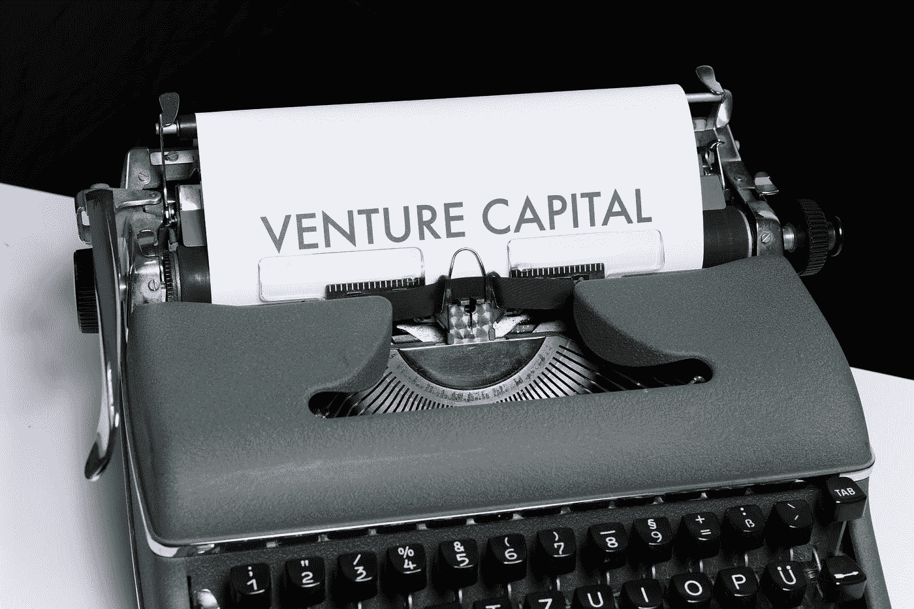

# 披萨外卖员如何“缝合”一个价值 14.5 亿美元的品牌

> 原文：<https://medium.datadriveninvestor.com/5-takeaways-from-how-a-pizza-delivery-guy-stitched-a-1-45-billion-brand-3ada154377f3?source=collection_archive---------15----------------------->

在被评为 2016 年英国增长最快的业务，同比增长 200%后，来自美国的通用大西洋公司收购了 Gymshark 21%的股份，将其估值推高至 14.5 亿美元。

Photo by [John Fornander](https://unsplash.com/@johnfo?utm_source=medium&utm_medium=referral) on [Unsplash](https://unsplash.com?utm_source=medium&utm_medium=referral)

本·弗朗西斯发现最小订购量极高后，开始在 Gymshark 上直接发送增刊。他心目中的英雄来自健身行业，他也一直想参与其中。他白天在伯明翰的阿斯顿大学学习，晚上在必胜客做披萨送货员，其余时间都在做东西。

本·弗朗西斯是英国企业家，也是 Gymshark 的创始人。Gymshark 是英国健身服装和配饰品牌，总部位于英国索利哈尔。

 [## 是的，我们可以！SBIR 和 STTR 对美国小企业的资助|数据驱动的投资者

### 在 20 世纪 80 年代，当伯顿·A·魏斯布罗德首次出版《非营利经济》时，他写道，美国经济是由…

www.datadriveninvestor.com](https://www.datadriveninvestor.com/2020/08/10/yes-we-can-the-sbir-and-sttr-grants-for-american-small-business/) 

他的个人网站上说，他痴迷于足球，但当他意识到自己永远无法以足球为生时，这种痴迷转移到了基于计算机的项目上。从 17 岁起，他发现自己对 IT、计算机和健身的兴趣越来越大。他在 YouTube 上看斯科特·赫尔曼，学习在健身房应用的基本技能。这就是一切开始的地方。

# 到目前为止，这是他旅途中的 5 点收获:

Photo by [Clark Tibbs](https://unsplash.com/@clarktibbs?utm_source=medium&utm_medium=referral) on [Unsplash](https://unsplash.com?utm_source=medium&utm_medium=referral)

# 创造力最大值

推出新产品是困难的。在必胜客，每小时 5 美元，这就更难了。这就是他的情况，他变得更强了。他在母亲的车库里创办了自己的服装公司，为健身运动员缝制 t 恤和帽衫。最初，他直接发运补充剂，并在第 6 周获得了第一个订单。

> 他表示:“在创业之初，你必须在业务的前端和后端都有创意。”。

# 冒险最大值

本为 2012 年英国健身博览会花光了所有积蓄。他设立了一个摊位，花光了每一分钱，还雇了健身 YouTubers 来展示，和围过来的人聊天。

他并不期待任何东西，因为没有人认识他们，但在他们所有的存货都卖完之后，他们还没有在博览会上看到更繁忙的展位。打赌成功了。这个摊位很受欢迎。YouTubers 红极一时。与过去每天 400 美元的收入相比，他第一天就赚了 4.2 万美元。

# 2012 年影响者营销

本意识到影响者是金沙克的秘密武器。他将无法与耐克和阿迪达斯沉重的营销策略竞争。但这些品牌忽略了社交媒体和社区建设。这是他的机会。

Gymshark Twitter.

Gymshark 一直专注于在互联网和现实世界中建立社区。他们有非常吸引人的 Instagram、脸书、Pinterest 和 YouTube 账户。很多增值内容被放了出来，但健身行业的人和公司本身也是如此。

Gymshark Community Group on Facebook

# 最大收入

Gymshark 的工作文化是透明的，并激励着社区。他们在 2017 年减少了两倍，拥有健身影响者社区。到 2018 年，他们的销售额达到了 1 亿美元。

2014 年:580 万美元
2015 年:870 万美元
2016 年:1660 万美元
2017 年:5200 万美元
2018 年:1.032 亿美元

Photo by [Markus Winkler](https://unsplash.com/@markuswinkler?utm_source=medium&utm_medium=referral) on [Unsplash](https://unsplash.com?utm_source=medium&utm_medium=referral)

# 自举最大值

上周，Gymshark 以 14.5 亿美元的估值出售了该公司 21%的股份。本现在比以前拥有更多，大约 70%的业务，使他成为英国最近的亿万富翁。

他说，他从日常健身中得到了结构、一致性和努力工作的早期经验。他在健身房找到的职业道德改变了他的生活。他在高中时从优等生升到优等生。

## 他证明了你并不需要一个学位或巨额投资来开创一个十亿美元的生意。

**访问专家视图—** [**订阅 DDI 英特尔**](https://datadriveninvestor.com/ddi-intel)