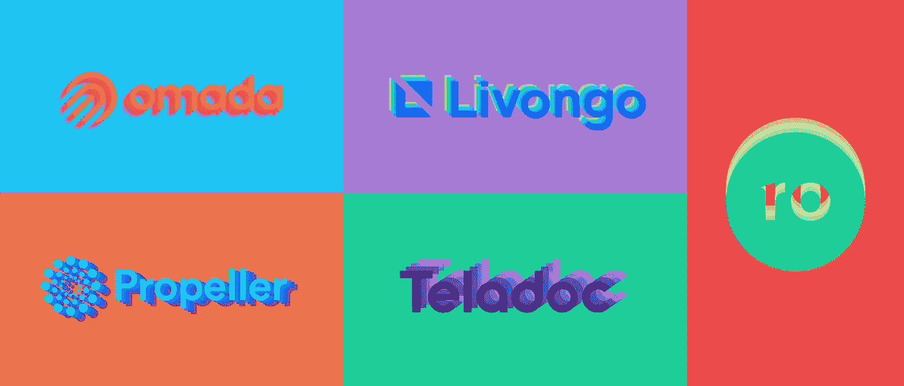
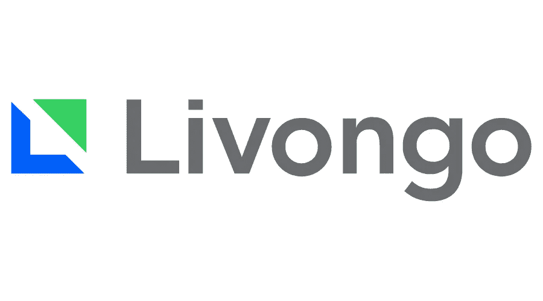
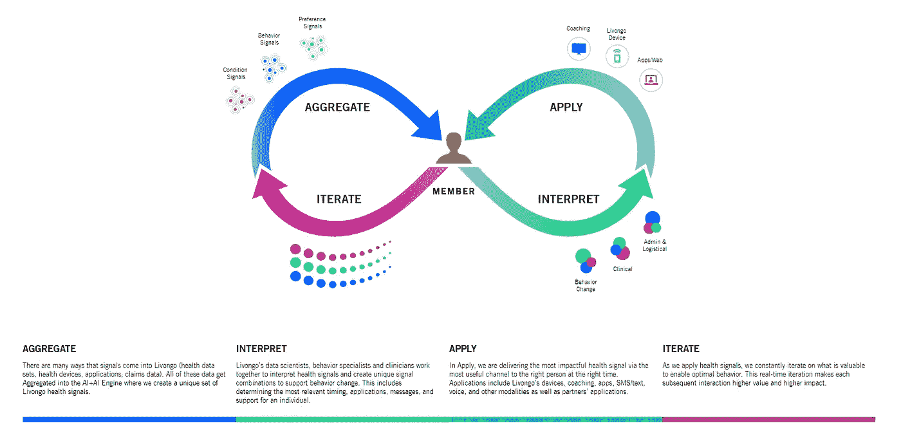
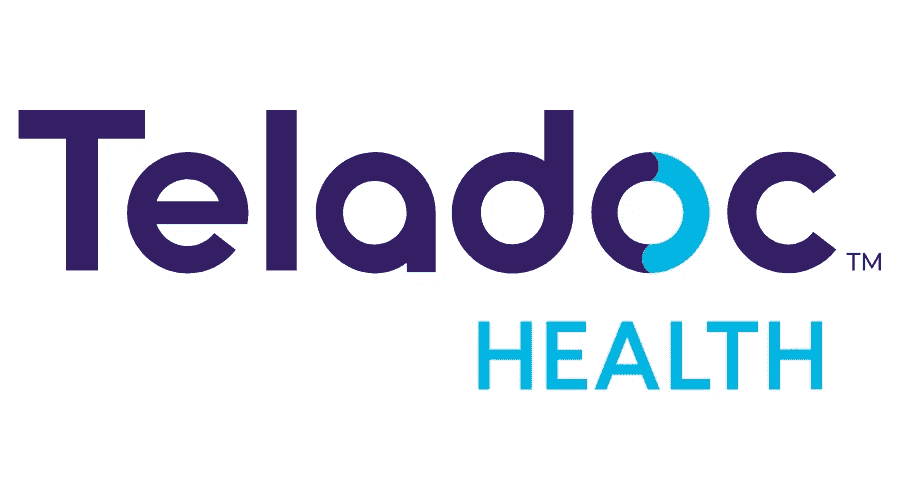
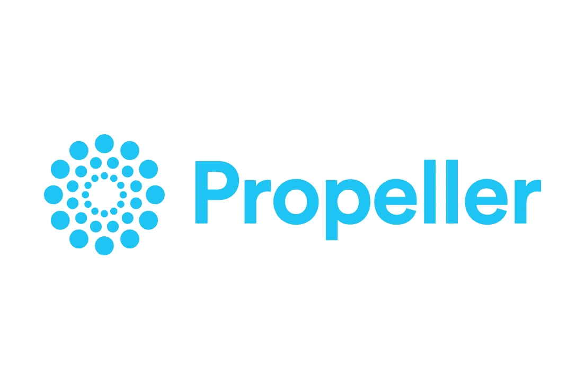
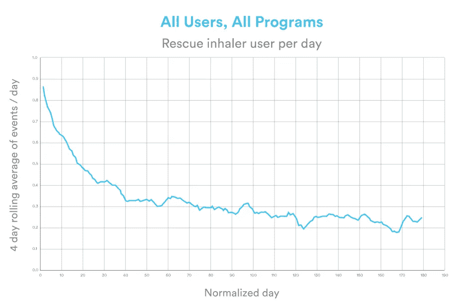
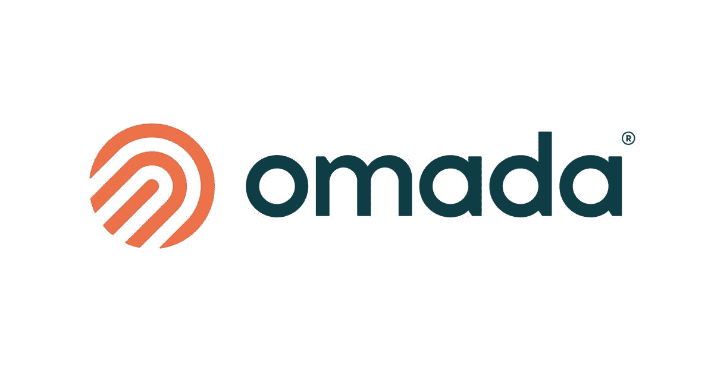
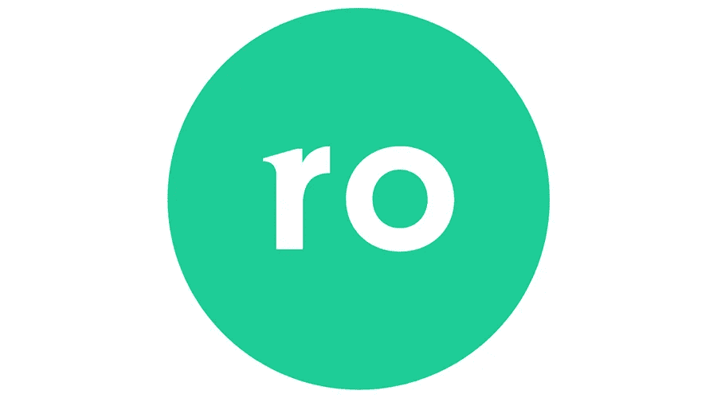

# 2020 年值得关注的 5 家远程医疗公司

> 原文：<https://medium.datadriveninvestor.com/5-telehealth-companies-719aaf789331?source=collection_archive---------2----------------------->

## 哪些公司最有可能利用新的虚拟医疗保健浪潮？

我最近刚满 18 岁，这意味着我很快将不得不面对成年后最可怕的挑战——预约我自己的医生。(啊啊啊啊)。

但是，浪费危机是一件可怕的事情——远程医疗得到了这份备忘录。虚拟医疗的采用率正在飙升，就像 SpaceX 的矮胖 Starhopper 一样，这些公司可能会推动它向前发展(排名不分先后):

1.  **Livongo**
2.  **特拉多克**
3.  **推进器**
4.  **奥马达**
5.  **Ro**

监管放松了，秘密泄露了，心碎了(我想)，但是远程医疗的时代已经到来。让我们先弄清楚一些定义:

1.  **远程保健/远程医疗:**患者和医生之间的某种形式的双边交流。
2.  **远程监控:**跟踪患者的医疗数据，并使用它为 PCP 提供见解。
3.  **虚托:**以上一种或两种(保护伞术语)。

整个空间仍在从 2020 年的怪物的子宫中出现，所以如果这些定义发生变化，不要感到惊讶。

这个列表包括了这些公司做什么的快照+他们的超能力(它们值得关注的原因)。

# 1.利翁戈

Livongo 是一个虚拟护理平台，以解决**糖尿病开始。**从那以后，他们将产品扩展到高血压、体重管理，甚至行为健康。

他们是**趋势的一个例子，我们将很快看到更多**:迈克尔·乔丹(专门的虚拟护理平台)正在 MLB(多元化到更多种健康问题)上一试身手。

Livongo 使用'**应用健康信号**'(数据驱动的见解)，为你推荐行动、锻炼，甚至与他们的健康教练之一为你安排会议。

Livongo 符合虚拟护理平台的所有条件，这就是它如此受雇主欢迎并拥有 118 亿美元市值的原因。他们的秘密武器可能是应用健康科学引擎，他们称之为 AI+AI:

Screengrab from Livongo’s website.

这是一个迭代的管道，**收集患者和健康数据**(其中一些来自 Livongo 自己的医疗设备)**使用数据科学从中得出可操作的见解**。这些信息通过用户的手机、笔记本电脑，甚至是一次培训，被传送到用户的大脑中。

## **超能力:**迭代方面。

一个伟大的产品越用越好，通常是通过某种个性化推荐算法——想想抖音或网飞。当 Livongo 向你发送更多的建议时，他们会计算出哪些可以，哪些不能；然后他们**迭代改进**。

Livongo 的远程监控+洞察力似乎是他们的强项，而他们的远程医疗服务似乎是一个附加产品。这就是为什么**与 Teladoc 的合并是强盗行为。**

# 2.泰拉多克

Teladoc 拥有超过 150 亿美元的市值，并在十几个城市提供非常受欢迎的远程医疗服务(包括世界上最好的城市多伦多)。

我的意思是，看看他们网站上这张漂亮的图片:

## 超级大国:执业医师

Teladoc 不是教练，而是**一个连接你和执业医师的平台**，他们可以给你开药。(获取毒品从来没有这么容易！).

泰拉多克医生涵盖了从关节炎到红眼病的各种疾病。将这一点与 Livongo 的数据驱动的见解结合起来，虚拟化就会蓬勃发展。关心。巨大无比。

这两家公司最近宣布了价值 180 亿美元的合并。尽管两家公司都没有真正突破各自的极限，但他们在虚拟医疗界组成了一对强大的夫妇——就像碧昂斯和 Jay-Z 一样。

# 3.螺旋桨

Propeller 的解说视频比 Livongo 或 Teladoc 都好，这不仅仅是因为这位女演员让我隐约想起了艾玛·斯通和某个美宝莲模特。

**他们是一家针对哮喘或慢性阻塞性肺病患者的远程监测公司。**它们的传感器连接到你的吸入器，以确保你按时服药，跟踪你周围的空气质量，甚至给你当天的哮喘预报。

该公司也是 ResMed 的子公司，ResMed 是一家价值 250 亿美元的公司，专门从事云连接医疗设备。他们与向用户提供螺旋桨服务的保险公司/雇主合作。

它正在工作。他们的网站上说，他们在美国、欧洲和亚洲开展业务，他们正在大幅减少日常救援吸入器的使用:

From the [Propeller](https://www.propellerhealth.com/outcome/) website.

## 超级大国:岁月如美酒

和 Livongo 一样，Propeller 也是越用越好。你使用这款应用的时间越长，它就能越好地找到你的触发点，帮助你避开它们，更轻松地度过一天。谈论健康的关系——可能不像碧昂斯和 Jay-Z(开玩笑)。

如果这种数字健康浪潮持续下去，预计 Propeller 将为 ResMed 带来大量现金。

# 4.奥马达

Omada Health 成立于 2011 年，总部位于旧金山，**它有点像更酷、更年轻、更时尚的 Li vongo**——它们还提供糖尿病、高血压和行为健康服务(由从现已死亡的 Lantern Health 购买的 IP 提供)。

它们是一个私人持有的数字护理平台(telehealth ),将您与健康教练、医疗设备和在线社区联系起来。他们的目标？让数字健康尽可能人性化。

## 超级大国:人的因素

考虑到我们现在是多么渴望与人接触——求你了，杰西卡，给我回个电话吧——这可能不是个坏主意；奥马达利用了人类社交的基本欲望。

奥马达的基于行为改变的医疗保健方法读起来就像投资者写得很好的 slam 诗歌…

Andreeseen Horowitz listening to Omada’s investor’s pitch, colourized | [GIPHY](https://giphy.com/gifs/cool-feeling-it-cecil-womack-3o6UB7XfaGGt7qscfe)

*Andreessen Horowitz* 只是该公司能够筹集到的**2.5 亿美元资金的风投之一。**

虽然他们的解说视频[远没有螺旋桨品牌的艾玛·斯通水平，但它感觉像是一部艺术电影，我可能会在凌晨 3 点在网飞偶然发现，所以我给这些家伙竖起大拇指。](https://www.omadahealth.com/about)

# 5.Romania 罗马尼亚

这是我最兴奋的一个——主要是因为(我认为)他们正在研究一些真正创新的东西。

但首先，一些背景。Ro 有多个渠道/品牌:

1.  **Roman** :他们在 2017 年开始为男性提供的旗舰服务是提供勃起功能障碍和脱发药物——在与有执照的医疗保健专业人士进行数字咨询后。
2.  **罗里**:面向女性的数字健康诊所为你提供性健康、皮肤护理等方面的药物，还包括数字咨询。
3.  **Zero** :一种戒烟服务，它将你与一位医生联系起来，这位医生会给你开一些药(会运送给你)来帮助你戒烟。
4.  **Ro Pharmacy:**Dollar Shave Club for drugs——以每月 5 美元的价格将您的仿制药运送给您。

还有一些其他的[东西](https://ro.co/)。如你所知，Ro 流程的很大一部分是在他们给你开药之前让你和医学专家联系。他们的愿景是在此基础上扩展，为医生提供他们需要的数字工具，以联系更多的患者和服务机会…

## 超级大国:野心+强势垂直。

基本上，他们想成为医疗保健的商店。(寒战)。

更令人兴奋的是，Ro 不像名单中的大多数其他虚拟医疗公司——他们不必与保险公司合作。

Ro, @ all the haters | [GIPHY](https://giphy.com/gifs/dmSENycrwbYQM)

Ro 的目标是成为患者的第一接触点，押注于未投保者。换句话说，Ro 可能会像 Square 处理信用卡那样扩展医疗保健行业——强盗行径。

鉴于他们的流程涵盖咨询和运输，Ro 非常接近于成为**垂直整合**(或者说是医疗保健领域最接近的水平)。投资者在观望，随着**Ro 15 亿美元的估值**，他们睁大了眼睛。

Ro 可能是目前最具颠覆性创新的数字健康创业公司，但他们仍然面临来自 Hims、亚马逊和沃尔玛等公司的竞争。尽管如此，还是要留意他们。

# 关键要点

1.  **Li vongo+Teladoc 的合并是健康的伙伴关系**——他们弥补了彼此的弱点。赢家包括股东和用户。
2.  **螺旋桨是一种常见情况下的常用服务。他们由一家医疗技术巨头资助，越用越好——有可能为 ResMed 带来一些重要的医疗利润。**
3.  在一个日益数字化的世界里，奥马达的制胜因素可能是人的因素。安德森·霍洛维茨基金引人注目的投资只是值得关注的一个原因。
4.  **Ro 正努力成为患者的第一站，成为医疗保健的 Shopify。**在一个迫切需要创新的行业中，颠覆性的创新计划应该让你像关注我一样关注 Ro。

你有什么想法？