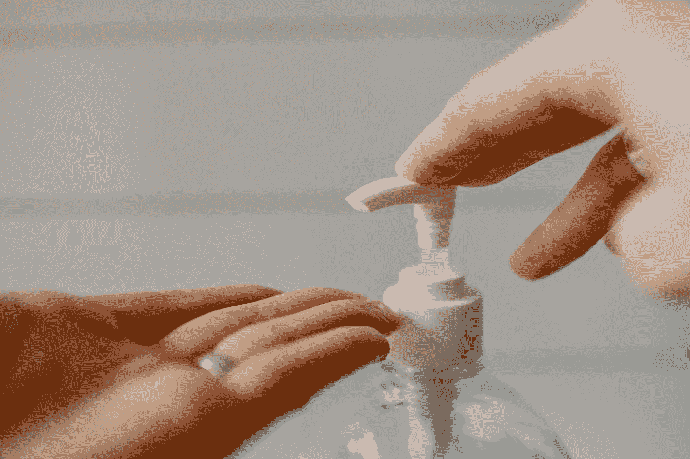

# 冠状病毒催化了 5 件事

> 原文：<https://medium.datadriveninvestor.com/5-things-coronavirus-acted-as-a-catalyst-for-3005d68d900e?source=collection_archive---------11----------------------->

## 疫情加速了一系列本应发生的情况。这是好事。是的，我们可以看到目前正在发生的好事情。

Photo by [Alex Kondratiev](https://unsplash.com/@alexkondratiev?utm_source=medium&utm_medium=referral) on [Unsplash](https://unsplash.com?utm_source=medium&utm_medium=referral)

# 什么是催化剂

在化学中，催化剂是一种加快反应速度的物质，并在反应结束时再生。催化剂既是一种试剂，也是使用它的反应产物。通过催化剂的作用提高反应速度的过程叫做催化作用。

催化剂在工业中广泛使用。一些例子包括制造酸、油和石油衍生物的过程，制造药物和汽车催化剂的过程。

当我修理冲浪板时，我在损坏处涂了一种带有催化剂的液体树脂。催化剂加速了树脂的干燥过程。如果你忘记使用催化剂，树脂将需要很长时间才能干燥，甚至干燥。

# 冠状病毒的催化作用

鉴于这些概念，即催化剂是反应的加速器，我们可以理解当前的疫情在几种情况下产生了这种效应，我将在下面描述。

## 1.内政部

Photo by [Paige Cody](https://unsplash.com/@paige_cody?utm_source=medium&utm_medium=referral) on [Unsplash](https://unsplash.com?utm_source=medium&utm_medium=referral)

长期以来，我们已经拥有了在家办公所需的所有技术。尽管在一些公司中有一些成功的经验，证明了生产率的提高和成本的降低，但只有在疫情，远程工作才得以大规模成功应用。

在一些国家，有必要制定强制远程工作的法律，有时会对违规公司进行罚款。同样是那些制定了这些法律的政府，也只是在当前的危机下，才持有允许远程工作的态度。

## 2.使用互联网进行交流

Photo by [visuals](https://unsplash.com/@visuals?utm_source=medium&utm_medium=referral) on [Unsplash](https://unsplash.com?utm_source=medium&utm_medium=referral)

与远程工作类似，远程通信工具已经足够成熟，但疫情之前的现实是一系列不需要发生的面对面会议、不必要的通勤以及会在公司中引发争斗的会议室时间表。

不仅在公司，例如，学校，教堂也可以使用这些工具进行交流。今天，covid 的催化作用使这种方法成为强制性交流。

我相信面对面的工作面试已经是我们过去的一部分了。

## 3.效率更高的公司

Photo by [Mimi Thian](https://unsplash.com/@mimithian?utm_source=medium&utm_medium=referral) on [Unsplash](https://unsplash.com?utm_source=medium&utm_medium=referral)

有了 covid，公司降低了成本，解雇了那些不重要的人，不得不彻底改造自己。当然，我不是在庆祝大规模裁员。但我想知道，为什么公司要在一场由病毒引起的危机后才努力提高效率。

公司经理不应该关心成本，总是让最好和最合适的团队在工作吗？

## 4.网上购物和送货

Photo by [Mark König](https://unsplash.com/@markkoenig?utm_source=medium&utm_medium=referral) on [Unsplash](https://unsplash.com?utm_source=medium&utm_medium=referral)

另一个已经存在的东西。购物中心有实体店，印象深刻。这些不必要的成本被转嫁到顾客身上，使得购买的产品价格更加昂贵。

催化剂正在使我们的营销方式发生革命，也是一场房地产革命。

## 5.卫生和保健

Photo by [Kelly Sikkema](https://unsplash.com/@kellysikkema?utm_source=medium&utm_medium=referral) on [Unsplash](https://unsplash.com?utm_source=medium&utm_medium=referral)

我妈妈总是说当你从街上回来的时候要洗手。现在，我们将这一点提升到了一个新的高度，一个简单的注意个人卫生的行为可以防止个人悲剧的发生。

洗手，给自己消毒，把街上的鞋子留在家门口……这些都是我们本可以使用的习惯，因为这也可以预防其他疾病。

我不知道将来我们是否会再次握手来问候我们，或者我们是否会继续使用我们的肘部。

***世界变了。***