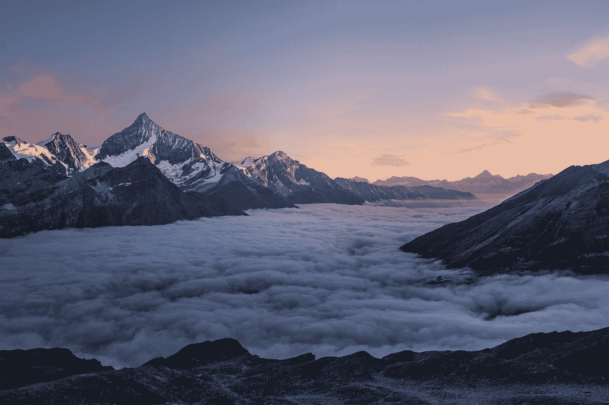

# 世界可以向瑞士学习的 5 件事

> 原文：<https://medium.datadriveninvestor.com/5-things-the-world-can-learn-from-switzerland-cd21e3b5f3b9?source=collection_archive---------9----------------------->

Photo by [Samuel Ferrara](https://unsplash.com/@samferrara?utm_source=medium&utm_medium=referral) on [Unsplash](https://unsplash.com?utm_source=medium&utm_medium=referral)

迷幻药，牛奶巧克力，和我有什么共同点？不，我们不仅制造快乐，而且我们都来自瑞士。世界上最富有、最幸福的国家之一。

 [## 教科书行业如何最终被颠覆，并将继续改变|数据驱动…

### 就此而言，教科书产业在美国乃至全世界都有着悠久的历史。事实上，他们已经…

www.datadriveninvestor.com](https://www.datadriveninvestor.com/2018/09/25/how-the-textbook-industry-has-finally-been-disrupted-and-will-continue-to-change/) 

作为一个土生土长的瑞士人，我可以向你保证，瑞士并不完美。但是周游世界让我看到了许多国家可以向我们学习的地方。

让我与你分享其中的一些。

# 想自己的事

瑞士士兵因其作为雇佣兵的成就而闻名的时代早已一去不复返了。瑞士从不参与战争。我们是中立的，我们影响世界的方式是通过支持和教育。一个例子是 1863 年在瑞士日内瓦成立的红十字国际委员会(红十字委员会)。

> 真正和持久的胜利是和平的胜利，而不是战争的胜利。——拉尔夫·瓦尔多·爱默生

# 传播知识

不管你住在最大的城市还是 100 人的山村。你将在瑞士接受扎实的教育。扎实的教育会让你要么上大学，要么找份工作。如果你像我一样选择学工作，可以做三年学徒。你每周去学校一两天学习理论，其他时间在导师的指导下工作。这样，瑞士可以确保每个行业的高质量，因为每个人都是专业人士。如果你决定去学习，大门依然向你敞开。哦，政府支付学费。

> 教育是你可以用来改变世界的最强大的武器。纳尔逊·曼德拉

# 不要落下任何人

在瑞士你很少看到无家可归的人。如果你不是故意搞砸或者做了什么见不得人的事情，你可以在被解雇后继续工作三个月。这段时间过后，你会从政府那里得到钱，直到你找到一份新工作。当然，你得证明你愿意工作，但你不可能在瑞士一夜之间失去一切。残疾人或病人也是如此。如果可能的话，他们可以做兼职，剩下的可以拿钱。

无论你是否工作，都必须有健康保险。

> 单独我们能做的很少；我们一起可以做很多事情。——海伦·凯勒

# 做你做对的事情

瑞士以像劳力士这样的手表而闻名。我曾经参观过一家手表制造商，并有机会组装一只手表——我可以告诉你这不是开玩笑。你必须精确地工作，即使有真正大师的帮助，我也几乎做不到。

在瑞士，所有东西都很贵。但是商品质量很高。因为每个工人都至少有一个三年的学徒，我们被告知要从很小的时候就开始追求质量。

> “质量意味着在没人看的时候做对。”―亨利·福特

# 每个人都很重要

瑞士有三个政治层级分享权力:联邦、26 个州和 2250 多个市镇。

*瑞士联邦政府(联邦委员会)由议会选举的七名成员组成。*

*瑞士议会(联邦议会)共有 246 名议员，由人民直接选举产生。瑞士有一个两院制议会:国民议会(200 名成员)和联邦院(46 名成员)。*

瑞士议会中有 15 个政党的代表。获得最多民众选票的政党在联邦委员会中有代表。 [*资源*](https://www.eda.admin.ch/aboutswitzerland/en/home/politik/uebersicht/politisches-system-der-schweiz---fakten-und-zahlen.html)

系统设置的方式，我们在系统中没有巨大的波动，因此有一个长期规划的稳定环境。

> 民主值得为之献身，因为它是人类有史以来最值得尊敬的政府形式。—罗纳德·里根

我很感激出生在瑞士。许多大门向我敞开，我希望能够充分利用这个绝佳的机会。

# 准备好变得无限吗？

如果你想变得无限并大大加快你的学习速度，看看我的小抄:

[点击此处立即获取备忘单！](https://roadtolimitless.com/cheatsheet/)