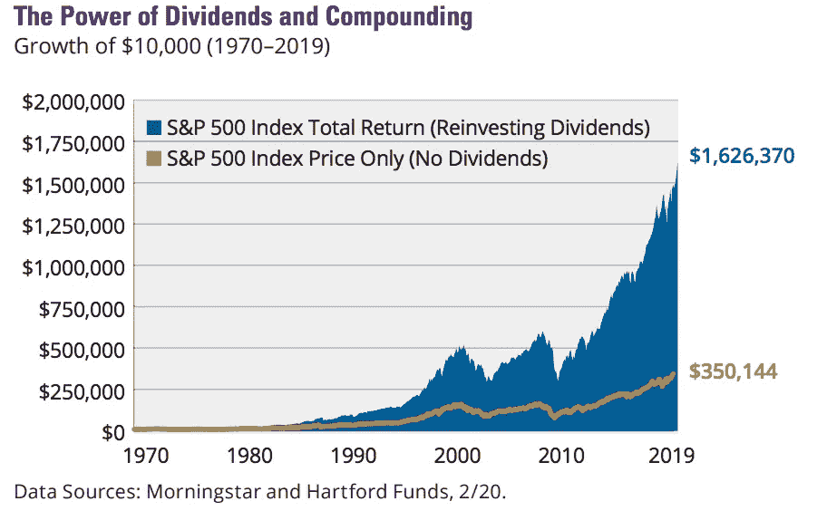

# 建立红利投资组合时要考虑的 5 件事

> 原文：<https://medium.datadriveninvestor.com/5-things-to-consider-when-building-a-dividend-portfolio-3c000025bf58?source=collection_archive---------8----------------------->

Reach your investment goals by researching Dividend Stocks for your portfolio photo via [Unsplash.](https://unsplash.com/)

如果你开始投资，分红股票是一个很好的起点。你可能在网上听说过这个术语，并希望利用他们的力量。

任何投资者的最终目标都是看到你投入的资金获得回报，而股息恰恰能给你带来回报。有了分红投资组合，你可以投资于那些定期向你支付报酬的公司，而且你的投资每年都在增长。

公司从经营中获得的利润中支付给投资者。这些支出被称为股息。

它们如此受投资者欢迎是有原因的。看看这张图表:

Graph via [Hartford Funds.](https://www.hartfordfunds.com/dam/en/docs/pub/whitepapers/WP106.pdf)

如果你将获得的股息进行再投资，你获得的回报将远远高于仅仅依靠股价上涨的回报。

在你投资之前，你会想考虑你投资分红股票的原因是什么。

你是否希望将你的钱进行长期投资，并一次又一次地将利润进行再投资，直到你退休后可以靠这些钱生活？

或者，你是否在使用股息投资组合来获得可以用来支付账单的收入？

无论哪种方式，您使用的策略都是相似的。

当你创建一个股息投资组合时，你会想对你感兴趣的股票做一些研究。一个普通的股息投资组合大约有 20-30 股。研究这些需要很长时间，但是在你投资任何东西之前，你应该尽可能的自信。

当你建立一个股息投资组合时，有五件事需要考虑:

## 1.支付比率

一家公司的派息率是它支付给投资者的利润额。如果这个数字相当高，这可以被视为一个负面信号，因为它可能是不可持续的。如果公司陷入困境，利润下降，它可能无法维持它的股息，这意味着你得到的报酬会减少。如果出现这种情况，可能是因为该公司的长期问题。注意这个。

通常，低于 60%的支付率被认为是优秀的。你可以在网上搜索这类信息。

## 2.安全

对于分红股票，要考虑的一件事是其股息的安全性。股息是否可持续取决于企业是否安全。如果是的话，它的股息应该是可持续的，这就是你在股息股票中所寻找的。

你想要的是一家年复一年产生利润的稳定公司。

潜在的危险是看到一家公司刚刚支付了 15%的季度股息。

您可能认为这很棒，如果每个季度都这样，那就太棒了。但地球上没有一家公司能够持续管理这种水平的股息支付。

通常，像这样的高股息是由于其他因素导致股价下跌。或者一次性出售一项资产，并将其转移给投资者。

如果你找到一家 30 年来股息率为+5%的公司，请告诉我。

安全企业的一个例子是公用事业公司，它年复一年都有稳定的利润。无论经济是否衰退，人们都需要电力。

如果一家公司定期公布稳定的股息，那么这可以被视为一个好的因素。如果他们经常达到分析师的预期，这可以被视为一个好迹象。

## 3.股息增加

考察一家公司是否在增长，它的股息支付与其利润和收入是否一致，是衡量股票健康状况的一个很好的方法，有利于股息投资。

像美国电话电报公司这样的公司，其收入、利润和股息都在增长。收入的增加意味着商业模式以及业务和管理的整体健康状况是强劲的。

不需要像亚马逊或网飞那样是爆发式增长；这些是不同类型的投资。它只是需要增加。这意味着你的红利在未来几年内不会受到通货膨胀的影响。

*你从这一指标中寻找的主要内容是，该公司的收入、每股收益和股息支付都处于上升轨道。只要稍加搜索，所有这些信息都可以在互联网上找到。*

## 4.多样化

如果你把一篮子公司放在你的投资组合中，把所有鸡蛋放在一个篮子里会很有诱惑力。石油公司和银行通常有很高的股息收益率。高收益和相对较低的股息，因为这些类型的公司赚了很多钱。

但正如过去几十年所显示的，如果油价像现在这样跌至接近于零，这些股息将不再像以前那样，公司可能无法继续支付股息。你投资的股票价格将会大幅下跌，这意味着你的投资将会亏损。对于银行业来说，2008 年的经济危机是由鲁莽的银行业造成的，这意味着许多银行倒闭了。这种情况将来还会发生。

更不用说整体趋势的威胁，比如政府监管对银行和石油公司的影响，这将意味着利润减少，从而减少向投资者支付的股息。

建议你将你的红利投资组合分散到几个不同的行业，这样你就不会受到任何经济衰退的影响。

*一般来说，将你的投资分散到 5-7 个行业是保护你免受经济低迷影响的最佳选择。*

## 5.股息收益率和总收益率

作为投资者，股票的股息收益率是最重要的。收益是以股票价格的百分比给出的。

例如，如果你以 10 美元购买一只股票，它每年支付 0.40 美元的股息，股息收益率将为 4%，这将是很大的。我知道 0.40 美元不是很多钱。但是如果你拥有 1000 股这样的股票，你每年将得到 400 美元。如果你的目的是继续投资利润，这将在几年内大幅增长。

然而，仅仅考虑一只股票的股息率是不够的。你需要考虑你的股息投资组合的整体收益率。如果你在每家公司投资相同的金额，你可以通过把你所有股票的股息率加起来，然后除以你所拥有的股票数量得到平均值。

虽然没有一个神奇的目标数字，而且不同国家和行业之间的股息差异很大，但对于专注于美国股票的相对保守的投资组合来说，你整个投资组合的 2.5%-3.5%的收益率将是一个很好的数字。

## 结论

建立一个股息投资组合应该是一件非常有趣的事情。你可以在网上使用大量的研究资源来分析股票。

在这里看看如何看待一只股票的技术指标:

 [## 如何使用技术分析来挑选股票(用一个实例)

### 这个 10 步指南将告诉你如何自信地投资股票。

medium.com](https://medium.com/@millennialnetworthjourney/how-to-use-technical-analysis-to-pick-stocks-with-a-worked-example-9d34848d617d) 

与任何投资一样，请在投资前做好研究。本文不是理财建议。