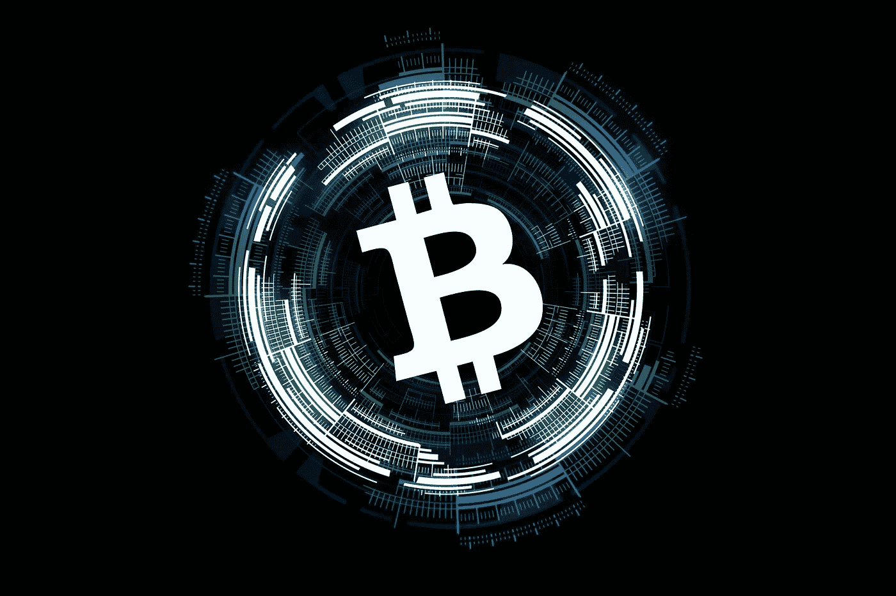
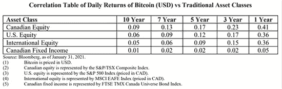

# 关于全球首只比特币交易所交易基金，你需要知道的 5 件事

> 原文：<https://medium.datadriveninvestor.com/5-things-you-need-to-know-about-worlds-first-bitcoin-etf-86a7210496ee?source=collection_archive---------5----------------------->

## 想投资交易所交易基金(ETF)？在冒险之前，记住这 5 件事

Image by [xresch](https://pixabay.com/users/xresch-7410129/?utm_source=link-attribution&utm_medium=referral&utm_campaign=image&utm_content=3041480) from [Pixabay](https://pixabay.com/?utm_source=link-attribution&utm_medium=referral&utm_campaign=image&utm_content=3041480)

加拿大监管机构将发行直接管理的比特币交易所交易基金，供加拿大居民购买。这是全球首个面向散户投资者的产品，开创了全球先例。

对于正在看比特币价格的人来说，这个产品的诞生意味着胃口大、钱包小的小散户有机会持有比特币。那么接下来的问题就是，这个产品真的适合散户参与吗？

在另类投资中，ETF 已经是相对另类的产品，而比特币 ETF 可以算是另类中的另类。分析这个产品需要很大的脑力。

以下是关于比特币交易所交易基金你需要知道的 5 件事:

# **1。怎么买 ETF 或者直接买比特币？**

作为散户，持有比特币的方式有很多种。最直接的方式是通过加密货币交易所购买，也可以通过各种衍生品间接持有比特币，也可以像加拿大散户一样购买一些直接持有。有比特币 ETF 基金。

实际上，人们直接持有比特币的风险越来越大。随着比特币的价格越来越高，很多人都在思考要不要买一个比特币？风险会不会太高？这个问题真的很难回答。因为比特币已经不是普通人能买得起的了。

而且更多的人可能连比特币是什么都不知道，如何交易，如何保存就更无从谈起了。

大部分人可能买不到比特币。因为当时比特币价格已经超过每枚 48000 美元，市值 8900 亿美元。比特币已经成为百分之百的奢侈品。

对于大多数散户来说，买一个比特币的钱，可能足够在亚洲国家二三线城市买一套房子的首付了。

但是买房只能成套买，而不是只买一个一个地板砖去积累，但是不像买一个比特币 ETF，只能买一个 ETF，可能只对应不到半个比特币，就看这个 ETF 了。与基础资产的对应关系以及这种对应关系将随着比特币价格的波动而发生重大变化。

比如美国的[灰度比特币信托的比特币 ETF，根据其官网显示，截至 2021 年 2 月 12 日，每只 ETF 对应 0.00094789 个比特币，即 94789 个 satoshis——作为记账单位，比特币的最小单位是 0.000000001(*亿分之一*)。比特币，又称“1 聪”，是为了纪念比特币的创始人，至今未现身的神秘互联网极客“](https://grayscale.co/bitcoin-trust/) [*【中本聪】*](https://en.wikipedia.org/wiki/Satoshi_Nakamoto) ”。

加拿大的目的比特币 ETF 将直接结算并投资于实际的比特币，而不是像其他类似产品一样使用衍生品。因此，BTCC 的底层资产是比特币和现金。

从这个角度来看，加拿大 BTCC 为投资者提供了一个直接持有相对少量比特币资产的机会。

# **2。比特币与其他资产有什么关联？**

我们通常说“*不要把所有的鸡蛋放在一个篮子里。*

因此，在进行任何类型的另类投资时，你都必须考虑它与其他类型资产的相关性。相关性越小，对投资者整个投资组合的干扰就越小，越有利于分散风险。

BTCC 的招股说明书列出了比特币的平均日回报率与其他资产类别的平均日回报率之间的相关系数。从已披露的数据来看，长期来看，比特币的日均收益与加拿大定息产品的相关系数最小，无论是 1 年期、5 年期、7 年期，还是 10 年期，相关系数都低至 0.06。

与国际股市的相关系数其次——无论是 5 年、7 年，还是 10 年，相关系数都小于 0.1。一年期加拿大股票相关性最高。比特币日均收益与加拿大股市日均收益的相关系数为 0.41，但这个比值小于 0.5，如果在 0.7 以上相关性通常被认为较大。

Credits: Bloomberg, as of January 31, 2021.

因此，根据 BTCC 公布的相关数据，将比特币资产加入投资组合将有助于加拿大投资者降低其整个投资组合的风险。

# **3。ETF 是高风险投资吗？**

从 [PII 公告](https://en.wikipedia.org/wiki/Personal_data)来看，为了获得监管部门的批准，在过去几个月的过程中，通过一系列的会议，与[安大略省证券委员会](https://www.osc.gov.on.ca/) [( *OSC* )](https://www.osc.gov.on.ca/) 建立了紧密的合作关系，最终获得了 ETF 的批准。但这并不意味着奥斯卡认可了 BTCC。正如其招股说明书所写，证券监管机构并未对这些证券发表意见(*指 ETF*)。

投资者仍需防范 BTCC 的各种风险:

*   首先考虑的是比特币价格波动的风险。与其他风险资产相比，比特币的价格波动性显然不低。比特币的价格波动越大，越容易直接影响比特币 ETF 的[资产净值( *NAV* )](https://en.wikipedia.org/wiki/Net_asset_value) 。一般来说，比特币的价格会受到各种因素的影响，包括比特币的供求关系、各国地缘政治的不确定性(*政治不稳定的地区可能会增加对比特币的需求*)、宏观经济状况(*如货币，当通胀预期大幅上升时，对比特币的投机兴趣也会上升*)。自 2020 年 1 月 31 日以来，比特币的波动性减缓了很多。一方面，比特币的现货交易更加稳定和具有流动性，另一方面，各国监管机构对加密货币相关产品的监管审批增加，使得比特币的价格更加稳定。尽管如此，我们不能仅根据当前的波动性来判断比特币未来的波动性，因此我们必须提防 BTCC 的波动性。
*   二是比特币的流动性风险。BTCC 主要在现货市场进行比特币交易。但比特币现货市场的流动性未必能满足资金的交易需求。比如可能有价无市，或者买卖时可能存在较大的差价。
*   第三是 BTCC 自身的汇率风险。一是投资者的货币风险。毕竟，BTCC 是一种以加元计价的 ETF。也就是说，如果你是美元投资者，你需要把美元换成加元来购买 BTCC，然后在赎回的时候，你必须先把 ETF 份额换成加元。然后兑换成美元，有外汇风险。比特币交易的外汇风险。该基金的资产和负债以加元计价，该基金将购买以美元计价的比特币。为了计算每个 ETF 单位的资产净值，基金管理人每天会将基金投资组合中持有的比特币价值换算成加元。

因此，加元相对于美元的价值波动将继续影响每个 ETF 单位的资产净值。如果加元相对于美元升值，该基金的比特币回报可能会减少、消除，甚至变为负值。当然，也可能发生相反的情况。如果这种情况真的发生，基金投资者可能会受益于美元相对于加元的升值。

# **4。ETF 是避风港** **还是风险隐患？**

是也不是。但最有可能的是它不是安全的天堂。

> 这是一个危险的冒险。

ETF 最大的风险是市场风险。比特币在很大程度上依赖于比特币网络的稳定性，而 PII 持有的比特币能否保证其安全性，很大程度上取决于其冰冷钱包的有效性。

与香港证券期货委员会强制虚拟资产交易所投保不同，加拿大监管机构尚未要求 PII 基金和基金托管人购买针对基金持有的比特币损失风险的保险。PII 解释说，主要原因是加拿大目前无法在经济合理的条件下购买此类保险。

目前基金的比特币会由二级托管人离线保存在“*冷库*”中。这是目前市场上最安全的托管解决方案。PII 选择的托管人是[纽约的 Gemini Trust Co LLC](https://www.bloomberg.com/profile/company/1732972D:US) 作为副托管人，资金管理候选人是 [CIBC 梅隆全球证券服务公司](https://www.bloomberg.com/profile/company/0148654D:CN)以增强投资者的信心。

虽然离线存储的比特币理论上受到更强的保护，但即使是冷藏也不是 100%无风险的。过去，该行业曾出现过工作人员看守并窃取线下冷钱包中所有比特币的情况。转到另一个钱包。此外，冷藏设备(如计算机或硬盘)有使用寿命，也容易因外部温度或碰撞而损坏。在这种情况下，可能会造成比特币被冷藏。信息被销毁了。而当冷库里的比特币需要交易时，也要联网。这时候他们也会暴露在黑客攻击之下。

# 5.BTCC 会允许投资者在 ETF 的每个交易日将其兑换成现金吗？

如果你仔细阅读 BTCC 的招股说明书，你会发现赎回条款相当苛刻。首先是赎回价格，只能低于净资产(NAV)的 95%或其 ETF 价格。试想一下，如果比特币的价格很高，但是 ETF 的交易价格是打折的，并不能完全反映比特币的市场价格，那么当 BTCC 的美元投资者赎回自己的基金份额时，赎回的钱可能并没有达到 ETF 价格的 95%，手里的钱也将面临兑换的风险，最终的兑换可能买不到 ETF 份额对应的比特币数量。

二是赎回的资产类别，完全由基金经理决定，多数情况下是现金。BTCC 的招募说明书明确表示，基金管理人有权决定投资者赎回 ETF 时获得的现金和其他资产类别。这意味着通过赎回 ETF 获得比特币相对困难。

当然，加拿大 BTCC 的赎回安排可以视为比美国灰度信托公司的 [GBTC 更具流动性。因为灰度到目前为止根本没有赎回安排，即使要退出信托单位，也要求持有人持有信托单位至少 12 个月，才能卖出基金信托单位。**BTCC 允许投资者在 ETF 的每个交易日自由赎回 ETF 并兑换成现金。**](https://grayscale.co/bitcoin-trust/)

世界上不仅有 GBTC 和 BTCC。另类投资者经常面临各种选择困难，没有别的原因。这不是一个传统的经典流动性市场。所有的风险都要自己考虑，所有考虑后做出的决定也要自己承担。