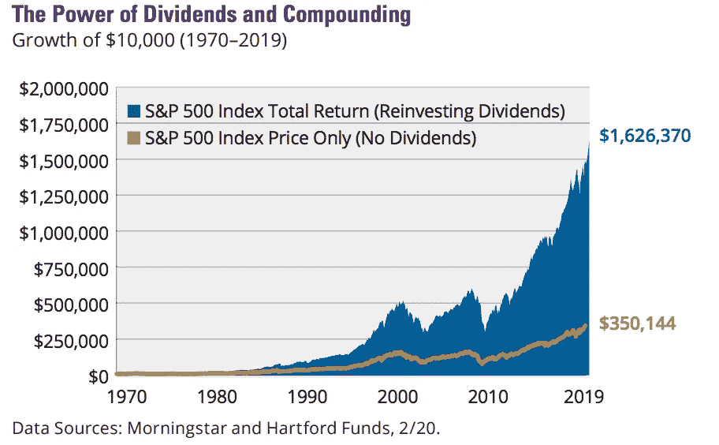
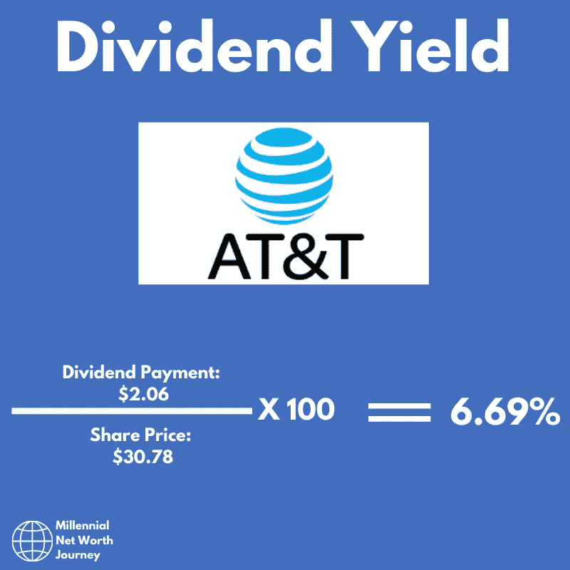
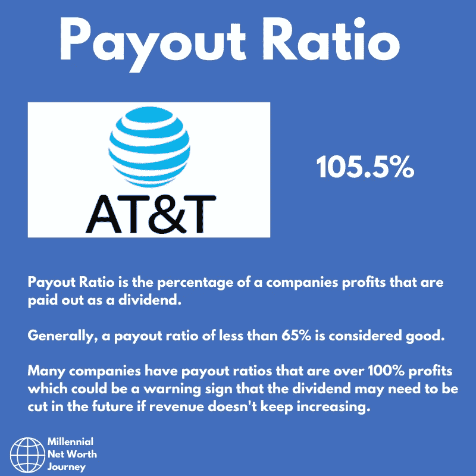
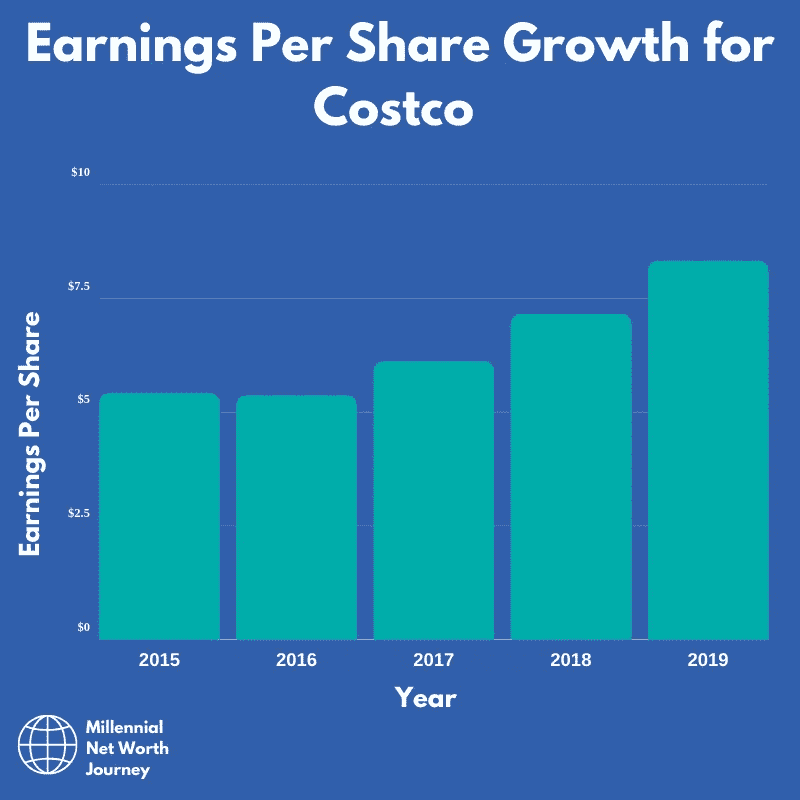
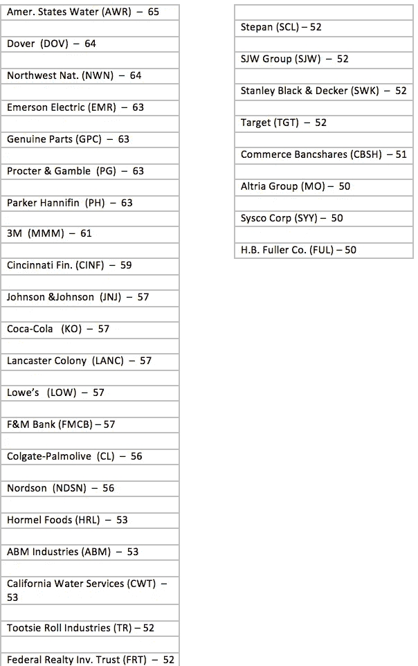
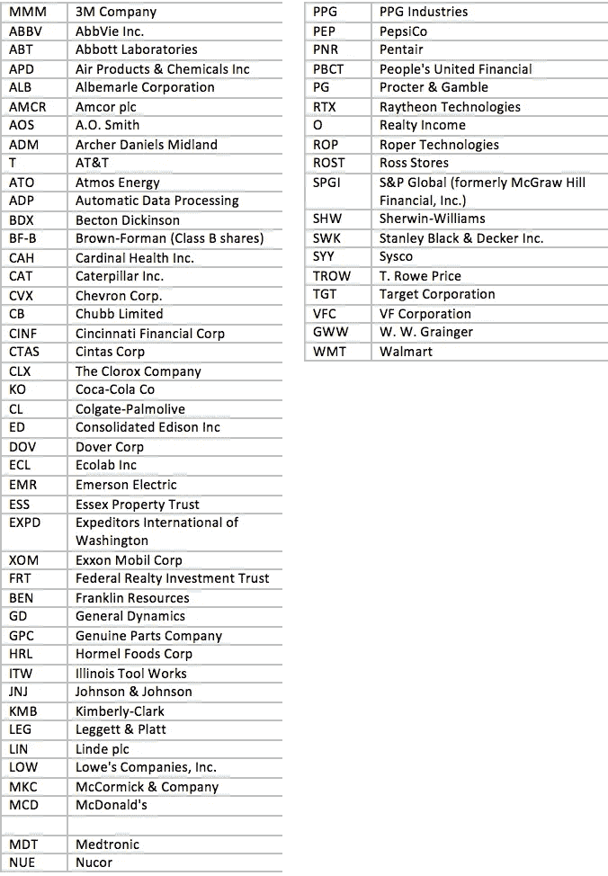

# 股息投资成功需要知道的 5 件事

> 原文：<https://medium.datadriveninvestor.com/5-things-you-need-to-know-for-dividend-investing-success-e29e37421003?source=collection_archive---------10----------------------->

如果你正在读这篇文章，你可能对派息股票感兴趣。你可能听说过股息在股市中积累财富和产生良好回报的力量。如果你听过这句话，那么你没有错。如果你是一个新的投资者，希望找到更多关于股息支付股票的信息，或者你可能是一个以前一直专注于成长型股票的投资者，希望通过一些股息投资来平衡他们的投资组合。如果这是你，那么继续读下去。

在本文中，您将了解到:

*   股息是什么。
*   你如何获得分红。
*   关键股息条款。
*   关键股息指标。
*   分红投资时如何定义自己的目的？
*   当你投资分红股票时，你需要考虑什么。
*   连续 25 年和 50 年多次增加股息的公司的完整列表。(如果你现在想看，直接跳到最后。)

所有这些事情应该设置你的股息投资成功，因为你将有一个基本的坚定的把握和市场上最稳定的股息股票列表，你可以开始你的研究。

让我们开始吧。

# 1.什么是股息？

当一家上市公司盈利时，管理团队可以选择如何处置它。他们可以做的一件事是将其进行再投资，以产生更多创收资产。他们做的另一件事是以支付股息的形式将部分利润返还给公司股东。管理团队将决定支付时间表，以及在每个确定的时间点支付多少。股息以现金形式按股票的百分比支付给投资者。然后，投资者可以选择他们想用得到的钱做什么。

## 我多久领一次工资？

最常见的派息时间表是每三个月一次，或者业内通常所说的每季度一次。也就是说你一年领四次工资。

各公司都有支付时间表，而且在整个行业中，支付股息的时间框架并没有达成一致。

有一些公司每月支付股息，但这些是例外，而不是规则。但作为一名投资者，你可以很容易地购买三只股票，它们的派息时间都在一个月的不同日期，这意味着你每年每个月都有股息支付。

作为一名投资者，知道你的投资组合每个月都将获得股息，尤其是如果你持有相对安全、有长期派息历史的股息股票，这可能是一种安慰。

## 我如何获得股息支付？

获得红利的过程很简单。你需要一个经纪人账户来购买股票。你买了一只支付股息的股票。该公司宣布它正在支付股息和除息以及支付日期。如果你在除息日之前持有股票，你将在支付日以现金形式被支付到你的经纪人账户。

## 为什么它们如此重要？

股息是人们投资的主要原因之一。事实上，你可以购买的东西不断支付你是一个有吸引力的人，包括我在内。

这也有一个很好的理由。股息支付占股市回报的很大一部分。看一下这张图表:

The power of dividends — Copyright of [Hartford Funds.](https://www.hartfordfunds.com/dam/en/docs/pub/whitepapers/WP106.pdf)

正如你从哈特福德基金公司的这张有用的图表中所看到的，股息再投资的力量显而易见。S&P500 总回报的 78%来自股息。正是因为这个原因，他们对通过分红来积累长期财富至关重要。

你越年轻就开始投资有股息的股票越好，但开始投资永远不会太晚。你仍然可以在任何年龄通过投资分红股票获得不错的回报。

# 2.关键股息条款

## 股息收益率

股息率是大多数人用来判断分红股票是否值得投资的指标。

股息率是作为股票红利支付的金额除以股价。

Payout Ratio on [@millennialnwj](https://www.instagram.com/millennialnwj/) on Instagram.

请看这个例子:AT&T。

*   他们的股价是 30.78 美元。(在撰写本文时，2010 年 6 月 17 日。)
*   全年总支出为 2.06 美元。
*   如果你用股息支付除以股价，你会得到 6.69%的股息收益率。

这就是每支支付股息的股票的股息率的计算方法。

## 除息日

除息日是股票开始交易而不派发股息的日期。公司承诺在这一天从它的利润中支付红利，并且钱开始被分配给所有的股东。

## 股息支付日期

一旦宣布股息，在除息日之前持有股票的人将有权获得下一笔股息。

支付日期通常是除息日之后的一两个月。缴款日与除息日、缴款日同时公布。当支付日到来时，在你的经纪人账户中，你将收到你有权得到的每股股息。

然后，你如何处理这笔股息取决于你自己。经纪人通常有一个政策，你可以用比买股票更低的利率再投资股息。

你甚至可以在一些经纪商设置指令，将任何股息自动进行再投资。或者你可以选择把它作为现金，投资到另一家公司。

## 红利贵族、国王和挑战者

比较分红公司的时候有几个层次。股息股票是根据他们设法增加股息的年数来区分的。贵族名单是投资界最排外的名单之一，成为其中一员并不容易。

在过去的 50 年里，有过四次市场崩溃，2008 年是自大萧条以来最严重的一次。(与冠状病毒疫情相比，它看起来很小)。这份名单上的公司已经设法增加了 50 多年的股息。有些人这样做的时间更长。这些类别是如何形成的:

*   股息贵族——50 多年的股息增长。
*   股息王—超过 25 年的股息增长。
*   股息挑战者—超过 10 年的股息增长。

没有理由说一些分红王和挑战者将来不会成为贵族，只有时间会证明。如果说今年教会了我们什么的话，那就是你永远不知道接下来会发生什么，这就是为什么在所有市场条件下都能表现良好的分红股票都是有利的。

# 3.关键股息指标

## 支付比率

派息率是公司作为股息派发的利润数。这是投资者密切关注的指标，因为它可以告诉你股息是否不可持续。

Payout Ratio on [@millennialnwj](https://www.instagram.com/millennialnwj/) on Instagram.

如果派息率接近利润的 100%，任何轻微的市场低迷都可能导致股息减少，这通常意味着股价下跌。

通常，低于 65%的派息率被认为是健康的。任何高于这个数字的数字都会带来麻烦。如果低派息率意味着公司获得大量利润并向投资者支付大量资金，那么它就是好的。

## 股息增长

股息增长是一个衡量股息支付随时间增长的指标。如果一家公司有持续增加股息的记录，这是一个积极的迹象，表明该企业是健康的，他们的利润也在增长。

如果公司股息保持不变，通货膨胀就会侵蚀你的收益。如果一家公司的股息是 1.5%，通货膨胀是 2%，并且没有增加，你得到的钱将变得一文不值。

## 每股收益增长(EPS)

每股收益是一个衡量标准，它展示了一家公司从投资者可获得的每股股票中赚取的美元数。

这可以用来显示投资者愿意为一家公司的每一美元收入支付多少。

Earnings per share growth for Costco on [@millennialnwj](https://www.instagram.com/millennialnwj/) on Instagram.

考虑到每股收益多年来的增长率，每股收益的增长比这更进一步。这一增长预示着公司未来的积极方向。

# 4.定义你的目标

为了在任何追求中取得成功，你需要明确你的目标。

如果你刚刚开始你的财富之旅，你可能会选择那些在未来几年里股息会增长的公司。

如果你想长期积累财富，那么你会想把你的红利一次又一次地再投资，直到它们变成一笔可观的钱。

你投资的原因对你购买的股票有影响。如果你想要稳定的收入来支付你的开销，你可能会选择一个较小的投资组合，投资高收益的股票。这可能包括支付更固定股息的股票。

要达到货币红利收入的水平，需要相当大的一笔钱。

# 5.建立你的投资组合

## 组合投资组合时需要考虑的事项

我之前写过一篇关于这个的文章，我会在这里链接:

 [## 建立红利投资组合时要考虑的 5 件事

### #3 你投资的企业的安全性。

medium.com](https://medium.com/datadriveninvestor/5-things-to-consider-when-building-a-dividend-portfolio-3c000025bf58) 

但是如果你还不想读，我可以在这里总结一下。当你建立股息投资组合时，有五件事你应该考虑。

# 支付比率

一家公司的派息率是它支付给投资者的利润数。如果这个数字相当高，这可以被视为一个负面信号，因为它可能是不可持续的。如果公司陷入困境，利润下降，它可能无法维持它的股息，这意味着你得到的报酬会减少。如果发生这种情况，可能是因为公司长期的问题。注意这个。

通常，低于 65%的支付率被认为是优秀的。你可以在网上搜索这类信息。

# 安全

对于分红股票，要考虑的一件事是其股息的安全性。股息是否可持续取决于企业是否安全。如果是的话，它的股息应该是可持续的，这就是你在股息股票中所寻找的。

*如果一家公司定期公布稳定的股息，那么这可以被视为一个好因素。如果他们经常达到分析师的预期，这可以被视为一个好迹象。*

# 股息增加

考察一家公司是否在成长，它的股息支付是否与其利润和收入相符，是衡量股息投资股票健康状况的一个很好的方法。

*你从这一指标中寻找的主要内容是，该公司的收入、每股收益和股息支付都处于上升轨道。只要稍加搜索，所有这些信息都可以在互联网上找到。*

# 多样化

建议你将你的红利投资组合分散到几个不同的行业，这样你就不会受到任何经济衰退的影响。

一般来说，将你的投资分散到 5-7 个行业是保护你免受经济衰退影响的最佳选择。

# 股息收益率和总收益率

仅仅考虑一只股票的股息收益率是不够的。您需要考虑股息组合的整体收益率。如果您对每家公司的投资金额相同，您可以通过将所有股票的股息收益率相加，然后除以必须获得平均值的股票数量来找到答案。

*虽然没有神奇的数字可以瞄准，而且不同国家和行业的股息差异很大，但对于专注于美国股票的相对保守的投资组合来说，总体投资组合 2.5%-3.5%的收益率是一个很好的数字。*

## 哪里可以找到分红股票

这里有一些网站，有关于分红股票的内容和研究，我会链接到这里:

[www.marketwatch](http://www.marketwatch) 。com

[www.motleyfool.com](http://www.motleyfool.com)

[www.millennialnetworthjourney.com](http://www.millennialnetworthjourney.com)

[www.macrotrends.com](http://www.macrotrends.com)

[www.dividendvalueinvestor.com](http://www.dividendvalueinvestor.com)

[www.dividendmax.com](http://www.dividendmax.com)

一个好地方是看看那些多年来成功增加股息支付的公司。公司这样做的时间越长越好，但这并不意味着将来这种情况不会改变。无论出于什么原因，公司总是会进出分红王和贵族名单。看看这里的名单。

## 当前分红王完整列表

这是分红王的完整名单。在过去的 50 年里，这些公司增加了股息。

## 当前分红贵族完整名单

这是分红贵族的完整名单。这些公司在过去的 25 年里增加了股息。

这份名单上有很多公司你会认可，并在你生命中的某个时候给了他们钱。可口可乐、沃尔玛、高露洁、雪佛龙都是美国的标志性企业，分红的时间比我还长。

其中许多公司有趣的地方还在于，就市值或收入而言，它们中的许多公司都相当小。您可能没有听说过其中许多公司，因为它们不是大牌、知名的公司。但是这个列表清楚地表明了一个事实，商业上的成功并不取决于你所在地区的世界支配地位，在较小的公司里稳定的回报是可能的。

当寻找股票加入你的投资组合时，确保你做了调查，这样你对你正在做的事情有信心。在投资中，通常很少有捷径，耐心往往比基于情绪和短期收益的可能性做出轻率的决定更好。

## 后续步骤

读完这篇文章后，你应该有了一切你需要知道的东西，为你的分红投资成功做好准备。

如果你想在未来继续关注派息股的研究，请在这里注册我的邮件列表:

 [## 时事通讯注册-千禧净值之旅

### 注册我们的邮件列表，了解我们最新的帖子和深入的投资新闻和分析。我们…

millennialnetworthjourney.com](http://millennialnetworthjourney.com/newsletter-sign-up/)