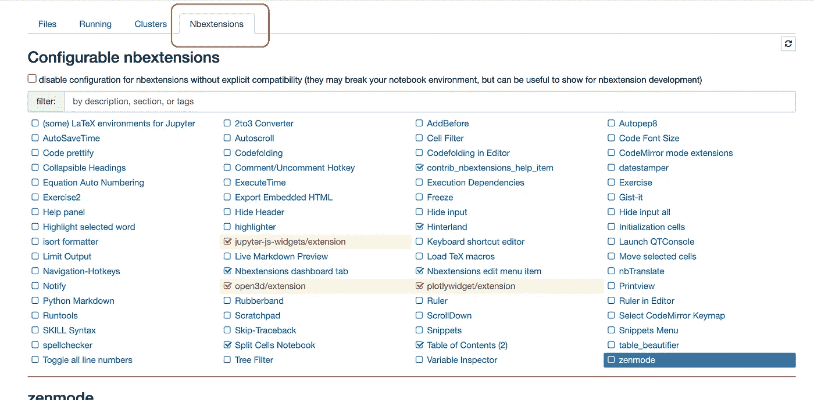
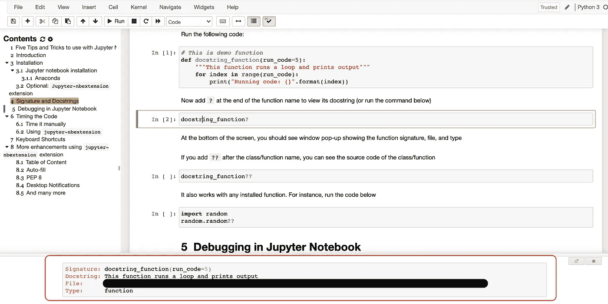
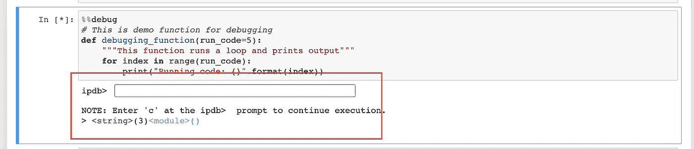
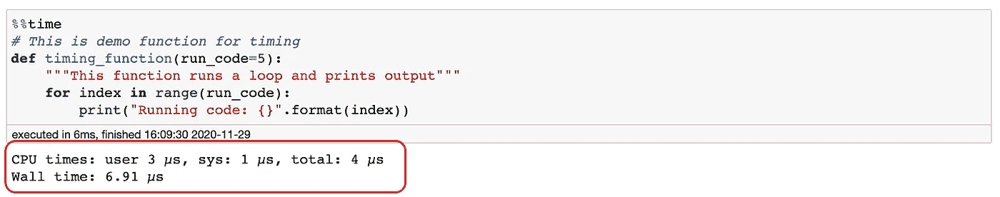
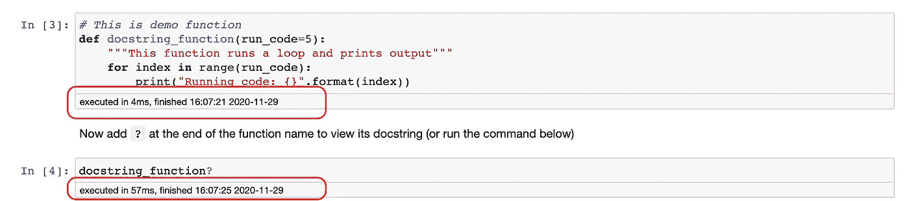
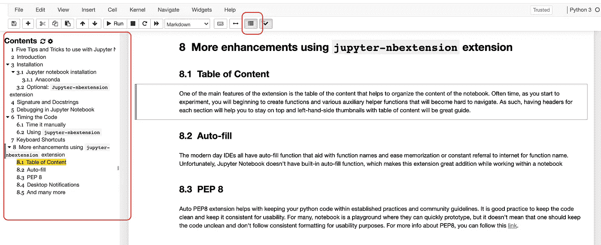
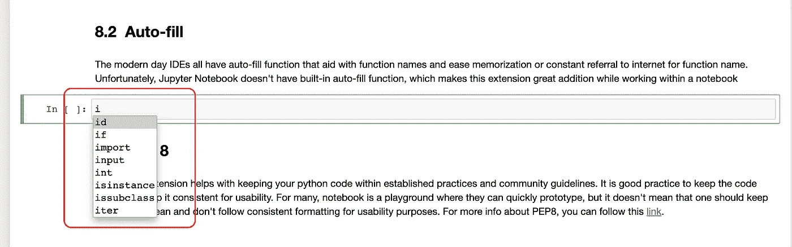
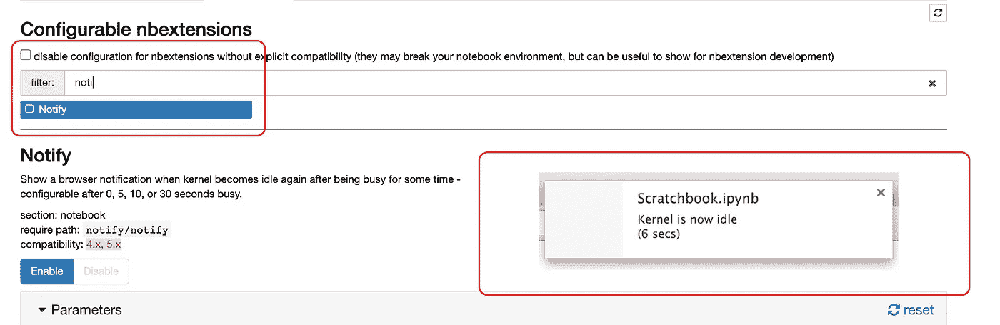

# 使用 Jupyter 笔记本提高工作效率和保持条理的 5 个技巧和诀窍

> 原文：<https://medium.datadriveninvestor.com/5-tips-and-tricks-to-use-with-jupyter-notebook-to-be-productive-and-to-stay-organized-8d790e887e97?source=collection_archive---------3----------------------->


作为一名数据科学家，您可能每天都在使用 Jupyter Notebook，以便快速创建原型或探索数据集。任何经验丰富的数据科学家都可能找到许多适合他们的技巧，但本文(通过 Jupyter 笔记本演示)的目标是提供介绍性的提示和技巧，以帮助新的数据科学家保持有序并充分利用该工具。

在下面的笔记本中，我们将介绍以下材料:

## 目录

1.  安装指南
2.  **提示&招数 1** :签名和文档串
3.  **提示&招数二:**调试
4.  **提示&招数 3:** 执行时间
5.  **提示&招数四:**键盘快捷键
6.  **提示&招数 5:** Jupyter-nbextension

## 注意:

我还编写了 Jupyter Notebook 来演示本文中讨论的所有特性。我认为在你阅读这篇文章的时候进行演示会很有帮助，并且在学习的时候可以随时重复使用。

这里是[链接](https://github.com/AlmasM/Medium/blob/main/jupyter-notebook-tutorial.ipynb)

# 介绍

J upyter 笔记本是任何数据科学家不可或缺的工具。它是一个用于快速原型和迭代开发的交互式工具。特别是，对于希望在解析数据、运行算法或可视化时看到中间结果的新手来说，该工具非常方便。笔记本电脑的主要优势和受欢迎程度之一可以归因于算法或代码修改的简易性，而无需一直重新运行整个程序。

> 要使用此笔记本，您需要安装“Jupyter 笔记本”和可选的“jupyter-nbextension”扩展。

# 1.装置

这里有几种安装 Jupyter Notebook 的方法，作为一种流行的工具，它在 Windows、Linux 和其他主要操作系统平台上都受支持。更多关于如何安装的信息可以在 Jupyter 笔记本官方文档[中找到](https://jupyter.org/install)

官方文档推荐使用 [**康达**](https://docs.conda.io/projects/conda/en/latest/user-guide/install/) 软件包管理器安装 Jupyter 笔记本。

如果使用 **python 包**，可以在终端运行:

```
pip install jupyterlab
```

如果您安装了 **conda** ，您可以在终端中运行:

```
conda install -c conda-forge jupyterlab
```

要运行，您可以在终端中执行:`jupyter-lab`

## 1.1 蟒蛇

个人比较喜欢 [Anaconda](https://www.anaconda.com/products/individual/download-success) ，也就是*数据科学平台*。一旦安装，它会预装许多库，如`numpy`、`scikit-learn`、`pandas`(等等)。可以把它想象成一个一站式商店，提供数据科学工作所需的所有工具

## 1.2 可选:Jupyter-nbextension 安装

在本教程中，我们也将使用`jupyter-nbextension`库。我会推荐安装它，因为它会给你更多的高级增强

使用`pip`，你可以在终端运行:

```
pip install jupyter_nbextensions_configurator
```

使用`conda`，您可以在终端中运行:

```
conda install -c conda-forge jupyter_nbextensions_configurator
```

安装完成后， **Nbextension** 选项卡应该会出现在主笔记本页面上，旁边还有几个选项卡:文件、运行、集群



Nbextension tab once installed

如上图所示，您可以安装许多扩展。你只需要勾选你想激活的那个。

# 提示和技巧 1:签名和文档字符串

记录你的代码并在解释代码的同时附上注释是一个很好的实践。很多时候，我们不得不阅读别人的代码，甚至不时地重温我们自己的代码；在长时间远离你的代码或者阅读别人的代码之后，可能会有点令人畏惧。因此，**一定要了解签名和文档字符串**，以便为自己和他人将来的工作提供便利。

创建新的单元格并通过以下代码:

```
# This is demo function
def docstring_function(run_code=5):
    """This function runs a loop and prints output"""
    for index in range(run_code):
        print("Running code: {}".format(index))
```

现在，在下面创建新的单元格，在函数名的末尾添加`?`来查看它的 docstring(或者运行下面的命令):

```
docstring_function?
```

在屏幕底部，您应该会看到一个弹出窗口，显示函数签名、文件和文件类型。

如果在类/函数名后面加上`??`，就可以看到类/函数的源代码

```
docstring_function??
```

它还可以使用任何已安装的函数和/或标准库函数。例如，创建新单元运行下面的代码:

```
import random
random.random??
```

一般来说，当你在函数的末尾添加`?`或`??`时，你应该会在网页的底部看到关于你刚刚询问的函数的信息



The bottom of the webpage will show info about the function when ? or ?? invoked in the cell

# 技巧 2:在 Jupyter 笔记本中调试

尽管 Jupyter notebook 提供了分解代码和分别运行组件的粒度，但有时调试会很方便，尤其是在编写算法或寻找边缘情况时。以下是如何在 Jupyter 笔记本中调试的一种方法:

`%debug` —调试单行代码；**或**
`%%debug` —调试整个单元

运行下面的代码，你会看到`ipdb>`行和文本空间给出调试命令(如继续等)。

让我们创建一个新的单元格并粘贴以下代码:

```
%%debug
# This is demo function for debugging
def debugging_function(run_code=5):
    """This function runs a loop and prints output"""
    for index in range(run_code):
        print("Running code: {}".format(index))
```

当您运行上面的单元时，您将看到下图所示的输出:



Debugging option in the Jupyter Notebook

**注:**这只是笔记本调试的一种方式。更多关于如何调试的信息，可以在这里找到[。](https://www.blog.pythonlibrary.org/2018/10/17/jupyter-notebook-debugging/)

[](https://www.datadriveninvestor.com/2020/07/23/learn-data-science-in-a-flash/) [## 一瞬间学会数据科学！？数据驱动的投资者

### 在我之前的职业生涯中，我是一名训练有素的古典钢琴家。还记得那些声称你可以…

www.datadriveninvestor.com](https://www.datadriveninvestor.com/2020/07/23/learn-data-science-in-a-flash/) 

# 技巧 3:执行时间

有几种方法可以测量代码的执行时间。下面我们将探讨两个选项:

## 第一:用内置函数计时

创建新的单元格并通过以下代码:

```
%%time
# This is demo function for timing
def timing_function(run_code=5):
    """This function runs a loop and prints output"""
    for index in range(run_code):
        print("Running code: {}".format(index))
```

或者，您可以只对一条语句计时。这与对`?`和`??`执行的过程相同。创建新单元格，粘贴代码并运行以下代码:

```
run_code = 5
%time mult_print = [print("Running code: {}".format(index)) for index in range(run_code)]
```

输出应该显示运行代码所花费的时间，如下图所示:



Execution time measurement by built-in Jupyter Notebook

## 第二:使用 jupyter-nbextension 库

库`jyputer-nbextensions`有一个扩展，它打印出执行时间以及执行的时间戳。你可以在库[文档](https://jupyter-contrib-nbextensions.readthedocs.io/en/latest/nbextensions/execute_time/readme.html)中找到更多关于扩展的信息

您必须在主菜单的 Nbextension 选项卡中激活此功能。您可以随时创建新的 web 浏览器选项卡并通过以下 URL:

```
[http://localhost:8888/tree](http://localhost:8888/tree)
```

您的端口号 8888 可能不同，但是如果您在配置期间没有更改它，默认情况下它是 8888

激活后，计时功能将出现在您运行的每个细胞上，如下图所示。



Execution time and timestamp for each cell

# 提示和技巧 4:键盘快捷键

到达左上角来运行单元格或创建新单元格可能会非常烦人。相反，有几个热键，你可以用来精通 Jupyter 笔记本。主要的有:

`**Shift + Enter**` —运行单元格+选择下一个单元格
按键`**a**` —在上方插入单元格
按键`**b**` —在下方插入单元格
按键`**m**` —将单元格转换为 markdown(运行 markdown 单元格后，可以双击它进行编辑)
按键`**y**` —将单元格转换回代码
按键`**x**` —剪切选定的单元格
按键`**c**` —复制选定的单元格
按键

**注意:**您可以在*帮助- >键盘快捷键*中导航至左上角菜单来更改这些快捷键

# 技巧 5:使用“jupyter-nbextension”扩展获得更多增强

在“安装”部分，我们安装了名为`jupyter-nbextension`的附加库，这是一个很好的扩展，可以在您使用笔记本时提供帮助。

## 5.1 目录

该扩展的主要特性之一是目录，它有助于组织笔记本的内容。通常，当你开始实验时，你会开始创建一些函数和各种辅助函数，这些函数会变得难以操作。因此，每个部分都有标题将有助于你保持在顶部，左手边的缩略图和目录将是很好的指南。

为了确保你有表格内容的格式，你需要遵循标题的 markdown 格式，它会自动创建标题，副标题等等。

您可以通过点击网页顶部菜单栏中的目录图标来显示或隐藏它。



Table of content activation and formatting example

## 5.2 自动填充

现代 ide 都有自动填充功能，这有助于函数名的记忆或经常在因特网上查询函数名。不幸的是，Jupyter 笔记本没有内置的自动填充功能，这使得这个扩展在笔记本中工作时非常有用

一旦在 Nbextension 菜单中激活，自动完成将被激活，如下图所示。



Auto fill functionality

## 5.3 PEP 8 (Python)

Auto PEP8 extension 有助于将您的 python 代码保持在既定的实践和社区准则范围内。保持代码的整洁和可用性的一致性是一个很好的实践。对于许多人来说，notebook 是一个可以快速开发原型的平台，但这并不意味着人们应该保持代码的整洁，不要为了可用性而遵循一致的格式。想了解更多关于 PEP8 的信息，你可以关注这个[链接](https://www.python.org/dev/peps/pep-0008/#introduction)。

## 5.4 桌面通知

如果您有几台并行运行的笔记本电脑，这将非常方便。这项功能将通过浏览器在桌面应用程序上向您发送通知。如果你用的是 Mac，这就意味着在右上角，Chrome(比如)会代表 Jupyter Notebook 给你发一个提醒。

下图显示了如何激活它以及弹出窗口的示例



## 5.5.更多的

在使用 Jupyter Notebook 时，您可以探索和使用更多扩展。重要的一点是，上述功能只是你开始的起点。我将由您来探索适合您需求的特性。

# 感谢阅读我的文章。

查看[我的其他故事](https://medium.com/@almasmyrzatay)。如果你喜欢它，或者有任何意见/问题，请告诉我！在社交媒体上随意联系: [Instagram](https://www.instagram.com/almasmyrzatay/?hl=en) ， [LinkedIn](https://www.linkedin.com/in/almasmyrzatay/)

## 访问专家视图— [订阅 DDI 英特尔](https://datadriveninvestor.com/ddi-intel)