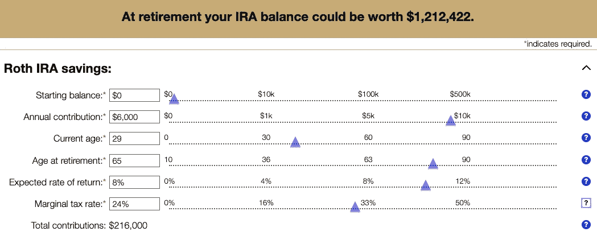

# 2021 年财务成功的 5 个秘诀

> 原文：<https://medium.datadriveninvestor.com/5-tips-for-financial-success-in-2021-bf24485729e4?source=collection_archive---------12----------------------->

## 新的一年需要新的投资策略。

Photo by [Sigmund](https://unsplash.com/@sigmund) via Unsplash

我们迎来了新的一年，也迎来了新的投资和财务成功的一年。2021 年，你可能会考虑在你的投资组合中增加一些新的投资，甚至改变你的投资策略。

无论你 2021 年的目标是什么，都有财务成功的基本原则，你可以遵循这些原则度过财务成功的一年。我们不是在谈论建立一个应急基金。这些是给你度过那个阶段的提示。

我们在讨论如何利用你的钱让它为你服务。从创造被动收入到投资资产，你可以从这五个 2021 年财务成功的秘诀中受益。

# 最大化你的罗斯

这应该是每个人的首要任务。如果你还没有罗斯个人退休帐户，*申请一个*。

让我重复一遍，如果你还没有罗斯个人退休帐户，那么你在 2021 年应该做的第一件事就是**建立一个**。这是一个免税的退休账户，你一年最多可以存入 6000 美元，如果你年满 50 岁，可以存入 7000 美元。

最大化你的财富应该是你最优先考虑的事情，尤其是如果你还年轻的话。6000 美元可能看起来不是很多投资，但如果你使用任何罗斯个人退休帐户增长计算器，你会发现，如果你在 30 岁之前开始最大化你的罗斯，那么你很可能在 60 多岁时达到 100 万美元，平均市场回报率为 8%。

thrivent.com Roth calculator

最棒的是，当你长大后最终决定取出这笔钱时，它是完全免税的。没错，花的都是你的钱。这就是为什么首先罗斯个人退休帐户必须有 6000 美元的上限。这就是它们的价值所在。

以下是一些建议，以防你不确定是否要开始一项 Roth:

*   你不能开第二个罗斯来贡献更多。(每人每年只有 6000 美元，如果你超过 50 岁，则为 7000 美元)
*   你的罗斯的任何收入也是免税的。

# 增加你的副业

在这个不确定的时代，拥有多种收入来源是每个美国人的梦想。如果一种收入流不能产生足够的钱，你肯定会依靠其他收入流来生存。

也就是说，我们都应该专注于增加我们的副业，创造这些额外的收入流。一个侧面的骗局不一定会让你赚很多钱，也不一定会很耗时。

一些值得考虑的最佳兼职是那些你不必离开舒适的家去做的工作。无论是写作，调查，甚至是兼职，这些额外的收入将会用来支付开销，甚至是投资。

你怎么处理你的私房钱不关我的事。我在这里只是给你一些选择，你可以在哪里获得额外的钱:

*   兼职工作
*   自由职业者(写作、数字设计、你拥有的任何技能)
*   在线调查
*   转售

 [## 我与理财顾问的“丰富”之旅——你应该避免的错误|数据驱动型投资者

### 20 多岁的时候，我从来没有想过退休或者养老。不知不觉中，我相信了每个国家的养老金制度

www.datadriveninvestor.com](https://www.datadriveninvestor.com/2020/12/03/my-rich-journey-with-a-financial-advisor-mistakes-you-should-avoid/) 

# 投资更多支付股息的股票

股息投资在过去几年越来越受欢迎，如果你想获得更多的被动收入，这是值得考虑的。

许多聪明的股息投资者投资于各种不同的股息支付股票，因此他们每个月都有被动收入。如果你有足够的资金来投资各种股票，这是一个好主意。如果你没有那么多资本，那么从小规模开始总是最好的。

股息投资的伟大之处在于，你不会太在意一只股票的表现是否良好。你只是想确保你持有的股票有回报。

# 增强你的储蓄

在阅读这篇文章之前，我猜你已经有了一笔可观的现金储备，以备长期使用。增强这种储蓄从来都不是一件坏事。

有时候，我们只是遇到额外的钱，我们真的没有地方放。也许是退税款或三薪月。不管是什么原因，你可能会多花几百或几千美元，而你并没有任何计划。用它来缓冲你的储蓄从来都不是一件坏事。

你可能甚至没有储蓄，但也许你可以用这些额外的钱来开始一个。对我来说，储蓄不同于应急基金。最终，一旦应急基金达到一定数额，继续向其捐款是不明智的，因为它总是会输给通货膨胀。

与你的应急基金相反，你的储蓄应该放在类似高息储蓄账户的地方。一些非常安全的东西，但仍然比你的应急基金赚取更多的利息。如果你能在你的储蓄中积累一笔可观的钱，那么它将会持续为你带来多年的被动收入。

# 尝试不同类型的投资

新的一年意味着在不同类型的投资上有一个新的开始，你可能一直在观望。浏览这些选项会把你带到一个收入的世界，甚至是你喜欢做的爱好。

投资最大的好处是，你可以投资很多不同的东西，看着钱增值。你的钱也有不同程度的承诺。你不必买一栋公寓楼就开始投资房地产，你可以从小处着手。最后一点是，重要的是要记住多样化是关键。

这些都是我在新的一年里关注的不同类型的投资。我已经涉足了一些，还在考虑其他的。

*   不动产
*   劳力士手表
*   股票预购买卖
*   秘密党员
*   贵重物品(口袋妖怪卡、稀有运动鞋等。)

## 访问专家视图— [订阅 DDI 英特尔](https://datadriveninvestor.com/ddi-intel)