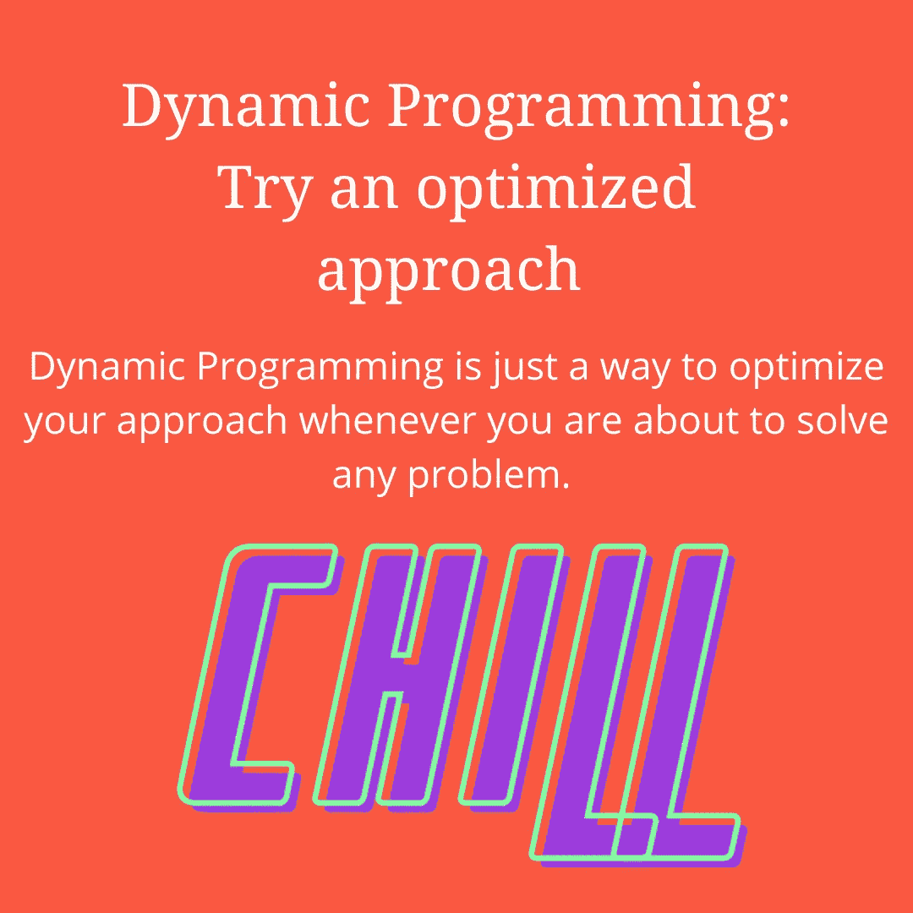

# 关于“如何发展谈判技巧”的 5 点建议

> 原文：<https://medium.datadriveninvestor.com/5-tips-on-how-to-develop-negotiation-skills-d38c6cbb630f?source=collection_archive---------15----------------------->

嘿伙计们，

很高兴看到你回来了！本文是以“我探索，你学习”为标题的系列文章的继续。

Article 2/10: Tips to develop Negotiation Skills

**我对我的读者又有什么期待呢？**

> 分享他们真实的反馈，就像他们上次做的那样，让我写一篇关于新话题的文章。

**感谢我的队友**

> Khushi Seth :她为我提供了更好的输入和想法，帮助我以更好的方式创作内容。

那么，现在让我们从第二篇文章*开始，它旨在通过定义谈判技巧来丰富你的谈判方法，让你知道为什么谈判技巧很重要以及如何提高谈判技巧？*

 [## 谈判技巧培训|如何培养谈判技巧的指南

### 为什么我的家人，不理解我的梦想？为什么总是要求我调整？为什么我的每段感情都结束得这么快？为什么…

www.drillitdown.com](https://www.drillitdown.com/negotiation-skills-training/) 

**让我奉承一下，我花了多少钱，“*准备这篇文章”。***

> 令我惊讶的是，有一位读者通过我的社交媒体账号联系我，说他有兴趣阅读一篇关于这个话题的文章。那种感觉让我起鸡皮疙瘩。我很高兴能参与其中，最终在阅读了相当好的文章并探索了一些未知的事实后，我在现实生活中的例子的帮助下以一种简单的方式开发了这个脚本。所以，让我们从它开始。

# 理解 4 P 的力量

支持 P 的力量，以一种不会给你试图与另一方签订的任何合同增加任何虚伪的方式概念化事实。我们提出的这 4 P 应该是第一步，当你准备好提高你的谈判技巧时，你应该采取这一步。

Understand the power of P’s

# 准备

预先展望你已经准备好的事实。明智而恰当地为每一点谈判技巧做好准备，只在事前。如果你是个新手，准备一份关于谈判技巧训练的脚本。

# 实践

我所说的练习是指，找一个你信任的朋友或同事，然后和他/她一起练习。制作一份脚本，并与你的朋友分享。

# 获得

让我澄清一下，我确切的意思是，这是一种预先考虑的方式，你可以测试你已经做的所有准备和练习。

# 收集

完成准备、练习和采购后，你需要发展的最后一项技能是捡东西。你需要从你在特定的人面前获得谈判技巧的方式中吸取经验。建议你应该分析整个形势，从你所犯的错误中吸取教训。

# 不要回头看你没有准备好的事情

Be prepared for things you want to present

> 你有没有在毫无准备的情况下尝试过这种关系，这种关系对你有用吗？
> 
> *我想没有。*
> 
> *你有没有尝试过考试中你没有准备好的问题？*
> 
> 我认为你从未尝试过，将来也不会尝试。

“谈判技巧”也是如此。

假设，你坐在会议室里，面对你的老板，向他推销你的想法。现在，回答我的几个问题？

# 你是否试图以某种方式压缩你的观点，让他称赞你的想法？

是的，我们都这样做。因为最终这会给我们带来利润。

# 你事先准备好剧本了吗？

是的，你这样做。只是，用你要提出的观点来分析清楚。

# 你是否更喜欢用一些不寻常的事实来打断你的谈话，而你甚至都没有准备好？

最有可能的是，如果你刚进入公司，你永远不会这样做。当你很有经验，并且能够回答任何可能向你提出的问题时，建议你尝试不同的事实和数据。

# 像职业足球运动员一样射门得分

AMA！那些拥有梅西的人有他们最喜欢的球员。关于这位足球运动员，有一件事启发了我:“当他为自己的梦想而努力时，他是如何重重地击倒了他前进道路上遇到的所有障碍！”。

发展谈判技巧不是一天的过程，你需要每天一点一点地学习。你以一种突出地统一你的思想的方式遵循所有的 4 P。在脑海中勾勒出一幅足球地图。当你学习谈判技巧时，你需要通过某些阶段。

# 一开始就需要成为守门员

你需要面对所有的批评，无论你什么时候开始。你需要成为一个优秀的守门员，不要让任何批评影响你的心态。你需要保存你的心态，从每一个计划好的镜头和对你的每一次击球中。

# 作为一名防守队员提升自己

当你擅长做守门员的时候，优化你自己做后卫。从长远来看，在所有的攻击中放弃和干扰来保存你之前所做的准备是可以帮助你的事情。作为一名后卫，你有机会从后面参与比赛，并理解比赛的结构。

# 担任中场队员

作为一名中场球员可以优化你的日常训练，这可以帮助你了解比赛是如何从背后进行的，并可以产生更多关于如何作为一名进攻者进行比赛的想法。

# 像攻击者一样杀死它:游戏性

像一个攻击者一样玩游戏意味着你对游戏非常在行，你对事情非常了解。现在，你很有可能以一种无人能及的方式脱颖而出。所以，每当你想要学习新东西的时候，把这个游戏保持在你的脑海里，明智地玩下去。

# 引入动态规划概念

Dynamic Programming

所以，正在阅读这篇博客的程序员，应该很熟悉动态编程这个术语。所以，对于非程序员来说"*动态编程只是* *一种在你要解决任何问题时优化你的方法的方式"。*

现在，DP 的概念将如何帮助我加强谈判技巧。让我们再造一个故事。

"*你有没有试过走一条更远的路去你家？"*

*“你有没有尝试过和那些有‘自我型’个性的人交谈？”*

我从来不喜欢。无论何时，当你安排与某个特定的营销人员会面时，你都应该意识到这样一个事实:“成千上万的人已经联系上了他/她，那么在这种情况下，什么是明智之举？”。准备一段独白，陈述你的使命和愿景。在他/她的头脑中培养清晰的思维。

# 不要和魔鬼做交易

无论你想签什么样的合同，都要三思而行。即使你对交易不满意，也不要只说是。为双方建立一个双赢的局面，尝试描述对你有利的方面，而不是对他们有利的方面，反之亦然。以递归的方式理解整个交易。培养自己清晰的思维。

让我们用你的旧记忆重现这一切。

*当你还是个孩子的时候，你有没有尝试过在你父母面前牺牲自己，让他们对你的任何要求说“是”***”是的，我们都这样做过。这是说服你父母的正确方法吗，不！但我们做到了，因为我们从中获得了一些东西。”**

***同样，对方甚至可以——愚弄你，只是为了从你身上获得一些利益。在这种情况下你需要做什么？***

*你只需要保持冷静，并在以一种完美的方式承认所有情况后做出反应。建议不要发脾气和筋疲力尽，给对手一个赢得比赛的机会。但是，谈判直到你真正的要求都没有得到满足。*

**所以，以此我们来结束* ***十篇文章中的第二篇。****

*所以，现在我想听听你的意见。*

> *你想在日常生活中赋予哪一个技巧？*
> 
> *你喜欢我们用美丽的故事重新创造概念的方式吗？*

*让我们在以下方面相互交流和联系: [Dhruv Trehan](https://twitter.com/dhruvtrehan45)*