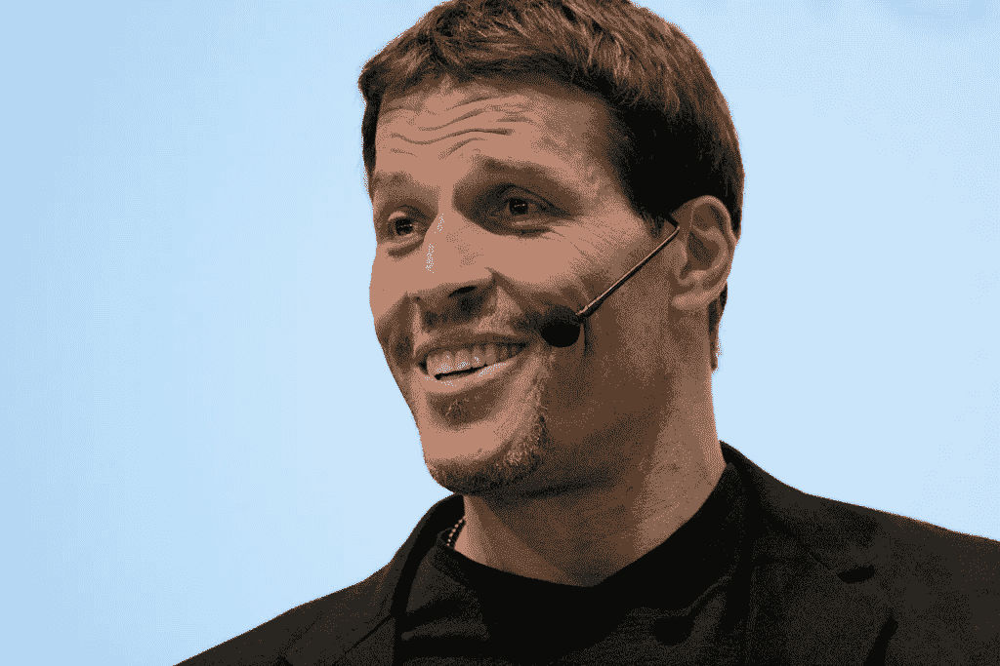

# 托尼·罗宾斯的 5 句名言会让你醒悟

> 原文：<https://medium.datadriveninvestor.com/5-tony-robbins-quotes-that-will-wake-you-up-7652b0aa7d4a?source=collection_archive---------7----------------------->

[Randy Stewart](https://www.flickr.com/photos/stewtopia/) — [https://www.flickr.com/photos/stewtopia/3948482669/](https://www.flickr.com/photos/stewtopia/3948482669/)

有时我们在自动驾驶模式下度过一天。

谢天谢地，有一个声音很大的大个子不时地叫醒我们。托尼·罗宾斯从不回避说出真相，并帮助我们把我们的生活带到一个新的水平。

罗宾斯是著名的作家、励志演说家和生活教练。许多人认为他改变了他们的生活，因为他以独特的方式面对他们的恐惧，并促使他们采取行动。

不是我们所有人都有能力参加他的为期多天的研讨会。但是你仍然可以让罗宾斯用有力的引用来影响你。

 [## 成功人生的 25 种自我提升方式|数据驱动的投资者

### “我活得越久，学到的就越多。学的越多，体会的越多，知道的越少。”―米切尔·莱格兰德时间到…

www.datadriveninvestor.com](https://www.datadriveninvestor.com/2019/03/12/25-self-improvement-ways-for-a-successful-life/) 

让我与你分享我最喜欢的托尼·罗宾斯的五句名言:

> 你私下练习的东西会在公开场合得到回报

大多数时候，在你付出努力和看到结果之间有一个时间差。

能够忍受这种压力的人往往比那些总是寻求即时满足的人更成功。

许多一夜成名的人一生都在训练。

**如何使用这句话:**

在你期望看到结果之前，一定要投入工作。学会拥抱这个时候，因为这是你可以自由实验而不被评判的时候。一旦你登上舞台，你就会一夜成名。

> 你的过去不等于你的未来。

许多人用他们的过去来定义自己。是的，知道你从哪里来并从生活教给你的课程中学习是很重要的。

但别忘了时间是向前流动的。昨天发生的事情是无法改变的。你改变的唯一机会就是现在。

所以，每时每刻，你都有改变未来的力量，不管你的过去如何。

最成功的人回顾他们的生活，感谢他们学到的东西和取得的成就。但是他们意识到，为了继续成功，他们现在必须全力以赴。

**如何使用这句话:**

你可以随时改变。从你的过去中学习，但是要意识到你才是那个坐在驾驶座上的人。

> 如果你做你一直做的，你会得到你一直得到的。

每年冬天，我父亲都会感冒。一旦他做了，他需要几个星期来摆脱它。然而，他拒绝改变自己的行为。

我恳求他开始冥想，更加注意，因为他压力很大——但没有成功。

我建议他增加水果和蔬菜的摄入量，并服用锌和维生素 D——但没有成功。

我让他多洗手，不要再摸脸——但没有成功。

所以像每年一样，他感冒了，但至少他不再向我抱怨了。

**如何使用这句话:**

不要固执。如果生活没有如你所愿，开始尝试和学习新事物。

> 你生活的质量就是你人际关系的质量。

无数的研究都在指出这样一个事实:孤独可能是当今最大的流行病。我们是群居动物。

但是在社交媒体上把某人加为好友是不行的。没有什么可以取代个人互动。

建立有意义和持久的关系是幸福和充实生活的支柱。与朋友和爱人共度时光将是你所能做的最明智的投资之一。

**如何使用这句话:**

去陪陪你的家人吧。你的祖父母和父母不会永远在那里，所以不要浪费时间。

> 成功的人会问更好的问题，结果，他们会得到更好的答案。

的确，我们在生活中经常得到我们想要的。我见过许多人仅仅因为自己要求而获得加薪。

但是这不仅仅是简单的要钱。

我认识的最好的学生总是问复杂而重要的问题。这样做，他们对一个主题理解得更深，而我们其他人想知道他们是如何提出这个问题的。

一个问题并不意味着你没有得到它。这是一个信号，表明你对一个主题理解得足够好，可以质疑它与你已经知道的事情有什么联系。这是学习新事物的关键一步。

**如何使用这句话:**

对一个主题进行足够深入的研究，这样你就可以就此提出问题。这些问题将导致更深的理解，甚至更好的问题。

# 外卖

每当你发现自己只是在走过场，停下来一会儿，读一读托尼·罗宾斯的名言，感受生活的激情再次升起。不要让限制性信念或破坏性惯例限制了你的潜力。

相反，成为你能成为的最好的版本。花时间和你爱的人在一起，问更好的问题，看着你的整个生活发生转变。

# **准备好变得无限吗？**

如果你想变得无限并大大加快你的学习速度，看看我的小抄:

[单击此处立即获取备忘单！](https://roadtolimitless.com/cheatsheet/)