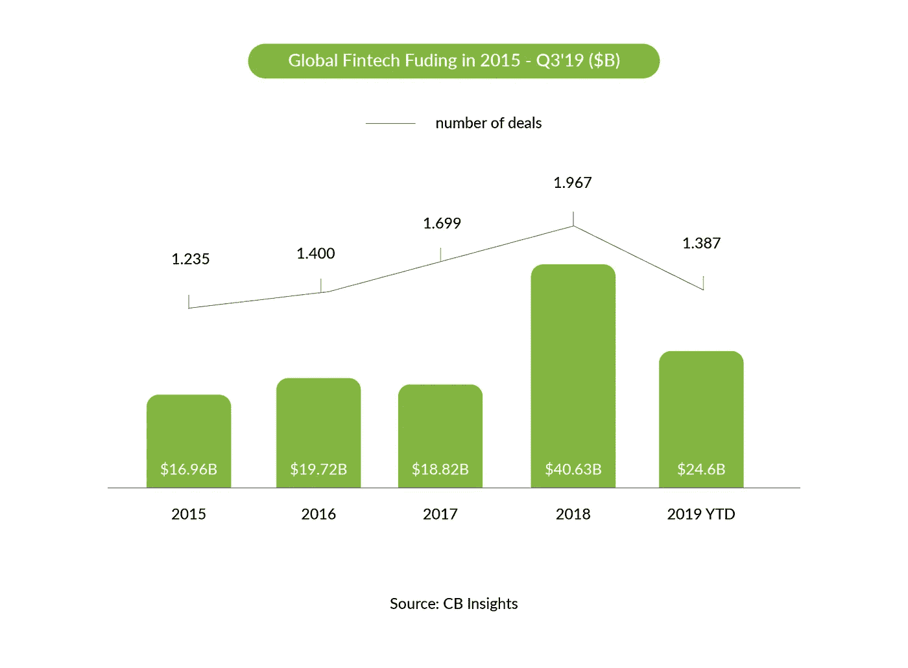
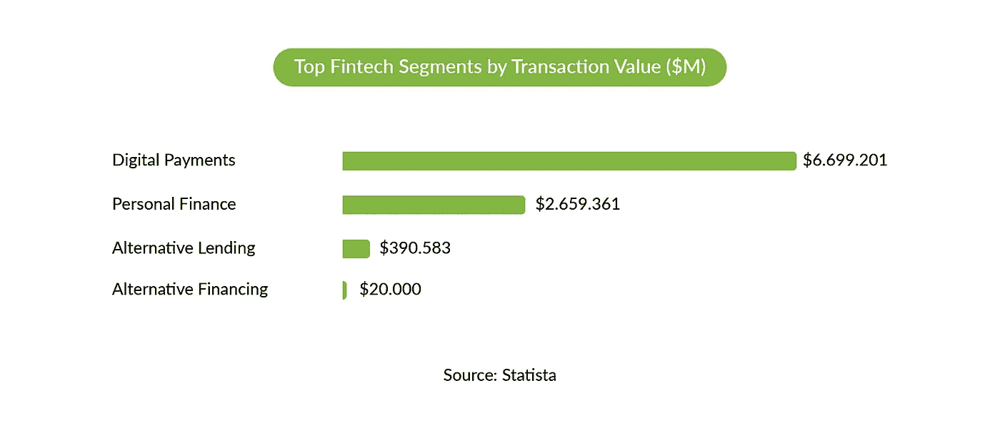
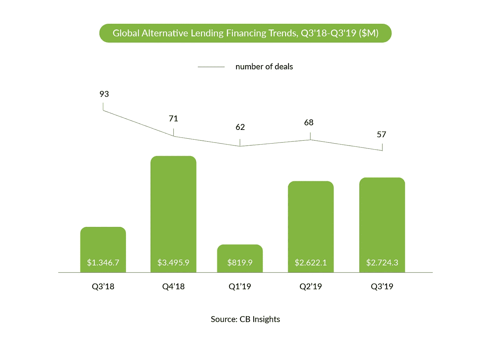
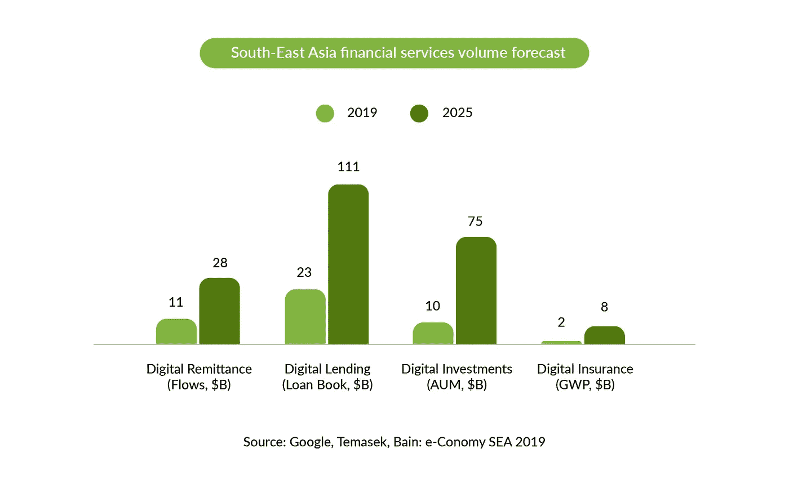
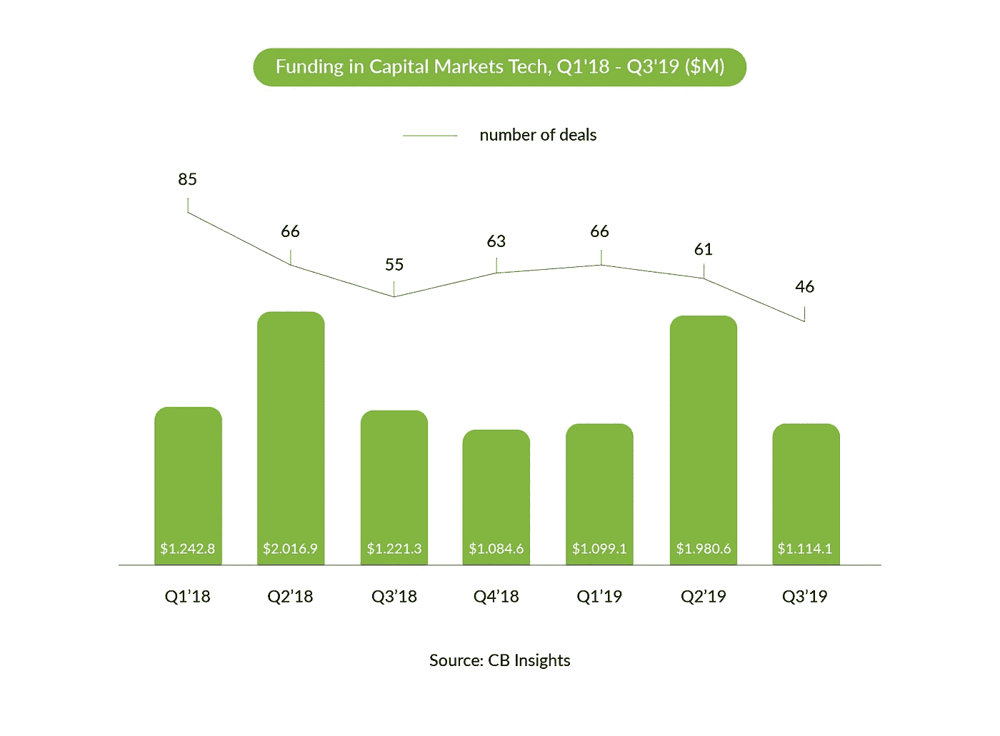
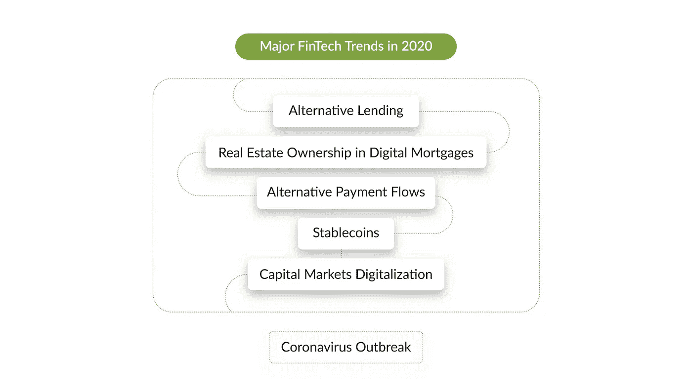

# 将在 2020 年颠覆金融科技市场的 5 大趋势

> 原文：<https://medium.datadriveninvestor.com/5-trends-that-will-disrupt-the-fintech-market-in-2020-f4a3fe765319?source=collection_archive---------3----------------------->

金融科技曾被称为新兴产业，现已成为商业和金融服务领域不可否认的突破性类别。尽管从时间上看，现代金融科技是一个相对年轻的行业，但它是一个独立的领域，有自己的趋势和法规。该行业已经积累了足够的资本，可以纵向扩张，开始横向扩张。球体发展的速度只是成倍增长:**2019 年第三季度 fintech 融资** [**超过了**](https://www.cbinsights.com/reports/CB-Insights_Fintech-Report-Q3-2019.pdf)**2017 年融资总额，2019 年又出现了 6 家独角兽**。

**然而，据 [CB Insights](https://www.cbinsights.com/research/coronavirus-fintech-financing-impact/?utm_source=CB+Insights+Newsletter&utm_campaign=7124f067be-newsletter_general_Thurs_20200402&utm_medium=email&utm_term=0_9dc0513989-7124f067be-91793441) 报道，由于新冠肺炎疫情爆发伴随着经济衰退，很明显，2020 年第一季度金融科技公司的融资速度可能会达到 60 亿美元，从而回到 2017 年的水平**。

由于其稳固的市场地位，作为金融科技初创公司推出的企业正在走出舒适区。因此，**他们抓住机会接触新的人口统计数据，介绍和测试新产品，并居住在新的地方。他们现在是金融服务价值链不可或缺的一部分。**

该行业正在跟随服务数字化的全球趋势，这实际上影响着人类生活的方方面面，包括日常金融业务。尤其是现在，整个世界除了线上服务，几乎没有其他的通讯手段和购买方式。比如，金融技术的引入创造了替代信贷和先租后买的交易模式，而老牌银行终于认识到，在线服务不仅是时代的贡品，也是基本必需品。因此，今天对该行业不可避免的观察是，它正从最初的一个新奇行业成长为一个拥有巨大能力的成熟金融领域。此外，这一行业的趋势是全球性的，主要参与者需要保持警惕，以便跟上行业的发展并在其中保持优势。在这篇文章中，我们分析了金融科技市场在 2020 年的预测，以及流行病和随后的经济危机将如何影响它。我们还将解释如何利用这些趋势来继续从这个行业中获利。

# 2020 年金融科技市场趋势

如今，金融科技涵盖了许多领域，包括个人金融、保险、结算、资本市场、财富管理、房地产、regtech 和加密货币。所有这些都有各自的规格和新兴趋势。然而，如果你将它们与金融科技作为一个整体联系起来，这些趋势最终会涉及该行业最具活力的分支，并取决于金融科技全球化带来的经济和政治进程。因此，它们受到全球范围冠状病毒爆发的强烈影响。

例如，在这种情况下，CB Insights 认为，持续的经济低迷会比现在更大程度地减少企业和消费者支出。无论发生与否，当前的经济停滞将对那些无法在度过危机的同时降低成本的金融科技公司构成严峻挑战。

就地理位置而言，该行业倾向于瞄准亚洲和非洲未被占领的地区。与此同时，以前在欧盟的英国公司保持着他们在世界上的领先地位。然而，由于英国退出欧盟和冠状病毒在英国的大规模传播，他们现在面临动荡和不确定性，这反过来又影响到全球的相关公司。英国金融科技(fintech)新市场和客户的资源现在正在减少，这些业务的未来岌岌可危。

基于上述领域的金融科技发展和全球市场形势，我们确定了【2020 年金融科技的五大趋势:

*   替代贷款
*   数字抵押贷款中的房地产所有权
*   替代付款流程
*   稳定的硬币
*   资本市场数字化

但在文章写完之后，新冠肺炎严重干扰了我的正常生活，以至于我无法忽视它，并补充了最后一点:

*   冠状病毒爆发和危机。

## 替代贷款

替代贷款通过在线平台发挥作用，传统机构借款人通过这些平台寻找寻找有吸引力投资的投资者。它始于点对点借贷，目前，大多数投资者都是机构投资者。然而，去年全球此类交易的数量有所减少，主要原因是亚洲加强了监管。与 2018 年第三季度相比，2019 年第三季度交易数量和贷款金额有所减少。而且，形势好转的可能性微乎其微，因为这种流行病不会刺激人们的消费欲望。

此外，贷款人可能面临企业和消费者无力偿还债务的挑战。和上的；情况好转的可能是政府将通过税收减免和税收抵免来帮助贷款人。

与此同时，东南亚有一个新兴的国家间合作生态系统，将从替代贷款中获益。当各国通过泛亚金融科技合作委员会和亚太金融科技网络等框架创造流量时，该地区在全球金融科技行业的地位将得到巩固。贷款将保留其点对点性质，但将由更大的参与者监管和使用。然而，这些措施的成功受到世界范围内疫情局势的严重威胁，尽管东南亚比欧洲更有效地应对了冠状病毒。

最后，在美国，替代贷款系统已经发展到不仅可以针对中小企业利益相关者，也可以针对学生的程度。这可以帮助许多人解决他们的学生贷款问题，这些问题对于那些别无选择只能为他们的教育提供资金的人来说是很严重的，因此，为他们支付了过多的费用。由于负担不起和缺乏其他选择，随着学生贷款债务的增加，学生贷款成为贷款者的负担和政府的一个问题。在这种情况下，替代贷款模式和收入共享协议(ISA)提供了一个期待已久的解决方案。

尽管冠状病毒给贷款市场带来了新的挑战，但抵押贷款公司将得到政府提供的再融资措施的支持，特别是由于美联储降息。与此同时，提供汽车贷款、学生贷款和抵押贷款的替代贷款机构必须做好准备，帮助他们面临风险的客户，其中大多数是受检疫影响的零工经济和其他服务行业的工人。

> **产品示例:**
> 
> **是一个面向学校、投资者和学生的 ISA 市场。它帮助学校让他们的学生接受教育，并帮助投资者找到有兴趣资助的学校。金融科技整合了所有参与者的利益:学校、学生和投资者。学生不是归还债务，而是将他们未来毕业后的财务利润与 ISAs 的资金池挂钩。因此，贷款和债务之间不存在像学生贷款那样严重的不平衡。**

## **通过数字抵押贷款获得房地产所有权的新途径**

**2020 年的房地产金融科技有两大趋势:先租后买模式和现金担保。这两种模式都有利于房地产购买，并为买家创造更舒适的购买条件。**

****1)先租后拥有****

**这种模式允许寻找房地产交易的人最终在不支付抵押贷款的情况下购买房子。租赁协议有两部分:租赁协议和购买房产的选择权。签署协议的人可以在协议期限内购买房子。在这里，购买房产仍然是一种选择，而不是一方的义务。一些协议允许租赁付款计入最终购买价格。**

> ****产品示例:**[**divy**](https://www.divvyhomes.com/)**
> 
> **Divvy 是成功实施先租后拥有模式的一个例子。它的工作方式如下:客户查找可供出售的房屋，并选择他们想要租赁和/或购买的房屋。然后，Divvy 购买选定的房子，客户签署一份租赁协议。租赁房屋时，客户用每笔付款建立资产净值。**

**2)现金担保**

**从本质上讲，在这种模式中，公司充当了客户的担保人，客户希望获得贷款来购买房子或其他房地产。这是为那些对自己偿还债务的能力有信心，但对自己的信用记录有一定问题的人提供的解决方案。**

> ****产品示例:** [**Flyhomes**](https://www.flyhomes.com/)**
> 
> **Flyhomes 是一家为客户提供现金担保交易的公司。在这种情况下，现金充当担保人，如果这个人想贷款买房，就必须有担保人。如果他们没有任何人，他们可以使用这项服务并完成交易。**

## ****替代支付流程****

**这一趋势是由美国美联储宣布他们计划建立一个实时支付服务来简化过程和全天候工作所决定的。技术进步和人们接受各种服务的速度也决定了这种改革的必要性。与此同时，银行和支付系统与今天的技术相比仍然相当保守和缓慢。因此，美国美联储[计划](https://www.reuters.com/article/us-usa-fed-payments/fed-to-develop-real-time-payments-system-for-launch-in-2023-or-2024-idUSKCN1UV1XP)在 2024 年推出其实时支付系统。**

**推出这样一个系统的尝试是在 2017 年推出的，但没有得到美国所有银行的支持。该公告在规模较小的银行和规模较大的银行之间造成了利益冲突。前者认为这是一个无需向规模更大的竞争对手支付高额费用就能获得实时支付的机会。反过来，后者认为这是对其现有私人基础设施的威胁，他们可能不得不与美联储分享这些基础设施。未来的支付系统旨在统一所有的银行，并让它们遵循同样的快速、全天候支付标准。**

**对于金融科技公司来说，这是关注替代支付基础设施和替代支付流程中的光明机遇的一个很好的理由。**

> ****产品示例:** [**Rapyd**](https://www.rapyd.net/)**
> 
> **Rapyd 是一家总部位于英国的企业，提供一系列金融服务，包括快速支付。它还处理资金收集，结帐，外汇，等等。该产品面向电子商务商家、市场和银行，基于单一 API，提供用户可能需要的大部分服务。**

## ****Stablecoins:加密货币的新品种****

**近年来，加密货币因其带来的机遇而引起了巨大的轰动——更不用说它提供的隐私、透明和安全了。然而，加密货币的主要缺点是利率不稳定，以及监管措施不明确。事实证明，对传统银行系统来说，弊大于利，这就是金融机构不接受加密货币的原因。出于这个原因，有一种新兴的加密货币有望结合区块链和传统银行系统的优势:它像美元或黄金一样稳定，像加密货币一样透明和安全。从逻辑上讲，它被命名为 Stablecoin。**

> ****产品示例:** [**富国银行**](https://www.wellsfargo.com/)**
> 
> **富国银行是一家传统的银行和保险公司。2019 年，它为自己的稳定货币富国银行数字现金(Wells Fargo Digital Cash)创建了一个试点，该货币由美元支持。该公司计划在他们自己的区块链平台上运行，并且只在银行内部运行。如果试点成功，世行将把它用于对外业务。**

**然而，某些因素正在减缓这种潜在的理想货币格式的发展。主要因素是其对传统货币稳定性的依赖，而传统货币与传统金融机构紧密相连。为了让稳定的货币得到传统货币的支持，它必须与传统的银行系统建立传统的银行关系。这里的复杂之处在于，由于合规和信贷风险，很少有银行愿意承担这一角色。如果稳定币由传统货币支持，然后被黑客攻击，支持它的银行将承担巨大的风险，这就是为什么很少有银行愿意接受这个想法或支持它的发展。**

**此外，G-7 报告对加密货币市场及其运营提出了新的监管规定。问题是，在这份报告发表之前，区块链有更多的自由，因为它不像传统的金融机构那样受到监管。加密货币市场有自己的沙箱，与全球金融市场脱节。对后者的担忧日益加剧，突显出虚拟货币领域缺乏监管，这削弱了它在传统机构中的地位。**

## ****资本市场数字化****

**资本数字化本身并不是最新的趋势。它开始于一段时间前，并证明有一个利基市场。今天，有许多私人和商业投资的在线平台，如 Clear Minds。然而，新出现的趋势是扩张——具体来说，交易所正在数字化。显然，这一过程需要很长时间，但有理由相信这一趋势即将出现。**

****

**特别是，伦敦证券交易所的股东支持数据和分析公司路孚特以 270 亿美元收购该交易所。这笔交易得到了伦敦证交所股东的压倒性支持，并获得了 99.27%参与者的赞成票，因为他们从中看到了[【令人信服的机会】](https://www.reuters.com/article/us-lse-m-a-refinitiv/london-stock-exchange-shareholders-bless-27-billion-refinitiv-deal-idUSKBN1Y01DD)。伦敦证券交易所主席认为这符合公司的长期战略利益。交易所的数字化将提高收入，并远离政治敏感领域，并将数据和分析作为交易所市场不可分割的组成部分。**

**因此，这笔交易已经成为金融科技和资本市场趋势的某种标志。对于交易所和股东来说，这意味着交易所的主要因素将变成追求利润，而不是投资和参与者的政治背景。**

## ****冠状病毒爆发和危机****

****

**如果我把这个放在开头，就没有必要再往下读了。开玩笑的。但我们应该承认，即使对金融科技分析公司来说，病毒爆发也是一个惊喜。**

**正如在上述趋势的某些点中提到的，新冠肺炎已经强烈地影响了这个行业，并成为这个季节的主要趋势引领者。虽然这种病毒导致了开支的大幅下降，但政府的支持有可能消除它的不利影响。与此同时，我认为，大规模隔离和无法外出，将大幅提高对在线金融服务的需求。**

**对于那些准备好满足对便捷、安全的金融科技产品的需求的初创公司(是的，那些需要投资的公司，因为[尽管处于危机之中，它们仍在获得投资](https://www.fintechfutures.com/2020/04/api-builder-yapily-lands-13m-series-a/))来说，这是一个好机会。**

**与此同时，金融市场巨头，如老牌银行、投资公司、抵押贷款机构和保险提供商，最有机会(实际上也是最后一次)成为金融科技市场的一部分，并承认数字化的关键作用。简而言之，老歌还在风险区。**

# **金融科技公司在 2020 年为了生存应该考虑的事情**

**我们所回顾的每个趋势都有不同的发展速度和影响。然而，在某种程度上，它们正在撼动整个行业及其参与者。为了在金融科技领域生存和盈利，企业必须驾驭这些变化，并对其目标进行优先排序。你不希望被更新淹没，但知道哪些公司需要更密切地关注并跟随这个快速发展的行业的趋势是至关重要的。对一个企业来说，最好是领先竞争对手一步。**

**本着这种精神，这里有一些关于 2020 年金融科技蓬勃发展的建议。**

****

## ****1。开放式架构****

**您将希望为您的产品与任何 API 的集成做好准备，这就是为什么关注创建互操作性是有意义的。关于我们提到的趋势，产品将获得新的用户，这就是为什么公司应该确保产品在不同的平台上同样工作良好。因此，目标是平衡网络安全、控制和可访问性，以及在云中管理您的产品。如果您的产品可以与任何 API 集成，那么调整它以适应市场和新兴趋势的需求将会更容易，因为可以向您已经拥有的代码中添加新的功能。**

**由于冠状病毒爆发给金融行业参与者带来了无法亲自服务客户的新挑战，越来越多的公司意识到了数字化的必要性。无论是让现有网站更加面向用户，还是用更多相关功能更新移动应用，API 解决方案都可以显著减少开发时间。**

**相比之下，从零开始重新开发产品将需要更多的努力、资源和宝贵的时间，所以你可能会错过，这在数字化的世界中是不允许的。**

**为了使您的产品灵活并为集成做好准备，最好使用 Python。在其中，您可以修改产品的参数或特性，而无需对其进行重大或不可逆的更改。确保你的团队中有优秀的专业人士是你在 fintech 2020 中应该采取的另一个明智之举。**

****

## ****2。接触熟练员工****

**一个公司需要优秀的、有动力的员工来成长，这可能是一个显而易见的想法。然而，今天的行业已经相当成熟，这意味着雇主之间的竞争更加激烈。这意味着一个体面的专家可以从劳动力市场的各种选项中进行选择，他们的工作场所标准现在远远超出了薪酬和主题。出于这个原因，公司不得不发明[新的招聘方法](https://djangostars.com/blog/hire-python-developers/)，而不仅限于金融行业。**

**此外，公司需要根据员工未来的能力要求和专业知识，为他们的人才创造教育和发展机会。随着实践培训融入公司文化，驾驭趋势和适应新发展将变得更加容易。**

**当今雇主面临的另一个挑战是无法在本地找到人才。当然，在这种情况下，搜索必须扩展到全球，招聘人员必须了解他们正在寻找的人才的移民政策。例如，英国目前是金融科技的领导者，但英国退出欧盟局势和新冠肺炎疫情可能会导致人力资源短缺，特别是由于该行业的资金减少。根据[国际金融法评论](https://www.iflr.com/Article/3875510/Fintech-Europe-2019-key-takeaways.html),“英国退出欧盟导致金融科技公司缺乏新市场和客户的资源”，这对于公司来说，转化为寻找新方法招聘最佳员工的新需求。**

****

## ****3。通过改进传统系统和采用人工智能降低成本****

**许多人类活动可以分配给 AI 而不是人。机器人技术和自动化的引入将降低人力资源成本并优化流程。今天，先进的机器人技术不仅可以完成对技能和训练要求不高的工作。事实上，人工智能可以提高(如果不是取代)高级职位的表现。**

**机器人技术是否会进入并改变智力劳动力的方式，这个问题已经不再讨论了。现在，这只是时间问题。因此，寻找机会实现自动化符合每个公司的最大利益——就在今天。探索它们，找出它们将带来的潜在好处，部署迭代，并根据您的特定业务需求对它们进行调整。**

**然而，机器人技术的推出并不意味着工作场所的缺乏。相反，你将很快需要从事人工智能工作的专家，而他们可能很难找到。这将挑战公司培训人工智能专家，并允许他们在未来节省工资。无论如何，人工智能有望成为金融科技的一大部分，这就是为什么最好的选择是尽快采用它。**

# **结论**

**如今，金融科技的主要焦点是探索和占领那些未被充分数字化或尚未被占领的利基市场。公司可以发明新的方法来接触那些需求或问题无法解决的用户，这些问题有时甚至是由传统银行业务引起的。例如，关注那些允许人们获得学生贷款或在不支付过多的情况下购买房子的解决方案。这些是革命性的。银行数字化的另一个方面是由于交易所的参与和统一即时支付系统的引入，其规模可能会增加。它标志着传统金融机构正在与数字机构合作，以使服务更快、更面向用户。**金融科技与保守金融体系成功合作的例子越来越多，这只能证明金融科技的地位只会加强**。**

**尽管现在宣布冠状病毒今年对金融科技的影响以及它将如何影响上述趋势还为时过早，但无论影响如何，它们都将改变该行业的工作方式。我希望它能推动数字化，让这个领域变得更加多样化。**

**最后，为了在行业动态中生存下来，金融科技公司应该专注于产品架构的灵活性，并准备好调整产品架构以适应市场和技术变化。要做到这一点，这些公司必须拥有最聪明的人才，并为这些人提供教育机会，包括机器人技术和自动化方面的机会。今年还将显示哪些趋势将在金融科技领域得到巩固，哪些趋势可能会失去相关性，因此继续跟上这些趋势非常重要。**

> **这篇关于[**2020 年将颠覆金融科技市场的 5 大趋势**](https://djangostars.com/blog/fintech-trends/) 的文章最初发表在 **Django Stars 博客上。** 作者**阿图尔·巴钦斯基**——首席运营官在**姜戈群星**。**