# 2020 年，5 只英国股票仍在派息

> 原文：<https://medium.datadriveninvestor.com/5-uk-stocks-still-paying-dividends-in-2020-afdb38709cf8?source=collection_archive---------14----------------------->

Image by Author.

股息是吸引投资者的主要因素之一。你购买股票，并定期得到公司利润的一部分。这是你可以获得的最自然的被动收入形式之一。

在冠状病毒疫情期间，投资者面临的一个问题是股息暂停发放。尽管考虑到收入已经跌落悬崖，这完全可以理解，但一些公司已经设法继续支付股息，并为投资者带来滚滚财源。

这是因为这些都是重要的业务，不管周围的市场如何，它们都在经营。它们涵盖了医疗保健、资产管理和采矿等行业。

在我们的网站上，我们通常倾向于关注美国股票。这是因为它们通常是世界上规模最大、回报最高的。但是我们的总部在英国。

 [## 生存还是毁灭:经营者 Vs 创始人 Vs 投资人？数据驱动的投资者

### 作为一名从经营者转型为创始人、再转型为投资者的人，我经常被问到这两者的利弊。我经常用一句…

www.datadriveninvestor.com](https://www.datadriveninvestor.com/2020/08/02/to-be-or-not-to-be-operator-vs-founder-vs-investor/) 

在英国市场，股息确实倾向于略高于美国，这可能对外国投资者具有吸引力。

我不知道这是为什么，富时 100 指数的总股息是 4.35%。纳斯达克 100 指数的平均股息收益率为 0.99%。

富时指数的成份股公司范围相当广泛。前十名涵盖医疗保健、采矿、金融和石油。美国比较指数的高端科技权重非常高。所以这是你做投资决定时要考虑的事情。

## 英国股息股票

我可以在早上去伦敦西南的路上看到金丝雀码头和伦敦金融城的塔楼，所以我应该花一些额外的时间把一些专注于家庭的股票带给那些阅读我文章的人。

以下是我个人最喜欢的几只英国股票，它们在疫情冠状病毒肆虐期间成功保持了股息——这种情况并不多。银行股目前已被政府强制停止派息。如果不是这样，有些人可能会上榜。

## 在这些公司投资 1000 英镑你会得到多少

这些股票的平均股息率非常高。其中一些公司支付的股息率远远超过 5%，在人们记忆中最具挑战性的时期之一，它们仍在设法向投资者回报。看看你在每家公司投资 1000 美元会得到多少。

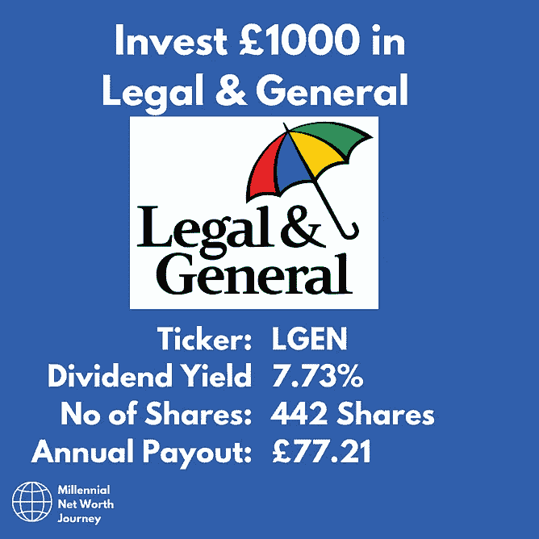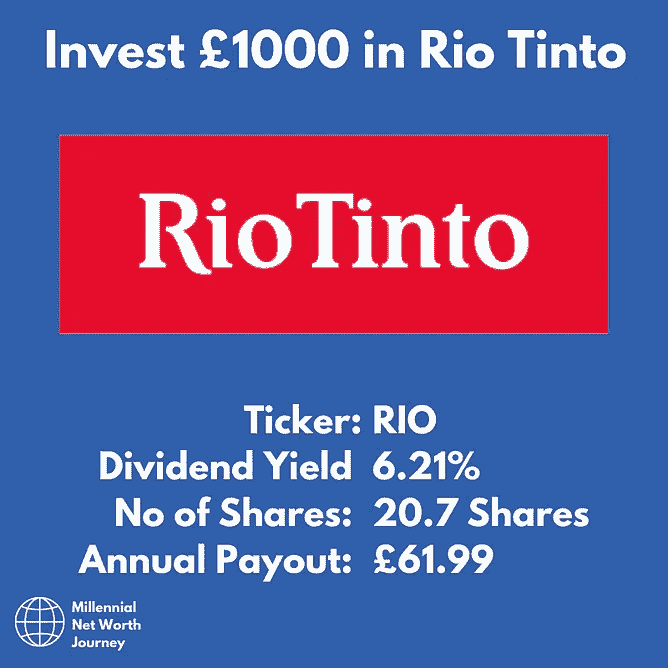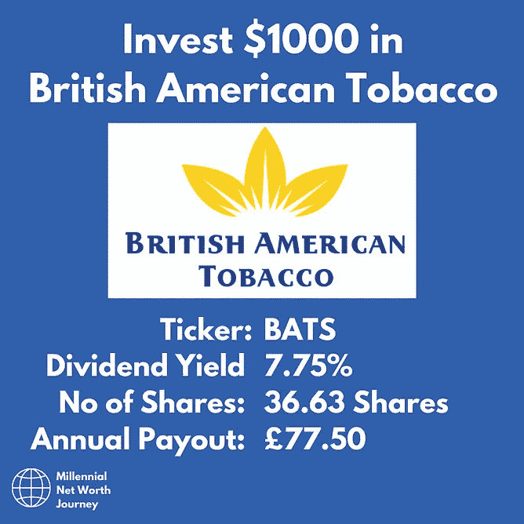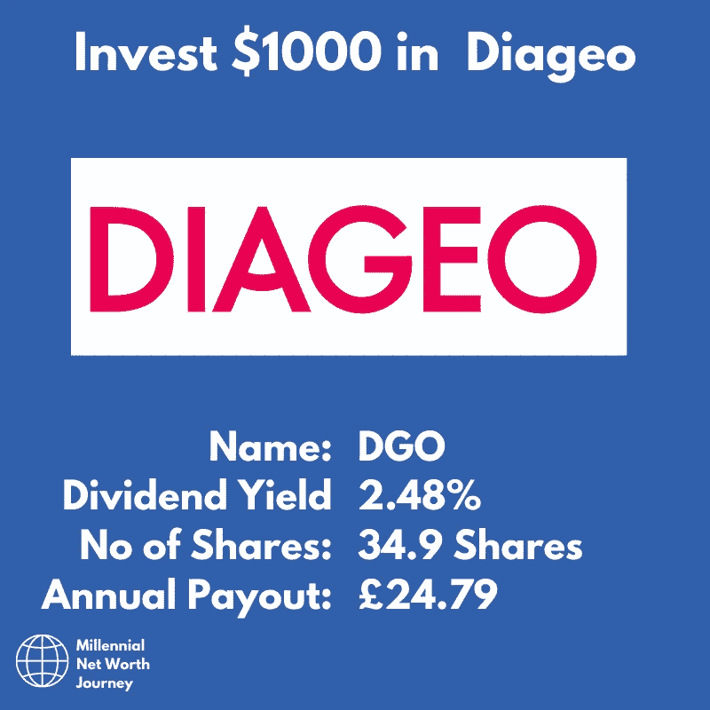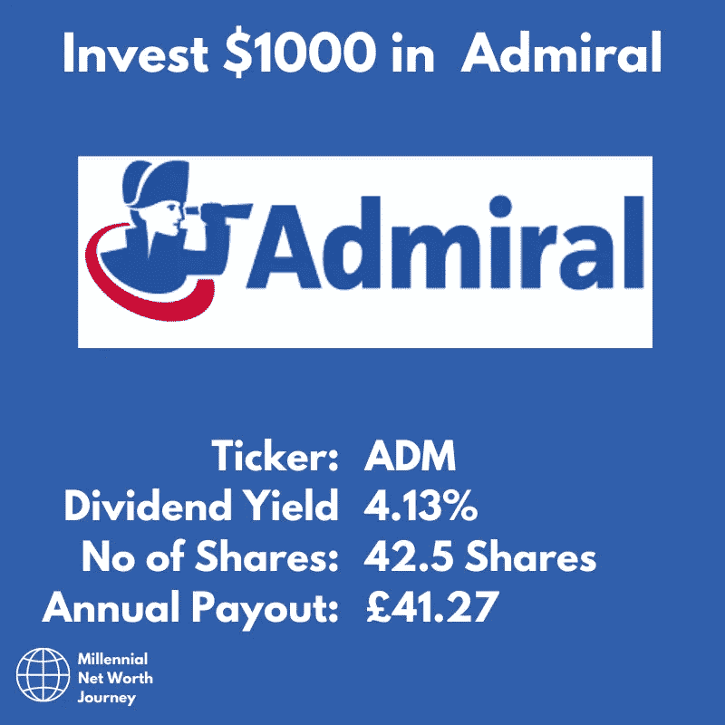

Image from [@millennialnwj](http://www.instagram.com/millennialnwj) on Instagram.

# 法律和普通

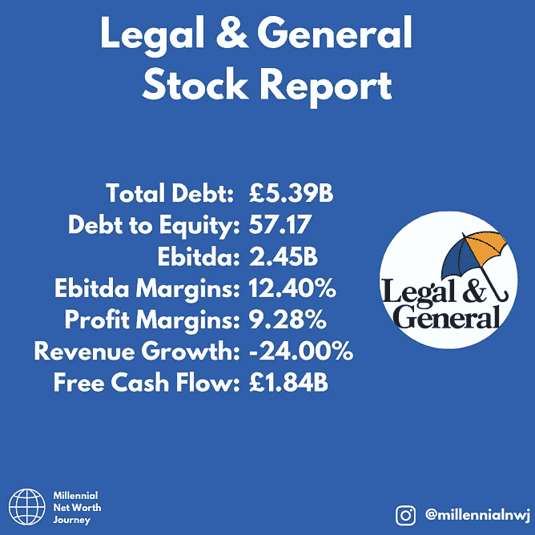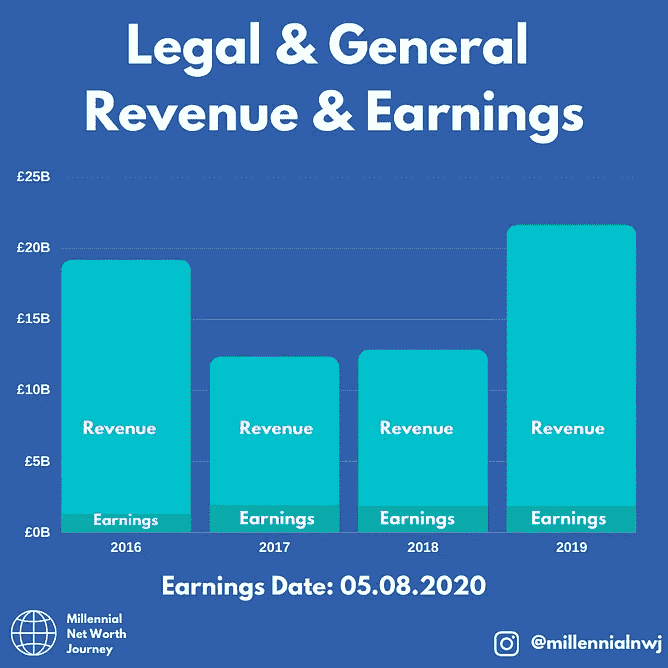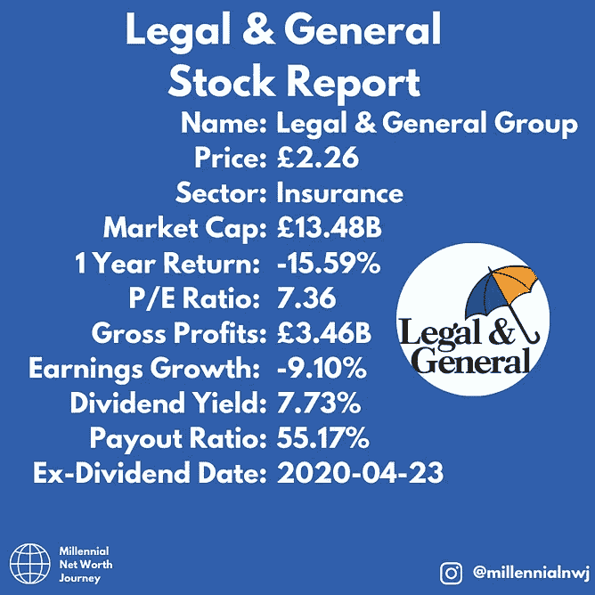

Image from [@millennialnwj](http://www.instagram.com/millennialnwj) on Instagram.

首先，我们有法律和一般。如果你在英国生活和工作，他们很可能是你的养老金提供者。他们提供保险、投资管理，并管理他们的增长基金，我通过 Hargreaves Lansdown 投资了其中一些。他们是未来的安全赌注。他们的收益最近受到了一点打击，但鉴于他们在英国和国际市场的地位，我相信他们应该能够反弹。

哦，对了，还有 7.72%的股息和 55%的支付率。对任何人的投资组合都是一个很好的补充。

# 力拓矿业公司

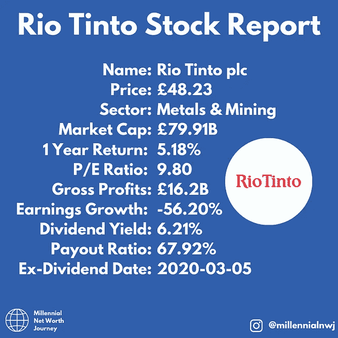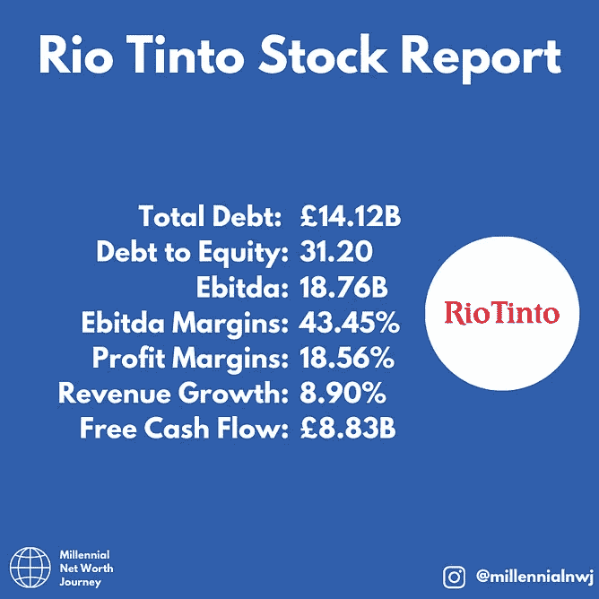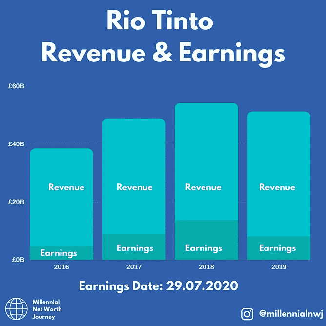

Image from [@millennialnwj](http://www.instagram.com/millennialnwj) on Instagram.

名单上最可靠的公司之一是力拓。该公司在世界各地拥有非常多样化的控股公司，在西班牙、澳大利亚和地球的几乎每个角落都有采矿和提取业务。他们提炼工业用原材料、钻石，还拥有石油和天然气资产。这些年来，随着他们继续高效开采，他们的收入一直在稳步攀升。他们是世界第二大矿业集团，紧随其后的是另一家英国矿业公司必和必拓集团。

年度股息 6.21%，同时设法继续在整个新冠肺炎疫情进行采矿作业，令人钦佩。这是这份名单上的一只股票，它的价格在这段时间内由于其阻力而上涨。

# 英美烟草公司

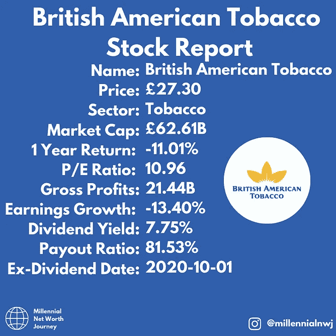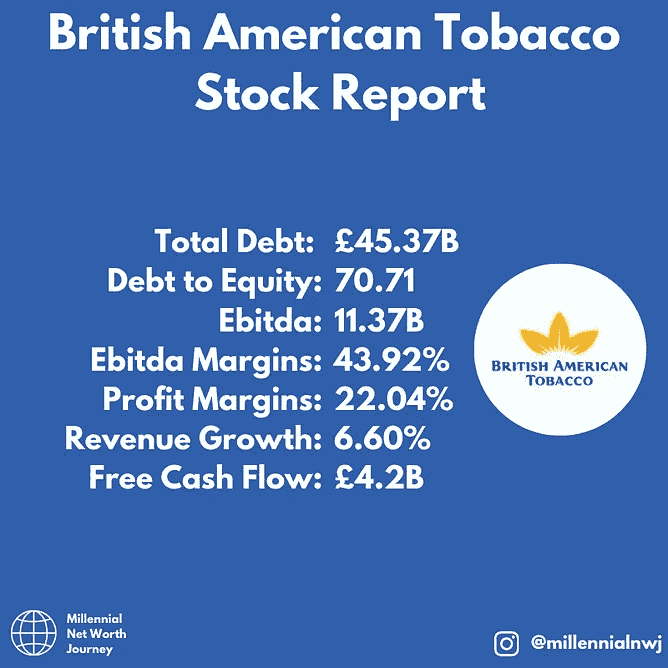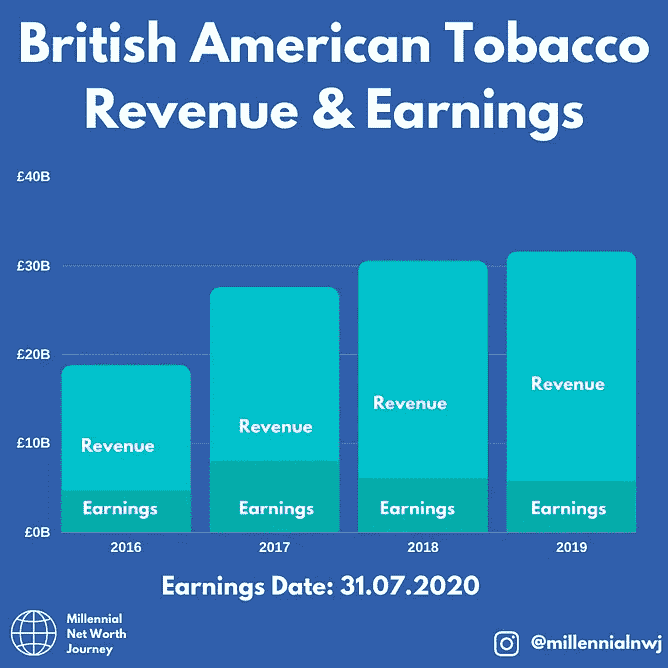

Image from [@millennialnwj](http://www.instagram.com/millennialnwj) on Instagram.

烟草是大生意。我不打算谈论投资一家出售有害健康产品的公司的道德或伦理问题，那是以后的事了。

英美烟草公司拥有骆驼、新港和好彩。随着市场的变化，它还将其产品扩展到无烟烟草和“vape”产品。

该公司本身的财务状况良好，目前市盈率为 10.96 倍，收入健康且逐年增长。今年的分红也是有保障的。该计划已经宣布，这意味着在 10 月除息日之前购买股票的投资者可以从其 7.75%的巨额股息中分得一杯羹。

# 帝亚吉欧

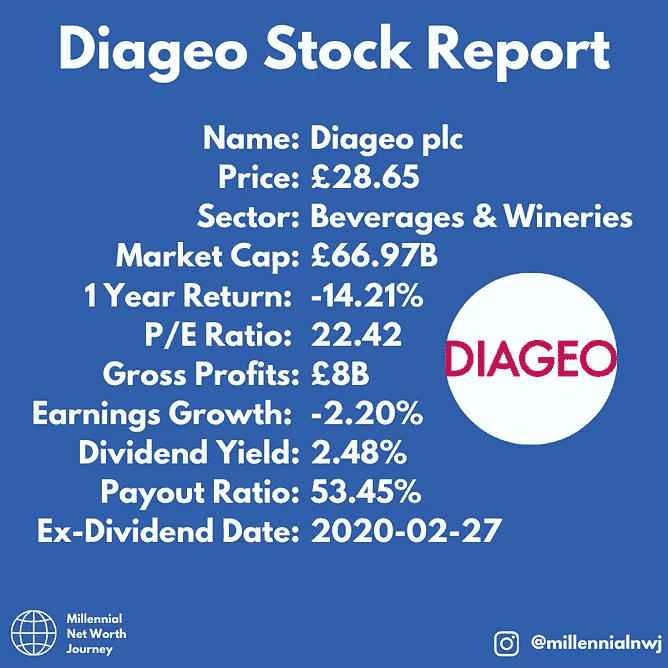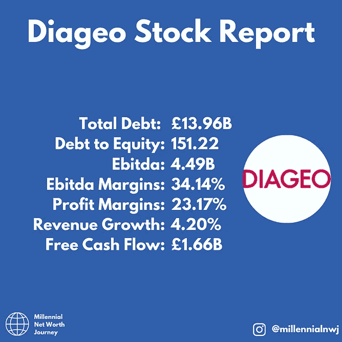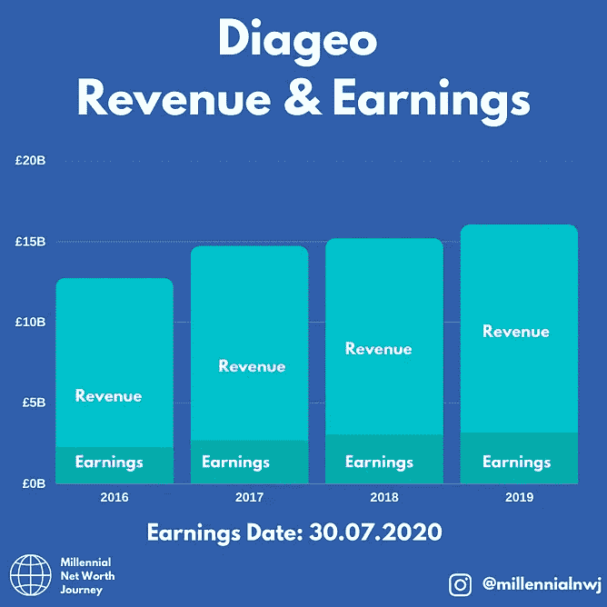

Image from [@millennialnwj](http://www.instagram.com/millennialnwj) on Instagram.

继大烟草之后，我们有大酒精。这家公司可能拥有世界上最令人印象深刻的酒精饮料系列。他们拥有斯米尔诺夫，吉尼斯，约翰尼·沃克和百利。那是世界上最受欢迎的伏特加、黑啤、威士忌和白酒。除此之外，他们还持有轩尼诗和酩悦香槟的饮料部门 39%的股份。分别是最受欢迎的干邑和香槟。

在同一屋檐下，这家公司在酒精饮料的所有主要产品类别上都是世界领导者。

虽然该公司的债务看起来很高，但该公司的其他部分看起来相当不错，有可观的派息率和可观的股息。他们产品的受欢迎程度应该可以帮助他们度过冠状病毒导致的任何低迷时期。

# 舰队司令

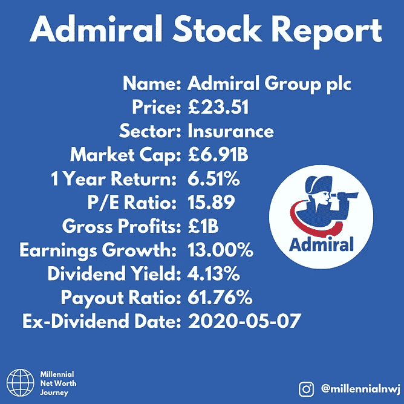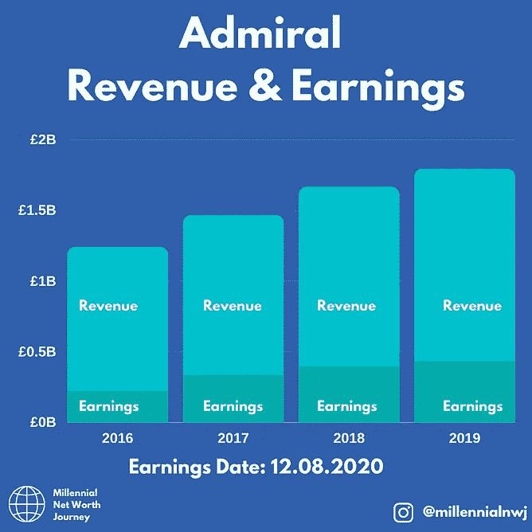

Image from [@millennialnwj](http://www.instagram.com/millennialnwj) on Instagram.

最后一只仍在派息的股票是海军上将保险公司。与我们网站上的许多公司相比，他们是一家相对较小的公司，但他们一直在以优异的速度稳步增长。

Admiral 是一家汽车和家庭保险公司，在英国、西班牙、法国和美国开展业务。该公司在这些市场拥有近 700 万客户。

由于其业务性质，即使在新冠肺炎危机期间，该公司也保持了股息和增长能力。它的收入来自保险费，无论人们是否开车都需要这笔钱。

## 最后

有一些伟大的公司包括在内，它们的利润受到保护，免受像疫情冠状病毒那样大的市场冲击。这件事教会了我一件事，那就是最好投资那些能够承受任何事情并不断推高利润的公司。

如果你喜欢这样，请考虑注册我的邮件列表，这样你就可以将这样的帖子发送到你的收件箱:

 [## 时事通讯注册—千禧净值之旅

### 注册我们的邮件列表，了解我们最新的帖子和深入的投资新闻和分析。我们…

millennialnetworthjourney.com](http://millennialnetworthjourney.com/newsletter-sign-up/) 

请把这篇文章作为参考。这不是财务建议，你应该在投资前做自己的研究。

**进入专家视角—** [**订阅 DDI 英特尔**](https://datadriveninvestor.com/ddi-intel)