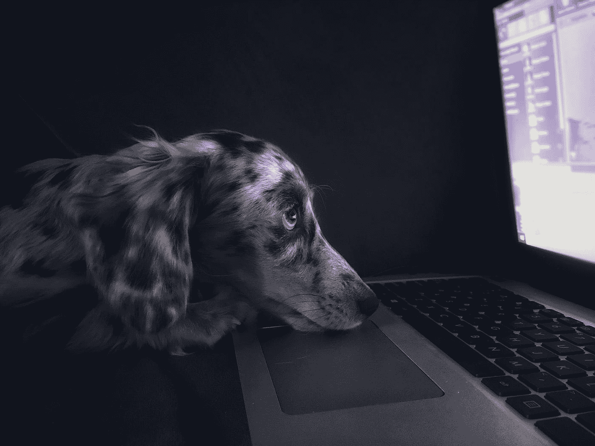
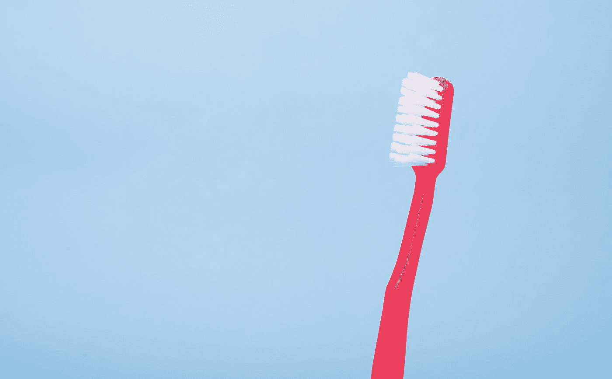
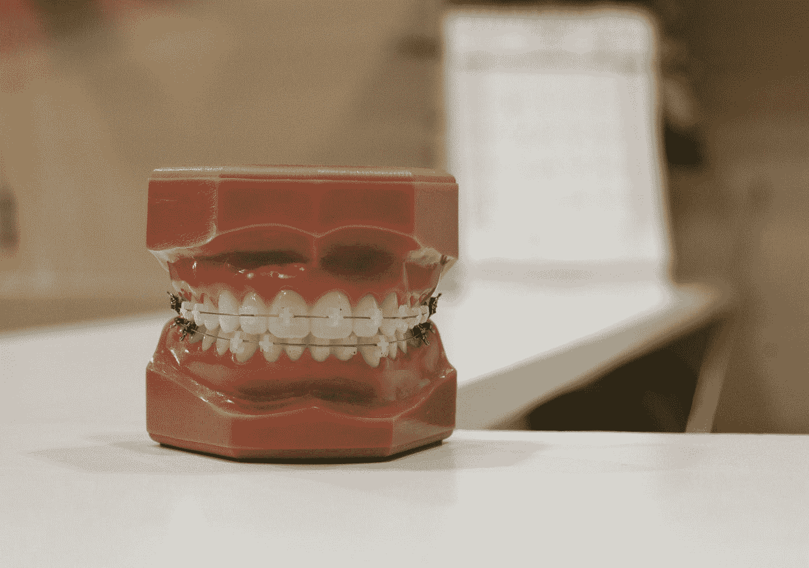

# 远程医疗的 5 种意想不到的用途&它们如何帮助你

> 原文：<https://medium.datadriveninvestor.com/5-unexpected-uses-of-telemedicine-how-they-may-help-you-42f3c1420b8f?source=collection_archive---------27----------------------->

Photo by [Kyle Hanson](https://unsplash.com/@kyledarrenhanson?utm_source=medium&utm_medium=referral) on [Unsplash](https://unsplash.com?utm_source=medium&utm_medium=referral)

远程医疗——通过电子通信将医疗信息从一个地点交换到另一个地点，以改善患者的健康——不仅仅是医生的虚拟访问。

在疫情期间，牙医、正畸医生、眼科医生、心理学家甚至兽医等专家都在使用远程医疗解决方案。

像他们的医生同行一样，许多人抵制虚拟访问，直到它成为继续照顾病人和保持业务的唯一方式，因为在家订单从几周扩大到几个月。

这里有一个远程医疗在其他专业中的使用的快速运行，以及每个专业的未来可能会是什么样子。

Photo by [Alex](https://unsplash.com/@worthyofelegance?utm_source=medium&utm_medium=referral) on [Unsplash](https://unsplash.com?utm_source=medium&utm_medium=referral)

## **牙科**

**我们现在在哪里**

根据[美国牙科协会](https://www.ada.org/en/publications/ada-news/2020-archive/april/second-week-of-hpi-polling-shows-dentists-response-to-covid-19)的数据，自三月初以来，除了急诊，79%的牙科诊所关闭，另有 18%完全关闭。

考虑到新冠肺炎是如何传播的，这并不奇怪，但对于疼痛的患者来说，很难知道什么是真正的紧急情况，什么可以在家里处理。帮助病人弄清楚什么需要立即关注，什么可以等待，这似乎是远程牙科的最大优势。

 [## 在医疗保健中使用人工智能的伦理|数据驱动的投资者

### 人工智能(AI)正被应用于任何管理大量数据的行业，并且在一个…

www.datadriveninvestor.com](https://www.datadriveninvestor.com/2020/03/21/the-ethics-of-using-ai-in-healthcare/) 

“研究表明，80%的急性牙齿问题可以在家里解决，无需亲临现场，”切尔西·阿科斯塔·帕特尔解释道，他是位于波士顿的牙齿护理初创公司 Wally Health 的 Wally Experience 负责人。“利用技术，牙医可以在让病人离开椅子的同时对问题进行分类并照顾他们。”

**我们何去何从**

根据 Patel 的说法，更大的长期机会可能是在预防保健方面，通过在患者牙科旅程中创建和监控家庭预防保健解决方案。

“大多数牙医没有工具与病人保持同步。他们只是假设，如果病人有问题，他们会打电话到办公室。远程牙科解决方案使牙医能够开发定制的持续接触点，以帮助患者保持健康并及早发现潜在问题。这改善了患者的体验，提高了牙医的忠诚度和口碑(双关语)，创造了一个良性的口腔健康循环。”

Photo by [Yingpis Kalayom](https://unsplash.com/@yingpis?utm_source=medium&utm_medium=referral) on [Unsplash](https://unsplash.com?utm_source=medium&utm_medium=referral)

## **牙齿矫正**

**我们现在在哪里**

虽然牙医需要一种方法来回答问题，分类问题，并提供后续护理，但正畸医生有一个更迫切的需求——确保他们的病人的颌骨继续发育，他们的牙齿继续以正确的方式移动。

“我们服务于弱势儿童群体，他们的颌骨正在发育。作为治疗的一部分，我们所做的调整会影响他们的生长和发育，”内华达州里诺市 [Welmerink 正畸](https://www.welmerinkorthodontics.com/)的[Adam wel merink](https://www.welmerinkorthodontics.com/meet-dr-adam-welmerink)医生解释道。“当我们意识到这将超过 2 周的关闭时间时，我们需要一种方法来保证患者的安全，确保他们的设备不会造成任何伤害，并确保他们的治疗按计划进行，”

通过像[牙齿矫正筛查工具包](https://www.orthoscreening.com/doctor) (OSK)这样的服务，患者会收到如何拍照并将照片上传到 OSK 网站供他们的牙齿矫正医生审查的指导。当然，牙齿矫正医生评估患者需求的能力取决于照片的质量，但至少，这项服务为牙齿矫正医生创造了一个与患者重新联系的机会，并就可能引发诊室就诊的迹象给予他们指导。

**我们何去何从**

像许多其他专业一样，正畸领域的远程医疗可能会继续用于分流问题或为偏远农村地区的患者提供服务。

“我们的许多患者生活在农村地区，有些人为了 10 分钟的预约开了 2 个小时的车。我们可能会继续使用(OSK)来看看他们是否需要进来。我认为可以在有限的能力范围内使用它来对打来紧急电话的患者进行分类，以评估他们是否可以在家处理问题，或者他们是否需要进来。”韦尔梅林克博士沉思着。“老实说，从时间上来说，在办公室看病人更快。但这对于现在来说很好。”

Photo by [nrd](https://unsplash.com/@nicotitto?utm_source=medium&utm_medium=referral) on [Unsplash](https://unsplash.com?utm_source=medium&utm_medium=referral)

## **眼科&验光**

**我们现在在哪里**

远程医疗作为一种安抚患者和分诊问题的方式，决定是否需要在办公室就诊，继续用于眼科护理。

纽约验光师苏珊·雷斯尼克博士告诉《关于视力的一切》杂志说:“这当然是一种让患者放心的方式，让他们相信我们会在他们身边，这在这个可怕的时期是最重要的。”。

虽然安抚很重要，但大多数眼科护理专家都认为远程医疗的用途极其有限。正确的眼部护理需要瞳孔放大和专业工具来准确识别青光眼等问题或评估视神经和视网膜的健康状况。

**我们将何去何从**

尽管有其局限性，Resnick 博士认为继续使用远程医疗是有价值的，“我们将继续在必要时利用这个平台。我们不认为这是一种干扰或威胁，而是一种支持我们实践的方式。”

不是每个人都同意。

“我对(远程眼科检查)并不太感兴趣，”伊利诺伊州眼科医生本杰明·蒂乔(Benjamin Ticho)博士告诉我们关于视力的一切。“会有太多的错误。此外，它削弱了互动的热情和个性。对许多病人来说，一次好的医生拜访是一个愉快的社交场合，对许多医生来说，这也是我们从事医学的部分原因。”

Photo by [Nik Shuliahin](https://unsplash.com/@tjump?utm_source=medium&utm_medium=referral) on [Unsplash](https://unsplash.com?utm_source=medium&utm_medium=referral)

## **心理健康**

**我们现在在哪里**

数据惊人。

根据联邦统计数据，危机前，20%的美国成年人患有精神疾病，但不到一半的人接受了治疗。

在三月的最后两周，45%的美国成年人认为与新冠肺炎有关的担忧和压力正在损害他们的心理健康。随着家庭订单的扩大，失业和休假的增加，这个数字可能会增加。

然而，采用远程医疗来解决精神健康问题一直进展缓慢。这种现象并不新鲜。一个典型的例子是——十多年前，国会将精神健康服务提供者排除在一项 3000 万美元的数字化病人健康记录投资之外。即使是现在，随着 CMS、私人保险公司和州监管机构放松限制并增加远程医疗的报销以治疗身体疾病，对精神健康问题的关注和灵活性却没有表现出来。

因此，“(医疗服务提供者)现在正在尝试各种方法，看看什么能起作用，”贝斯伊斯雷尔女执事医疗中心数字精神病学部门主任约翰·托鲁斯告诉政治。

**我们何去何从**

与其他专业相比，陪审团对精神健康远程医疗接下来会发生什么还没有定论。

一方面，“很多咨询都与肢体语言有关，身体在房间里，语调，”美国咨询协会的林恩·林德告诉 Politco。“有时，当你没有良好的互联网连接，或者你的一个开始变得模糊时，这些就会丢失。”

另一方面，这可能是“我们实践方式的转折点，”加州大学戴维斯分校临床精神病学教授、美国远程医疗协会前主席彼得·耶洛斯说。

联合健康的一个部门 Optum 似乎在赌后者。上周，它宣布正在谈判以 4 . 7 亿美元收购总部位于纽约的虚拟治疗提供商 AbleTo，相当于预期收入的 10 倍。

Photo by [FLOUFFY](https://unsplash.com/@theflouffy?utm_source=medium&utm_medium=referral) on [Unsplash](https://unsplash.com?utm_source=medium&utm_medium=referral)

## **兽医护理**

**我们现在在哪里**

如果远程医疗对人类足够好，对我们的动物伴侣也足够好。

作为提供远程医疗解决方案的专业领域的一个相对较新的补充，目前只有少数几家公司涉足该领域。TeleVet 是一家“总部位于德克萨斯州，专注于兽医护理的数字优化公司”。

在疫情爆发前，TeleVet 在美国 1000 家诊所使用，甚至在一月份结束了一轮 [$2M 种子回合](https://houston.innovationmap.com/televet-provides-virtual-vet-care-2645788643.html)。

“我们可以从静态图片或视频中检查感染，如耳朵感染或流脓，甚至可以与主人进行视频会议，”休斯顿地区兽医艾米·加罗博士向创新地图解释说。“该平台非常有用，因为我们可以进行任何咨询，并获得我们管理案件所需的信息，而无需宠物主人来到诊所。”

**我们何去何从**

像牙科、牙齿矫正和眼科保健一样，在拥挤的办公室里不安全的时候，远程医疗在兽医领域的使用对提供者和患者来说都是一个福音。但随着限制的解除，就像其他医疗保健领域一样，它可能主要用于回答问题、分流问题和进行术后检查。

Photo by [Bruno Bergher](https://unsplash.com/@bbergher?utm_source=medium&utm_medium=referral) on [Unsplash](https://unsplash.com?utm_source=medium&utm_medium=referral)

## **临床应用不同，但前路相同**

是的，远程医疗是我们集体医疗保健工具包中不可思议的工具。它在医疗专业的使用证明了它满足了临床医生(为我的病人提供护理)和病人(解决我的问题)的需求。

在“正常”时期，这些需求可以通过门诊、零售诊所和紧急护理得到很好的解决。只有在非常特殊的情况下，如当医疗专业人员无法轻松或安全地亲自查看患者时，现有的解决方案才能满足要求，远程医疗才成为最有吸引力的选择。

然而，只有当监管机构放松规定，保险公司增加报销，病人接受电子邮件和视频聊天作为治疗手段时，远程医疗才成为一种可用的选择。

疫情为内科医生、牙医、正畸医生、眼科护理专业人员、心理健康护理人员、兽医和其他临床医生创造了开始或扩大远程医疗应用所需的环境。正是他们的经验，以及医疗保健生态系统中其他参与者的经验和决定，将引导他们回到办公室，并得到他们所期望和需要的实际护理。

你怎么想呢?我做对了什么？我做错了什么？请在评论中留言，让我知道。

如果您喜欢这篇文章，请与朋友分享，单击👏很多次，跟着我在媒体上。

如果你想了解更多我在创新方面阅读和喜欢的内容，请使用下面的表格来订阅我的每月简讯