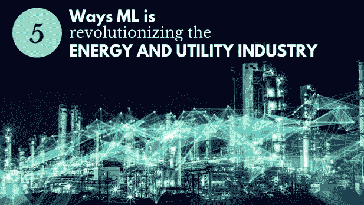

# 机器学习变革能源和公用事业行业的 5 种方式

> 原文：<https://medium.datadriveninvestor.com/5-ways-machine-learning-is-revolutionizing-the-energy-and-utility-industry-4f1aafe9919b?source=collection_archive---------14----------------------->

能源部门一直对数据驱动的解决方案感兴趣，以解决能源消耗、需求和生产问题。智能传感器和收集器的日益普及产生了大量数据，这反过来为现代预测技术创造了无尽的机会。机器学习工具快速、高效、准确，可以提供对最复杂数据源的理解。能源行业的企业已经[发现了](https://www.mdpi.com/1996-1073/12/7/1301)这个机会，并利用他们的预测能力进行广泛的应用。下面我们列出了机器学习解决方案的主要优势，并用一些成功应用的例子来支持它们。

# 1.提高故障预防能力，减少设备停机时间

机器学习解决方案为能源供应商提供了一种可靠的方法来监控其机器和设备的正常运行。作为预防性维护措施的一部分，故障概率建模算法对于即时检测潜在故障至关重要。

当分析模型能够访问基线功能条件以及实时传感器和跟踪器数据时，它们就成了平稳运行的安全卫士。一旦识别出可能的故障，就可以提醒操作人员，避免代价高昂的错误。

减少设备停机时间和防止故障错误将有助于防止大规模停机。此外，公司可以基于可靠的模型做出决策，帮助他们优化维护成本并有效利用资源。

# 2.准确的需求预测

预测消费者需求的能力是能源经济的一个基本方面。但是，考虑到涉及大量数据，并且需要对多个数据源(例如天气和历史消费数据)进行综合解释，找到供需之间的正确平衡可能是一个真正的挑战。

机器学习算法具有预测的超能力，使其能够系统地处理大量的电力交易数据。现代存储解决方案使得轻松处理异构数据源成为可能，并且模型随着时间的推移变得越来越准确。他们得到的数据越多，预测就越准确。

准确的需求预测改善了需求管理的各个方面。这导致供应商和消费者之间的能量流动最优化，并使双方的成本最小化。

# 3.降低运营成本

在能源行业的许多领域，机器学习解决方案对于提高运营效率从而降低成本至关重要。应用范围从性能监控和智能报警系统到价格方案优化和太阳能/风能条件预测。

这种智能解决方案可以处理电网系统的复杂特性，并对实时数据流做出实时反应。它们可以确保电网的稳定性和可靠性，全天候可用，几乎不需要人工干预。最后，通过对各种参与者(消费者、生产者、储存设施)之间错综复杂的依赖关系进行建模，它们给公司带来了重要的竞争优势，而这在其他情况下是很难实现的。

因此，能源数据的汇总、分析和解释转化为效率的提高，而成本只是其中的一小部分。

# 4.明智的商业决策

由于机器学习工具的强大功能，定量数据分析支持的商业决策已经成为许多行业的规范。对于某些行业，如果没有合适的商业智能平台，复杂的信息源根本无法使用。

能源部门也不例外，考虑到需要照顾的具有挑战性且有时相互矛盾的目标。当试图平衡功能性能、竞争性定价方案、环境影响和电网效率时，只有高级分析才能帮助找到正确的答案。

机器学习支持从定价到生产和销售等多个领域的明智决策。先进的推荐系统有助于人类决策者，从数据中获得的见解可被所有相关利益方使用。

# 5.更好的数据访问和质量

构建机器学习解决方案需要访问大量数据。能源部门的数据尤其丰富，但其错综复杂的性质也使其难以解读。

当为机器学习准备能量数据时，通常在为快速访问和实时推断而优化的存储位置中收集、汇总能量数据并使其可用于训练。这也使得 BI 和可视化工具可以轻松访问它。这是机器学习解决方案的一个有价值的副作用，因为数据访问对于数据科学团队以外的多个利益相关者来说是可能的。

当商业智能启用并可用时，组织可以确保他们做出明智的决策，并对其运营方面有正确的了解。

# 摘要:能源和公用事业优化

蓝橙数码在开发机器学习算法、分析模型和定制大数据解决方案方面拥有丰富的经验。我们以前解决过能源领域的问题(阅读更多关于我们的[高级传感器分析平台](https://blueorange.digital/casestudy/advanced-sensor-analytics-platform/)的信息),我们一直很乐意帮助公司了解他们数据的力量。

在下面给我们发一封电子邮件，让我们知道你的项目！