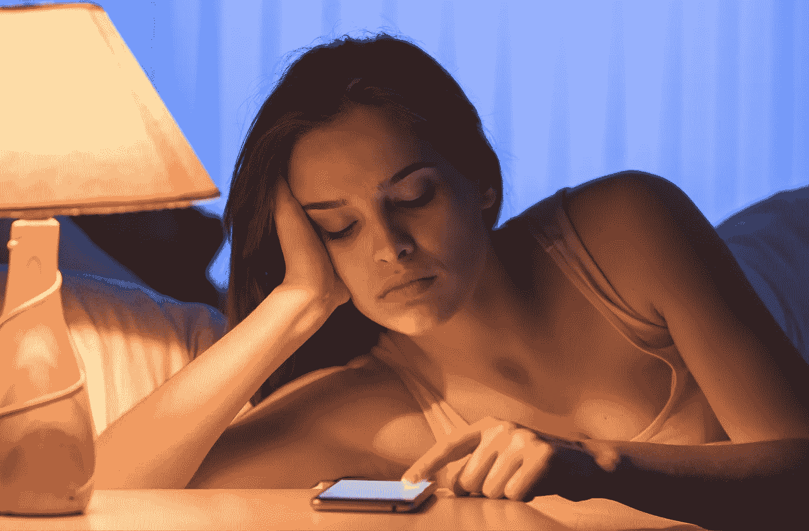

# 比智能手机更聪明的 5 种方法

> 原文：<https://medium.datadriveninvestor.com/5-ways-to-be-smarter-than-your-smartphone-e84e58e5c374?source=collection_archive---------14----------------------->

## 技术

## …阻止它毁掉你的生活

[Canva Pro](https://www.canva.com)

退一步说，埃拉生气了。她感到恼火、沮丧和无助。她的反应是正当的。毕竟，她的智能手机让她失望了。*又来了*。

智能手机是人类最先进的创造之一，是你手中的超级计算机，由云中的人工智能助手和数百万个应用程序驱动，这些应用程序有望让你比忙碌的海狸更有效率。

然而，Kiera 的智能手机没能按时叫醒她，她错过了与新客户的会面，可能失去了价值数百万美元的业务。她责怪她的手机说闹钟没有响，但事实是，几个小时的多次闹钟铃声甚至没有把她从睡梦中吵醒。

原因很简单。她一直盯着手机，直到凌晨，滚动浏览无限的社交媒体，了解她的国家正在发生的政治场景。

我们都有责任让智能手机控制我们的注意力，经常打断我们，让我们焦虑和恐惧，紧张我们的关系，最糟糕的是，破坏我们的睡眠。

> “意识是变革的最大动力”
> 
> ~艾克哈特·托尔

工具的好坏取决于使用它的人。在新手手里，锤子可以砸大拇指。在雕塑家大师的手中，它可以创造出杰作。专家不仅知道如何使用工具，还知道何时使用正确的工具。他们不会因为手里有锤子就到处找钉子。

我们的智能手机就像瑞士军刀。我们需要知道什么时候从工具箱中拿出哪个工具，什么时候什么都不用。一旦我们掌握了我们智能手机的工具包，我们将处于控制之中，而不是被我们的智能手机所控制。

> "当技术和工具是你的仆人而不是你的主人时，它们是有用和强大的."
> 
> ~史蒂文·柯维

*在接下来的讨论中，我将使用术语智能手机来表示设备及其应用程序。*

这里有 5 种方法可以让你从智能手机中夺回控制权，成为更聪明的人:

# 1.不要让它打断你

科学家称人类的注意力持续时间比金鱼的短。经常被打断不仅会减少我们的注意力，还会让我们焦虑。

我们可以选择我们想要的通知，但我们经常不行使这一权利。如果我们让我们的智能手机为我们选择，它会默认。此外，每个应用程序开发人员都希望得到你的关注，这样默认设置会通知你应用程序世界中发生的一切。

## 行动步骤:

在您的日历上安排 15 分钟，浏览通知并明确选择设置。追求绝对的最低要求。如果不是“我离不开这个”，那就关掉。

 [## 更改 iPhone 上的通知设置

### 大多数通知设置可以为每个应用程序定制。你可以打开或关闭应用程序通知，让通知…

support.apple.com](https://support.apple.com/en-gb/guide/iphone/iph7c3d96bab/ios)  [## Android 上的控制通知

### 根据您想要的通知，您可以更改某些应用程序或整个手机的设置。通知…

support.google.com](https://support.google.com/android/answer/9079661?hl=en) 

## 习惯改变:

当您安装新应用程序时，您的手机会提示您选择通知和其他隐私设置。我们常常无意识地接受一切。停下来。选择不被通知。如果你愿意，你可以以后再打开它，但是现在，说不。

# 2.不要让它分散你的注意力

通知并不是智能手机吸引你注意力的唯一方式。让你的智能手机在你的可视范围内会提醒你拿起它。有时候，屏幕会亮起一条信息，提示我们接电话。另一些时候，想要抓住它的冲动是如此强烈，以至于我们忍不住要看一眼。

几千年来，当人类是狩猎采集者时，我们的大脑进化到能够注意到我们视野中的运动，作为一种保护机制。晃动的灌木丛可能表明猎物或捕食者的存在。集中注意力意味着我们可以茁壮成长(抢午餐)或生存(避免成为午餐)。

此外，古代人类的大脑学会跟踪他们武器库中最重要的武器，无论是长矛还是匕首。我们的大脑认为我们的智能手机不亚于史前人类的棍子，并真诚地跟踪它。

> 人才流失:仅仅是拥有自己的智能手机就降低了可用的认知能力。— [消费者研究协会杂志](https://www.journals.uchicago.edu/doi/abs/10.1086/691462?journalCode=jacr)

## 行动步骤:

下次你坐下来做一些有意义的事情时，在你的手机上设置一个 25 分钟的计时器，并把它面朝下。在时间结束前不要捡起来。[详见番茄工作法](https://www.themuse.com/advice/take-it-from-someone-who-hates-productivity-hacksthe-pomodoro-technique-actually-works#:~:text=What%20Is%20the%20Pomodoro%20Technique,are%20referred%20to%20as%20pomodoros.)。

## 习惯改变:

试着把你的手机放在看不见的地方。只要有可能。

如果你出去和别人见面，把它放在你的口袋里；如果你在工作，把它放在你的抽屉里。如果你需要把它放在桌子上，把它面朝下。你也可以试着在一天的前几个小时(或者你最有效率的时候)把它藏在另一个房间里。

逐步脱离你的手机。每当你想拿起它的时候，深呼吸，告诉自己，我会在整点，或者两个小时后做。这次慢慢加大，你会重新控制住的。

Designed in [Canva Pro](https://www.canva.com)

# 3.不要让它侵犯你的隐私

大多数时候，你的智能手机知道你在哪里，你在做什么。这些信息可供手机上运行的操作系统使用，也可以对您安装的应用程序开放。就像我们盲目地允许应用程序通知我们一样，我们经常允许应用程序访问我们的位置、联系人、照片等。没怎么注意。

随着数百个应用程序和服务在我们的智能手机上运行，我们失去了对给定权限的跟踪。

此外，社交媒体应用因每次使用时都会对你进行侧写而臭名昭著。为了给你提供最好的饲料，他们不断地分析你在关注什么，关注多长时间。

搜索引擎也在跟踪你的活动，为你提供定制的结果，并向你展示他们认为你会感兴趣的广告。

现在，完全摆脱被跟踪几乎是不可能的。在变得偏执，把我们的智能手机扔进马桶之前，我们需要控制我们的手机和应用程序的隐私和权限设置。

## 行动步骤:

添加定期日历条目，以便每月查看一次您的隐私设置。仔细检查你手机上的设置和你使用的应用程序。

 [## 更改 Android 手机上的应用程序权限

### 您可以允许某些应用程序使用您手机上的各种功能，如您的相机或联系人列表。一个应用程序将发送一个…

support.google.com](https://support.google.com/android/answer/9431959?hl=en)  [## 如何控制 iOS 应用权限|数字趋势

### 移动应用程序是各种多功能功能的通用网关。使用 iOS 应用程序，权限允许您…

www.digitaltrends.com](https://www.digitaltrends.com/mobile/how-to-control-ios-app-permissions/) 

## 习惯改变:

想想你在社交媒体上分享了什么。在和家人度假时，你真的需要使用脸书的登机功能吗？是的，这个度假胜地很棒，但是你为什么不在度假回来后发微博呢？

此外，不要在分心或处理多项任务时安装应用程序或创建新帐户。注意请求的数据访问、许可协议和其他设置。许可协议可能是法律术语，很难理解，但看看是否有什么东西跳出来。这不会让任何事情变得万无一失，但是外面的黑客正指望人们犯愚蠢的错误。心不在焉、大大咧咧的人都是低垂的果实，千万不要成为其中一员。

# 4.不要让它毁了你的睡眠

我们总是抱怨我们没有足够的时间睡觉，因为工作、孩子和无数的其他承诺。然而，我们发现自己不得不在打瞌睡前最后一次查看我们的社交媒体，这让我们远离了焦虑之地、嫉妒之地、比较之地，有时甚至是绝望之地。5 分钟的窥视延伸到 50 分钟的会议，我们早起的宏伟计划在互联网管道中消失了。

> “连续四周限制睡觉时使用手机减少了睡眠潜伏期、睡前唤醒和负面影响，增加了睡眠持续时间、正面影响和工作记忆。这种干预对改善睡眠质量是有效的”。[阅读更多](https://journals.plos.org/plosone/article?id=10.1371/journal.pone.0228756)。

不久前，智能手机屏幕上的蓝光被指责为[通过指示我们的大脑醒来，扰乱了我们的昼夜节律](https://www.health.harvard.edu/staying-healthy/blue-light-has-a-dark-side)。大多数现代智能手机都有一个内置功能，可以在晚上减少蓝光。

蓝光只是睡觉前使用智能手机造成的问题之一。

最大的问题是我所谓的“再多一分钟”问题。我们拿起手机想快速查看，但却陷入了又一个滚动，又一个视频，又一个回复等等。

YouTube 会自动播放下一个视频，这个视频总是比上一个视频更有趣。《网飞》的剧集以扣人心弦的结尾，我们不得不通过观看下一集来解决这个问题。

聊天应用程序通过显示“正在输入”或三个点或其他指示符来吸引我们等待回复，这些指示符表明对方随时都会回复。

大多数时候，我们通过这些吸引注意力的方法获得的信息会引发负面情绪。可怕的消息带来的震惊，由于预测的灾难性情况而产生的担忧，或者甚至是因为我们朋友的精彩旅行照片而产生的嫉妒，都是不利于一夜良好放松睡眠的情绪。

## 行动步骤:

确保蓝光减少设置已打开。如果你的智能手机不支持这一功能，请尝试使用蓝色滤镜的眼镜。

限制社交媒体应用的使用时间。屏幕时间限制既适合孩子，也适合我们成年人。在周末早晨，当你放松和控制的时候，设定你的屏幕时间限制。这将有助于你在疲倦和困倦时控制多一分钟的冲动。

 [## 在你的 iPhone、iPad 或 iPod touch 上使用屏幕时间

### 有了屏幕时间，你可以实时报告你在 iPhone、iPad 或 iPod touch 上花了多少时间…

support.apple.com](https://support.apple.com/en-au/HT208982)  [## 如何让手机为你限制屏幕时间(2019 年发布)

### 最新的 iPhone 和最新版本的谷歌 Android 都有工具来限制你盯着你的…

www.nytimes.com](https://www.nytimes.com/2019/04/01/smarter-living/how-to-make-your-phone-limit-your-screen-time-for-you.html) 

## 习惯改变:

用意志力来抵制深夜查看手机的诱惑是行不通的。我们每天都有有限的意志力储备，到了晚上，我们就快用完了。

一个更好的主意是把你一天中最后一次社交媒体检查安排在睡觉前一个小时或更久。为此，你可以在晚饭后留出 15 分钟(或者更多，如果你需要的话)。当你完成了无限滚动，在 YouTube 上找到了猫的视频或者任何满足你渴望的东西，把你的智能手机打开“更多飞机”，或者至少打开“请勿打扰”。

# 5.不要让它破坏你的早晨

我们大多数人早上第一件事就是拿起智能手机。当我们的大脑试图抓住我们拥有的最重要的生存工具时，这几乎是一种下意识的行为。我们会立即查看我们的信息、电子邮件、社交媒体等。我们觉得必须赶上 24x7 全天候的世界。

考虑一下:如果你晚一个小时醒来，查看手机，世界会分崩离析吗？我想今天不会了。所以，为什么不在赶上这个无论如何都不会等你的世界之前给自己多一个小时呢。

健康专家 Chelsea Pottenger 发现，早上第一件事就是检查我们的手机，这会使我们的脑波转换短路，导致压力、焦虑，甚至削弱我们的免疫系统。

早晨是感恩、冥想、与你所爱的人(和你住在一起的人)联系、给你的身体补充一些好东西、照顾你的健康等的最佳时间。

想象一个你每天早上都需要穿过的旋转漩涡，并且一整天都呆在里面。如果你选择推迟进场，你会不会在进场前花点时间？

有些情况下，你没有选择，你需要立即开始一天的工作，但起床后第一件事不接电话，至少会给你额外的 5 分钟刷牙时间。

## 行动步骤:

把手机充电装置搬出卧室是个好主意。担心报警问题？我们仍然可以买到好的旧闹钟。讨厌旧技术？使用智能音箱(亚马逊 Echo 或等效物)，询问智能助手(Alexa、Siri 等。)来叫醒你。这也将帮助你解决第四个问题。

## 习惯改变:

计划比平时早起一个小时。如果你遵循第四条，你可能会早一点入睡。

做一个早晨的例行公事，包括冥想、阅读、锻炼等。用你的意志力把拿手机的时间推迟到做完早上的工作之后。

# 最后的想法

将我们所有的问题归咎于技术是很容易的，但指责让我们感到无能为力。我们周围有很多情况是我们无法控制的。我们至少可以掌控智能手机这一令人惊叹的人类发明，让它为我们服务，而不是让它主宰我们的生活。

感谢阅读。您可能也会喜欢这些相关文章:

 [## 5 种我们可以停止用智能手机伤害自己的方法

### 穴居人带着棍子，我们带着智能手机，这有什么错？

medium.com](https://medium.com/illumination/5-ways-we-can-stop-hurting-ourselves-with-our-smartphones-679726d46b34)  [## 起床，开始新的一天

### 改变生活的三个步骤，一天一次

medium.com](https://medium.com/soul-safari/wake-up-and-set-up-your-day-6c169b8542ee)  [## 睡觉前准备好你的潜意识

### 改变生活的三个步骤，每次一个晚上

medium.com](https://medium.com/soul-safari/prepare-your-subconscious-mind-before-you-sleep-2437a5a34a77)