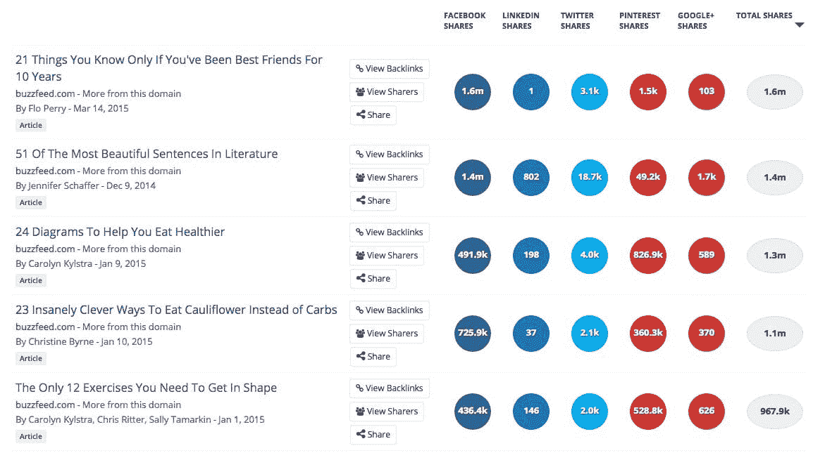
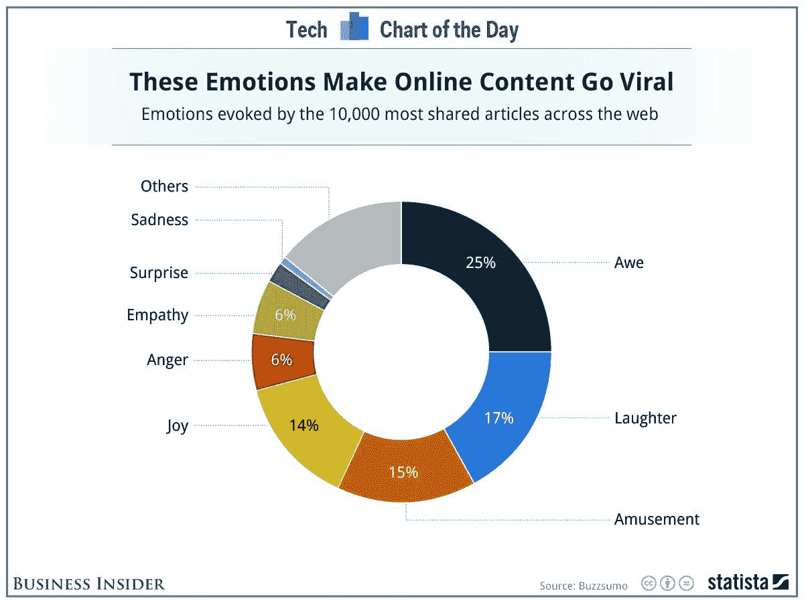

# 帮助你的内容传播的 5 个简单原则

> 原文：<https://medium.datadriveninvestor.com/5-ways-to-make-your-content-go-viral-52b4b86cd6d0?source=collection_archive---------13----------------------->

## 通过应用这些关键原则实现病毒传播的圣杯。

Photo by [Austin Distel](https://unsplash.com/@austindistel?utm_source=medium&utm_medium=referral) on [Unsplash](https://unsplash.com?utm_source=medium&utm_medium=referral)

想增加你的内容传播的机会吗？

受够了花费大量时间制作内容，却只能让它毫无意义地落在你的观众面前？

厌倦了你所有的努力没有得到太多或任何牵引？

在今天的网络世界里，病毒式传播是游戏的名字。

无论是你的博客文章、社交媒体活动还是产品发布，你都可以运用一些关键原则来提高你的机会。

## 以下是让你的内容迅速传播的 5 个关键原则。

# #1.精心制作引人注目的标题

我相信你都听到了。了解你的受众——了解他们的需求、欲望，以及他们想从你的内容中获得什么。从最终用户开始，然后从那里开始。

首先要创造引人注目的标题，吸引读者想了解更多。一个好的标题会激起观众的兴趣，并激发他们想知道更多的欲望。

众所周知，史蒂夫·乔布斯在发布或推广新产品时，会使用类似 Twitter 的、[有力的标题](https://clementbourcart.medium.com/how-to-sell-your-products-like-steve-jobs-76cf6583e440)来描述新产品。相当成功！

为了制作标题，你可以使用一些免费的工具。你可能不想仅仅依赖它们，但是它们可以给你一个很好的指示，说明什么样的*倾向于*构成一个吸引人的标题。

*   一个流行的标题分析工具[在这里](https://coschedule.com/headline-analyzer)
*   另一个伟大的选择[在这里](https://capitalizemytitle.com/headline-analyzer/)
*   一些奇妙的标题公式[在这里](https://sumo.com/stories/headline-formulas)

永远记住:这是一种微妙的平衡。你的标题在吸引人的同时，应该和你的其他内容保持一致。两者之间的脱节可能代价高昂。

信任是你能与听众建立的最有价值的资产。不兑现承诺的“点击诱饵”标题会立即打破这种信任。因此，恢复关系需要时间。

**永远不要对你的内容做出过多承诺和过少交付**。

# #2.正确掌握搜索引擎优化(SEO)的基础知识

即使在像 Medium 这样的平台上，您的内容可以依赖于已经提供高度可见性的现有基础架构，您也需要了解一些基本知识。

如果做得好，一些简单的调整可以让你的内容更容易通过有机搜索引擎结果找到。

有很多很棒的工具可以用来优化你的内容的搜索引擎优化。例如:

*   [Moz](https://moz.com/) —关键字研究功能允许您查看详细的结果，以及与搜索量相比，哪些关键字的竞争力更强或更弱。它还包括在一个地方对您的活动进行社交媒体监控，以及一个月的免费试用
*   [Ahref](https://ahrefs.com/)——另一个非常流行的关键字和 SEO 优化工具，可视化仪表盘让你看到相关的主题和详细的支持跟踪，以及域权威排名等有用的指标

为了快速而有用地了解你开始所需的一切，请查看这个由 [HubSpot](https://medium.com/u/8732e73183e5?source=post_page-----52b4b86cd6d0--------------------------------) 提供的[免费课程](https://academy.hubspot.com/courses/seo-training)。

# #3.用视频和吸引人的视觉效果充实您的内容

视频是倾向于创造最高在线参与度的内容类型。

一些关键事实清楚地证明了视频的重要性:

*   88%的视频营销人员对视频的投资回报率感到满意(相对于其他媒体)
*   视频比其他类型的内容多 66%的*合格*销售线索
*   80%的软件或应用程序购买发生在消费者观看了某个品牌的视频内容之后

视频也代表着消费者注意力持续增长的份额。

回到 2019 年，消费者每周已经在视频内容上花费了近 7 个小时。那可是很长时间啊！

你想让你的品牌或内容在这块大馅饼中分得一杯羹。想了解更多制作精彩视频的技巧，请点击这里[。](https://letsdovideo.com/5-simple-video-marketing-ideas-to-go-viral-in-2020/#:~:text=So%2C%20if%20you%20want%20to,in%20the%20most%20authentic%20way.)

 [## 给数字营销工作者的 5 本书推荐|数据驱动的投资者

### 随着就业率的上升，由于疫情和人们花更多的时间在网上，数字营销的技巧…

www.datadriveninvestor.com](https://www.datadriveninvestor.com/2020/10/28/5-book-recommendations-for-those-who-work-with-digital-marketing/) 

# #4.使用列表式内容快速吸收和最大限度地保留

列表往往工作得很好，因为这种格式更容易记忆和保留信息。

列表也很容易回来思考——导致重复参与、分享等。

例如，通过查看 Buzzfeed 帖子，您可以看到它们最成功的内容是列表格式的:

An [analysis of Buzzfeed’s popular content](https://digitalmarketinginstitute.com/blog/7-ways-make-content-go-viral) from the Digital Marketing Institute

没有必要让你的内容过于复杂。**少往往就是多**——把它分成简单的块，最好是列表，这样你的读者就能容易地理解和吸收。

此外，[已经证明](https://medium.com/better-marketing/increase-your-article-views-25-by-writing-for-a-6th-grade-reading-level-6b862153d654)越简单的内容越容易吸引读者。即使在制作与技术主题相关的内容时，有时简化术语并使事情尽可能清楚也是有帮助的。并且，对于面向普通大众的内容，那么越简单肯定越好！

# #5.激发情感，用您的内容创造奇迹

要特别注意标题可能会给你的受众带来的情绪或情感。

情感是强大的，是什么让一篇内容与读者产生共鸣——所以要明智地使用它，并确保它与实际内容本身相匹配。

这同样适用于你的全部内容。

你可以通过使用有力的词语来增加情感，这些词语会唤起你想在读者心中唤起的情感。

更好的是，使用最有可能导致更高参与度的情绪——增加你的内容以多种方式传播的机会。

根据[商业内幕](https://medium.com/u/68d0a1fff1ac?source=post_page-----52b4b86cd6d0--------------------------------)的报道，例如，“敬畏”一词在网络上四分之一最常分享的内容中被唤起。毕竟，谁不想被敬畏呢？

Emotions that lead to virality, based on [Business Insider research](https://www.businessinsider.com/these-emotions-make-things-spread-like-crazy-online-2014-6?IR=T)

# 概括起来

为了增加你的内容在下一次发布时被广泛传播的机会，请遵循以下原则:

*   确保你的**标题是有力的**，抓住你的读者的注意力
*   将一些好的 SEO 实践融入其中——使用最佳的关键词和结构，这样你的内容更容易被找到
*   加入**视频和视觉元素**让你的内容更吸引人
*   依靠**列表**来帮助你的读者吸收信息，让他们更容易分享
*   使用有力的语言在读者的头脑和心中激起情感

*我希望以上有助于让你的下一篇内容火起来。同时，快乐的内容创作！*

## 访问专家视图— [订阅 DDI 英特尔](https://datadriveninvestor.com/ddi-intel)