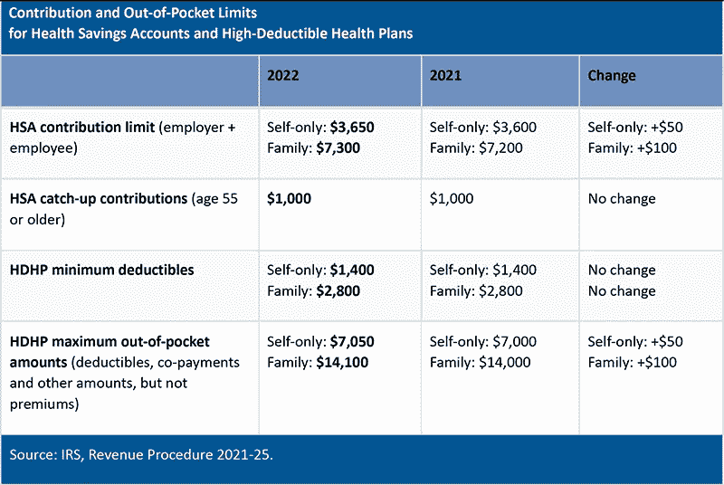

# 从 HSA 中获益的 5 种方式

> 原文：<https://medium.datadriveninvestor.com/5-ways-you-can-benefit-from-an-hsa-37651e8bf69a?source=collection_archive---------11----------------------->

Photo by [Xan Griffin](https://unsplash.com/@xangriffin?utm_source=unsplash&utm_medium=referral&utm_content=creditCopyText) on [Unsplash](https://unsplash.com/s/photos/victory?utm_source=unsplash&utm_medium=referral&utm_content=creditCopyText)

这是一个关于利益的故事。或者更重要的是，一个你可能不知道的医疗益处，以及它如何帮助你。

对许多美国人来说，这是开放注册的时间；我们选择来年健康保险计划的年度窗口。这可能是一个令人困惑的模糊选项，很容易检查出来。

我也有这种挫败感；我明白了。

但是如果我告诉你有一个好处，它不仅能以一种方式帮助你，还能以五种不同的、有价值的方式帮助你，那会怎么样呢？

输入健康储蓄帐户(HSA)。

## 这是什么？

健康储蓄账户是一个您出资帮助支付医疗费用的账户。HSA 与高免赔额健康计划(HDHP)一起使用。高免赔额计划可能是有益的，因为保费通常较低，为您省钱。HSA 可用于支付您可能产生的任何自付费用。

捐款是税前的，通常通过工资扣除完成。也就是说，无论你是自雇还是失业，只要你的计划是一个合格的 HDHP，你仍然可以缴费。

 [## 哪个国家的医疗保健排名第一？数据驱动的投资者

### 质量是相对的，因为每个人对更好的服务或商品都有自己的看法。即使是同一个人也可能或可能…

www.datadriveninvestor.com](https://www.datadriveninvestor.com/2020/10/30/which-country-is-number-one-in-healthcare/) 

下表显示了最高年度缴款限额。你可以给你的 HSA 提供任何你觉得合适的金额。这些数字可能看起来很高，但请记住，你捐献的任何一美元都是免税的。

Photo: [Rbgcal.com](https://www.rbgcal.com/irs-announces-2022-limits-for-hsas-and-high-deductible-health-plans/)

## 对我有什么好处？

1.  **所有捐款均免税。**

这意味着几件事。首先，这意味着你留出的钱将比税后留出的钱更多。你当然可以用这笔资金来支付合格的医疗费用，但是如果你能够通过其他来源支付这些费用，你可以像投资 401k 计划一样投资 HSA 元。确保你使用与其他退休工具相同的原则/风险承受能力。说到退休，到时候你可以用你的 HSA 基金来支付你的医疗保险费。

**2。免税收入。**

在 HSA，你的钱为你工作，你账户上的任何利息都是免税的。当你把一段时间内复利的力量考虑在内时，那将会是非常真实的收益。

想知道这意味着什么？试试这个[计算器](https://www.hsabank.com/hsabank/Learning-Center/HSA-Savings-Calculator)找出答案。

**3。免税提款。**

与个人退休帐户或 401k 不同，从 HSA 提款通常是免税的。只要这笔钱是用于资格费用，提取是不征税的。

**4。不是“用它或者失去它。”**

只要你愿意，任何捐款都会留在基金里。与灵活的支出账户不同，你不会发现自己在最后一刻不得不购买创可贴。HSA 能让你更好地控制自己的钱该做什么，不该做什么。

**5。它是便携式的。**

在一份工作上呆 30 年的日子已经一去不复返了。在今天这个跳槽和自由职业的时代，HSA 可能是一个常数。当你换工作时，它会伴随着你-再次给你灵活性和对你的钱的控制。

开设健康储蓄账户不仅是支付医疗费用的好方法。这也是增加你的钱和为明天存钱的好方法。HSA 是投资未来的好方法。

## 获得专家观点— [订阅 DDI 英特尔](https://datadriveninvestor.com/ddi-intel)