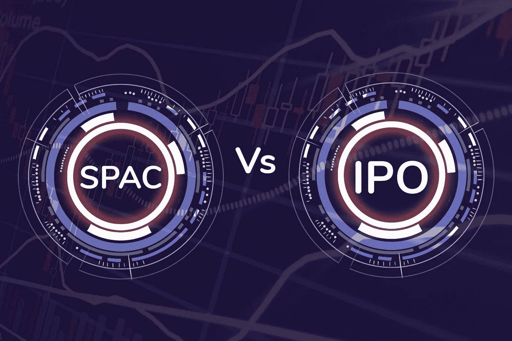
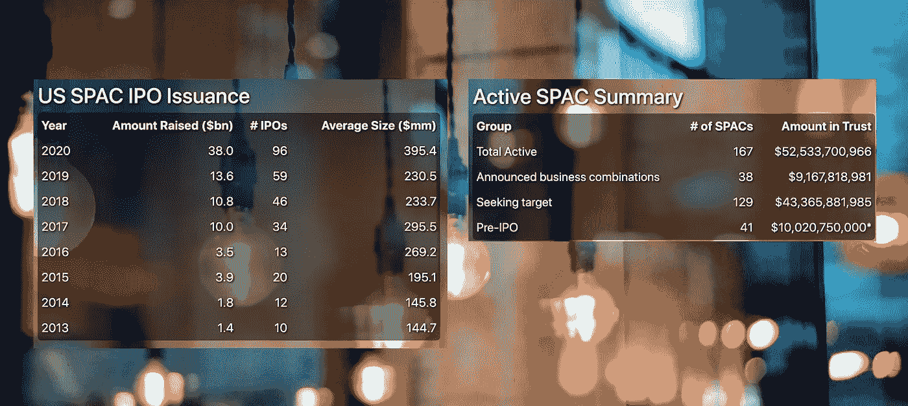
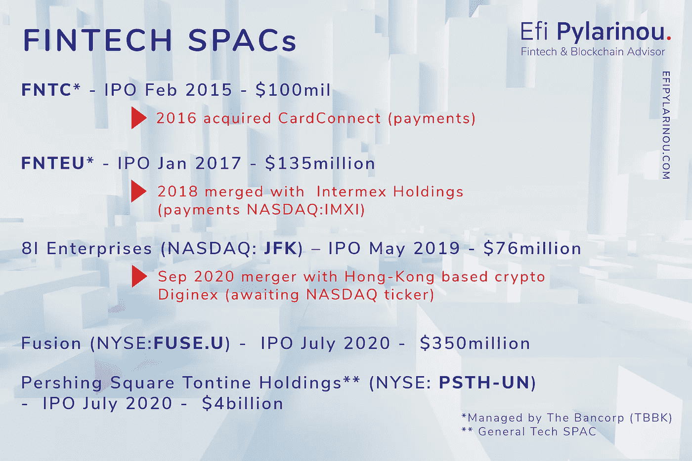

# 美国 50%的 IPO 都是垃圾邮件！

> 原文：<https://medium.datadriveninvestor.com/50-of-us-ipos-are-spacs-9c47addf44bf?source=collection_archive---------11----------------------->

路透社报道称，2020 年，公司在美国的首次公开募股已经筹集了超过 700 亿美元。Barron`s 报告称，2019 年，四分之一的 IPO 是特殊目的收购公司，他们为 59 个 SPAC 筹集了 136 亿美元。

截至 8 月中旬，共有 86 家特殊目的收购公司公司在美国完成上市，共募集资金 340 多亿美元。相比之下，2018 年筹集的资金额是 2018 年的三倍，推出的 SPACs 数量接近两倍。来自[特殊目的收购公司研究](https://www.spacresearch.com/)的活动报告显示，有几个 SPAC 正在寻找目标，还有一些已经找到了他们想要分配资金的私人公司。

7 月是超级特殊目的收购公司申报 40 亿美元的月份。比尔·阿克曼(Bill Ackman)的潘兴广场资本管理公司(Pershing Square Capital Management)以专注于科技行业的特殊目的收购公司上市。股票[**PSTH-联合国**](https://finance.yahoo.com/quote/PSTH-UN?p=PSTH-UN) 发行价为 20 美元，截至 9 月 3 日周五收盘，股价为 21.83 美元。让我们看看一些金融科技是否会出现在特殊目的收购公司。

 [## 商务沟通不畅是网络安全问题的 5 个原因|数据驱动型投资者

### 沟通是商业的命脉。没有协作就不会有想法，没有合作就不会有交易

www.datadriveninvestor.com](https://www.datadriveninvestor.com/2020/09/01/5-reasons-why-poor-business-communication-is-a-cybersecurity-issue/) 

SPACs 提供了一种更快的上市方式，避免了一些成本，以及大多数首次公开募股后不良的价格行为和禁止发布财务信息。

SPACs 是投资者接触私人公司的一种快捷方式。

对于特殊目的收购公司的 IPO 来说，这是重要的一周。这是你错过的。(巴伦` s)

今年 7 月，特殊目的收购公司也在纽交所进行了以金融科技为重点的 IPO，价值 3.5 亿美元。让我们欢迎并关注 Fusion 收购公司的([纽约证券交易所代码:FUSE。U](https://finance.yahoo.com/quote/FUSE-UN) )。

一家空白支票公司，专注于金融科技或资产和财富管理领域的业务，企业价值在 7.5 亿美元至 30 亿美元之间。保险丝。u 的发行价是 10 美元，现在是 10.09 美元。

[炙手可热的特殊目的收购公司板块与炙手可热的金融科技板块在 Fusion Acquisition Corp IPO 中相遇](https://www.crowdfundinsider.com/2020/07/164242-hot-spac-sector-meets-hot-fintech-sector-in-fusion-acquisition-corp-ipo/)(众筹人士)

另一项金融科技特殊目的收购公司 7 月份值得注意的交易是 Diginex 与特殊目的收购公司 8i 企业收购公司的反向合并(在纳斯达克上市的$JFK)。 [Diginex](https://www.diginex.com/) 是一家总部位于香港的加密和区块链解决方案技术公司。$JFK 是一家特殊目的收购公司，在 2019 年 5 月筹集了 7600 多万美元，现在正在推动总部位于香港的 Diginex 在美国上市。请记住，Diginex 已经根据支付受限许可在新加坡运营了自己的加密交易所 EQUOS.io。它还运营着一个场外(OTC)加密交易平台 Diginex Access 和一个“冷热”托管平台 Digivault。

[加密公司 Diginex 通过反向合并在纳斯达克上市](https://www.theblockcrypto.com/linked/73389/diginex-listing-nasdaq-reverse-merger?utm_source=newsletter&utm_medium=email&utm_campaign=2020-08-02)

众筹内幕人士暗示 Affirm 可能会考虑特殊目的收购公司，而不是传统的首次公开募股。随后，旧金山金融科技公司确定了 100 亿美元的估值

特殊目的收购公司的首字母缩写是“特殊目的收购公司”。

特殊目的收购公司上市并筹集资金，这些资金由信托公司保管。特殊目的收购公司的任务是去收购特定领域的私人运营公司。以前是科技独角兽狩猎。

马克·鲁宾斯坦在他最新的 [`SPAC the new black`](https://netinterest.substack.com/p/spac-the-new-black) 中报道，比尔·阿克曼最新的特殊目的收购公司结构引入了新的术语。特殊目的收购公司的基本条款([来源](https://www.cnbc.com/2020/07/22/bill-ackman-and-tontine-holdings-rewrite-the-terms-for-spacs.html))包括投资者接收普通股和可分离认股权证。魔鬼总是在细节中当然，所以权证细节发挥了很大的作用(是否可以在收购前或收购后行权)。肯尼斯·斯奎尔在这里详细解释了新的 40 亿美元特殊目的收购公司结构的细节。最重要的一点是，特殊目的收购公司赞助商潘兴广场(Pershing Square)首次没有获得方正的任何股份。因此，只有在特殊目的收购公司股东获得 20%的回报后，潘兴广场才会获得补偿。在通常的特殊目的收购公司结构中，情况正好相反，潘兴广场首先获得报酬，然后是股东。

[比尔·阿克曼和通廷控股公司改写了 SPACs 的条款](https://cnb.cx/2CspnrJ)

回到 2017 年 10 月，我写了关于金融科技 SPACs 的文章，名为[社会资本 Hedosophia Holdings Corp](https://www.sec.gov/Archives/edgar/data/1706946/000114420417047945/v475173_ex99-1.htm) 。9 月在纽约证券交易所上市 [IPOA。U](https://www.bloomberg.com/quote/IPOA/U:US) )并融资 6 亿美元。2019 年末，IPOA。u 合并与哪合并[维珍银河(SPCE)](https://spacinsider.com/2019/07/09/social-capital-hedosophia-acquiring-virgin-galactic/) ，2019 年 10 月聚焦载人航天。

我提到了当时唯一在纳斯达克、FNTC 和 FNTEU 上市的纯金融科技 SPACs。他们都是由银行管理的。

FNTC 于 2015 年 2 月上市，融资 1 亿美元，一年后收购了 CardConnect，这是一家成立十年的私人支付处理公司，其平台上有 60，000 家商户，迄今处理的信用卡交易超过 170 亿美元。此次收购基于价值 3 . 5 亿美元的现金(1 . 8 亿美元)和股票(1 . 7 亿美元)。

[FNTEU](http://www.reuters.com/finance/stocks/overview/FNTEU.OQ) 于 2017 年 1 月再次上市，收购一项金融科技业务。2018 年年中，它[与 Intermex Holdings](https://www.globenewswire.com/news-release/2018/07/26/1543005/0/en/Intermex-Completes-Merger-with-FinTech-Acquisition-Corp-II.html) 合并，Intermex Holdings 是一家专注于拉丁美洲和加勒比海地区的支付金融科技公司(纳斯达克代码:IMXI)，

[***EfiPylarinou***](https://www.google.com/url?q=https://www.linkedin.com/in/efipylarinou/&sa=D&source=calendar&usd=2&usg=AOvVaw0vA6IjQGSbjiUvx6ld0BTK)***是全球 Fintech &区块链影响者—***[*refinitiv global Social Media 2019*](https://www.google.com/url?q=https://www.refinitiv.com/perspectives/market-insights/meet-the-top-100-social-media-influencers-in-financial-technology/&sa=D&source=calendar&usd=2&usg=AOvVaw2ngBZ7ZcnGb_6bsTe7NjP8)*&2020 金融领域最具影响力的女性。*

[*www.efipylarinou.com*](https://www.google.com/url?q=http://www.efipylarinou.com/&sa=D&source=calendar&usd=2&usg=AOvVaw3s8iAdmK-0rRD64OECcDwJ)

**获取专家观点—** [**订阅 DDI 英特尔**](https://datadriveninvestor.com/ddi-intel)