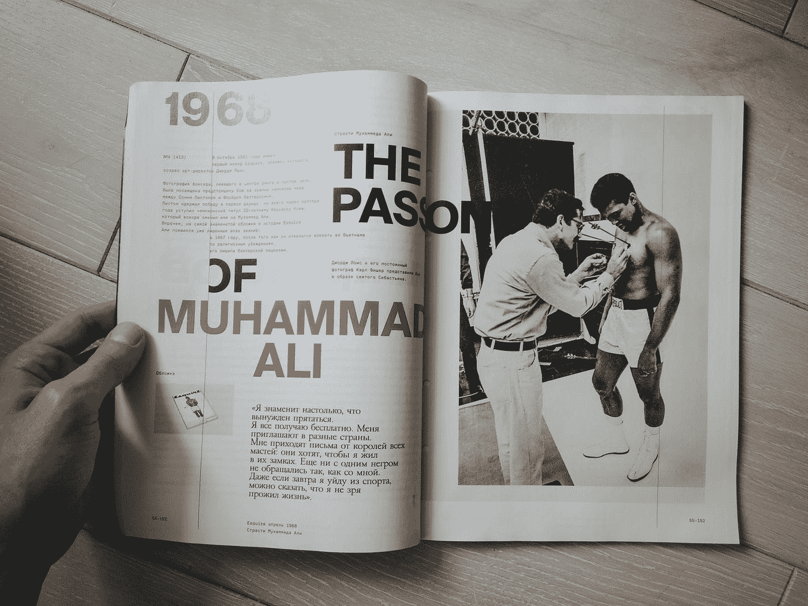

# 改变你对领导力看法的 50 句名言

> 原文：<https://medium.datadriveninvestor.com/50-quotes-that-will-change-the-way-you-think-about-leadership-cd1f5cfd6409?source=collection_archive---------22----------------------->

## 并且会激励你相信自己

# 成为一个有远见的人

领导力首先是设定愿景。而是要超越他人的眼光。注意趋势，消费者行为的变化，人群食欲的微妙变化。

> 1.人们经常高估未来 2 年将会发生什么，而低估未来 10 年将会发生什么——比尔·盖茨
> 
> 2.永不放弃。你永远不知道你离梦想有多近——奥普拉·温弗瑞

Photo by [Edward Cisneros](https://unsplash.com/@everythingcaptured?utm_source=medium&utm_medium=referral) on [Unsplash](https://unsplash.com?utm_source=medium&utm_medium=referral)

> 3.如果你梦想远大，你就会避免挫折。你不会被日常琐事困扰，因为你的目标和对你来说重要的事情是更有意义的事情——托尼·罗宾斯
> 
> 4.领导力是将愿景转化为现实的能力——沃伦·本尼斯
> 
> 5.好奇心是成就的引擎——华特·迪士尼
> 
> 6.没有勇气去梦想的人，也就没有力量去奋斗——保罗·祖莱纳

Photo by [Free To Use Sounds](https://unsplash.com/@freetousesoundscom?utm_source=medium&utm_medium=referral) on [Unsplash](https://unsplash.com?utm_source=medium&utm_medium=referral)

> 7.未来属于那些相信梦想之美的人。—埃莉诺·罗斯福
> 
> 8.疯狂的梦想从未停止——耐克

Photo by [Michael](https://www.pexels.com/@mgblr?utm_content=attributionCopyText&utm_medium=referral&utm_source=pexels) from [Pexels](https://www.pexels.com/photo/man-in-black-hoodie-and-gray-pants-standing-on-forest-3287160/?utm_content=attributionCopyText&utm_medium=referral&utm_source=pexels)

> 9.如果你分享你的想法并且不感到尴尬，那就太晚了- [雷德·霍夫曼](https://www.linkedin.com/pulse/arent-any-typos-essay-we-launched-too-late-reid-hoffman/)
> 
> 10.在科技领域，仅仅跟上时代是不够的。你必须在明天之前到达— [彼得·泰尔](https://www.forbes.com/profile/peter-thiel/#7c224c66533a)

这就是为什么硅谷是领导者和梦想家的圣地。当你想到未来会带来哪些**挑战，而你**为它们设计解决方案**时，最伟大的创新就诞生了。**

> 11.维克多·雨果说过一句话:你不能扼杀时机已经成熟的思想。我们的时代已经到来了——大脑象棋
> 
> 12.当你一无所有时，你也不会失去任何东西——鲍勃·迪伦

# 引领变革

列侬曾经唱过:你可能认为我是个梦想家，但我不是唯一的一个。非常正确。有许多梦想家和幻想家，但让你成为天才的是将这些梦想变成现实。采取行动和做出改变通常是最困难的部分。

> 13.好的决策者不会做很多决定。他们做出的决定会产生影响— [哈佛商业评论](https://hbr.org/1967/01/the-effective-decision)

你在公司结构中的位置越高，你做出的决定就越重要，而不是工作本身。

> 14.世界上的每个人都听同一个电台:WIIFM，这对我有什么好处——每个营销大师

Photo by [Joshua Rawson-Harris](https://unsplash.com/@joshrh19?utm_source=medium&utm_medium=referral) on [Unsplash](https://unsplash.com?utm_source=medium&utm_medium=referral)

无论你传递什么信息，都要记住这一点。无论变化是大是小，最终，人们都希望听到为他们量身定制的信息。实际上会发生什么？他们会做同样的工作吗？明天会有什么不同？

> 15.失败。快速失败。向前失败——硅谷谚语

我们应该选择不断适应，而不是追逐“成功公式”。

**在一个不断变化的世界里，没有所谓的“制胜公式”**。过去曾经引领你走向成功的东西，不一定会引领你走向未来的成功。

你需要愿意放弃曾经有效的东西，并且**转向**。再一次。再一次…

> 16.如果你没有尝试过任何有风险的事情，并且总是选择更安全的生活，你怎么会知道赢是什么感觉呢？— [理查德·布兰森爵士](https://en.wikipedia.org/wiki/Richard_Branson)

Photo by [Loic Leray](https://unsplash.com/@loicleray?utm_source=medium&utm_medium=referral) on [Unsplash](https://unsplash.com?utm_source=medium&utm_medium=referral)

> 17.让一个人生气的东西有多大，他就有多大——温斯顿·丘吉尔
> 
> 18.数字化转型比你想象的更强大。这就像一匹特洛伊马进入一个大组织，点燃更大的变革。— [马特乌斯·特雷德](https://www.linkedin.com/in/mateusztreder/) & [乔丹·费舍尔](https://newsroom.porsche.com/en/2020/digital/porsche-digital-design-system-19873.html)
> 
> 19.你必须相信某些东西——你的勇气、命运、生活、因果报应等等。这种方法从未让我失望，它让我的生活变得完全不同——史蒂夫·乔布斯

无论你在组织中引入什么样的变革，都必须基于信念。相信你选择的方向是正确的。只有这样，人们才会追随你。

> 20.成功胜过讨论——杰夫·贝索斯
> 
> 21.我们最大的弱点在于放弃。成功最可靠的方法就是永远再试一次——托马斯·阿尔瓦·爱迪生

我甚至想再引用一句爱迪生的话:“我没有失败。我刚刚发现了一万种行不通的方法”。通用电气的创始人是坚持和努力的著名象征。

 [## 领导力。赢得|数据驱动型投资者需要更广阔的视角

### 不管他们愿不愿意，领导者都是快速运转的机器中的齿轮，这就要求他们夹住自己的爪子…

www.datadriveninvestor.com](https://www.datadriveninvestor.com/2020/02/07/leadership-it-takes-a-wider-perspective-to-win/) 

# 增长

为了改变而改变是没有意义的。一切都必须有一个目的。一条轨迹。**通往成功和胜利的路线图。**这就是成长发挥作用的时候。

> 22.没有光鲜亮丽的成长，只有痛苦的成长。不要抱怨，采取任何一小步让你前进——麦肯锡
> 
> 23.冠军不是健身房里培养出来的。冠军是由他们内心深处的某种东西组成的——一种渴望，一个梦想，一个愿景。他们必须有技能和意愿。但是意志必须比技能更强大-穆罕默德·阿里

Photo by [Roman Skrypnyk](https://unsplash.com/@timesnewroman14?utm_source=medium&utm_medium=referral) on [Unsplash](https://unsplash.com?utm_source=medium&utm_medium=referral)

> 24.伟大的人不会气馁，但竞争。竞争驱使他们— [雷·克罗克](http://Ray Croc)

你认为 Lady Gaga 会想“天哪，已经有麦当娜了，没有我的位置了”吗？不完全是。

> 25.在足球界，没有严谨和精确，天赋和优雅就毫无意义——莱昂内尔·梅西
> 
> 26.日积月累，每天卓越的涟漪变成成功的海啸——罗宾·夏尔马
> 
> 27.最聪明的人从别人的错误中学习。明智的从他们那里学习。愚蠢的人根本不会学习——阿尔伯特·爱因斯坦

Photo by [Abigail Keenan](https://unsplash.com/@akeenster?utm_source=medium&utm_medium=referral) on [Unsplash](https://unsplash.com?utm_source=medium&utm_medium=referral)

> 28.如果你不成长，你就是在死亡。尤其是在科技领域——这是另一个硅谷谚语
> 
> 29.你越努力，你越幸运——阿诺德·施瓦辛格
> 
> 30.一个糟糕的章节并不意味着你的故事结束了
> 
> 31.你不能回到过去改变开始。但是你可以从你现在的地方开始，然后改变结局

每个人都会犯错。即使是我们最伟大的人。但不代表你。应该停止尝试或者停止成长。

> 32.你不可能在一夜之间，甚至几年内成为赢家。这需要时间…你会输掉比赛，你必须接受这一点，从中吸取教训，相信你会赢得下一场比赛，知道你也可能会输掉。你必须一直相信有一天你会赢— [保拉·拉德克里夫](http://www.paularadcliffe.com/)

# 人员管理

归根结底，一切都是为了你的团队。他们是追求成功的人。

打造一支冠军球队需要的不仅仅是天赋。

我们必须准确地认识到每个团队成员的贡献，以及他们的贡献如何融入大局。这也允许我们通过给每个成员一个空间来释放他们自然的、个人的能力，从而发挥出彼此最好的一面。

**一个好的领导者不仅知道每个人的优势**而且知道应该在哪里发挥每个人的优势，以便更好地相互促进。

> 33.天赋击中了别人无法击中的目标；天才击中了别人看不到的目标——亚瑟·叔本华
> 
> 34.在你信仰的所有事物中，为什么不是你自己——麦当娜
> 
> 35.无怨无悔地生活——理查德·布兰森爵士
> 
> 36.体验这个世界，而不是看着它——蒂姆·费里斯
> 
> 37.培养做大胆事情的力量，而不是忍受痛苦的力量— [尼可罗·马基亚维利](https://en.wikipedia.org/wiki/Niccol%C3%B2_Machiavelli)
> 
> 38.犯野心的错误，不要犯堕落的错误——蒂姆·费里斯

传奇篮球教练菲尔·杰克逊曾经被记者问及离开球馆后他会做什么。那是在输掉一场比赛之后。杰克逊回答说——不管结果如何，我都会回家，喝一杯，吃他妻子为他准备的晚餐。

无论我们犯了什么错误，他们都不应该改变我们太久。**感情只是暂时的。**他们不会改变大局。

> 39.不听的领导者会被无话可说的人包围——安迪·斯坦利
> 
> 40.在进行了一次艰难的谈话后，专注于应该做什么和进行谈话本身一样重要——瓦尼·科拉
> 
> 41.如果有人给你一个绝佳的机会，但你不确定你能做到——说好，然后以后学习如何去做——理查德·布兰森爵士
> 
> 42.你没有建立一个企业。你培养人才，人才打造企业— [金克拉](https://www.ziglar.com/articles/dont-build-business/)
> 
> 42.永远不要低估一小群有奉献精神的人改变世界的能力。事实上，这是唯一的事情。—玛格丽特·米德

Photo by [Priscilla Du Preez](https://unsplash.com/@priscilladupreez?utm_source=medium&utm_medium=referral) on [Unsplash](https://unsplash.com?utm_source=medium&utm_medium=referral)

> 43.领导力就是让别人因为你的存在而变得更好，并确保这种影响在你不在的时候也能持续。”—雪莉·桑德伯格

你没有教罗纳尔多如何踢任意球。你教他如何在队里打球。你不训练球员。你训练团队。

> 44.当有危险时，你站在第一线。那么人们会欣赏你的领导能力。”—纳尔逊·曼德拉
> 
> 45.团队不是一群在一起工作的人。一个**团队**是一群**互相信任的人**—[西蒙·西内克](https://simonsinek.com/)
> 
> 46.大胆地提高你周围每个人的标准— [马库斯·阿尔蒙德](https://www.amazon.com/Markus-Almond/e/B00K0N2118%3Fref=dbs_a_mng_rwt_scns_share)
> 
> 47.公开表扬，私下批评——这是任何领导力培训都会重复的一句话
> 
> 48.如果你只雇佣那些你了解的人，公司永远也招不到比你更好的人。永远记住，你经常会在那些你并不特别喜欢的人中发现杰出的人——本田宗一郎
> 
> 49.世界历史不过是伟人的传记——[托马斯·卡莱尔](https://en.wikipedia.org/wiki/Thomas_Carlyle)

也是最后一个。

> 50.引语很简单。执行很难。— [加里·维纳查克](https://www.garyvaynerchuk.com/)

## 访问专家视图— [订阅 DDI 英特尔](https://datadriveninvestor.com/ddi-intel)