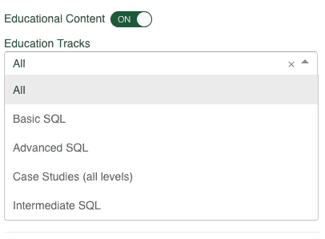

# 500 个真实公司的 SQL 面试问题

> 原文：<https://medium.datadriveninvestor.com/500-sql-interview-questions-from-real-companies-adbcaf797e37?source=collection_archive---------0----------------------->

## 为数据科学家和业务分析师收集了来自不同行业的真实 SQL 面试问题

搜索“ *SQL 面试问题*”会给你提供超过 10 页的文章，列出技术面试中可能会被问到的问题。作为一个准备成为数据科学家或分析师的人，我通常会浏览文章并尽可能多的记忆。但在多年面试数据科学家职位和各种其他分析角色后，我意识到我从未在面试中被问及这些问题。

**类似问题:**

> 什么是 RDBMS？和 DBMS 有什么不同？什么是指数？主键和唯一约束有什么区别？

可能是针对开发人员和数据工程师的问题，而不是针对数据科学家或任何面试分析职位的人的问题。分析性访谈不仅测试您通过 SQL 查询处理数据的能力，更重要的是测试您对与业务问题相关的输出的解释，这通常涉及到用数据开发一个指标，并给出您对该指标如何影响产品或功能的解释。

> 数据科学家在面试中会遇到的问题不是“什么是主键？”，它是“计算一段时间内朋友的接受度，并告诉我新功能如何影响平台”。

因此，为了帮助我的数据科学家同事和任何从事分析工作的人，我收集了专门为分析量身定制的 SQL 面试问题。我从许多不同行业的真实公司收集了超过 500 个针对数据科学家和一般分析角色的 SQL 面试问题，大多数是真实的面试问题，但有些是来自公司本身的数据集。我不会列出所有 500 个问题，让这篇文章没完没了地继续下去，我会展示几个问题，并提供一个链接，链接到剩余的 500 个 SQL 面试问题和问题的解决方案。


www.medium.com

# **行业我收集了来自**的 SQL 面试问题

我根据行业对我的问题进行了分类，因为不同的行业和市场有不同类型的数据和结构。金融业处理银行交易，而谷歌和脸书等科技公司处理用户参与数据。数据本身是不同的，面试官会问的问题也是不同的。因此，将问题按行业分开，并专注于你正在面试或想要从事的行业是有意义的。

[](https://www.datadriveninvestor.com/2020/02/19/five-data-science-and-machine-learning-trends-that-will-define-job-prospects-in-2020/) [## 将定义 2020 年就业前景的五大数据科学和机器学习趋势|数据驱动…

### 数据科学和 ML 是 2019 年最受关注的趋势之一，毫无疑问，它们将继续发展…

www.datadriveninvestor.com](https://www.datadriveninvestor.com/2020/02/19/five-data-science-and-machine-learning-trends-that-will-define-job-prospects-in-2020/) 

**以下是我收集 SQL 问题和数据集的行业列表:**

*   技术
*   在线教育
*   卫生保健
*   体育分析
*   商业
*   旅游和休闲

# **SQL 面试问题及解答**

以下是各行业的 SQL 面试问题和解决方案。我列出了一个问题和解决方案，然后在底部添加了一个链接来访问其余的问题和解决方案。

> 目的是向您展示所提问题的类型以及回答这些问题所需的 SQL 技能水平。在大多数情况下，解决方案需要 SQL 的高级知识。

如果你想解决问题，我建议你在 [Strata Scratch](http://www.stratascratch.com) 平台上解决，所有的问题都存储在那里，因为你可以访问数据，了解解决 SQL 问题所需的数据结构。

**如果你没有耐心，只想访问所有的问题，这里有所有 SQL 问题的** [**列表**](https://www.stratascratch.com/sql-interview-questions.html) **。**


# 1.技术

像 Airbnb、谷歌、脸书这样的科技公司拥有非常详细的用户数据。我几乎总是被要求编写解释用户行为的查询。这里有一个问题和解决方案，后面是一个链接，链接到技术行业的其他 SQL 面试问题。

## 技术问题

> 查找拥有最多便利设施的城市。将娱乐设施的数量估计为**`娱乐设施`**栏中的字符数。

## **技术解决方案**

```
SELECT
  main.*
FROM airbnb_search_details AS main
INNER JOIN
 (SELECT 
     city,
     max(LENGTH(amenities)) AS max_amen
  FROM airbnb_search_details
  GROUP BY city
 ) AS tmp
ON
 main.city = tmp.city AND LENGTH(main.amenities) = tmp.max_amen
```

其余来自科技行业的 [SQL 面试问题可以在这里找到。](https://www.stratascratch.com/technology-sql-interview-questions.html)

# 2.在线教育

在线教育或 EdTech 实际上是来自 LeetCode 和 HackerRank 的策划内容。这两个平台为数据科学家准备面试提供了大量有价值的信息。

## 在线教育问题

> 假设您有两个表，客户和订单。编写一个 SQL 查询来查找从不订购任何东西的所有客户。

## 在线教育解决方案

```
SELECT 
   first_name
FROM customers 
WHERE id NOT IN
 ( SELECT 
       cust_id 
   FROM orders
 );
```

Leetcode 和 HackerRank 剩下的 [SQL 面试问题可以在这里找到。](https://www.stratascratch.com/leetcode-hackerrank-sql-interview-questions.html)

# 3.卫生保健

我通过一些公共医疗保健数据集来提供各种医疗保健和医疗技术公司提出的 SQL 问题。

## 医疗保健问题

> 有 A 级的分数的方差是多少？公式是 avg((X_i — mean_x) ^ 2)。关于 A 级分数的正态假设，这告诉了你什么？

## 医疗保健解决方案

```
SELECT
 AVG(x) AS variance,
 SQRT(AVG(X)) AS std
FROM
 (SELECT
     main.score,
     avgs.mean,
     (main.score — avgs.mean) * (main.score — avgs.mean) AS x
  FROM
    (SELECT
        avg(score) AS mean
     FROM los_angeles_restaurant_health_inspections
     WHERE 
        score BETWEEN 90 AND 100
     ) avgs,
  los_angeles_restaurant_health_inspections main
  WHERE main.score BETWEEN 90 AND 100
  ) tmp
```

来自医疗保健行业的其余 [SQL 面试问题可以在这里找到](https://www.stratascratch.com/healthcare-sql-interview-questions.html)。

# 4.**体育分析**

如果你有兴趣在 ESPN 或运动俱乐部工作，你会发现这一部分很有价值。这些 SQL 实践问题通常与运动员指标有关。

## 体育分析问题

> 使用上一个问题中的分类，通过子查询计算参加欧洲城市比赛的运动员人数。

## 体育分析解决方案

```
SELECT
 count(distinct name) AS n_athletes
FROM
 (SELECT
    *,
    (CASE WHEN city IN ( ‘London’, ‘Roma’, ‘Antwerpen’, ‘Amsterdam’, ‘Stockholm’, ‘Sarajevo’,‘Berlin’, ‘Grenoble’, ‘Moskva’, ‘Oslo’, ‘Athina’, ‘Paris’, ‘Munich’, ‘Garmisch-Partenkirchen’, ‘Sochi’, ‘Torino’, ‘Innsbruck’, ‘Helsinki’, ‘Barcelona’
  ) THEN ‘European’ ELSE ‘NonEuropean’ END) AS city_classification
  FROM olympics_athletes_events
  ) tmp
WHERE tmp.city_classification = ‘European’
```

体育分析行业的其他 [SQL 面试问题可以在这里找到。](https://www.stratascratch.com/sports-analytics-sql-interview-questions.html)

# 5.商业

这里的商业数据集和面试问题与公司的宏观趋势有关。根据你面试的公司，数据可能与财务交易或公司业绩有关。

## 商业问题

> 列表中哪个部门最受欢迎？

## 商业解决方案

```
SELECT 
 sector,
 count(*) AS n_companies 
FROM forbes_global_2010_2014
GROUP BY 
 sector
ORDER BY 
 n_companies DESC
LIMIT 1
```

其余来自商业行业的 [SQL 面试问题可以在这里找到。](https://www.stratascratch.com/business-sql-interview-questions.html)

# 6.旅游和休闲

《旅游与休闲》中的面试问题通常与他们数据集的聚合和排名有关。除非公司本身拥有可以收集用户参与度数据的平台，否则您可能会编写与给定几千行数据集的最佳酒店或葡萄酒排名相关的 SQL 查询。

## 旅游和休闲问题

> 找出所有在 **`winemag_p1`** 比在 **`winemag_p2`** 生产更多葡萄酒的省份。

## 旅游和休闲解决方案

```
SELECT
  tmp1.province,
  tmp1.cnt_1
FROM
 (SELECT
     province,
     count(*) AS cnt_1
  FROM winemag_p1
  WHERE province IS NOT NULL
  GROUP BY province
  ) tmp1
INNER JOIN
 (SELECT
     province,
     count(*) AS cnt_2
  FROM winemag_p1
 WHERE province IS NOT NULL
 GROUP BY province
  ) tmp2
ON
 tmp1.province = tmp2.province AND 
 tmp1.cnt_1 >= tmp2.cnt_2
ORDER BY tmp1.cnt_1 DESC
```

旅游&休闲的其余 [SQL 面试问题可以在这里找到。](https://www.stratascratch.com/travel-and-leisure-sql-interview-questions.html)

# **7。奖励#1:开源公共数据**

如果有人是 Kaggle 竞赛的粉丝，我已经从免费提供的数据集编写了 SQL 练习题，主要是通过 Kaggle 或 Google Cloud。数据集可能是公开的，但 SQL 问题确实来自不同公司的真实采访。

## 开源公共数据问题

> 找出所有通过奖金比基本工资赚得更多的人。从这些人中找出哪个名字能产生最高的最低总薪酬和福利。

## 开源公共数据解决方案

```
SELECT
  first_name,
  min(totalpaybenefits) AS tpb
FROM
 (SELECT
     lower(split_part(employeename, ‘ ‘, 1)) AS first_name,
     totalpaybenefits
  FROM sf_public_salaries
 WHERE otherpay > basepay
  ) cutap
GROUP BY first_name
ORDER BY tpb DESC
LIMIT 1
```

其他[开源公开数据 SQL 面试问题可以在这里找到。](https://www.stratascratch.com/public-data-sql-interview-questions.html)

# **8。奖金#2:通用 SQL 实践**

如果你需要复习 SQL 概念来准备面试，这里有几个问题可以帮助你。

## 一般 SQL 练习题

> 所有订单中有多少订单可以装运？如果客户地址已知，订单被定义为可发货。

## 通用 SQL 实践解决方案

```
SELECT
   100 * SUM(CASE WHEN is_shipable THEN 1 ELSE 0 END) :: NUMERIC / COUNT(*) AS percent_shipable
FROM
   (SELECT
       o.id,
       CASE WHEN address IS NULL THEN False ELSE True END AS is_shipable
    FROM orders o
    INNER JOIN customers c
      ON o.cust_id = c.id
   ) base
```

其他[一般 SQL 练习题和练习可以在这里找到。](https://www.stratascratch.com/general-practice-sql-questions.html)



# 包扎

因此，文章中列出了 8 个问题和解决方案，并提供了其余 500 个 SQL 面试问题和解决方案的链接。它们链接到一个存储数据集的平台，并允许你执行 SQL 查询，我认为这是一个有价值的练习，因为你准备面试或练习来提高你的 SQL 技能。

> 值得注意的是，数据科学家和分析角色是关于如何处理数据和解释输出的。所以我的建议是，要真正擅长编写 SQL 查询，这样操作数据就成了第二天性。

解释输出更多的是经验和与面试官良好的沟通技巧的作用，所以你要确保你所有的脑力都用于解释，而不是磕磕绊绊地写 SQL 查询。

祝你好运！

*最初发表于*[T5【https://www.stratascratch.com】](https://www.stratascratch.com/blog_feed/500-sql-interview-questions-from-real-companies)*。*