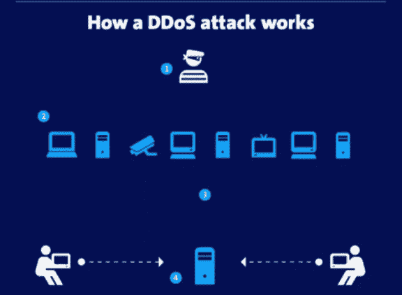

# 5G 驱动僵尸网络 DDoS 攻击

> 原文：<https://medium.datadriveninvestor.com/5g-to-drive-botnet-ddos-attacks-86fa871378dd?source=collection_archive---------4----------------------->

## 5G 技术将提供超快的数据上传和下载速度，通过释放智能手机、平板电脑和智能家居等下一代移动设备的潜力，彻底改变移动数据基础设施和物联网(IoT)生态系统。

你肯定听说过僵尸网络，一种自我传播的形式——感染无辜设备并将其置于中央服务器控制下的恶意软件。然后，受感染的设备被命令和控制服务器操纵来执行分布式拒绝服务(DDoS)攻击。当我们想到僵尸网络时，我们通常只会想到被感染的电脑，它们成为僵尸网络的一部分，一旦僵尸网络足够大，就会被用来发动网络攻击。它依靠僵尸网络恶意软件的传染性来感染成千上万的设备，用来创建僵尸军队，并向其预定目标发送大量的互联网流量。

随着 5G 网络的引入，连接速度将导致 DDoS 攻击和网络攻击等安全威胁的增加。依赖互联网开展业务的组织将不得不适应 5G 带来的日益增加的网络风险。报告强调了与过去一年 DDoS 武器增加相关的一些关键观察结果。

众所周知，很明显，基于物联网的 DDoS 攻击时代不仅即将到来，而且已经处于早期阶段。黑客已经开发了一种专门针对物联网设备的全新恶意软件。不幸的是，物联网爆炸还允许攻击者攻击易受攻击的连接设备，以便它们可以被感染恶意软件的连接设备用作网络，向目标服务器发送大量请求。

随着隐私泄露和其他网络攻击成为今年的头条新闻，僵尸网络也受到了关注。顶级物联网恶意软件已经达到了全球臭名昭著的程度。

 [## 认知计算——一套被广泛认为是……

### 作为它的用户，我们已经习惯了科技。这些天几乎没有什么是司空见惯的…

www.datadriveninvestor.com](https://www.datadriveninvestor.com/2020/02/19/cognitive-computing-a-skill-set-widely-considered-to-be-the-most-vital-manifestation-of-artificial-intelligence/) 

随着互联网连接设备(IoT)数量的增长，等待黑客利用的潜在网络入口的数量也在增长。不幸的是，许多物联网设备都有弱密码，这些弱密码是由粗心的用户造成的，他们经常无法更改设备上的默认密码。通过僵尸网络，用户通常不会意识到他们的设备是一个复杂的僵尸网络的一部分，该网络会感染其他设备，无论是计算机、手机、平板电脑还是智能家居设备。

越来越多的不安全物联网设备意味着网络攻击者可以利用它们渗透企业网络，并创建僵尸网络来发起拒绝服务(DDoS)攻击。5G 使用软件定义的网络(SDN)来创建单独的虚拟网络。

多种基于软件的网络接口增加了可以识别网络攻击者的人数和流量类型，并为他们提供了更多的目标。当更强大的智能设备上线时，托管它们的网络具有更大的攻击区域，使得分布式拒绝服务(DDoS)攻击更加有效。它还增加了使用设备对其他目标实施有害 DOS 攻击的能力。

在最高级别，物联网中的信任基于设备硬件和软件配置的可信度。由人工智能和机器学习支持的新兴网络安全模型可以帮助识别行为异常和技术，改善攻击流量的过滤，并通过在早期检测到威胁时对事件做出响应，以自动化的方式防止未来的 DDoS 利用。用户数据报协议(UDP)伪造目标 IP 地址，并利用服务器中的漏洞触发反射响应。攻击者利用 UDP 中的漏洞对目标的网络基础设施发起拒绝服务攻击。

此外，5G 网络增加的带宽意味着未来的僵尸网络可能不需要使用那么多移动物联网设备来瘫痪它们的目标。有人以几十美元的价格租用 DDoS 租赁服务，让任何愿意使用不必要的连接发起自己的破坏的人都可以使用，这确实可能会削弱一个新的复杂网络。

为了打击来自黑暗僵尸网络的攻击，消费者和企业应该检查他们的内部网络，以识别连接的物联网设备，并进行漏洞分析，以便在攻击者之前检测到未打补丁或配置错误的设备。物联网安全设备可以通过检测异常流量来瞄准和防御这种网络级攻击，但它们无法阻止这种攻击。不断修补设备有效地使系统免受成功入侵。

缺乏必要的物联网安全标准来强化物联网设备并使其更不容易受到攻击是一个巨大的行业失败，这使得黑客能够成功和有利可图的僵尸网络攻击。

简而言之，5G 技术将提供超快的数据上传和下载速度，通过释放智能手机、平板电脑和智能家居等下一代移动设备的潜力，彻底改变移动数据基础设施和物联网(IoT)生态系统。

## **引用来源**

*   [https://telecomstechnews . com/news/2019/feb/14/opinion-combat-threat-5g-networks/](https://telecomstechnews.com/news/2019/feb/14/opinion-combat-threat-5g-networks/)
*   [https://small business connections . com . au/security-challenges-of-5g-wireless-technology/](https://smallbusinessconnections.com.au/security-challenges-of-5g-wireless-technology/)
*   [https://www . sc magazine . com/home/opinion/executive-insight/IOT-proliferation-and-discovery-5g-a-perfect-botnet-storm/](https://www.scmagazine.com/home/opinion/executive-insight/iot-proliferation-and-widespread-5g-a-perfect-botnet-storm/)
*   https://www.pentasecurity.com/blog/top-5-botnets-2017/
*   [https://blog . tier point . com/new-cyber security-challenges-5g-IOT-and-ai](https://blog.tierpoint.com/new-cybersecurity-challenges-5g-iot-and-ai)
*   [https://www.corero.com/5g-will-increase-ddos-attack-risk/](https://www.corero.com/5g-will-increase-ddos-attack-risk/)
*   [https://www . techrepublic . com/article/new-botnet-attack-puts-other-IOT-botnets-to-shame/](https://www.techrepublic.com/article/new-botnet-attack-puts-other-iot-botnets-to-shame/)
*   [https://www . a10 networks . com/blog/IOT-and-DDOS-attacks-a-match-made-in-heaven/](https://www.a10networks.com/blog/iot-and-ddos-attacks-a-match-made-in-heaven/)

**访问专家视图—** [**订阅 DDI 英特尔**](https://datadriveninvestor.com/ddi-intel)