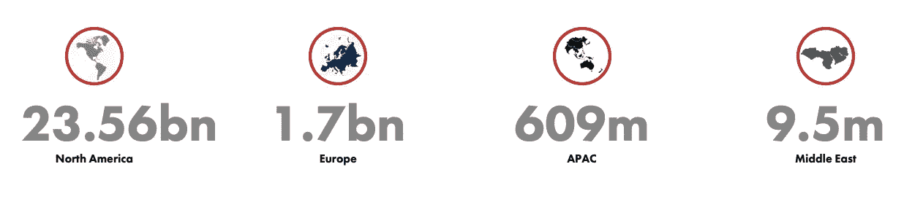

# 第 5 号反洗钱指令——区块链技术如何提供帮助

> 原文：<https://medium.datadriveninvestor.com/5th-money-laundering-directive-how-blockchain-technology-can-help-6755ac786115?source=collection_archive---------12----------------------->

根据路孚特最近对全球 2，373 家组织进行的调查，它发现“*根据我们在世界各地调查的组织，估计因金融犯罪造成的总营业额损失，占其全球营业额的 3.5%，相当于每年 1.4 万亿美元*。”由于金融犯罪产生的大量资金，无论是奴役，毒品，卖淫，运输非法武器，出售人体器官，勒索，恐怖主义(名单还在继续！)，要求组织了解您的客户(KYC)并确保受监管公司在开展业务前进行适当的反洗钱(AML)检查的压力越来越大。

【2008 年至 2018 年全球不同地区违反反洗钱/KYC 的罚款金额

资料来源:Fengro.com

违规罚款并非微不足道。2019 年，仅截至 8 月，就有价值 80.7 亿美元的罚款，是 2018 年同期的 4 倍多。因此，2019 年看起来将是罚款创纪录的一年。因此，毫不奇怪，据估计，2019 年全球公司进行 KYC 和反洗钱检查的成本将超过 320 亿美元。

第 5 号反洗钱指令将于 2020 年 1 月 10 日生效(第 5 号 AMLD)，可能会导致合规成本增加。虽然第五届 AMLD 是由欧洲立法推动的，但英国(除了英国退出欧盟)也将遵守。第五代 AMLD 首次引入了新的变化，现在将包括加密货币和数字资产交易所，这些交易所在与新客户开展业务并提交可疑活动报告之前，必须进行更详细的客户尽职调查。这将使数字交换与其他受英国监管的公司保持一致，这些公司将受《2002 年犯罪收益法》( POCA)和《2000 年反恐怖主义法》的约束。

超过€150 英镑的预付卡和超过€50 英镑的远程支付现在都需要支票。艺术品、珍贵宝石、汽车、历史、文化和考古文物等高价值商品也是第五项反洗钱指令的重点，所有这些商品都必须遵守报告要求和监管规定。未能遵守规定可能导致 500 万€的罚款，相当于公司年营业额的 10%,董事被禁止经营受监管的业务，公司被迫停止交易。

 [## 5 行业转型区块链应用|数据驱动投资者

### 除非你一直生活在岩石下，否则我相信你现在已经听说过区块链了。而区块链…

www.datadriveninvestor.com](https://www.datadriveninvestor.com/2019/02/13/5-real-world-blockchain-applications/) 

毕马威估计，反洗钱/KYC 合规成本实际上可以削减 35%，因为 80%的合规资源用于检查文件，而不是评估风险。总部位于美国的市场情报公司 BIS Research 声称，作为 KYC/反洗钱合规入职和前瞻性监控的一部分，金融机构使用区块链技术可以降低 90%的管理成本。区块链技术将有助于开发更强大和实时的系统和程序，从而解决增加的负担，同时将第五代 MLD 带来的不可避免的成本增加降至最低。毕马威认为，一个私人的、获得许可的区块链平台将允许金融机构与其他组织共享 KYC/反洗钱数据(假设它们已经获得客户的同意)。因此，有可能建立一个更安全的数字系统，而不是基于纸张的系统，而不是依赖于单独和重复的验证过程，从而创建一个可验证的客户数据来源。监管机构没有理由不能在线访问一家机构基于区块链的合规系统来提取报告。通过这种方式，金融系统可以实时展示其法规遵从性。

区块链技术的潜力并没有被那些希望利用其潜力，然后向第三方提供服务的公司所忽视，例如:

• • • •

孔帕尼

封锁通行证

chai 分析

省略的

区块链技术有能力创建一个公司可以信任的记录，记录谁是资产的受益所有人，以及所有权何时转移。这里的关键词是*信任，*也就是说，帮助组织确定他们知道他们在和谁打交道，并且他们可以信任他们的资金来源。理论上，虽然这听起来可能非常压抑，几乎像是一种命令和“控制”类型的经济，但随着越来越多的资产数字化并进入区块链，每个数字资产都应该相对容易拥有一个参考/哈希代码，以确定谁是受益所有人。最佳结果将包括使犯罪分子更难拥有和转移包括现金在内的资产，从而使信息的监控和检查更快、更有效和高度合规。