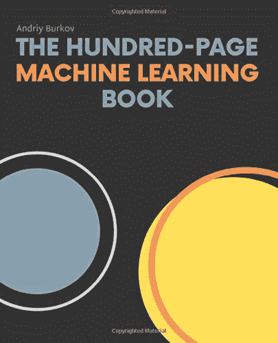
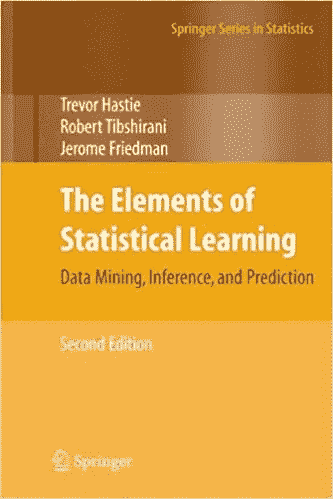
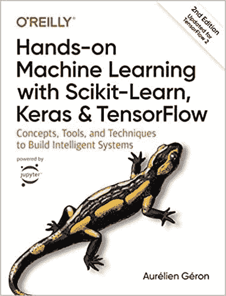
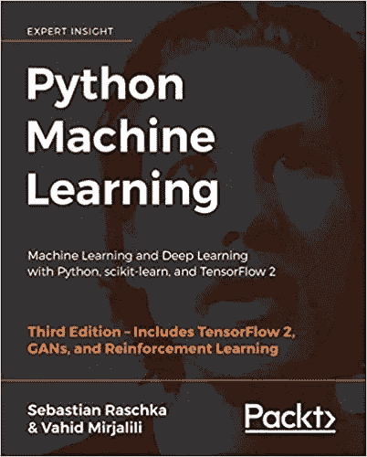
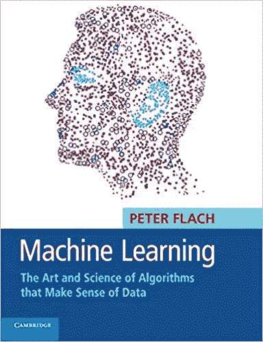
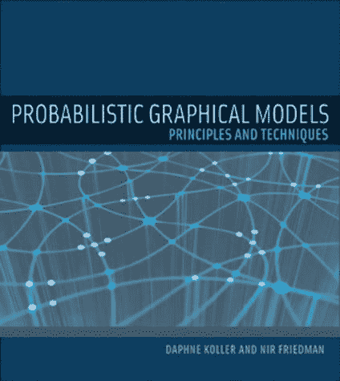

# 机器学习工程师应该读的 6 本书

> 原文：<https://medium.datadriveninvestor.com/6-books-machine-learning-engineers-should-read-973eb278d17c?source=collection_archive---------0----------------------->

## 通过动手练习掌握 ML 的重要概念…

Gif (Source and credits: Giphy)

嗯，说实话——对于初学者来说，ML 和 AI 可能会非常吓人。作为先决条件，你应该能够用 python 或 R 编写一点代码，有一些数学背景，应该能够理解一些基本的 ML 术语。 ***但最重要的是要有正确的机器学习书籍的指导。***

 [## Stack Overflow 分析了来自 60，000 多名软件开发人员的数据，包括他们的工作时间、语言…

### 以下是他们的发现…

medium.com](https://medium.com/datadriveninvestor/stack-overflow-analyzed-data-from-60-000-software-developers-hours-they-work-languages-they-476ac6ca0197)  [## 黑客地球调查了来自 76 个国家的 16000 名开发者——以下是我的发现

### 惊人的洞察力…

medium.com](https://medium.com/datadriveninvestor/hacker-earth-surveyed-16000-developers-from-76-countries-heres-what-i-found-dbd5d7c422b0)  [## Hacker Rank 分析了来自 10 万多名开发人员和招聘经理的数据——以下是我的发现

### 来自 100，000 多名开发人员和招聘经理的出色分析结果

medium.com](https://medium.com/datadriveninvestor/hacker-rank-analyzed-data-from-100k-developers-and-hiring-managers-here-is-what-i-found-a374b98e937e) 

下面是我最喜欢的书的列表—

# 1.[百页机器学习书](https://amzn.to/3a12MwV)

我非常喜欢这本书。这是你需要了解和掌握机器学习概念的书。它用 100 页的篇幅详细解释了各种机器学习主题，其方法非常学术。它得到了知名领导人的认可——谷歌研究总监彼得·诺维格和易贝工程主管苏吉特·瓦拉克赫迪。

[The Hundred-Page Machine Learning Book](https://amzn.to/3a12MwV) (Image source and Credit: Amazon books)

谁能读这本书:成长为有经验的 ML 工程师

**涵盖的主题—**

监督和非监督学习

支持向量机

神经网络、集成方法、梯度下降、聚类分析、降维、自动编码器和迁移学习

特征工程和超参数调整

**作者** —安德烈·布尔科夫

# 关于作者—

安德烈是两个孩子的父亲，也是加拿大魁北克市的机器学习专家。他拥有人工智能博士学位，一直在 Gartner 领导一个机器学习开发人员团队。

他的专长是自然语言处理和对话界面。他的团队致力于利用浅层和深度学习技术，为生产建立最先进的多语言文本提取和标准化系统。

**作者 Github**:[https://github.com/aburkov](https://github.com/aburkov)

***拿过来:***[https://amzn.to/3a12MwV](https://amzn.to/3a12MwV)

# 2.[统计学习的要素:数据挖掘、推理和预测](https://amzn.to/3b3JWXf)

如果你喜欢统计学，并且想从统计学的角度学习 ML，那么这本书是一个有价值的资源。这本书强调数学推导来解释机器学习算法的基本概念。这本书的先决条件是彻底了解统计和线性代数。

[The Elements of Statistical Learning: Data Mining, Inference, and Prediction](https://amzn.to/3b3JWXf) (Image source and Credit: Amazon books)

作者— 特雷弗·哈斯蒂、罗伯特·蒂布拉尼和杰罗姆·弗里德曼

**谁能看这本书:**体验 ML 工程师。

**涵盖的主题—**

监督学习和非监督学习。

神经网络、支持向量机、分类树和 boosting

图形模型、随机森林、集合方法、最小角度回归和套索路径算法、非负矩阵分解和谱聚类。

**关于作者—**

特雷弗·哈斯蒂、罗伯特·蒂布拉尼和杰罗姆·弗里德曼是斯坦福大学的统计学教授。Hastie 和 Tibshirani 开发了广义加法模型，并写了一本同名的畅销书。Hastie 参与开发了 R/S-PLUS 中的大部分统计建模软件和环境，并发明了主要曲线和曲面。Tibshirani 提出了套索，并且是非常成功的《自助入门》的合著者。弗里德曼是许多数据挖掘工具的共同发明人，包括 CART、MARS、投影寻踪和梯度推进。*(来源:施普林格)*

***拿到这里:***[https://amzn.to/3b3JWXf](https://amzn.to/3b3JWXf)

 [## 10 个“硅谷”的俏皮话/双关语是如此有趣、贴切且与技术世界相关

### 虽然听起来很搞笑…

naina0412.medium.com](https://naina0412.medium.com/10-silicon-valley-liners-puns-that-are-so-funny-apt-relatable-to-the-tech-world-a2ee797f7949) 

# 3.[动手机器学习 Scikit-Learn，Keras & TensorFlow](https://amzn.to/2yNC7Xt)

动手练习和实施与彻底理解概念同样重要。这本书通过提供关于神经网络的详细理论和实践，确保你可以玩代码、例子和建立你自己的神经网络。信息涵盖的广度相当广泛，文字非常清晰，易于阅读，用无可挑剔的英语书写。这本书假设你是一个对机器学习几乎一无所知的绝对初学者，想要学习机器学习的错综复杂。

[Hands-on Machine Learning Scikit-Learn, Keras & TensorFlow](https://amzn.to/2yNC7Xt) (Image source and Credit: Amazon books)

**作者—** 奥雷连·盖伦

谁能读这本书:初学 ML 的爱好者/工程师

**涵盖的主题—**

使用 Scikit-learn 的端到端机器学习项目

深入研究神经网络架构，包括卷积网络、递归网络和深度强化学习

详细探索神经网络，训练和扩展深度神经网络的技术

探索支持向量机、决策树、随机森林和集成方法

如何使用 TensorFlow 库来构建和训练神经网络

**关于作者—**

Aurélien Géron 是一名机器学习顾问和培训师。作为一名前谷歌员工，他是 YouTube 视频分类团队的产品经理..他还是 Wifirst 的创始人和首席技术官，以及两家咨询公司 Polyconseil(电信、媒体和战略)和 Kiwisoft(机器学习和数据隐私)的创始人和首席技术官。

***作者 Github***——[https://github.com/ageron](https://github.com/ageron)

***拿到这里:***[https://amzn.to/2yNC7Xt](https://amzn.to/2yNC7Xt)

# 4. [Python 机器学习:使用 Python、scikit-learn 和 TensorFlow 进行机器学习和深度学习](https://amzn.to/2xhutV8)

这是我开始学习机器时买的第一本书，我一点也不后悔。这本书的美妙之处在于它非常注重实用的代码示例。如果你知道一些 Python，并且你想使用机器学习和深度学习，那么拿起这本书。这本书是为想要构建实用的机器学习和深度学习代码的开发人员和数据科学家以及任何想要教计算机如何从数据中学习的人编写的。Raschka 和 Mirjalili 这本书的作者将困难的概念分解成外行人在真实世界环境中构建和学习这些代码/示例时可以容易理解的语言。

[Python Machine Learning: Machine Learning and Deep Learning with Python, scikit-learn, and TensorFlow](https://amzn.to/2xhutV8) (Image source and Credit: Amazon books)

**作者—** 塞巴斯蒂安·拉什卡和瓦伊德·米尔贾利利

谁能阅读这本书:初学 ML 的爱好者/工程师

**涵盖的主题—**

了解如何将机器学习应用于图像分类、情感分析、智能网络应用等

掌握使机器能够从数据中学习并使用回归分析预测连续目标结果的框架、模型和技术

使用 Scikit-learn 进行机器学习，使用 TensorFlow 进行深度学习，了解评估和调整模型的最佳实践

***建立和训练神经网络，GANs 等***

了解如何使用社交媒体数据进行情感分析

**关于作者—**

Sebastian Raschka 是威斯康星大学麦迪逊分校的统计学助理教授，专注于机器学习和深度学习研究。他最近的一些研究方法已被应用于解决生物统计学领域的问题，以将隐私赋予人脸图像。他的研究重点领域包括机器学习中模型评估相关方法的开发、有序目标的深度学习以及机器学习在计算生物学中的应用。

***作者 GitHub****——*[https://github.com/rasbt](https://github.com/rasbt)

Vahid Mirjalili 获得了机械工程博士学位，研究大规模分子结构计算模拟的新方法。目前，他正在密歇根州立大学计算机科学与工程系重点研究机器学习在各种计算机视觉项目中的应用。他最近以研究科学家的身份加入了 3M 公司，在那里他利用自己的专业知识，应用最先进的机器学习和深度学习技术来解决各种应用中的现实问题，让生活变得更美好。

***作者 Github—***[https://github.com/vmirly](https://github.com/vmirly)

***拿过来:***[https://amzn.to/2xhutV8](https://amzn.to/2xhutV8)

## [5。机器学习:理解数据的算法艺术和科学](https://amzn.to/3cekezu)

这本书很难读，但最终，它是值得的。这本书的作者使用了基于示例的方法，从讨论垃圾邮件过滤器如何工作开始，这直接介绍了机器学习的作用，而没有给出很多技术细节的重要性。这本书有很多数学术语，需要对线性代数有透彻的理解。

[**Machine Learning: The Art and Science of Algorithms that Make Sense of Data**](https://amzn.to/3cekezu) **(**Image source and Credit: Amazon books**)**

**作者—** 彼得·弗莱克

**谁能读这本书—** 初学者到有经验的机器学习工程师

**涵盖的主题—**

主要的焦点被给在包括一个广泛的逻辑，几何和统计模型和最先进的主题，例如矩阵分解和 ROC 分析。

**关于作者—**

彼得·弗莱克是布里斯托尔大学的人工智能教授。他的主要研究领域是挖掘高度结构化的数据以及使用 ROC 分析评估和改进机器学习模型。他也是机器学习杂志的主编。

***拿到这里:***【https://amzn.to/3cekezu】T4

## [6。概率图形模型:原理和技术(自适应计算和机器学习系列)](https://amzn.to/2VnGCQd)

我喜欢这本书，因为这本书统一了人工智能中使用的许多不同类型的概率模型。这本书涵盖了各种模型，从贝叶斯网络，无向马尔可夫网络，离散和连续模型，以及处理动态系统和关系数据的扩展。概率图形模型是使用概率分布来表示复杂领域的强大框架，在机器学习、计算机视觉、自然语言处理和计算生物学中有许多应用。

[**Probabilistic Graphical Models: Principles and Techniques (Adaptive Computation and Machine Learning series)**](https://amzn.to/2VnGCQd) **(**Image source and Credit: Amazon books**)**

**作者—** 达芙妮·柯勒和尼尔·弗里德曼

**谁能读这本书—** 有经验的机器学习工程师

**涵盖的主题—**

贝叶斯网络，无向马尔可夫网络，离散和连续模型

概率图形模型

**关于作者—**

达芙妮·柯勒是斯坦福大学计算机科学系的教授。她的主要研究重点是使用概率模型和机器学习来理解涉及大量不确定性的复杂领域。*(来源:斯坦福人工智能实验室)*

Nir Friedman 是希伯来大学计算机科学与工程系的教授。他感兴趣的领域是——概率模型中的推理和学习，涉及表示、推理和贝叶斯网络及相关表示的学习，以及概念学习、数据挖掘的应用。计算生物学，专注于应用概率模型来理解生物系统和分析从生物来源收集的数据，如蛋白质和 DNA 序列。*(来源:斯坦福人工智能实验室)*

**【https://amzn.to/2VnGCQd】拿过来:** [拿过来](https://amzn.to/2VnGCQd)

注意:这篇文章包含附属链接。

# 想看程序员幽默？

 [## 编程幽默第 2 部分

### 继续笑，因为太搞笑了…

medium.com](https://medium.com/datadriveninvestor/programming-humor-part-2-f92cf5a26f2b)  [## 史上最搞笑的代码注释

### 程序员幽默:是的，实际上是程序员写的！

medium.com](https://medium.com/datadriveninvestor/the-most-hilarious-code-comments-ever-bae3cb1030b5)  [## 编码原罪:令人捧腹的开发者自白

### “白板”是如何被嘲笑的

medium.com](https://medium.com/datadriveninvestor/coding-sins-hilarious-developer-confessions-f55eb342454e)  [## 10 个让你着迷的诙谐编程笑话

### 这些太搞笑了…

medium.com](https://medium.com/datadriveninvestor/10-witty-programming-jokes-that-will-make-you-go-rofl-a53fbfb91943) 

# 推荐文章-

 [## Python 迭代器、生成器和装饰器变得简单

### 快速实施指南

medium.com](https://medium.com/python-in-plain-english/python-iterators-generators-and-decorators-made-easy-659cae26054f)  [## 你应该知道的 23 种数据科学技术！

### 使用这些技巧来节省你的宝贵时间

medium.com](https://medium.com/ai-in-plain-english/23-data-science-techniques-you-should-know-61bc2c9d1b3a)  [## 编码原罪:令人捧腹的开发者自白

### “白板”是如何被嘲笑的

medium.com](https://medium.com/datadriveninvestor/coding-sins-hilarious-developer-confessions-f55eb342454e)  [## 面向数据科学家的 5 项酷炫先进熊猫技术

### 使用这些技巧…

medium.com](https://medium.com/datadriveninvestor/5-cool-advanced-pandas-techniques-for-data-scientists-c5a59ae0625d)  [## Stack Overflow 分析了来自 60，000 多名软件开发人员的数据，包括他们的工作时间、语言…

### 以下是他们的发现…

medium.com](https://medium.com/datadriveninvestor/stack-overflow-analyzed-data-from-60-000-software-developers-hours-they-work-languages-they-476ac6ca0197)  [## 高级 Python 变得简单—第 4 部分

### 使用这些技巧和技术…

medium.com](https://medium.com/datadriveninvestor/advanced-python-made-easy-part-4-a4996ba9fe19)  [## 高级 Python 变得简单—第 1 部分

### 使用这些技巧和技术…

medium.com](https://medium.com/datadriveninvestor/advanced-python-made-easy-part-1-ce1e2f17431e) 

# **如果你喜欢这篇文章，别忘了在下面鼓掌—**

***感谢阅读。继续学习！！***

**访问专家视图—** [**订阅 DDI 英特尔**](https://datadriveninvestor.com/ddi-intel)