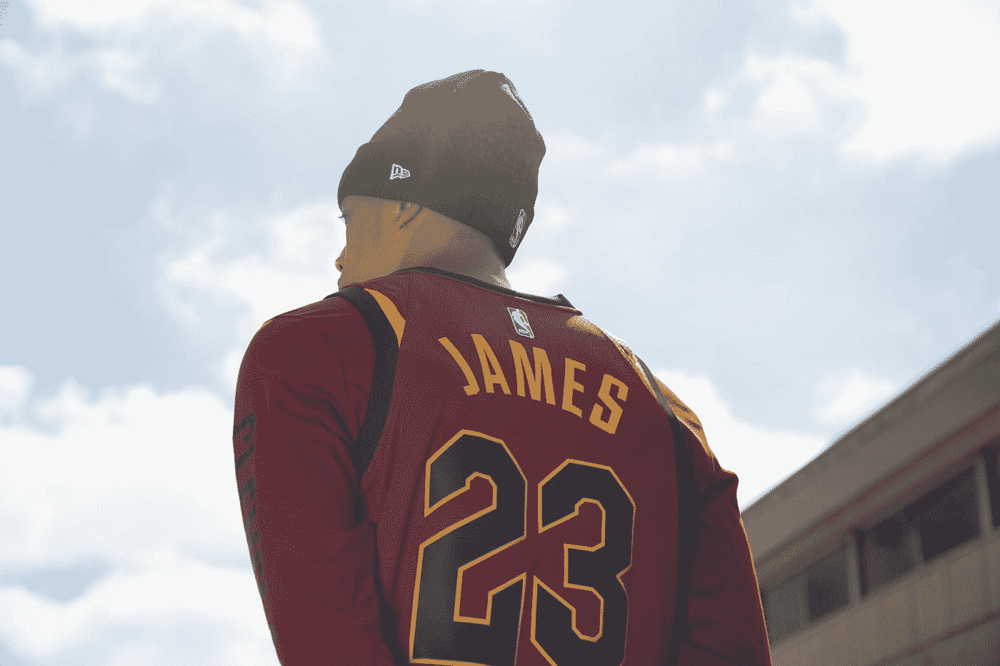

# 剖析勒布朗·詹姆斯创业历程的 6 条商业经验

> 原文：<https://medium.datadriveninvestor.com/6-business-lessons-from-dissecting-lebrons-entrepreneurial-journey-dac484ee3546?source=collection_archive---------7----------------------->

詹姆斯国王如何从一名 NBA 全明星球员成为一名全明星企业家

Photo by [Project 290](https://unsplash.com/@project290?utm_source=medium&utm_medium=referral) on [Unsplash](https://unsplash.com?utm_source=medium&utm_medium=referral)

众所周知，职业运动员和彩票中奖者一样不善于理财。从迈克·泰森、丹尼斯·罗德曼到文斯·杨，曾经高薪的运动员破产的例子不胜枚举。退役后，很少有运动员转为商人。其中一小部分人获得了成功。勒布朗·詹姆斯在这里脱颖而出，他不是 NBA 历史上最伟大的球员之一，同时他表现出高度的商业头脑。从高中时拒绝锐步(Reebok)2800 万美元的支票，到寻求与代言品牌的合作，购买企业股份，再到创建自己的媒体公司，詹姆斯国王可以教给我们很多关于创业和业务增长的知识。在这篇文章中，我们详细介绍了勒布朗在职业生涯中做出的著名商业决策，以及他是如何将自己变成一名精明的商人的。

# **#1。关注长期目标而不是短期收益**

勒布朗·詹姆斯在俄亥俄州阿克伦市的贫民区长大。作为一名高中生，勒布朗是历史上最受期待的 NBA 前景之一。体育明星，甚至耐克的联合创始人菲尔·奈特在高中时也来看他的比赛。对于他家乡的高中球队来说，将比赛从他们的小体育馆转移到更大的体育馆并不罕见，因为所有比赛的门票都持续销售一空。鞋业高管非常希望詹姆斯穿上他们品牌的标志。阿迪达斯向他提供了 6000 万美元的合同，耐克提供了 8700 万美元的合同，锐步愿意向他提供高达 1.15 亿美元的合同。对于一个年轻的篮球运动员来说，这些数字是非常高的——相比之下，科比·布莱恩特连续三年赢得 NBA 总冠军，同年只从耐克公司获得了一份 4000 万美元的四年合同。

锐步希望将勒布朗·詹姆斯加入他的运动员名单，包括沙奎尔·奥尼尔、阿伦·艾弗森和维纳斯·大威廉姆斯。由于与迈克尔·乔丹的合作，耐克当时是 NBA 领先的鞋类品牌。勒布朗决定与耐克签约，耐克给他的报价低得多，他错过了额外的 2800 万美元。詹姆斯国王的长远眼光得到了回报。2015 年，他与耐克签下了一份估计价值 10 亿美元的终身合约。这是该公司历史上第一份此类合同。与此同时，锐步确实在 2019 年停止了对 NBA 球员的赞助。勒布朗后来称这是他做过的最好的商业决定。

> 他说:“我打算做一笔终身交易，你不会考虑第一张支票，你会考虑所有的支票。”这是将勒布朗塑造成今天的他的商业思维的最初迹象。

# **#2。支持合作而非认可**

当勒布朗加入联盟后，他继续与可口可乐和麦当劳等更多公司签署营销协议。到 2003 年底，他是世界上第四高的运动员。只有泰格·伍兹、迈克尔·舒马赫和大卫·贝克汉姆的收入比他们高。在联盟的第二个赛季结束时，勒布朗承担了他最大的商业风险，让他的经纪人走自己的路，与他的三个家乡朋友一起创建了一家营销代理公司。他决定掌控自己的商业决策，这让他能够塑造向公众描绘的故事。NBA 的精英企业当时认为这是一个可怕的想法。

勒布朗接近了保罗·沃希特，他是阿诺德·施瓦辛格的顾问，并帮助他成为这个星球上最知名的人之一。勒布朗从保罗那里得到的最值得注意的建议是，他应该寻求合作伙伴，而不是代言。没错，代言可以带来高额的一次性报酬，但从长远来看，合作可能会有更大的回报，因为运动员可以获得公司的一部分利润。勒布朗决定，如果一家公司不愿意接受合作伙伴关系，他不会简单地与他们合作。

# **#3。购买公司股份 Dr Dre Beats 交易**

2006 年，勒布朗·詹姆斯被介绍给 Beats by Dre 的联合创始人吉米·洛温和德瑞医生。这两人想与詹姆斯合作，以促进公司的销售。同样，勒布朗没有与 Beats 达成赞助协议，在公开场合佩戴耳机将获得固定金额的报酬，而是与该公司建立了合作伙伴关系，其中包括该公司的所有权股份。

勒布朗·詹姆斯(Lebron James)想出了一个绝妙的主意，在美国篮球队前往 2008 年奥运会期间，在从美国到北京的 21 个小时的飞行中，他给每个队员都提供了一副 Beats 耳机。当团队抵达中国面对镜头时，所有团队成员都戴着 Beats 耳机。这一事件引起了巨大的轰动，推动了公司的销售。Beats 最终在 2014 年被苹果以 30 亿美元的估值收购。这笔交易为勒布朗·詹姆斯净赚了 3000 万美元。这是另一个例子，证明从长远来看，拥有股票比背书支票更有经济回报。

# **#4。购买和建造——投资 Blaze 披萨连锁店**

勒布朗·詹姆斯多年来一直出现在麦当劳的广告中。当他与快餐连锁店的合同在 2017 年到期时，他拒绝了利润丰厚的 1500 万美元，而是决定加倍投资披萨连锁店 Blaze。与他对 Beats 的投资类似，勒布朗也对所有权感兴趣。此外，詹姆斯获得了两个特许经营点的所有权。据《福布斯》报道，他现在拥有 21 家特许经营店。

Blaze Pizza 成为美国发展最快的快餐连锁店。该公司计划建造 100 至 150 家餐厅，并进行国际扩张。据《ESPN》报道，莱邦的投资至少价值 4000 万美元。

# **#5。拥有一支运动队——获得利物浦足球俱乐部 2%的股份**

勒布朗·詹姆斯总是公开谈论他想拥有一支 NBA 球队的愿望。话虽如此，NBA 规则禁止现役球员拥有球队股份。然后他把注意力转向了足球是最受欢迎的运动的欧洲。詹姆斯设法收购了英格兰超级联赛足球俱乐部利物浦足球俱乐部 2%的股份。自此次收购以来，该俱乐部赢得了欧洲冠军联赛冠军，2019 年的估值接近 20 亿美元。这意味着詹姆斯的股份价值超过 3000 万美元。

# **#6。垂直整合，去掉中间商——为运动员创办媒体代理**

当勒布朗·詹姆斯在 2014 年从迈阿密热火队转会到克利夫兰骑士队时，他已经给《体育画报》的读者写了一封信，解释了他转会的原因。

> 在那篇文章中，他说:“我写这篇文章是因为我想要一个不受干扰地解释自己的机会”。

他不知道这就是创办一家媒体机构的动机，在这里运动员可以自由表达自己，分享自己的想法，而不会被“打断”。他们与他的商业伙伴马华力·卡特于 2014 年创办了这家机构，并称之为“不间断”。该机构于 2014 年开始录制 NFL、UFC 和 NBA 中备受瞩目的运动员的视频见证。2015 年 2 月，该机构从华纳兄弟获得了 1600 万美元的资金，用于与更多运动员开展活动。“不间断”现在与大西洋两岸的数十名运动员合作。

由于与华纳兄弟的合作，勒布朗·詹姆斯已经获得了《太空堵塞 2》的主要角色，这是 1997 年迈克尔·乔丹主演的电影的续集。这部电影预计将于 2021 年上映，预计会大受欢迎。