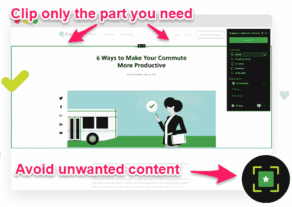
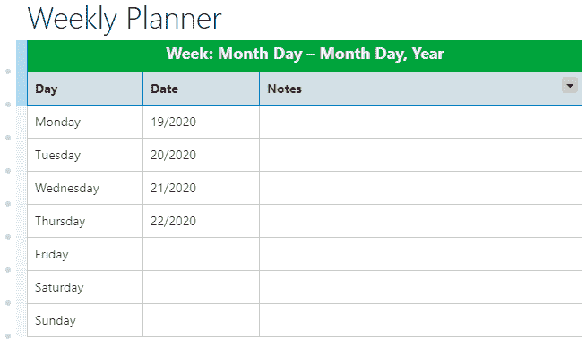
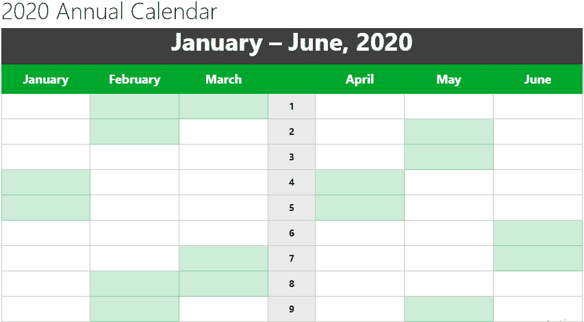

# 使用 Evernote 提高内容营销效率的 6 种简单方法

> 原文：<https://medium.datadriveninvestor.com/6-easy-ways-to-use-evernote-to-increase-your-content-marketing-productivity-76a45437c048?source=collection_archive---------5----------------------->

Photo by [Pixabay](https://www.pexels.com/@pixabay) from [Pexels](https://www.pexels.com/photo/man-creating-a-presentation-on-laptop-3153204/?utm_content=attributionCopyText&utm_medium=referral&utm_source=pexels)

你在用 Evernote 来扩大你的营销组合吗？你想知道如何使用 Evernote 来提高工作效率和增强你的营销策略吗？这篇文章适合你。

我是一名数字营销人员，专注于内容营销，包括:

*   博客
*   电子邮件
*   视觉内容(视频、信息图表等。)
*   播客
*   电子书
*   社交媒体帖子
*   铅磁体
*   白皮书
*   清单

因此，我有更多的日常任务要为我的博客和客户完成。但是，为了完成更多的工作，我需要有条理，在一个结构良好、井然有序的环境中工作。这是提高生产率和完成更多工作的唯一途径。

例如，看看社交媒体，它是一列快速行驶的火车，有大量数据需要处理。然而，你不仅要努力吸收这些信息，而且还要与你的目标受众、顾客和潜在客户保持联系。

 [## 跑步摆脱疯狂:锻炼如何提高你的生产力|数据驱动的投资者

### 没有比锻炼更好的方式来开始一天的工作了。我试着一周至少做四天，在…

www.datadriveninvestor.com](https://www.datadriveninvestor.com/2018/10/23/running-to-get-rid-of-the-crazy-how-working-out-increases-your-productivity/) 

实际上，你必须保持有组织性来完成你的任务，否则你会精疲力尽。尽管如此，让我们讨论一下为什么你需要这个生产力软件。

# 为什么营销人员应该考虑使用 Evernote

一个原因是 Evernote 可以在所有平台上运行——智能手机、平板电脑、个人电脑等等。它使用户能够在设备之间同步笔记和文件。此外，EN 是一个软件应用程序，其功能相当于个人数字助理(PDA)。

该应用程序可以在以下方面为您提供帮助:

*   做笔记
*   创建待办事项列表
*   开发内容日历
*   计划发布内容
*   分配任务
*   在项目上合作，等等。

您不必担心从哪里访问您的内容。因为，有了这个工具，你所有的笔记和其他贵重物品都在一个地方。它们在不同设备和操作系统之间自动同步。所以让我们进入文章的核心部分。

**以下是如何使用 Evernote 提高生产力和营销策略的六种方法。**

# 1.用 Evernote 创建资源库

使用 Evernote 建立一个可行的资源库，您可以在其中保存您最有价值的资料。它可以是任何内容，例如:

*   策划内容片段
*   视觉材料
*   草稿
*   参考链接
*   客户列表
*   网页
*   pdf
*   电子邮件地址等等。

这些材料在你的 Evernote 账户中是安全的，并且可以在网络上的任何地方访问。[工具将帮助你保持有序](https://www.mossmedia.biz/editorial-calendar-tools/)。而且，点几下就能快速找到自己需要的东西。它是这样工作的:

Screenshot via Evernote

通过 Evernote 截图

当你在网上发现有帮助的内容时，将文章剪辑到 Evernote 并保存。你可以选择保存整页材料，或者只保存对你最有用的部分(见截图)。它让你摆脱广告和其他不想要的内容。

# 2.建立内容营销日历

你知道吗？您可以轻松地创建一个内容日历来增强您的营销活动。Evernote 可以让你制作每日待办事项清单、每周、每月和每年的内容营销计划。好处是你可以把 Evernote 和其他第三方工具集成在一起，比如:

*   谷歌日历
*   Microsoft Exchange
*   办公室 365
*   苹果日历
*   Outlook.com

该软件与上述工具配合得非常好。此外，在建立 Evernote 日历连接器后，所有内容将跨平台自动更新。看看现成的周历和年历模板:

Calendar via Evernote

通过 Evernote 截图

您可以访问该网站并调整您的模型，以满足您每天、每周、每月和每年的内容营销需求。

Template via Evernote

通过 Evernote 截图

下面是要做的 **:**

1.  用日常工作建立一个笔记本
2.  为每周和每月任务创建另一个日志
3.  计划社交媒体更新
4.  规划内容创建和发布策略
5.  起草内容推广和分发策略

现在，您已经为无缝营销活动做好了准备。但是，您可以使用其他软件进一步简化流程。例如，在计划好你的社交媒体营销策略后，你可以使用社交媒体工具来安排和发布你的帖子。

你所需要做的就是获得你为不同的社交媒体网站计划的内容，并将其粘贴到你首选的社交媒体工具中进行发布。它将帮助你保持一致性，提高生产力，[建立信任](https://www.mossmedia.biz/build-brand-trust/)，增加收入。

# 3.使用 Evernote 保存研究资料

尽管你有不同的选择来保存研究资料，比如 Google Sheets，事实上，这是我的最爱之一，你也可以在 Evernote 中保存你的研究工作。记住，在上面的部分中；我们谈到了创建资源库。

但在这里，你可以创建一个笔记本系统来帮助你组织你的主题材料，以便安全保存和快速访问。但是，请注意，您不仅可以保存您的研究项目，还可以保存您在网上找到的任何内容。

这个过程可以让你快速找到想要的资料。因此，你将增加产量并避免营销中的生产率挑战。

# 4.产生博客内容创意

如果你没有让读者兴奋的奇思妙想，你就无法为他们提供价值。因此，这个软件可以帮助你为你的博客和客户产生史诗般的内容创意，从而加强你的内容营销策略。

因此，你可以创建一个博客主题创意库，当你遇到写作瓶颈时可以使用。因此，在 Evernote 中建立一个笔记本，在那里你将保存一个内容想法的列表。请不要误会我。你可以使用其他工具来保存你发现的博客创意。

我使用 Word 文档和谷歌电子表格。所以你可以选择任何你觉得更方便使用的软件。但是我们关注 Evernote 是因为主题是关于如何用 Evernote 提高生产力和营销。也就是说，你可以在这个工具中保存来自互联网上任何来源的想法。

你的[博客文章创意](https://www.mossmedia.biz/blog-topic-ideas/)可能来自任何地方；它可能来自看新闻、听播客、读电子邮件或博客内容。因此，当你在网上时，你可以使用 Evernote Web Clipper 收集不同的信息，并把它们转移到你的帐户上，这样你就可以在任何需要的时候访问它们。

该软件让你只需点击几下鼠标，就可以将你从电子邮件、博客内容和其他网络材料中产生的想法提交给 Evernote。但对于那些你在听播客和看新闻或电影时获得的信息，你必须做笔记，然后把它们发送到你的 EN 账户。

# 5.通过 Evernote 提醒保持最新状态

数字营销不断发展，需要消化大量数据。因此，由于短暂的记忆或缺乏系统的安排，可能会令人沮丧并容易丢失重要的信息。例如，假设你是一个有影响力的人，或者有一个[有影响力的营销机构](https://shanebarker.com/blog/influencer-marketing-agencies/)，正在帮助你的客户成长。

你最重要的职责之一就是记住重要的信息。例如，截止日期对客户来说至关重要，你应该记住这一点。此外，与客户会面、发布时间表和其他重要任务对你的成功至关重要。

这就是为什么你需要一个提醒来帮助你及时了解重要的事情。有鉴于此，可以设置 Evernote 提醒，及时了解商务会议和时间表。该软件可以让你为你所有的笔记/笔记本添加提醒。

因此，通过在笔记、日期和通知中添加 Evernote 提醒，你将不会错过任何截止日期或约会。你将在数字营销中变得更加高效。

# 6.在 Evernote 上做一个清单

您的企业需要标准操作程序(SOP)吗？是的。为什么？因为它使员工、营销团队或单个营销人员能够遵守设定的标准，无缝地执行复杂的操作。

SOP 是具体的操作步骤指南，确保根据公司标准生产一致的产品。由于创意是成功的内容策略的一部分，你需要在你的[营销策略](https://www.mossmedia.biz/marketing-strategy/)中加入一个 SOP。

这就是创建清单的用武之地。你的推荐人列表是你的 SOP，可以帮助你变得更有效率和生产力。它帮助你制作出符合业务需求的高质量内容，并与你的买家角色相联系。

Video via Evernote

因此，通过创建一个清单和后续步骤，您将产生一致的和可预测的结果，因为清单告诉团队成员要采取的行动。这一过程将帮助您确保您创建的每一项内容都符合公司制定的标准。

例如，作为一个博客作者和内容营销者，我有一个方法来创建符合我的目标的吸引人的博客帖子。我坚持我的清单。因此，如果你像我一样，你可以制作一个记录列表，在你营销过程的每个阶段都有一个勾号框。

Evernote 可以帮助你点击几下鼠标。之后，您可以将清单分发给协作者和团队成员，以确保内容创建过程中的一致性。

# 总结如何使用 Evernote 来提高生产力和营销

这就是我们如何使用 Evernote 应用程序来提高生产力和营销的地方。这些是使用软件帮助你组织营销工作、提高生产力和增加收入的一些策略。

还有谁在使用这个工具？请在评论中告诉我们你的建议和见解。

*本文首发于*[*https://mossmedia . biz*](https://mossmedia.biz/how-use-evenote/)