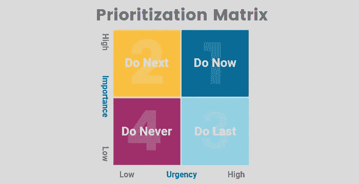

# 开发人员提高工作效率的 6 个有效技巧

> 原文：<https://medium.datadriveninvestor.com/6-effective-tips-for-developers-to-maximize-productivity-33a9159b564?source=collection_archive---------20----------------------->

Source: insidesmallbusiness.com.au

> 蒂姆·费里斯
> 
> ***专注于高效而不是忙碌*。”****

*我们今天很多人都把' ***【忙碌的*** '和' ***高效的*** '混为一谈。*

*忙碌仅仅意味着你没有太多的空闲时间，因为工作日志中有大量的任务需要你去完成。*

*高效是指你做高质量的工作来完成你的重要任务或更接近你的目标。*

**

*Source: fathers.com.sg*

*成为一名程序员意味着你有很多事情要做。然而，如果你花太多时间阅读电子邮件或重复重复性的任务，你可能会变得很忙，没有多少生产力可言。*

*作为一名开发人员，你如何变得更有效率，而不仅仅是“忙碌”？*

# *提示 1。知道什么时候按“暂停”*

*写代码可能会变得非常紧张，尤其是连续写几个小时的代码。过一会儿，你会发现自己盯着屏幕，不知道如何解决眼前的问题。*

* [## 干净的代码在软件开发中至关重要——这就是为什么|数据驱动投资者

### 干净的代码是“容易理解和容易改变的”，它是关于对细节的关注。但是开发人员为什么要担心…

www.datadriveninvestor.com](https://www.datadriveninvestor.com/2020/05/27/clean-code-is-crucial-in-software-development-heres-why/) 

生产力和花在屏幕后面的时间不一样——漫无目的地盯着屏幕会给你一种生产力的错觉，但是不要被骗了。

你应该清醒几分钟，因为这肯定会让你重新集中注意力。你可以通过散步、锻炼或跳舞来伸展你的双腿。你甚至可以给自己带些食物或水来离开死亡地点。

一旦回到同一个问题，你就会有一个新鲜的视角！

> ***乔伊斯·惠勒***
> 
> “有时候最好不去管一些事情，暂停一下，编程也是如此。”

# 技巧二。尽可能自动化

世界上的每一份工作都有一些工作过程非常重复的部分，编程也不例外。根据您完成的任务，您还可以自动化编程过程的某些部分。

自动化可以帮助您花更少的时间做手工和耗时的活动。首先，您需要花一些时间来创建脚本来自动完成任务，但是从长远来看，它对您的帮助比您想象的要大。

Source: drsimaging.com

自动化不仅能节省你的时间，还能帮助你在做重要或紧急的事情时保持专注。将工作流程的某些部分自动化肯定会帮助您专注于更重要的任务，因为自动化会处理繁琐的任务。

# 技巧三。优先考虑

这听起来很无聊，但并不是你所有的任务都至关重要。因此，不要认为他们是一样的。

你最重要的任务是那些如果你完成了就会产生最关键结果的任务。

这就是所需要的: ***确定你最重要的任务，并首先完成它们*** *。*

不要让自己被任务压垮——创建一个待办事项列表，优先处理你的日常任务。

Source: proservice.com

养成安排时间优先处理事情的习惯——早上先做最重要的事情。

不要一心多用:一次只专注于一项任务，在进入下一项任务之前完成它。

有时候，帮助你的同事，分担一项复杂任务的负担是可以的，但是，不要太久不去完成这项任务。

在阅读或回复邮件和电话之前，完成你最重要的任务。

# 技巧四。编码前创建一个计划

无论你需要完成哪种类型的任务，头脑风暴和计划都会帮助你保持专注。结果将是确切地知道开发什么和解决问题的最有效的方法。

这可以确保您不会添加任何您认为将来可能有用的不必要的功能。

在开始编码之前，确保你理解了所有的需求——你需要确切地理解你需要构建什么，因为最小的细节都会对你试图实现的解决方案产生巨大的影响。

一旦你做到了这一点，通过将你的问题或特征分解成更小的部分，开始创建一个计划。

考虑到你将要面临的潜在问题，做一些研究，以防万一。

对你的任务要有战略眼光:分析你生产力中的任何问题，并提出解决方案。

应用程序是简单还是复杂并不重要；规划一定会节省你一些时间！

# 技巧五。学习新工具

你就是你所编码的——你所使用的工具定义了你的工作风格或工作特征。尽管你是所用工具的专家甚至大师，你还是应该花些时间学习你感兴趣的新工具。

开发人员肯定有一个特定的关注领域和相应的工具。您可能需要的工具对于每个开发人员来说是完全不同的——Java 开发人员使用的工具与 Python 开发人员不同，等等。

然而，花些时间考虑一下您想了解更多的工具。总是寻找可以减少你完成单调任务的工具。

Source: bigthink.com

如果你通过学习新工具来挑战自己，你的推理会保持敏锐，这在试图解决问题时是至关重要的。

# 提示 6。切断自己与社交媒体的联系

最后一个也是非常重要的提高你工作效率的技巧是切断你与社交媒体的联系，因为这是一个巨大的干扰。

社交媒体订阅没有尽头——一旦你开始滚动，它就变成了一个无尽的陷阱。你可以每隔 15 分钟查看一次新内容，但这只会转移你的注意力，耗尽你本可以用来解决工作中问题的智慧。

如果你不小心，社交媒体会占用你很多时间。每当你分心的时候，就要花两倍的时间来找回你的注意力，而在此期间，什么工作也没做。

因此，试着只在你休息的时候查看你的社交媒体账户。当你掌握了你的社交媒体纪律，你会发现这条建议可能是最能提高你工作效率的一条。

# 概述

生产率的提高需要时间，所以不要期望在短时间内看到巨大的增长。一次专注于一个小技巧，你会发现随着时间的推移，你会变得更有效率。

如果你没有在一天内完成所有的事情，那也没关系。不要让自己总是忙忙碌碌，因为这并不意味着你一定会完成更多的工作。

请记住，忙碌是一种懒惰的思维和无意义的行为，而高效就是高效。

> 福兰兹·卡夫卡
> 
> 生产力就是能够做你以前从未做过的事情。

## 访问专家视图— [订阅 DDI 英特尔](https://datadriveninvestor.com/ddi-intel)*