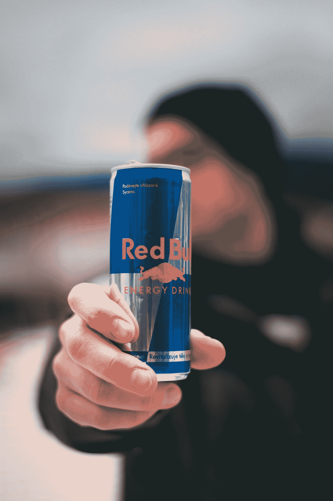

# 6 个你可以借鉴的虚假广告丑闻

> 原文：<https://medium.datadriveninvestor.com/6-false-advertising-scandals-you-can-learn-from-c780c0cbce8b?source=collection_archive---------5----------------------->

Photo by [Jan Kopřiva](https://unsplash.com/@jxk?utm_source=medium&utm_medium=referral) on [Unsplash](https://unsplash.com?utm_source=medium&utm_medium=referral)

新企业家经常被诱惑夸大新产品或服务的能力。难怪:向一位强大的投资者展示一段真相，可能有助于获得首轮融资。

另外，不太严重的是，在很多情况下，一点营销天赋或表演技巧会帮助企业家在没有太多反响的情况下实现自己的目标。

 [## 数据驱动始于数据素养|数据驱动的投资者

### 光是听到“数据”这个词就令人生畏。老实说，只有 21%的全球员工对自己的工作充满信心

www.datadriveninvestor.com](https://www.datadriveninvestor.com/2020/03/22/data-driven-starts-with-data-literacy/) 

但是，在其他情况下，如果你是那个被发现故意误导投资者或消费者的企业家，你可能会面临虚假广告指控——以及你的品牌声誉受损。考虑这六个例子:

# 1.空降部队被自己的伪科学抓住了。

回到 20 世纪 90 年代，草药补充剂风靡一时。它富含维生素和矿物质，被营销人员宣传为能够预防或减轻感冒和流感等常见疾病。最终，公共利益科学中心(CSPI)介入测试制造商的说法，发现没有真正的科学证据支持这些说法。空降同意[支付 2330 万美元和解](https://cspinet.org/news/airborne-agrees-pay-233-million-settle-lawsuit-over-false-advertising-its-miracle-cold-buster)。

# 2.没有。Splenda 不是来自糖。

在 21 世纪初，当时新的人工甜味剂 Splenda 参与了一场营销活动，其口号是“由糖制成，所以尝起来像糖”，以转变其他人工甜味剂的消费者和不愿消费任何人工产品的糖纯化论者。

但是，[正如糖业协会发现的](https://www.cbsnews.com/news/splenda-sugar-sweetener-spat/)，Splenda 并不是真的“由糖制成”，因为它实际上是一种在工厂里经过深度加工的化合物。该协会提起诉讼，最终在庭外秘密解决。Splenda 的竞争对手 Equal 也对这些指控感到愤怒；2007 年，Splenda 被送上法庭，[也达成了秘密和解。](https://www.nytimes.com/2007/04/06/business/media/06sweet.html)

# 3.可悲的是，新百伦鞋不会让你减肥。

早在 2011 年，新百伦推出了一个新系列的鞋子，它声称具有“使用隐藏的平衡板技术，鼓励臀部、股四头肌、腿筋和小腿的肌肉活动，从而燃烧卡路里。”

在最终的集体诉讼中引用的多项研究表明，与步行鞋相比，这种鞋并没有提供任何额外的健康益处，而且[实际上可能会导致伤害](https://www.reuters.com/article/us-shoes-lawsuit/lawsuit-accuses-new-balance-of-false-walking-shoe-ads-idUSTRE7035TP20110104?feedType=RSS&feedName=domesticNews)。不用说，这个案子对新百伦来说不是一个好的公关。任何购买这双鞋的人[都有权获得 100 雷亚尔的退款](https://www.huffingtonpost.com/2012/08/29/new-balance-toning-shoe-settlement_n_1839537.html)，新百伦最终支付了 230 多万美元。

# 4.伪科学二:爆米花不会增强你的免疫系统。

早在 2010 年，凯洛格就错误地声称米饼具有“[免疫增强特性](http://thechart.blogs.cnn.com/2010/06/04/kellogg-settles-rice-krispies-false-ad-case/)”，据称是因为早餐麦片中强化了抗氧化剂、维生素和矿物质。这些说法充其量也是可疑的；美国联邦贸易委员会命令凯洛格停止任何提及这些影响的广告。

2011 年该案达成和解时，家乐氏同意向受影响的客户支付 250 万美元的罚款，并将价值 250 万美元的家乐氏产品捐赠给慈善机构。

# 5.大众汽车放出谎言。

2016 年，美国联邦贸易委员会[对大众](https://www.ftc.gov/news-events/press-releases/2016/03/ftc-charges-volkswagen-deceived-consumers-its-clean-diesel)提起诉讼，声称其部分车辆燃烧清洁的柴油燃料。事实上，大众在排放测试中作弊已经超过七年。这也不是一个简单的错误；大众汽车设计了一款软件，允许车辆在接受测试时进行检测，并故意减少有害废气，作为欺骗测试人员的临时措施。

这起虚假广告丑闻被证明是对大众汽车的巨大打击；这家汽车制造商不仅名誉受损，面临联邦贸易委员会的重大诉讼，还因违反《清洁空气法》面临 900 亿美元的罚款。

# 6.红牛不给你翅膀。

这是一个特别有趣的案例。你可能知道能量饮料红牛的招牌标语:“红牛给你翅膀。”作为一个理性的消费者，你直觉地知道红牛事实上不能给你翅膀——然而这是 2014 年对饮料公司提起诉讼的部分前提。

其他投诉提到红牛声称其饮料可以提高注意力和反应速度。红牛最终和解了 1300 万美元的支付，但表示:“红牛和解诉讼是为了避免诉讼的成本和分心。然而，红牛坚称其营销和标签一直是真实准确的，并否认任何及所有不当行为或责任。

如果你有兴趣了解更多关于广告真实性的法律框架，那么你可以尽可能地不为你的品牌制造问题，美国联邦贸易委员会[有一个关于这个主题的有用的大纲](https://www.ftc.gov/news-events/media-resources/truth-advertising)。

在任何情况下，尽可能接近可证明的客观事实；此外，如果你有任何疑问，请咨询律师，了解在推销你的产品时，你能说什么，不能说什么。

更多类似的内容，一定要看看我的播客， [*企业家阵容*](https://theentrepreneurcast.com) ！