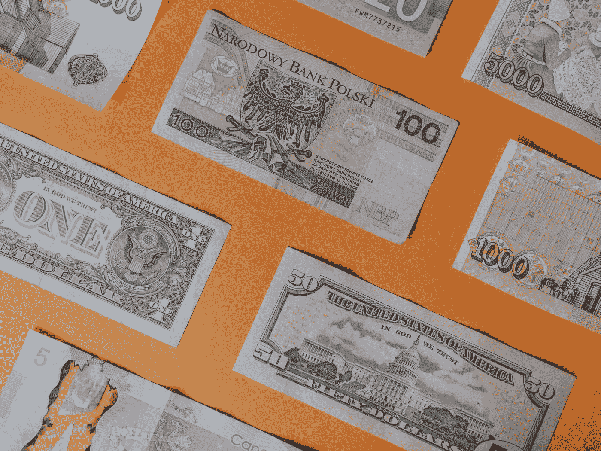

# 6 条重要的教训当人们意识到金钱的时候，已经太晚了

> 原文：<https://medium.datadriveninvestor.com/6-important-lessons-people-fail-to-learn-about-money-until-its-too-late-baf5c3eba83c?source=collection_archive---------3----------------------->

## #3 花在你喜欢的东西上，削减你不喜欢的东西

Photo by [Annie Spratt](https://unsplash.com/@anniespratt?utm_source=unsplash&utm_medium=referral&utm_content=creditCopyText) on [Unsplash](https://unsplash.com/s/photos/finance?utm_source=unsplash&utm_medium=referral&utm_content=creditCopyText)

当我年轻的时候，我认为管理我的钱是一项如此复杂的任务，我永远不会掌握它。

投资、选择储蓄账户、开养老金账户，所有这些似乎都是难以理解的。因此，在我成年后的大部分时间里，我都有自己的银行账户和一个储蓄账户。

我把一小笔钱转到了我的储蓄账户里，再也没想过这件事。你知道接下来发生了什么吗？没什么。我懒得再往我的储蓄账户里存更多的钱，也没考虑开一个投资账户。我把头埋在沙子里，假装一切都很好。

现在三十多岁了，回头看看年轻时的自己，畏缩了。21 岁时，我的财务状况还不错，但我不具备利用这种状况的技能。

如果我这样做了，我可能会在财务自由的道路上走得更远，而不是在几年无所事事后不得不从头开始建立我的财务。

你不一定要这样。即使你已经不年轻了，并且认为自己具备金融知识，你仍然有很多东西可以学习。

我将要与你分享的建议将帮助你掌握你的财务状况，把你的头从沙子里拉出来，并为你建立一个稳定的财务未来。

# 你开始得越早越好

我犯的最大错误是没有早点开始理财。信不信由你，当我大学毕业时，我的财务状况很好。

当然，我有我的大学债务要还。但是在英国，只有当你的收入超过一定数额时，你才开始还钱。如果你毕业 30 年后仍未还清，这笔钱就会被一笔勾销。

大学毕业后，我口袋里有很多钱，但不知道该怎么花。我仅有一个标准账户和一个基本的储蓄账户。我对股票市场几乎一无所知，更不知道养老金和任何其他省钱的方法。

只是在我从多个国家生活回来五年后，我才开始认真对待我的个人财务。此时，我的财务已经缩水，我已经错过了赚取五年价值增长的机会。我没有前进，而是倒退了。

从个人理财中学到的最重要的一课是尽早开始。你开始得越早，你的资产就越值钱。在年轻的时候就对金融世界有所了解，这样你就不用担心年纪越大越难入门。

# 管理你的钱比你想象的要容易

当我年轻的时候，我从来不检查我的银行余额。对我来说，一两个月不看它并不罕见。就我而言，我的银行存款余额就像薛定谔的猫；如果我不看它，我的余额可能会比之前好，也可能会更差。

这是一种糟糕的理财方式。把头埋在沙子里是鸵鸟的事，不是人类的事。所有这些对我没什么好处，只是让我越久不看余额就越担心。

我如此不愿意检查我的余额的原因是我认为管理我的钱是困难的。忽略它，希望最好的结果，比掌管我的财务要容易得多。

当我最终抽出手指开始管理我的钱时，我惊讶地发现这比我想象的要容易。拉米特·塞西的书 [*我会教你变得富有*](https://alonewithbooks.com/i-will-teach-you-to-be-rich-summary) 等好资源都有帮助，但远没有我想象的那么难。

一旦你意识到实现财务自动化、设立储蓄和股票账户以及缴纳养老金是多么容易，你就会奇怪为什么一开始就要花这么长时间。

# 花在你喜欢的东西上，削减你不喜欢的东西

我从拉米特的书中学到的概念是，在你喜欢做的事情上挥霍，同时削减那些不能给你带来快乐的事情。

很长一段时间以来，我认为我需要在生活的各个方面省钱。无论是减少旅行，在我当地咖啡馆喝一杯热巧克力，还是加入一个便宜的健身房。我喜欢所有这些事情，但我想保持低支出的愿望意味着当我挥霍时，我会感到内疚。

拉米特在书中提出的观点很简单。不要因为做自己喜欢的事情而感到内疚。相反，多做一些。你应该削减的是那些你不喜欢的领域。对我来说，那就是少喝酒，少吃让我没有成就感的食物，少穿昂贵的衣服。

事实是，你可以省钱，还可以把钱花在你喜欢的东西上。不一定非此即彼。

# 复利是世界八大奇迹

复利是你的原始支出和后续利息的总和。阿尔伯特·爱因斯坦称之为“世界第八大奇迹”，如果你理解了这个概念，你的理财能力就会显著提高。

这里有一个例子可以帮助你理解这个概念

*   如果你在股票市场投资 1000 美元，直到 70 岁，你可能最终会有大约 32000 美元。这是假设股票市场的平均回报率为每年 7%
*   如果你等到 30 岁再投资 1000 美元，那么 40 年后退休时，你会赚 16000 美元左右。你错过的那十年是你成长的主要原因。
*   有趣的是，如果你投资 1000 美元，然后每月贡献 83 美元，直到 70 岁，那么你退休时将有大约 465000 美元。

复利的魔力在于多年来的指数增长。你越早把钱投入市场或存入长期储蓄账户，它产生利息的时间就越长，因此，你最终会赚得越多。

这又回到了我的第一点。你开始得越早越好，而且有复利，你开始得越早，你的钱就会随着时间的推移越来越多。

# 挣得多不如存得多

有两种方法可以致富，要么你赚得更多，要么你存得更多。理想情况下，你想两者都做，但这并不总是可能的。赚更多的钱是增加财务稳定性的最快方法。

不幸的是，并不是每个工作都有几千的月薪。如果你发现自己处于这种情况，你有几个选择。你可以向老板要求加薪，可能行得通，也可能行不通。你可以申请更高收入的工作，或者你可以成立一个副业。

申请另一份薪水更高的工作是个好主意，尽管这取决于你有多爱你目前的工作和你的同事。也许增加收入的最好方法是建立一个副业。

副业可以是任何东西，比如开一家 Etsy 商店，出售绘画、珠宝或任何你制作的东西，在 Medium 上写作，或者将你自己的博客货币化。你可以设置许多不同的骗局，让你赚到比现在更多的钱。

这些骗局的伟大之处在于你能掌控一切。你学到的技能也可以转化到你现在的工作中，或者为你提供一些技能，让你更容易被其他人雇佣。

当你达到一个比以前挣得更多的阶段时，你就可以进入黄金十字路口，你会有更多的钱进来，也有更好的能力存更多的钱。

# 你的钱应该为你工作，而不是相反

最后一点很简单。当你可以让你的钱为你工作时，你不想花大部分时间去追逐金钱。

人们陷入财务困境的主要原因之一是因为他们不知道可以用来改善财务状况的各种储蓄账户和工具。

对我来说，在英国的一个例子是一生是一个 T1。这是一个 18-39 岁的人每年最多可以开并存入 4000 英镑的账户。无论你投资什么，政府都会给你 25%的红利。所以 4，000 英镑的存款加上奖金就是 5，000 英镑。

你只能在 50 岁之前存钱，60 岁之前不能取钱，但在这段时间里，这笔钱会给你带来利息，每年你投资 4000 英镑，就会得到 1000 英镑的红利。

这是一个任何人都可以轻松开立和维护的账户，并且将为你以后的生活打下基础。我相信其他国家也有类似的计划。你也有股票交易应用程序，比如自由贸易和罗宾汉，你可以毫不费力地投资股票市场。

掌控自己的财务并为未来的财务自由做好准备从未如此简单。问题是许多人没有意识到他们的存在。

还是那句话，你越早意识到这些可能性，让你的钱为你工作，你就能越早控制你的财务。