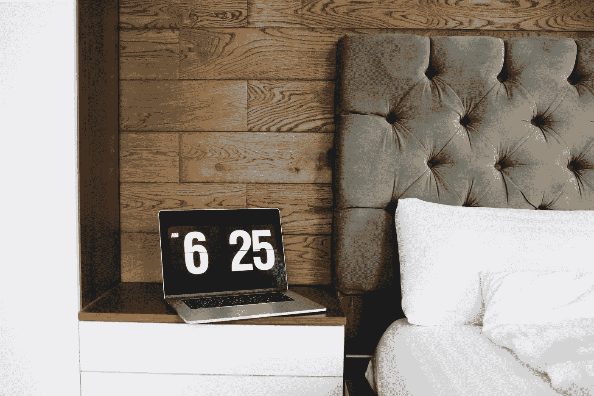

# 关于远程工作的 6 个不可回避的事实

> 原文：<https://medium.datadriveninvestor.com/6-inescapable-truths-about-working-remotely-57bd6b032477?source=collection_archive---------7----------------------->

## 远程工作的好处、坏处和丑陋之处

Picture by Josh Power / [**Unsplash**](https://unsplash.com/photos/FWoH2qhLb5I)

*这个故事包括附属链接*

2020 年第一季度是远程工作概念的开创性时期。

在家工作突然成了 T2 的惯例，而不是 T4 的例外。

许多不知情的隔间工作人员第一次看到了远程工作以及随之而来的挑战。一些人在他们的新家庭办公室表现出色，而另一些人则惨败。

对我来说，远程工作已经成为常态很长一段时间了。

在过去的几年里，我的大部分工作时间都是在咖啡店、机场候机楼、酒店房间以及其他地方度过的。

我曾经在从公寓到马尼拉机场的出租车上完成了一份 2000 字的自由写作任务。提醒你一下，交通太糟糕了。

2020 年对我来说仍然是一个重大的转变。我不再喜欢每周都有新的工作地点，而是接受了在同一个地方——我的家——一次远程工作几个月的想法。工作模式的讽刺逆转。

令我惊讶的是，我发现自己更喜欢非传统的工作场所，而不是想象中舒适的家庭办公室。

因此，在家工作让我丰富的远程工作经验大开眼界。

在这种情况下，我第一次意识到所有类型的远程工作之间的相似性。无论你在家还是在其他地方工作，津贴和困难都是一样的。

在此基础上，这里有 6 个关于远程工作的不可回避的事实。

# 1.纪律从来都不是天生的

不管你有多有经验，作为一名远程工作者，你的纪律将不断受到考验。

在家里，每当你把视线从公司的笔记本电脑上移开时，你就会面对一堵分心的墙。

在一个小隔间里，像你的电视、你的伴侣、你的狗和你在咖啡桌上的大量藏书通常不会影响你的工作效率。在家里，他们会。

此外，没有老板会在那里执行你的纪律。

这同样适用于在咖啡店、交通枢纽和共同工作空间等地方远程工作的人。

我们的纪律必须与我们的自由相称。

*咖啡店图书馆里的这本斯坦贝克小说看起来很诱人，但我是来工作的。*

 [## 良好的生活是习惯的形成|数据驱动的投资者

### 过度思考是过度紧张。仅仅几个简单的习惯就会在一天中产生巨大的影响。那是…

www.datadriveninvestor.com](https://www.datadriveninvestor.com/2020/01/17/a-good-life-is-habit-forming/) 

因此，远程工作的主要挑战之一是我们控制和执行时间表的能力。

随着熟悉的办公室约束的消失，你的纪律现在掌握在你的手中。

作为远程工作者，每个人都是自己的老板，没有额外津贴。你不得不组织和执行时间表，却得不到经理的好处。听起来很不公平，不是吗？

远程工作是一个巨大的性格考验。要想在任何不熟悉的工作环境中脱颖而出，你需要做好自我控制的准备，并想办法保证自己的勤奋。

建立一个[专用工作区](https://medium.com/datadriveninvestor/7-remote-working-hacks-to-stay-productive-anywhere-92554c9dd3fa)，反映你的日常工作，把所有不必要的电子设备放在你的包里，这些都是确保远程工作者纪律的最好方法。

# 2.没有人不受孤独的影响

不管你有多爱你的狗，都会有孤独袭来的时候。

远离拥挤的办公环境，远程工作实际上等同于独自工作。

这就在自己和外界之间制造了一道屏障。

这种障碍可以通过清除办公室干扰来提高生产率，但也可能导致令人沮丧的孤独。

为了战胜你的孤独，你需要采取一些保护措施。

定期检查你的同事。即使你们不在同一个项目上工作，分享你作为远程工作者的经验也能提升双方的精神。

与你的朋友和家人保持联系。一开始，他们可能会把你的新习惯误认为是额外的空闲时间。说服他们不这样做是*你的*工作。

就我而言，我的朋友和家人过了一段时间才明白支持我远程工作的重要性。

然而，一旦我向他们证明了他们的精神支持对消除我的孤独感至关重要，他们很快就明白了远程工作不是我闲暇时间的延伸*。*

# 3.灵活性是福也是祸

远程工作和灵活性密不可分。

你设计你的环境，你控制你的大部分工作时间。

然而，硬币有两面。

随着灵活性而来的是责任。

在家工作，你可以自由地整天穿着睡衣。在午休时，你也可以更灵活地去跑腿和修剪草坪。

另一方面，办公时间已经过去了。没有人会告诉你在下午 6 点停止工作，也没有人会阻止你把笔记本电脑带到床上。反正你还穿着睡衣。

就像保护你的纪律一样，管理你新发现的灵活性是至关重要的。

在这种情况下，大多数经验丰富的远程工作人员使用*逐步*的方法。

如果你习惯了僵硬的办公时间，不要从极度灵活的夜间工作区开始。

前几周模仿你的日常习惯，慢慢向更灵活的时间表前进。

这会给你时间调整。在落入灵活性陷阱之前，你将有机会设计你的最佳节奏。

另一方面，如果你已经习惯了企业责任，远程工作的灵活性不会对你的日常工作产生重大影响。

尽管如此，它将为您的业务工具提供一个测试。

远程管理你的企业将允许你检查你的创业系统的价值。

当我开始远程工作时，我发现了像 Spark 和 Serene 这样的新应用，也测试了新设备。我对 [JellyComb 可折叠键盘](https://amzn.to/2wMYXxY)特别满意。

由于体积小，它可以塞进我的平板电脑的外壳。我一般在笔记本电脑上写累了就拿出来。

这使我能够在咖啡店里靠着一杯冰茶使用我的[联想平板电脑](https://amzn.to/3ad1nn9)时，在一个合适的键盘上打字。

Picture by Anastasiia Chepinska / [**Unsplash**](https://unsplash.com/photos/UjF6pCwfwZw)

# 4.沟通总是一个挑战

尽管有尖端技术的帮助，但在狭窄的办公楼里，交流总是更容易。

*为什么？*因为当你站在你的对话者面前时，你不能只按“结束通话”按钮。

当你的老板当面问你事情时，你不能等 30 分钟才回答。同样的道理也适用于同事的请求。

这种情况造成了*双重头痛*。

雇主需要找到一种方法来集中他们团队的沟通流，员工需要学习如何以正确的效率、礼貌和迅速进行沟通。

如果你是一名雇主，你的员工和你之间的沟通将是成功管理远程团队的第一个里程碑。

像[福布斯](https://www.forbes.com/sites/jonobacon/2020/03/10/how-to-switch-to-remote-working-quickly-for-both-employers-and-employees/#48ff67e44579)这样的权威商业资源建议使用一个*单一*平台来创建一个“公司交流和讨论的俱乐部”

作为一名员工，掌握远程沟通的最佳方式是避免你在办公室会避免的习惯。

不要比平时花更长的时间。不要把你的地理位置作为一个比你本人更不礼貌的借口。

如果你习惯了以某种方式和老板说话，不要仅仅因为你是通过 Zoom 交流就胡乱修改礼节。

# 6.很难实现良好的工作生活平衡

与处理灵活性一样，实现良好的工作与生活平衡是远程员工面临的一大挑战。

无论你的远程工作环境，都会模糊“工作”与“生活”的界限。

如果你在家工作，你的工作空间也是你的生活空间。这给良好的工作生活平衡造成了内在障碍。

在这方面，一个完全不同的工作空间——与你的生活和睡眠空间明显分开——是最好的补救措施之一。

另一方面，如果你在公共零售场所工作，工作环境和放松的休闲环境之间的差别实际上就不存在了。

举个例子，我曾经在曼谷素坤逸区的一家时尚咖啡店工作了 6 个多小时。我中午到达，下午 6 点左右结束工作。

6 点 30 分，一个朋友和我一起喝咖啡，吃东西。我们大约在晚上 11 点离开。我在同一家咖啡店里总共呆了 11 个小时。

它已经变成了一个集办公室、休闲区和下班后的地方于一体的地方。不用说，咖啡店的店员成了我最好的朋友。

因此，你必须找到最有效的方法来平衡工作时间和休闲时间。

如果钟摆向任何一个方向摆动太多，你的远程输出将受到影响，你的老板或企业将做出相应的反应。

Picture by Luke Chesser / [**Unsplash**](https://unsplash.com/photos/KR2mdHJ5qMg)

# 6.远程工作将继续存在，但不会取代办公室工作

这话我听了一遍又一遍。

*我们将永远远程工作。没有人会回到他们的办公室。很快，我们的度假地点将成为我们的工作地点，数字游牧生活方式将成为常态。*

这听起来很诱人，但不会发生。

更不用说根据定义不能远程工作的零售员工了，有很多原因可以解释为什么传统的隔间员工不会在一夜之间变成数字游民。

首先，2020 年并没有改变公司的企业结构。仍然有决定的人和执行这些决定的人。

许多首席执行官第一次允许他们的员工在家工作。同样，当尘埃落定时，他们可以很容易地恢复这一决定。

简而言之，这个新系统是出于需要而建立的。一旦这种必要性减弱，建造它的人可以很容易地再次拆除它。

许多公司在 2020 年之前已经有了远程工作政策。一些公司将保留其新引入的规则，但许多公司将继续将远程工作视为一种特殊的、紧急的安排，而不是近期的模式。

其次，对于年轻的父母和家庭生活繁忙的人来说，远程工作不方便。

2020 年 4 月，丹麦等欧洲国家开始重新开放幼儿园和小学，然后因为这个原因重新开业。

远程工作和照顾蹒跚学步的孩子不太协调。

我不是说这不可行，但这很难成为年轻父母的普遍生活方式。

最后，远程工作永远比员工更适合企业家。

如果你管理自己的事业，你的心态已经适应了灵活性、责任感和时间安排。

远程工作的主要缺点往往与企业家的[挑战](https://medium.com/@jackkrier/6-inescapable-truths-for-aspiring-entrepreneurs-b1473433f2c6)重叠。

这就是为什么企业家通常比朝九晚五的员工更能应付远程工作。

# 总结和最终想法

*   为了确保你作为远程工作者的纪律，你需要找到*保持动力和专注的*技巧。
*   作为远程工作者，孤独会成为你最大的敌人。采取安全措施以避免隔离。
*   不要低估你新发现的灵活性所带来的责任。如果你不习惯工作中的灵活性，那就用循序渐进的方法。
*   作为一名远程工作者，很难实现良好的工作生活平衡。因此，找到把工作和娱乐分开的最佳方式是至关重要的。
*   在沟通方面，雇主需要简化系统，雇员需要发挥自己的作用，使其发挥作用。
*   远程工作将继续流行，将来会有更多的人远程工作。然而，由于家庭和朝九晚五员工面临的问题，远程工作不会取代传统的办公室工作。

如果你喜欢这篇文章，[**加入我的邮件列表，保持联系**](https://minimalistfocus.com/email-list/) 。

# 你可能也会喜欢

 [## 7 名远程工作人员，随时随地保持高效工作

### 如何在平常的办公环境之外茁壮成长？

medium.com](https://medium.com/datadriveninvestor/7-remote-working-hacks-to-stay-productive-anywhere-92554c9dd3fa)