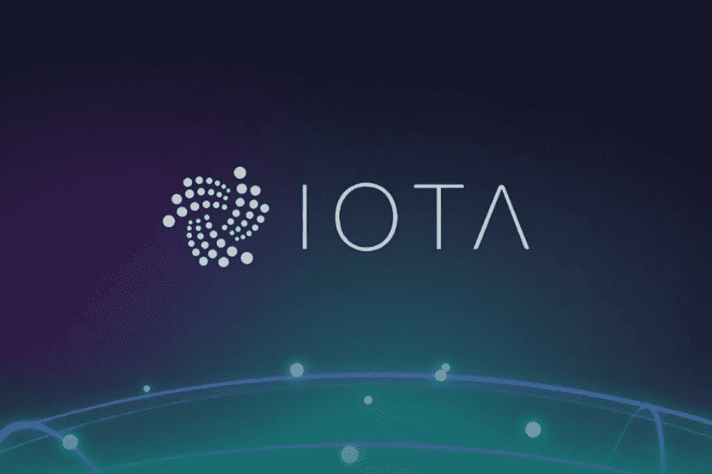
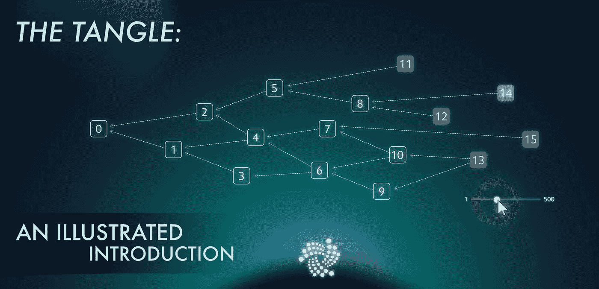

# iota 可能成功的 6 个应用领域

> 原文：<https://medium.datadriveninvestor.com/6-possible-areas-of-application-where-iota-could-become-successful-e28394d41224?source=collection_archive---------3----------------------->

# IOTA 是什么？

IOTA (MIOTA)是物联网(IoT)的安全通信和支付协议。该系统没有使用经典的区块链，而是使用了所谓的“tangle”，这在可伸缩性和速度方面提供了一些优势。IOTA 是与财团和公司合作开发的。

## IOTA 的未来

IOTA 在短暂的构思阶段后于 2016 年推出。这是一个主要设计用于在所谓的物联网中实现机器、车辆和设备之间快速交易的系统。从一开始，IOTA 就受到了极大的关注，尤其是来自私营部门的关注。因此，该系统的开发与行业协会和公司(如博世、大众、捷豹路虎、富士通等)密切合作。)，它希望创建一个物联网设备之间交易的密码安全基础设施。

IOTA 的设计最显著的特点是，它不像比特币那样使用区块链，而是使用一种不同但相关的结构。这种结构被称为有向无环图(DAG)。

## 有向无环图

路径连接一组事务(所谓的“节点”)。这是一张“图表”这些路径中的每一条都有明确定义的行进方向，因此可以理解为“箭头”因此它是一个有向图。如果永远不可能找到一条由箭头组成的返回起点的路径，那么这个图就是无环的，也就是说，它没有绕圈运行的循环路径。有向无环图是区块链链结构的推广，因此每个区块链都是非常简单的链状 DAG。

## IOTA“纠结”

在 IOTA 的情况下，这个图叫做纠结图。但关键的一点是，纠结的节点不是网络中的节点或区块链的块，而是单个事务。区块链在其他系统中接管的功能是相互交易确认的纠结。为了执行交易，用户必须确认/验证至少两个其他交易。如果一项交易以这种方式收集了最低限度的确认，它就被认为是经过验证的，可以执行。

交易本身是经过签名的，因此不能被伪造。发送的事务用正方形表示，称为“站点”箭头被称为“边缘”它们象征着已确认的交易。两条边指向另外两个事务。尚未确认的交易称为“Tips”它们位于缠结的外部区域。

 [## 完美的加密交易策略|数据驱动的投资者

### 如果你在交易游戏中已经有一段时间了，你可能听说过“支点”和“VWAP”前者听起来像…

www.datadriveninvestor.com](https://www.datadriveninvestor.com/2020/08/31/the-perfect-crypto-trading-strategy/) 

# IOTA 网络中的安全性和一致性

当路径从交易通向所有 tip 时，就达到了该系统所需的一致性(网络中的一致性)。则存在多个确认。验证路径被称为蒙特卡罗马尔可夫链(MCMK)。如果该算法被执行一百次，并且系统确定一笔交易涉及 70 个小费，则 70%被确认。

参与 IOTA 网络的任何人使用他们的私钥签署执行交易所需的信息 IOTA 号码、接收者和发送者，确认强制提示，并进行一些计算以避免垃圾邮件(工作证明)。该算法然后计算一个唯一分配的数字(nonce)作为垃圾邮件保护。然后，它将它发布给其他网络参与者进行验证。

# IOTA 纠结中的 IOTA 纠结事务处理

IOTA-Tangle 目前由“全节点”和“轻节点”组成全节点是连接到所有相邻节点的全功能节点，因此可以分发事务。光节点是 IOTA 钱包，参见 Trinity 钱包光节点依赖于全节点的信息。

为了减少节点对内存和计算能力的需求(并防止混乱变得无限膨胀)，IOTA 团队定期删除旧的事务。

## IOTA 协调员

所谓的“协调者”(首席运营官)目前仍然负责 tangle 的安全，防止未经授权的人访问:因为 tangle 仍然是可管理的，没有他就不能排除对网络的攻击。协调者大约每 60-90 秒创建一个带有签名的事务(所谓的“里程碑”)。

## IOTA 的优势

IOTA 仍处于发展初期，但至少在理论上，系统的设计带来了相当大的优势。Tangle 是可任意伸缩的，并且至少在理论上可以同时执行任意数量的事务。事实上，理论上，随着用户数量的增加，系统会变得越来越快。对于人类来说，这种速度的增加可能无法直接观察到。尽管如此，在物联网的预期应用领域，终端设备相互通信的低延迟时间应该是值得注意的。

IOTA 想成为机器和数据经济的“石油”，可以这么说。

# IOTA 的应用领域

根据 IOTA 基金会的设想，该协议可用于以下领域:

*   汽车行业(电动汽车)
*   卫生保健
*   供应链管理
*   智能城市
*   智能家居
*   工业 4.0
*   汽车行业和电动汽车

如今，许多交通工具都是由电能驱动的。目前甚至自动驾驶已经成为可能。然而，这样做的先决条件是不可操纵的和安全的数据和支付交换，如 Tangle 提供的。成功的汽车共享也可以受益于 IOTA 技术。大众集团在 2018 年 Cebit 上令人印象深刻地展示了这一点:汽车共享可以通过 IOTA 计费到最近的公里数。

汽车行业 IOTA 来源:iota.org/verticals/mobility-automotive
根据 IOTA 的设想，在未来，汽车可以拥有自己的“钱包”,并自动支付基础设施和服务费用，例如

*   停车(每秒)
*   加油(每千瓦时、每升)
*   通行费(比例取决于路线)

# 卫生保健

越来越多的人想确切了解他们的重要功能。戴在身上的传感器有助于及时发现疾病。因为数字医疗信息是最敏感的数据之一，所以它非常适合存储在 IOTA 网络中。此外，那里的患者可以控制自己的数据。没有他们的同意，甚至医生也不允许接触他们。

# 供应链管理(供应链)

供应链管理(SCM)涉及供应商到客户的供应链上的所有服务提供商。如果在这一领域使用分布式分类账技术，就有可能确定，例如，对某些食品来说是强制性的冷藏链没有中断，从而能够预先满足索赔要求。要做到这一点，只需给它们配备微芯片，并存储它们的路线和 IOTA 缠结冷却温度的信息。

# 智能城市

智能城市概念也是 IOTA 的一个合适的应用领域。有了这个概念，城市基础设施得到了数字化优化:每个开车去停车场的汽车司机都会通过 IOTA Tangle 得知那里还有多少停车位。IOTA 网络通过安装在停车库中的带有微型摄像机的传感器接收该信息。附着在所有垃圾桶上的传感器提供关于它们的填充水平和位置的信息。纠结然后通知垃圾处理公司哪些垃圾桶需要清空。这样就避免了不必要的行程，节约了成本。

# 智能家居

据专家称，智能家居功能正变得越来越重要。所有电器、电灯开关、停电和安全系统都通过互联网连接，并通过智能手机应用程序控制。例如，未来的智能冰箱可以使用内置的迷你摄像头来确定哪些食物快吃完了，通过互联网自动订购，并用 IOTA 支付。

# 工业 4.0

工业 4.0 的概念是利用数字技术提高生产力。在未来的智能工厂中，所有机器、工具和材料都自动协同工作:贴在工件上的标签告诉机器它们需要如何处理，并通过 Tangle 和 IOTA 发送到各自的加工站。所有生产步骤都记录在 IOTA 网络中，以便可以立即分析和纠正出现的任何错误。

我在每月一期的 [**简讯中分享了更多私密的想法，你可以在这里**](https://mailchi.mp/bf8f8e8ed697/keep-in-touch-with-lukas) 查看。请在评论中告诉我，并在各种社交媒体平台上加入我:

[**推特**](https://twitter.com/WiesfleckerL)●[**insta gram**](https://www.instagram.com/lukaswiesflecker/)●[**脸书**](https://www.facebook.com/lukaswiesfleckerr)●[**Snapchat**](https://www.snapchat.com/add/luggooo)**●[**LinkedIn**](https://www.linkedin.com/in/lukas-wiesflecker-1b11251a5/)**

**无论你做什么，都要带着爱和激情去做！**

## **访问专家视图— [订阅 DDI 英特尔](https://datadriveninvestor.com/ddi-intel)**