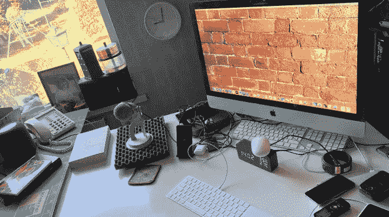
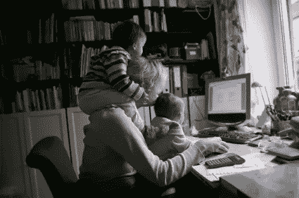
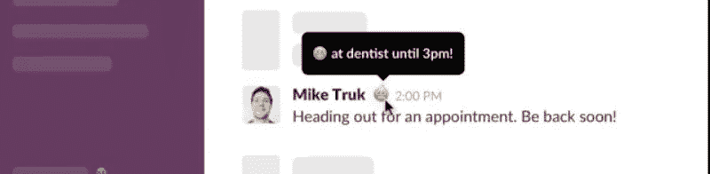
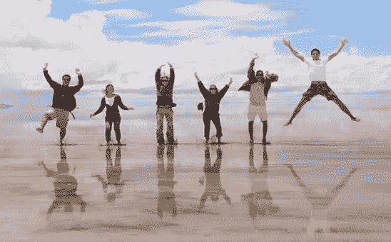
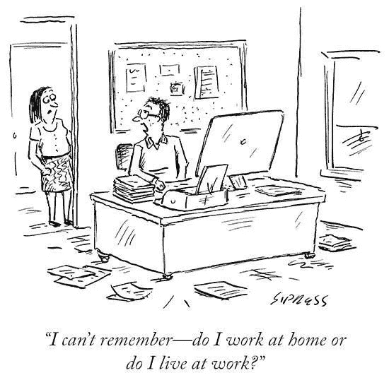

# Covid 隔离期间成功远程工作的 6 个经验证的技巧— Zesium

> 原文：<https://medium.datadriveninvestor.com/6-proven-tips-on-successful-remote-work-during-isolation-zesium-f892ac1f7fb1?source=collection_archive---------36----------------------->

Source: canberratimes.com.au

在家工作对大多数人来说是新的现实，许多人发现自己在客厅或餐厅、露台等地方工作。这是一个非常敏感的环境，任何噪音(*孩子，宠物等*)。)会分散你的注意力，让你的效率降低。

远程工作的挑战之一是缩短团队成员之间的距离。

在冠状病毒爆发期间，我们都保持社交距离，呆在家里，所以让我们分享一些关于如何利用在家工作的简短提示。

# 基础预科

当你远程工作时，有几个基本要素你应该考虑，但是我已经在**“准备”**阶段下收集了它们。

任何工作流程的基础都是一个良好的组织——拥有所有必要的工具、设备以及在家高效工作的习惯。

 [## 跑步摆脱疯狂:锻炼如何提高你的生产力|数据驱动的投资者

### 没有比锻炼更好的方式来开始一天的工作了。我试着一周至少做四天，在…

www.datadriveninvestor.com](https://www.datadriveninvestor.com/2018/10/23/running-to-get-rid-of-the-crazy-how-working-out-increases-your-productivity/) 

关于基础准备的一些简短提示可以是:

**——有一个指定的空间来工作**——如果你没有多余的房间，房间里的一个小角落也可以——试着把它变成一间办公室。拥有你的工作场所很重要，因为你会有空间放你的笔记本电脑或报告等。它会提供内在的动力，因为当你去那里的时候，你会知道是时候工作了。

Source: appleinsider.com

**——有指定的工作服**——在他的书《远程:不需要办公室中，杰森·弗里德说“*有指定的‘在家工作’服装可以让你进入正确的心境”*。这并不意味着你需要打扮，只是简单地说:不要穿和你周日下午在家穿的一样的 t 恤去上班。

**-对你的任务进行优先排序和安排**-给你的一天安排一些结构，并对下一天的任务进行优先排序，但如果情况需要，尽量保持*“敏捷”*。你可以按小时、按任务或按紧急程度组织你的工作流程，但要更适合你的工作流程。你也可以安排休息时间，因为这可以帮助你保持工作的一致性。

**-接受一些干扰**-许多父母在家工作，家里有小孩或青少年，事实证明很难给自己提供一个“*孤立的地方*”。接受一些骚动(*孩子、送货、门铃等*)。)尽量减少其他干扰，减少你能控制的干扰，比如大声看电视、查看手机或社交媒体新闻(*脸书、Instagram 等*)。)因为它可以转移你的注意力。把这些活动放在任务之间的短暂休息中，一旦任务完成，就让自己沉浸在新闻中。

Source: mommymaestra.com

# 与您的团队保持联系

远程工作时，大量的交流是通过聊天或消息进行的，这可能会感觉有点不自然，因为有时您无法键入所有需要说的话，或者您不想打扰任何人。在办公室工作时，您倾向于进行实时互动，以加强关系并实现更好的项目沟通。

远程办公如何维护这样的关系？

在职业层面上，为你的同事多做一点事，就像承担一项你的同事没有时间完成的额外任务，是保持团队有效工作的重要因素。每个人都喜欢成员们互相支持的安全环境

**尽可能多地伸出援手**，因为这能为你的工作关系增值——在远程环境中，除非你告诉他们，否则你的主管或队友无法知道你遇到了什么困难。

不仅为了工作，也为了闲聊与你的同事保持联系，比如生日或其他对他们来说重要的日子。

Source: instagram.com/zesiumapps

从事特定项目的团队可能会组织快速的**每日或每周会议**并讨论所有重要的细节，因为谈话比打字更快。即使隔着屏幕，面对面地与人交谈，仍然可以建立起“文本”对话无法建立的关系。

离开信息和其他元素一样重要——你不在的时候的细节也有助于开放式交流，让所有团队成员保持一致。

> 虽然是虚拟的，但这种交流建立了跨部门的信任，并创造了一种更容易理解的社区文化。

Source: engadget.com

# 使用现有技术

数字化转型引领我们走向移动性，以及正确完成工作所需的工具。今天的技术使我们无需亲临现场就能相互交流。

每个人都应该使用能够让我们远程工作并与每个人保持联系的技术——聊天应用、[视频会议工具](https://zapier.com/blog/best-video-conferencing-apps/)等。以及其他[通讯工具](https://thedigitalprojectmanager.com/best-communication-tools/)。

毕竟，这就是技术存在的原因。

今天有许多类型的工具(*时间跟踪工具、文件共享工具、协作工具等*。)与您的远程团队保持持续的沟通和联系—回顾它们的优势和功能，并检查哪一个最能满足您的需求。

注意**不要用太多的沟通渠道让人们不知所措**，但只需要那些无缝运作所必需的渠道。

如果你有一个大公司和大团队，最好的解决方案是将**团队分成子集**或子组(例如，每个特定项目)这将减少沟通渠道的数量，并降低沟通失误的可能性。

> 将你的团队分成几个小组将确保你的交流畅通无阻。

Source: belltimemagazine.ie

# 玩

当你感觉与你的团队联系在一起时，一种*‘玩’*的状态就自然而然地出现了。在处理任务和做有价值的工作时，与团队成员的积极互动会带来创造性的挑战。

根据心理学家的说法，这是一种自然的流动，一个人完全专注于自己正在做的事情——这是我们此刻敏锐地专注于自己活动的**“区域”。**

**非正式的 ( *俏皮、有趣的* ) **交谈**也很重要——离题的笑话、闲聊或戏谑应该成为与工作有关的讨论。**

****

**Source: laughterandhumor.blogspot.com**

**视频聊天和现场会议对于分散的团队成员相互了解仍然至关重要——如果你能**看到一个人并与之交谈**，你就可以建立关系，引发那些有趣的对话。**

> **随意的交流以及我们如何相互交往是建立团结意识和公司文化的重要组成部分。**

# **管理你的能量**

**管理你的精力比管理时间容易得多——时间经常是棘手的，而管理你的精力更有意义，因为它是你可以控制的。**

**管理能量很简单——你应该建立一些给你能量的简单习惯:例如，你可以在任务之间散步 10 分钟，可能的话跟着喜欢的音乐跳舞，或者只是在短暂的休息时间站起来做些运动。虽然在某件事情的*【中间】*离开你的电脑看起来很麻烦，但是短暂的休息会提升你的能量。**

> **记住，关键是要坚持这些短暂的能量休息，以便在你的工作方式中创造有效的结果。**

****

**Source: finermind.com**

# **定义工作时间**

**清楚地定义你在工作中的**可用性**——当你在工作时，当你不在工作时，并与你的同事讨论。如果你加班，你的团队成员需要知道这件事，以便更有效地与你沟通。**

**不要整天工作，因为这会耗尽你的精力，影响你的工作效率。一天的工作结束后，合上你的笔记本电脑，把它放在看不见的地方。**

**一些公司有灵活的工作时间表，如果是这样，确定你的工作高峰期是很重要的。你是一个早起的人吗？还是更喜欢夜的寂静？**

**这些答案可以帮助你确定**你的高峰工作时段**——在这些时段优先处理重要任务，在你轮班的后期优先处理不太重要的任务。**

> **如果你知道什么时候你工作得最好，你会从一天中得到最多。**

****

**Source: majorgeeks.com**

# **一锤定音**

**如果你发现自己在家里工作，并在与世隔绝的时期挣扎，记得总是联系他人，并试图通过可用的工具如聊天和视频会议来保持沟通。**

**能够看到你的团队成员并与他们交谈会让你精神振奋，提高你的能量和工作效率。**

> ****不管我们之间的物理距离有多远，在隔离期间保持联系会给我们一种一起工作的感觉。****

***原载于 2020 年 3 月 26 日*[*https://zesium.com*](https://zesium.com/6-proven-tips-on-successful-remote-work/)*。***

**通过以下链接安排与[**Maja Dakic**](https://app.ddichat.com/experts/maja-dakic)**的 DDIChat 会话。****

**** [## 马贾达基奇-迪迪恰特

### 技术行业(软件、移动应用、物联网、人工智能等)的资深作家。)以及在…

app.ddichat.com](https://app.ddichat.com/experts/maja-dakic)****