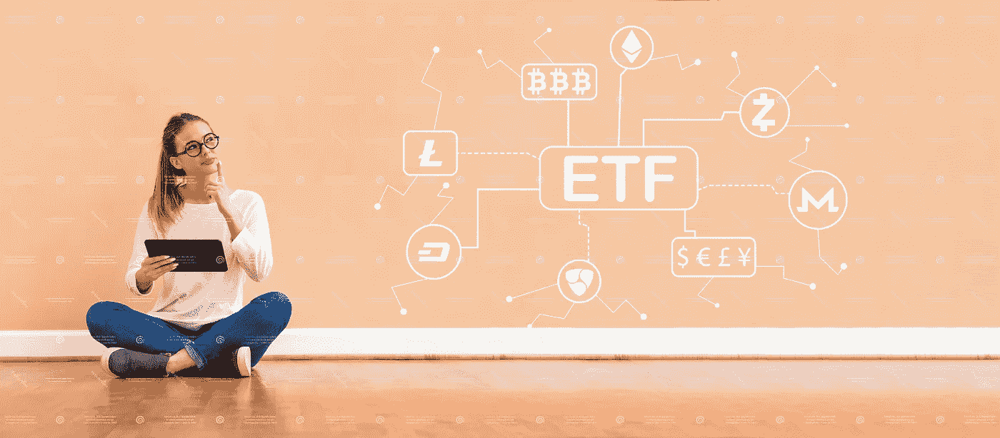

# 女性应该投资密码的 6 个理由

> 原文：<https://medium.datadriveninvestor.com/6-reasons-women-should-invest-in-crypto-c6150b4dd067?source=collection_archive---------11----------------------->

加密货币于 2009 年首次登上世界舞台，带来了数字货币系统的新时代。虽然具有开创性，但除了最懂技术的投资者之外，其他人都很难理解。一晃十年过去了，我们现在看到发生了巨大的变化，卡巴斯基报告称，大约有 19%的 T2 人持有某种数字货币。2017 年末，一枚最知名的加密货币[比特币](https://bitcoin.org/en/)的价值飙升至超过 19，000 美元；并且，在 2019 年底，全球加密货币的市值估计为**2370 亿美元。**我们看到来自世界各地的投资者大规模采用加密货币；但是，仍有一部分投资者对此不感兴趣:女性。

欧洲社交交易平台 eToro 发布的一份报告称，不到十分之一的加密货币投资者是女性。已经主导股市投资的男性，也是加密货币世界的主要投资者。目前，91.5%投资加密货币的用户是男性。

 [## 总部位于瑞士的 ETP 进入加密交易市场|数据驱动的投资者

### 虽然金融市场几乎没有沉闷的时刻，特别是在引入…

www.datadriveninvestor.com](https://www.datadriveninvestor.com/2019/03/10/swiss-based-etp-enters-the-crypto-trading-market/) 

也许这是当前加密货币市场的新生状态，原始市场结构的遗产，或者对加密相关的波动性的恐惧，但女性还没有出现。那我们该怎么办？嗯，它给女性留下了一个充满机遇的世界，让她们有机会探索 T21 的个人投资空间，无论是现在还是未来，都大有可为。

以下是女性应该考虑在自己的金融投资组合中加入加密资产的 6 个理由:

1.  **未来就在眼前** —虽然加密货币市场有起有落，但支持加密货币(区块链)的基础设施的增长从未真正放缓。根据许多行业专家的说法，这个领域现在已经稳定、更加成熟，并准备进入下一个阶段。
2.  鲸鱼们还没有开始(真正的)投资——全球经济的很大一部分仍在秘密世界之外。更大的投资者(鲸鱼)尚未完全开始投资加密货币——但它即将到来。这将最终导致加密货币的市值上升到前所未有的高度。一旦大(公司)投资者进入游戏，好的乘数将成为早期参与者的事实；更高的股份将提高加密货币市场和这些资产持有人的投资组合的整体价值。
3.  **稳定硬币的崛起** —加密货币正在发生变化:基于资产的加密技术以低成本、全球覆盖和极快的交易速度铺平了道路——所有这些都是加密货币持有者的巨大潜在利益。想想脸书宣布的 Libra 或正在广泛流行的 stablecoin 商业模式的集中变体。一个这样的项目是 [**矿脉**](https://lode.one) ，它以投资级白银支持的双重代币(矿脉代币和 AGX 币)为特色，作为一个完整的货币系统运作。稳定硬币的优势在于其作为支付手段的吸引力。Stablecoins 允许无缝支付，由于其开放的架构，可以嵌入到数字应用程序中，而不是银行的专有遗留系统。对于密码持有者来说，这意味着他们能够以他们认为合适的方式保存、发送和花费他们的资产。
4.  **高盈利能力的潜力** —虽然我们(还)没有重复 2017 年的比特币登月，但仍有机会在加密货币领域获得优异的回报。EOS 和 XRP 等许多 ALT 币的市值超过 20 亿美元，与蓝筹股投资不相上下。这里提供的主要建议是做好你的功课。花点时间去了解市场目前的状况以及未来的发展趋势。不要害怕探索 ALT 硬币以及前 5 名密码。较小的、不太知名的硬币具有巨大的回报潜力。真正的投资是持久的，需要对你投资的项目有所了解，并满怀信心地去追求。CoinMarketCap 是一个很好的起点。
5.  多样化和对经济危机的对冲 —全球市场显示出不稳定的主要迹象，法定货币的恶性通货膨胀成为一个真正的问题。以委内瑞拉为例。一段时间以来，它一直处于重大危机之中。在经济上，该国现在正试图借助一种名为“石油”的加密货币来拯救自己。顾名思义，这种加密货币是由石油储备支持的。委内瑞拉国家元首尼古拉斯·马杜罗(Nicolas Maduro)自称是加密迷，他正试图采取措施对冲国家货币的高通胀和过去 18 个月超过 1000%的贬值。虽然并非所有政府都接受投资加密货币的想法，但现在私下持有加密货币将有助于你在本国货币暴跌时对冲投资组合的价值损失。
6.  **你决定投资的节奏**——没有人能确定未来加密货币的价格会是多少，所以假设你遵循了第 4 点的建议，你可以对你决定投资的任何加密货币充满信心。开始买少量的东西来为你的基础做准备。感受市场，深入研究与每枚硬币相关的项目。只要你选择了一枚或多枚好硬币，最好现在就买入并长期持有。一旦你感觉更舒服了，如果你觉得合适的话，你可以选择买更多的东西。

最后一点:当然，和所有投资一样，加密货币投资也伴随着内在风险，只适合有风险偏好的投资者。