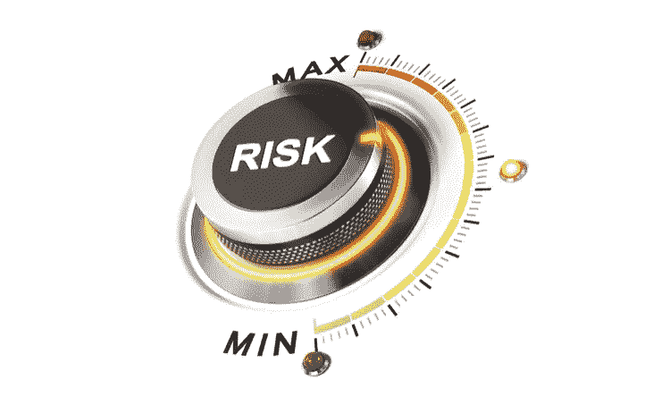
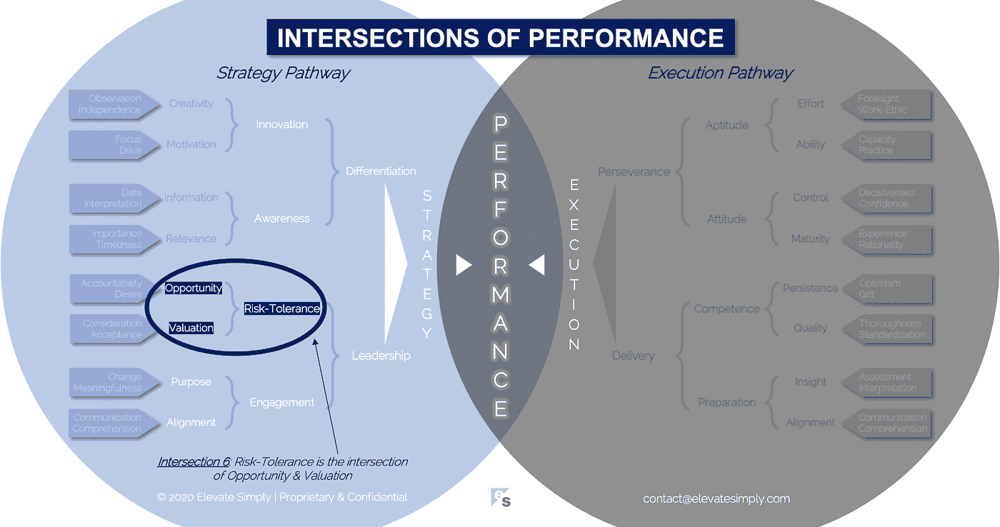

# 风险承受能力:机会与价值的交叉点

> 原文：<https://medium.datadriveninvestor.com/6-risk-tolerance-the-intersection-of-opportunity-valuation-29cf4d9a0ac?source=collection_archive---------12----------------------->

Image from 123rf.com

商业决策是风险管理的一项练习。

*   这个决定是对还是错？
*   如果对了会有什么影响？如果错了呢？
*   利用现有的信息能做出决定吗？
*   是否有应该考虑的替代方案？
*   谁应该参与决策？
*   这个决定的时机合适吗？

商人一天要做数百个决定，有些小而不重要，有些大而有影响。虽然上述问题可能无法针对一个人所做的每一个决定进行单独、明确的回答，但作为一个群体，它们构成了一个风险承受框架。

公司、团队和个人都有自己的风险框架。就个人而言，我可能比我所在的团队或公司更厌恶风险，但我的框架有助于团队和公司的整体框架。随着内部和外部因素的改变，风险承受能力会随着时间而波动。

**什么是风险？**

根据我的经验，风险是行动还是不行动的决定因素。它用来描述一个结果发生的影响，通常是负面的潜在结果。然而，反过来，如果负面结果的影响可以确定，这意味着正面结果的“风险”也可以是*(注意:影响不应与影响的概率混淆)。*

**什么是风险承受力的交叉点？**

风险承受能力是机会和估值的交叉点*(见下图交叉点 6)*。无论是对公司、团队还是个人而言，风险承受框架决定了决策的方式，从而导致公司、团队或个人的最终成功或失败。

*机遇*

机会，以及与其密切相关的机会成本，是风险等式中的关键。让我们以一个新产品介绍作为风险的例子。具体来说，就是决定是在这个季度发布新产品还是等到下个季度。以下是一些风险考虑。

**机遇**

*   上市速度(即先发优势)
*   收入增长速度(即投资回报)
*   行业认知(即早期创新者)

**机会成本**

*   质量(即未经全面测试的产品)
*   产品与市场的契合度(即市场准备好了吗？)
*   部署准备情况(例如，公司能否处理需求和支持？)

在任何决策中都必须考虑机会和机会成本，尤其是围绕人员、产品、战略、营销、投资等的重大企业决策。如果不了解机会，对风险的评估将是不完整的。

交叉点 6:风险容忍度=机会+估值

Image by [Brett Simpson](https://medium.com/u/191cf90a65d7?source=post_page-----29cf4d9a0ac--------------------------------)

*估价*

估价是量化或限定任何给定决策的机会价值(和机会成本)的能力。评估的结果是围绕影响的度量的断言。如果没有交叉点的评估，决策就变成了猜测，而不是明智的选择。

确定机会的量化或定性价值包括主观性和客观性。之所以这样，是因为不能保证(或不可能)百分之百准确地预测未来。因此，估价必须在可用信息和判断不完善的情况下进行。

使用上面的新产品引入决策示例，评估考虑因素包括:

*   *上市速度* - >从历史上看，该领域的产品是否受益于先发优势？如果有，多少？是否存在竞争对手将类似产品提前推向市场的风险？与竞争产品发布后相比，初始产品推出后将获得多少市场份额？
*   *快速获得收入* - >我们在第一周/月/年可以预期获得多少收入，这些收入的成本是多少？产品开发的回收期是多少？哪些因素影响客户获取？我们如何加快认知和订单到现金的速度？
*   *行业认知* - >在这个行业，被视为创新者有价值吗？如果是，这种价值是如何体现的？
*   *质量* - >如果产品质量低，我们会失去销售吗？如果我们的产品被认为有质量问题，收入和客户信誉会损失多少？上面提到的其他估价因素是否会使质量成为一个无关紧要的问题(例如，不管质量如何，对产品的需求是如此之大)？
*   *产品-市场契合度* - >市场是否渴求这款产品？产品是需要还是想要？客户会理解吗？什么是价格弹性？
*   *部署准备就绪* - >公司是否拥有推广和执行产品展示所需的资金和其他资源？持续的产品维护和支持成本是多少？公司的运营基础设施是否准备好根据预计的产品需求进行扩展？

这些只是本例中列出的许多估价考虑因素中的几个。估价是复杂的，其作为风险承受交叉的一部分的重要性不应被最小化。

**领导能做什么？**

风险承受能力始于承认决策存在风险。领导者必须首先了解自己的风险承受水平，以及这将如何影响他们的决策。接下来，他们需要认识到他们的团队和公司本身的风险承受能力。这一参考框架为确定当前风险框架是否可接受(即导致预期结果)奠定了基础。

如果框架是可接受的，那么领导者的目标是确保随着公司的成长和前进，框架继续得到维护。这是通过深入交叉部分……机会和估值……并有条不紊地确保关键决策包括对两者的考虑来实现的。

如果框架不可接受，领导者必须探索决策是如何制定的，并在过程中注入分析以及机会和价值的利用。

**总结&下一个**

领导者以他们的决策而闻名。鉴于他们需要做出的决策的广度和深度，静态的风险承受水平并不总是有效的。领导者必须调整自己和公司的风险承受能力，以适应特定时间点的新形势和新决策。

下一次，我们将检查第 7 个绩效交叉点，即**意识交叉点**。

*在这一系列文章中，我们探索了*性能*的交叉点，共有 30 个。*绩效的交叉点*框架是基于*[*Brett Simpson*](https://www.linkedin.com/in/brettjsimpson/)*[*董事总经理(简称为*](https://www.linkedin.com/company/elevatesimply/)*)20 多年来作为企业家、顾问和投资者在大大小小的组织中的领导经验和见解。**

***绩效-文章链接的交集***

*1.[绩效:策略的交集&执行](https://medium.com/the-innovation/1-performance-the-intersection-of-strategy-execution-2bf06329f8d4)*

*2.[战略:领导力的交叉点&分化](https://medium.com/the-innovation/2-strategy-the-intersection-of-leadership-differentiation-a568b17731ab)*

*3.[领导:参与的交集&风险承受能力](https://medium.com/the-innovation/3-leadership-the-intersection-of-engagement-risk-tolerance-f8c887e6c1d3)*

*4.[差异化:创新的交叉点&意识](https://medium.com/@brettjsimpson/4-differentiation-the-intersection-of-innovation-awareness-a21d053ecf12)*

*5.[啮合:目的的交集&对准](https://medium.com/@brettjsimpson/5-engagement-the-intersection-of-purpose-alignment-953747437c26)*

*6.[风险承受能力:机会的交叉点&估值](https://medium.com/@brettjsimpson/6-risk-tolerance-the-intersection-of-opportunity-valuation-29cf4d9a0ac)*

*7.[认知:信息的交集&关联](https://medium.com/@brettjsimpson/7-awareness-the-intersection-of-information-relevance-f0fd5322bcb7)*

*8.[创新:创造力的交汇点&动机](https://medium.com/@brettjsimpson/8-innovation-the-intersection-of-creativity-motivation-7c1a12e0d5e2)*

*9.[目的:变化的交集&意义的交集](https://medium.com/@brettjsimpson/9-purpose-the-intersection-of-change-meaningfulness-9f12b0153e1)*

*10.[估价:对价的交集&验收](https://medium.com/@brettjsimpson/valuation-the-intersection-of-consideration-acceptance-eebe7b15e763)*

*11.[机会:欲望的交汇&责任](https://medium.com/the-innovation/opportunity-the-intersection-of-desire-accountability-7e81adb1e195)*

*12.[相关性:重要性的交集&及时性](https://medium.com/@brettjsimpson/relevance-the-intersection-of-importance-timeliness-56cc748eb066)*

*13.[信息:数据的交集&解读](https://medium.com/@brettjsimpson/information-the-intersection-of-data-interpretation-62acc94ba8bf)*

*14.[动机:焦点的交集&驱动](https://medium.com/@brettjsimpson/14-motivation-the-intersection-of-focus-drive-d9ebd3ca9951)*

*15.[创造力:观察的交集&独立性](https://medium.com/@brettjsimpson/15-creativity-the-intersection-of-observation-independence-57f7294acb2b)*

*16.执行力:毅力与交付的交集*(即将推出！)**

*17.交付:准备与能力的交集*(即将推出！)**

*18.毅力:天资与态度的交汇*(即将推出！)**

*19.准备:洞察力和一致性的交集*(即将推出！)**

*20.能力:坚持与质量的交汇点*(即将推出！)**

*21.态度:控制与成熟的交集*(即将推出！)**

*22.资质:努力与能力的交集*(即将推出！)**

*23.洞察力:评估与解释的交集*(即将推出！)**

*24.质量:彻底性和标准化的交汇点*(即将推出！)**

*25.坚持:乐观与勇气的交汇*(即将推出！)**

*26.成熟:经验与理性的交集*(即将推出！)**

*27.控制:果断与自信的交汇点*(即将推出！)**

*28.能力:能力与实践的交集*(即将推出！)**

*29.努力:远见和职业道德的交集*(即将推出！)**

*30.对齐:传播与综合的交集*(即将推出！)**