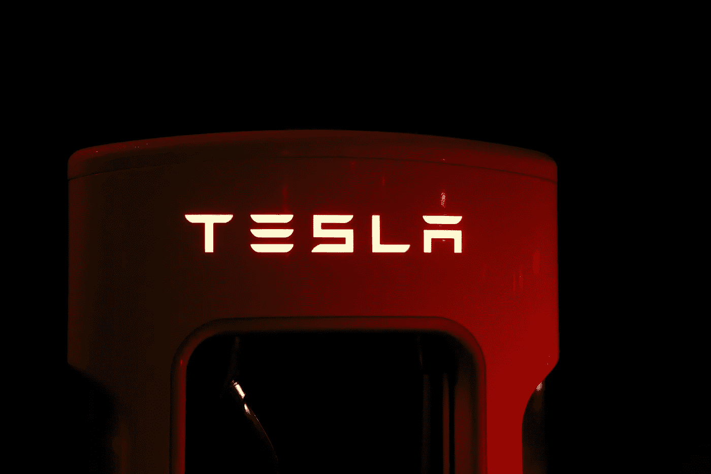

# 如何投资股票的 6 个秘密？股息增长投资组合的世界！

> 原文：<https://medium.datadriveninvestor.com/6-secrets-on-how-to-invest-in-stocks-the-world-of-dividend-growth-portfolio-ac45b3b1171e?source=collection_archive---------8----------------------->

> “在别人贪婪的时候恐惧，在别人恐惧的时候贪婪。”

在现在的世界里，越来越多的人将股市视为现实生活中的赌场，所以我认为强调一些投资原则会很好。

与其向你展示挑选股票进行日内交易的肾上腺素游戏，不如让我向你解释如何通过创造[成长型投资](https://bit.ly/2ZoLBSX)策略来建造堡垒的简单步骤。

# 一个关于我如何开始的小故事

几年前，在一个可以看到中世纪城堡美景的小咖啡馆里，我们一起重温了上次在一起的时光。

自从我们上次见面已经过了很长时间，但当我们坐在 Caphé广场(Plaza Caphé)里——与广场上的其他桌子隔开——时，话题转向了金融和投资。

 [## 使用谷歌搜索趋势预测首次申请失业救济人数|数据驱动的投资者

### 几年来，我的重点一直是使用多种替代数据来预测宏观经济统计数据…

www.datadriveninvestor.com](https://www.datadriveninvestor.com/2020/03/25/using-google-search-trends-to-predict-initial-jobless-claims/) 

路易斯，一个老朋友，用一个非常有趣的问题开始了对话，我的第一堂课开始了:

> “你知道我们为什么不坐在外面看太阳吗？这就像选股一样。当所有人都在买特斯拉股票时，不要买！”

那一刻，我不明白为什么我不应该买特斯拉的股票或者晒太阳，而应该呆在咖啡馆里。

在那些日子里，我不知道在任何商业领域投资。

不知何故，我的头脑开始兴奋和好奇。他谈论股市和分享成功的方式让我很好奇。

然后他推荐了托尼·罗宾斯的一本书，叫《不可动摇》。我知道我一离开咖啡馆就会捡起来。

那本书改变了我的生活。

Image from pexel.com

然而，我最初的恐惧之一是“如果我失去了所有的钱怎么办？”。

然而，当我读这本书的时候，不知何故，我明白了我们可以从小事做起，有一定程度的安全感。

# 选择信息的艺术

当你开始你的第一次搜索，就像你第一次打篮球比赛，看到这些巨大的运动员在你身上跳跃。

每个人都会试着卖给你一些东西或者为你预测未来。

但是让我告诉你一个陈腐而简单的事实:

> 没有人能预测未来。

CXO 咨询小组的一项研究强化了这一观点:

> 为了进行研究，在 2005 年至 2012 年期间，我们收集了 68 位专家、多头和空头对美国股市的 6，582 次公开预测，采用了技术、基本面和情绪指标。(…)如果我们根据 guru 而不是所有预测进行平均，最终准确率为 47.4%。

因此，你在社交媒体上听到的预测至少有一半是错误的。所以不要浪费你宝贵的时间去听他们。

我们去谈正经事吧。

# 你如何投资股票？

你需要做一些简单的步骤来建立你的堡垒，依我拙见，更有效的方法是创建一个红利增长投资组合。

以下是投资股票的 6 个简单秘诀:

*   **开立经纪账户**；
*   你退休所需的钱数**；**
*   ****从小做起，**多元化，有保障；**
*   **学习**如何** **选股**；**
*   ****尽可能多地阅读关于投资的书籍**(你必须阅读的名字:沃伦·巴菲特、霍华德·马克斯、彼得·林奇)；**
*   ****随机性总是存在于你的策略中**。所以，准备一个简单的方法让你的钱增值。你可以在这里看到约瑟夫·卡尔森如何构建他的股息增长投资组合。**

****

**pexel.com image**

# **开立经纪账户**

**数字时代已经成为现实。如果你注意到了，有越来越多的数字平台可以为你提供这种服务。**

**主要的经纪人是美国的罗宾伍德和 M1 金融。在欧洲，我们有[迪吉罗](https://bit.ly/2NmsHX2)、 [Etoro](https://bit.ly/2VbeikX) 以及许多其他品牌。自 2014 年 Robinwood 开始提供零佣金股票交易以来，这是一项竞争激烈的业务。**

**然而，我从一家本地投资银行开始，并一直与他们合作，原因有二。**

**第一，当我需要任何类型的信息时，我总是有一个经纪人可以在场，这给了我一些安慰和安全感。**

**第二，我不做日间交易。我不做月交易。我在工作和兼职项目上努力工作，尽可能多的投资于我的投资组合，这需要时间。我不需要每天都看到图形。有些星期，我甚至不看我的投资组合。记住，这是一次长途旅行。你必须有耐心。**

# **你需要存多少钱才能达到你的目标**

**你怎么知道要存多少？**

**1994 年，威廉·本格尔得出结论，一个 60%股票，40%债券的投资组合可以永远支持 4%的提款。**

**例如，如果你在一个 60/40 的投资组合中达到 1，000，000 美元，你可以每年花费 4%，或 40，000 美元，而你的投资组合将保持不变。**

**然而，你可以做另一种数学。“我想为我的退休生活每年花费 4 万美元，我想在 40 岁之前这样做。”**

**然后，你知道你必须在 40 岁之前存 100 万美元，才能做到这一点。**

**别担心，我有更好的消息告诉你。**

**Jack Garden 的一项研究发现，如果你投资标准普尔 500 收益最高的 100 只股票，你可以每年提取 5%的收益，并且仍然可以永久保持投资组合。**

**年薪 5 万美元怎么样？**

**当然，你面临着节省 100 万美元的挑战。**

**重要的是写下一个数字，并把它放在你每天都能看到的地方。**

**我的神奇数字是 578.000，00€，或 653，885 美元。那是因为我也有房地产投资，我也一定会达到 100 万美元的目标。**

**你可以在这里计算你的最终目标[。](https://bit.ly/2Ne1kyq)**

**然后试着找几个挣钱的方法去达到那个数字。**

**当那一天到来的时候，那一天你达到了你的目标，那一天你获得了自由，那一天将会是一个奇妙旅程的结果。**

**那段旅程会把你变成一个更好更强的人。**

****

**pexel.com via @simonemigaj**

# **从小处着手，多样化且安全**

**股息增长型投资组合是建立长期投资组合的最佳策略。**

**然而，你必须有很大的勇气和冷静。意识到市场总是起起落落。**

**在牛市中，你享受这一过程，看着你的投资组合增长，你的钱越来越多。**

**但是，事情往下走，你得有一个强大的胃！**

**这就是为什么开始投资 T2 交易所交易基金(T3)是明智的。**

> **[交易所交易基金(ETF)是一种证券，涉及一系列证券——如股票——通常跟踪一个基础指数，尽管他们可以投资任何数量的行业部门或使用各种策略。](https://bit.ly/30YlIf0)**

**市场上有数不清的 ETF。我有一个叫做间谍 ETF。这是最受欢迎的基金之一，旨在跟踪由 500 只大中型美国股票组成的标准普尔 500 指数。**

**你可以看到关于[阿蒙和克里斯蒂娜](https://bit.ly/3dV2af1)的不可思议的故事。他们在 40 岁前就实现了财务独立，并有一套非常有趣的分析 ETF 的方法。**

**ETF 具有多元化的特点。这些金融工具旨在跟踪一篮子多元化的资产，将资金分配到许多行业。科技、医疗保健、金融服务、工业、消费、房地产。**

**这是开始投资的安全方式。**

# **学习如何挑选股票**

**我投资 SPY ETF 之后，就开始研究如何选股。现在我有微软、苹果和摩根大通的股票。他们有内在的特征，允许我做长远的事情。**

**在下一篇文章中，我将更深入地探讨如何分析和挑选股息增长型股票的最聪明和简单的方法。**

**然而，有些事情你可以开始分析。**

**关于股票，我学到的第一件事是我必须研究公司本身。**

**他们有年收入吗？他们的净收入利润率是多少？资产负债表的数字是否可以接受？**

**开始时，这些项目对你来说似乎有点陌生，但是当你开始了解它们时，你会发现哪些是你想投资的股票。**

**不要忘记。投资有着良好历史记录的优质公司。**

**投资分红股票是保证你每个月、每个季度或每年都有一定数量现金的最佳方式。无论股票目前的价值是多少，你都会在你的银行账户中收到股息。**

**这就是分红股票的伟大之处。**

**你开始的第一个地方是在红利贵族名单上。**

**[股息贵族](https://bit.ly/3dnxwd4)是 66 只标准普尔 500 指数股票的精选组合，这些股票的股息连续增加了 25 年以上。**

**在你分析的每只股票中，试着看看这些年的股息增长。这是你应该知道的最重要的事情之一。**

**其他因素，如市盈率、派息率、净收入利润率、长期资产/债务、自由现金流以及许多其他技术细节，都是至关重要的。**

****

**image from pexel.com**

# **尽可能多地阅读关于金融的书籍**

**我读了霍华德·马克斯的书*[*掌握市场周期*](https://amzn.to/3hYmNJV) *。****

***那是我第一次明白人的心理和行为对股市的巨大影响。***

***像贪婪和恐惧这样的词总是出现在这本书里，在霍华德看来，它们强烈地影响着股票市场。***

***由玛丽·巴菲特和大卫·克拉克共同撰写的《巴菲特学》是理解沃伦·巴菲特成功背后的数学原理的最佳书籍，这是一种之前无法解释的技术，它让沃伦·巴菲特成为了世界上最著名的投资者。***

***这是一本技术性更强的书，但它展示了巴菲特是如何计算一只股票是否值得购买的。***

***我还没有买的书之一是彼得·林奇的《战胜市场》。***

***彼得是有史以来最成功的投资者之一。***

***他在富达管理着传奇的麦哲伦基金。在他管理该基金期间，其年化回报率为 29.2%，是标准普尔 500 同期回报率的两倍多。***

***你可以在这里看到一个著名的演示，彼得解释了投资股票的简单原则。***

# ***随机性总是存在于你的策略中***

***控制你知道的事情，因为你不知道的事情，你无法控制。***

***看似简单，却让我们如此难以内化。***

***理解一些结构喜欢冲击事件。它们在波动、随机和无序中茁壮成长。***

***如果你研究股票市场或市场周期，你会发现令人震惊的事件时有发生。它们完全是随机的。没人能预测它们，但它们一直在发生。***

***随着时间的推移，你的投资技巧变得敏锐，你会为这些令人震惊的事件做好准备。它们是债务危机、疫情危机、抵押贷款危机，随便你挑。***

***在股市中生存和赚大钱的艺术正在进行，正如沃伦·巴菲特曾经说过的:***

****“当别人贪婪时恐惧，当别人恐惧时贪婪。”****

***我会继续写关于财务独立的文章。分享优质内容，帮助像您这样的人茁壮成长。***

***你只是想找到通往快乐、健康和富裕的旅程的最佳方式！***

***如果我能做到，你也能做到！***

# ***祝你好运！***

*****访问专家视图—** [**订阅 DDI 英特尔**](https://datadriveninvestor.com/ddi-intel)***