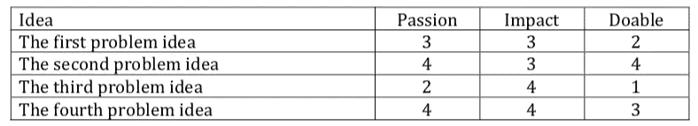
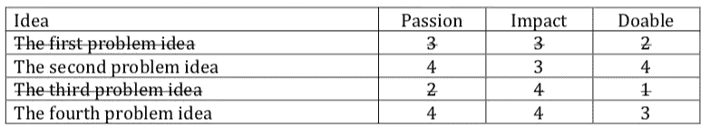
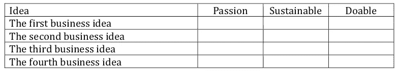

# 构思新业务的 6 个步骤

> 原文：<https://medium.datadriveninvestor.com/6-steps-to-conceive-a-new-business-5c098d88ed70?source=collection_archive---------2----------------------->

Photo by [Danielle MacInnes](https://unsplash.com/@dsmacinnes?utm_source=unsplash&utm_medium=referral&utm_content=creditCopyText) on [Unsplash](https://unsplash.com/s/photos/begin?utm_source=unsplash&utm_medium=referral&utm_content=creditCopyText)

我知道，鉴于新冠肺炎的限制，我的许多拥有企业的朋友正在重新考虑他们的企业。一些朋友失业了，需要一种方法来维持生活——也许只是一份临时的兼职。有些人只是想加入进来，帮助改善他们社区的状况，而不是袖手旁观。

不管你的动机是什么，你可能会考虑开始某种新的业务。这里有一种方法可以有条不紊地思考构思一个好的商业创意的前端过程。它建立在我职业生涯早期作为创新顾问所做的工作之上。作为一名教练，我已经成功地使用了这个过程，你当然也可以自己使用它。

**第一步——探索值得解决的问题世界**

逛逛你感兴趣的社区。

1.  这个社区可以是地理上的——你的邻居，你的城市，你的国家，你的世界。
2.  它可以是一个同龄人群体——你的学校、你的游戏伙伴、你的体育伙伴、你的画家伙伴，或者你的黄毛西伯利亚地鼠爱好者伙伴。
3.  如果你已经在做生意，它可能是你现有的客户群或它的一个细分市场，你的市场，或你的行业同行。

 [## 在创业之旅中，拥抱学习|数据驱动的投资者

### 好像建立一个数百万美元的公司还不够困难，企业家必须额外照顾他们的…

www.datadriveninvestor.com](https://www.datadriveninvestor.com/2018/10/16/on-the-entrepreneurial-trek-embrace-the-learning/) 

对于每个让你感兴趣的社区，问自己这三个问题。

1.  什么东西坏了或需要修理——结果是谁遭殃了？
2.  遗漏了什么——结果是谁遭殃了？
3.  发生了什么样的不公正——结果是谁受苦？

如果你使用这种方法是因为新冠肺炎震撼了你的世界，考虑一下问同样的问题，从短语“作为新冠肺炎约束的结果”开始。

使用头脑风暴法来写下你想到的任何事情。列一个长长的清单。不要担心会有一个非常长的列表——我们稍后会削减它。

不要担心细节，只要把主要思想写下来就行了。

请注意，你在这里头脑风暴的是问题思路，而不是商业思路。我们会谈到这些，但让我们首先找到一个值得解决的问题。

**第二步——缩小值得解决的问题的范围**

把每个问题的想法写下来，也许用电子表格。

根据这三个标准给每个想法打分。我喜欢用 1 到 4 的范围。不要想太多——快速给他们打分。

1.  获得激情——这是我真正想要解决的事情吗？我对修复它有多大热情？
2.  得分影响—修复它会产生我想要在社区中产生的影响吗？它真的对社区有帮助吗？
3.  得分可行性——对我来说这看起来可行吗，即使可能有点牵强？我有解决这个问题的知识和技能吗？

你可以有一个类似这样的电子表格，除了有一个更长的列表。

大多数人接下来会合计分数，看看 idea 分数最高。不要！那是个陷阱。

接下来我们真正想要的是消除那些显然不属于这里的想法。它们通常很明显。把它们划掉！

1.  我寻找那些我并不真正感兴趣的想法，比如第一个和第三个想法。如果你对你所做的事情没有热情，你要么会因为缺乏兴趣而失败，要么最终会讨厌它的每一分钟。
2.  接下来，我寻找那些我真的没有资源去实现的想法。在这种情况下，想法一和三有一个可行性问题。

您可能需要更进一步，评估影响程度，但在这个小例子中，我们显然已经有了两个不错的选择——想法二和想法四。这就是我们想要的——两到四个首要问题想法的简短列表。

**步骤 3——选择一个值得解决的问题进行跟进**

一旦你划掉了那些显而易见的不可行的事情，缩小了你的清单，你就会忽略这些数字，做出一个定性的决定。

*   哪个想法最吸引你？
*   哪个在召唤你？
*   哪一个代表了你的身份、你的品牌、你的存在或你的灵魂？

挑那个！但是，把其他的放在你的口袋里以防万一。

**第四步——探索解决这个问题的赚钱方法。**

就像你头脑风暴解决问题一样，现在头脑风暴解决你想要解决的问题的产品或服务。对于那个问题，问自己这些问题。

1.  对于这个问题。我可以制造和销售什么产品？
2.  对于这个问题，我可以制造和销售什么服务？
3.  对于这个问题，我可以转售什么产品或服务？
4.  对于这个问题，我能卖什么，哪怕只是解决了一小部分问题？
5.  对于这个问题，经历它的人真正想要的是什么？
6.  对于这个问题，我可以合法地设计一个(也许更好的)版本，现在卖的是什么？

尽可能多地写下你的想法。头脑风暴——意思是写下所有事情，不管它看起来有多傻。不要预先判断一个看起来不合适的想法——补充一下，我们以后再来判断。

**第五步——缩小商业想法的范围**

你知道该怎么做。制作一个列表或电子表格，从 1 到 4 给商业想法打分。

你仍然会对激情和可行性评分，但现在你看到了一个新的评分标准——可持续性。

1.  获得激情——仅仅因为你对要解决的问题充满激情，并不意味着你会对每个解决问题的商业想法充满激情(或同样充满激情)。
2.  给可持续性打分——可持续性是创意的潜在货币价值。想想每笔销售你能赚多少毛利。想想市场有多大。想想你每月可能需要多少固定成本来经营这项业务(但是要节俭——这不是许愿井)。
3.  评估可行性——你有制造产品或服务的技能或人脉吗？你知道如何联系目标市场和买家吗？启动这项业务需要多少成本——你负担得起或筹集到这笔资金的可能性有多大？如果你因为新冠肺炎震撼了你的世界而用这个过程来集思广益，考虑一下这些距离限制的可行性。

像以前一样，无情地划掉想法，删除那些明显没有意义的想法。

*   一些你有热情并且能够做的事情，但是不会在经济上支持你的事情需要被划掉。
*   一个你做不到的伟大的可持续想法必须被划掉，不管它听起来有多酷或者你对它有多热情。
*   一个高度可持续和高度可行的想法，你显然没有热情去做，需要划掉。对许多人来说，这是一个艰难的决定，尤其是那些现在需要钱的人。如果你确实是因为经济原因开始的，要认识到，随着时间的推移，你缺乏激情可能会导致你讨厌它或失去兴趣并失败。

**第 6 步——选择最好的一个商业创意进行开发并发布**

你知道该怎么做。就像以前一样，是时候从你的短列表中选择一个想法了。你可以把第二名放在口袋里，以防第一个想法没有实现——或者当你想增加更多产品或服务时。你的内心说你想跳进什么？

捡起来！创造它。启动它。

有很多资源可以帮助你。

*   查看设计思维实践，深入理解客户的情况和需求。
*   看看精益创业世界的创业流程。
*   看看 StoryBrand 讲讲你的品牌故事。你通过设想一个问题和一个遭受这个问题折磨的群体开始了整个过程，所以你可以很容易地从那里填充故事。
*   你当地的小企业管理局或小企业发展中心提供免费顾问来帮助你。
*   SCORE 提供免费的导师来帮助你。
*   您当地的社区可能有预加速器或加速器计划来帮助。建筑协会和 gener 8 tor gBETA 项目在我所在的社区开展，我们的妇女经济机会中心提供了一个妇女创业项目。过去，公司创始人在这里经营。你的社区可能会有类似的东西。

祝你成功！