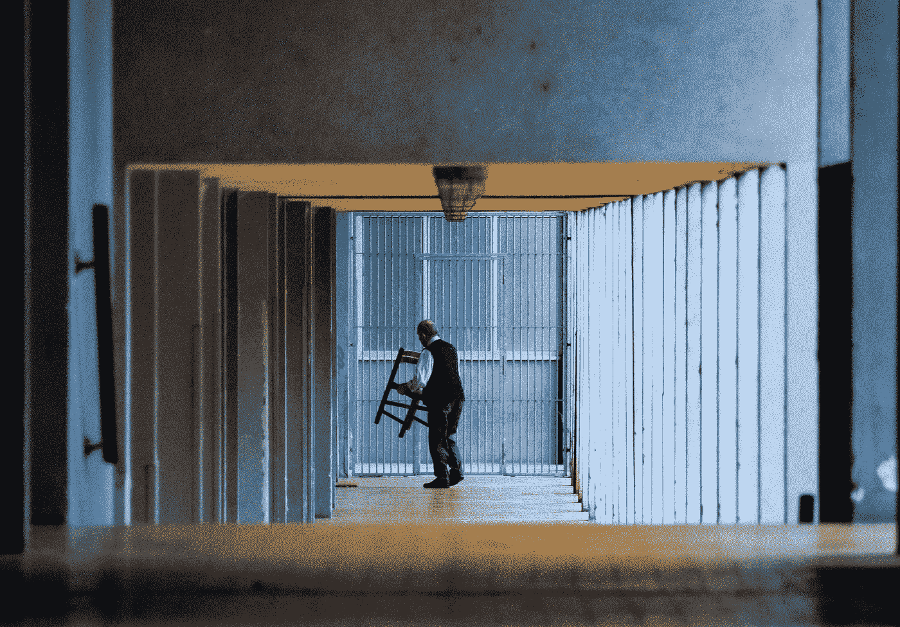

# 热爱你讨厌的工作的 6 个步骤

> 原文：<https://medium.datadriveninvestor.com/6-steps-to-love-the-job-you-hate-b9cf211dad3d?source=collection_archive---------7----------------------->

当你想恨它的时候，想办法去爱它。

Photo by [Emiliano Fanti](https://unsplash.com/@emiliano_fanti?utm_source=unsplash&utm_medium=referral&utm_content=creditCopyText) on [Unsplash](https://unsplash.com/s/photos/mop-floor?utm_source=unsplash&utm_medium=referral&utm_content=creditCopyText)

你被困在你讨厌的工作中了吗？现在可能不是换工作的最佳时机，如果你有工作的话。这意味着你向新生活的过渡比你想象的要远。

当你不能马上去任何地方的时候，你能做什么？如果真的很讨厌又能怎么样呢？

你害怕醒来去那里。你很清楚会有多惨。你让自己去工作，结果证明你是对的。恐惧。

人们找工作有很多不同的原因。支付账单，作为敲门砖，创造工作历史，学习一门手艺，或者了解一家公司是如何运作的。你可以做一份临时工作来了解可能的职业。在每份新工作中，你都可能希望找到一份梦寐以求的工作。

你怎么可能学会热爱一份你讨厌的工作，更别说容忍它了？

这似乎是一项不可能完成的任务。

所有的工作都有令人厌烦、单调、肮脏、困难或不愉快的任务。不管你喜不喜欢，有些事情是必须要做的。所有的生活都是如此。地板必须拖干净，顾客必须得到帮助，箱子必须打包和拆包，你的工作必须让你的老板满意。

 [## 良好的生活是习惯的形成|数据驱动的投资者

### 过度思考是过度紧张。仅仅几个简单的习惯就会在一天中产生巨大的影响。那是…

www.datadriveninvestor.com](https://www.datadriveninvestor.com/2020/01/17/a-good-life-is-habit-forming/) 

如果你在一份你讨厌的工作中，没有出路，你也可以想办法让它变得可以忍受。你可能会喜欢它，甚至找到爱上它的方法。

## **1-放弃你讨厌它的需要**

在某个时候，你决定接受这份工作。你在一个清单上、一个标志上发现了它，或者从一个朋友那里听说了它。为了得到这份工作，你必须面试。有时需要几周，有时需要几天。不管怎样，你都努力去得到这份工作。然后你开始工作，经过公司培训。从那以后你就一直在那里工作。

你想要这份工作。

这可能仅仅是为了报酬，也许你喜欢这个位置，或者这是一份你在得到它之前就非常想要的工作。事情变了。你长大了，人们变得很可怕，或者任何原因。不喜欢一份工作总有理由。

放弃吧。

当你醒来告诉自己你的工作很糟糕时，你猜怎么着？会的。如果你想能够忍受你的工作，放弃你讨厌它的需要。

一开始会觉得有点奇怪。你可能会想，“我不想讨厌这个，但我真的很讨厌。”如果你试着不去讨厌它，你会被拉回到“太糟糕了，太臭了”的方向。然后你又开始讨厌它。

这是一种“讨厌你的工作”的习惯。别说了。

可能需要一两天来克服这种感觉。尽你所能与之抗争。以下步骤将有助于你的努力。

## **2-找到一件你喜欢的事情**

确实有一点是你喜欢的。可能是制服，闪亮的地板，免费的咖啡，你的桌子，或者复印机的使用。不管是什么，找一件你喜欢的事情去专注。

我有过很多老板喜欢大喊大叫的工作。大部分是针对其他人，但偶尔，我也会受到指责。因为那些人，我可能讨厌我的工作。比起讨厌大喊大叫的人，我更喜欢其他人。我在大喊大叫的人周围尽了最大努力，主要是为了不让他们大喊大叫。

当你觉得一天中的任何时候都可能被吼的时候，去工作就没有乐趣了。没有人想成为目标。

选择一件你喜欢的工作。当你的工作变得有压力时，把你的想法集中在你有多喜欢你工作的那一部分。

不要忽视其余的，专注于并看到自己享受你喜欢的一个好处或方面。你会发现自己感觉好多了。

## **3-转移你的想法**

> "关注积极的海洋，而不是消极的水坑."
> 
> ―凯文·安斯布罗

当你关注消极的一面时，它会影响你对工作其余部分的理解。当你关注积极的一面，你就会开始享受它。

我们被我们喜欢的东西吸引，逃离我们害怕或不喜欢的东西。

把对工作不利的、无益的想法推开。这些应该在你的脑海中占据很少的时间和空间。

放大积极面。看到这份工作的好处，比如有趣的(有同情心的)同事，好吃的甜甜圈，或者薪水支票。

当你不在工作的时候，不要让它占据你的时间和思想。

如果你像现在许多人一样在家工作，设定一个截止时间。一旦时间到了，不要再谈论或思考工作。把工作和休息时间分开，让精神得到休息。

许多人都沉浸在当天、一周或过去某个时刻工作中的消极情绪中。重温消极。如果你不得不考虑工作，那就积极一点。

## **4-利用你目前的职位提高你的技能**

> “事实上，在这个世界上没有什么是不可能的，只要你下定决心，保持积极的态度。”
> 
> —卢·霍尔茨

证明你有能力做得比现在的工作更好。把它作为通向你更喜欢的东西的一步。一份你一直想做的工作。

如果你现在的工作很差，你就没有机会换到你真正想要的工作。你可能永远也不会成功，但是拥有良好的态度会有所帮助。

没有人愿意和一个总是抱怨别人、抱怨他们的生活或工作的人一起工作。

顾客和员工喜欢积极的态度，即使他们并不积极。如果你心情好的话，你可以把别人也放进去。

我丈夫的一个朋友得到了一份工作，因为他在复杂的情况下处理自己的方式。他保持冷静，微笑着迅速找到解决办法。

想一个你能在当前职位上提高的技能。也许是与客户或同事互动。也许是更有条理了。可能是提前截止了。

当你专注于你能做得更好的时候，你不会去想哪里错了。

## **5-选择一个新的视角**

认为别人和你想法一样是很常见的。认为他们和你有同样的感受，以你的方式看待一切。他们没有。

每个人都有一个由他们的生活经历组成的独特视角。我们对周围发生的事情都有不同的看法、感受和感受。

你可能有类似的经历，但即使是家庭成员也有不同的理解(有时是故意的)。

你有没有在会议结束后和同事讨论过这个问题？你很快意识到你们对结果有完全不同的看法。

你的观点受到你之前生活的影响，包括你不喜欢你的工作。

当你不再需要讨厌你的工作时，想想你喜欢它的一点，把你的注意力转移到积极的方面，你的观点会开始改变。你可以让它或快或慢地发生。

评估你的工作。问问自己为什么重要。为什么它甚至是一份工作？大部分公司都没有不必要的岗位。不必要的工作浪费金钱。

你的工作很重要。你是受托做这件事的人。把它当作荣誉徽章。

换个视角。

## **6-以积极的态度尽力而为**

> “积极的态度会引发积极想法、事件和结果的连锁反应。这是一种催化剂，能激发出非凡的效果。”
> 
> —韦德·博格斯

不管工作有多糟糕，你都应该努力做到最好。有时候，你不想尽力而为。有时候你会带着你最好游戏出现。对别人来说显而易见。

谁都知道谁是懒鬼。谁是抱怨者，谁没有执行，谁把别人的工作归功于自己。你永远不应该成为那样的人。

总是出现，尽你所能。每一天。如果你认真对待第三步，你正在提高你的技能，你已经比昨天做得更好了。

观察那些成功或超越你的人。至少，找出他们在做什么。观察他们采取的步骤并模仿他们。

用积极的态度去做。当你和他们一样优秀的时候，找一个更好的。不断提高你的极限。

我们通过实践学习一切。如果目前不自然，练习积极的态度。感受积极，看到自己积极，听到自己说积极的话。

态度是享受任何事物的关键。你以积极的态度做每一件事，你会发现自己乐在其中。

## **你想热爱你的工作还是讨厌它？**

你决定吧。

大多数工作包括每周 40 小时或更多的工作。一年 2000 小时左右。你想花 2000 个小时憎恨你的生活还是享受你所做的工作？

当你喜欢你的工作时，你的日子会变得更加愉快。你的压力会小一些。当你热爱你的工作时，你的整个人生观都会变得更好。

热爱你所做的事情，让你的生活更美好。