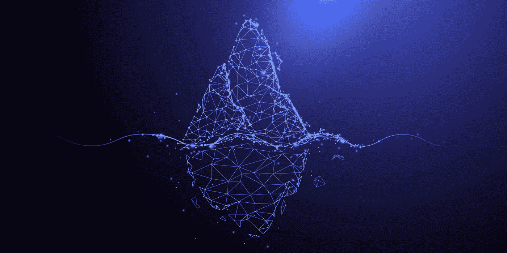
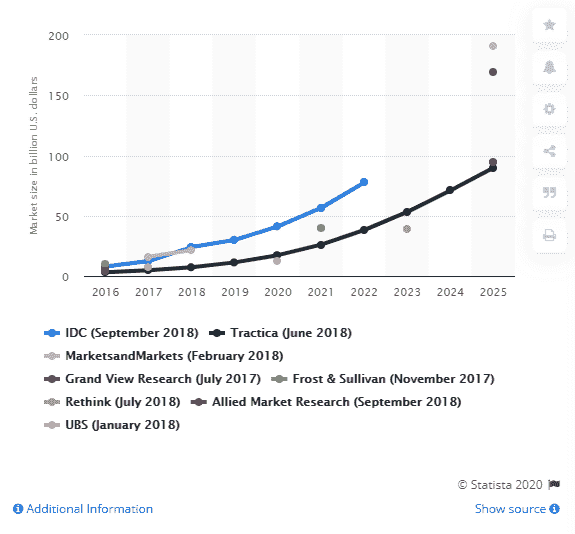
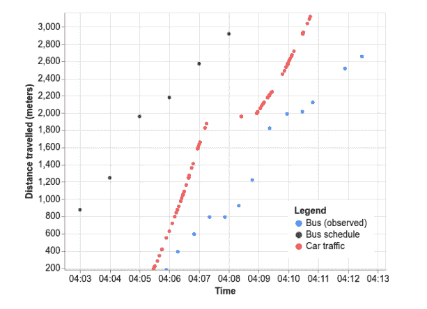
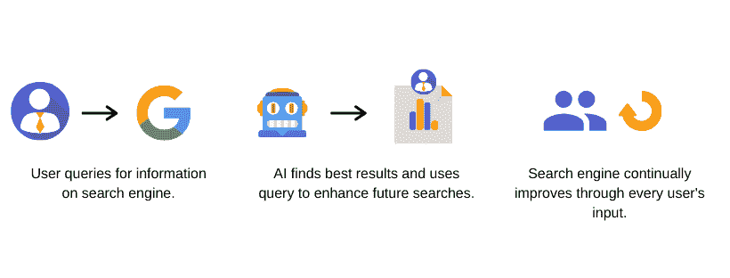
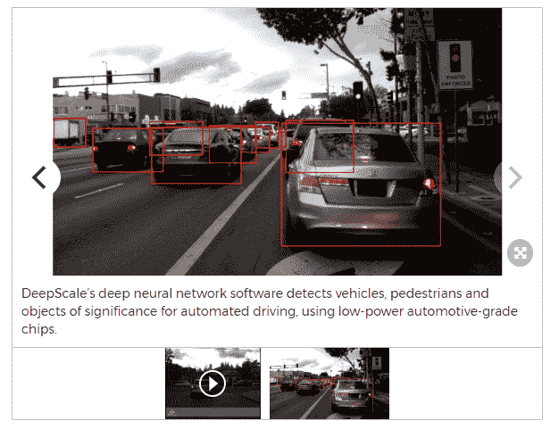
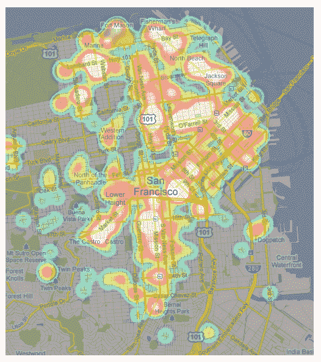

# 你不知不觉中使用人工智能的 6 种令人惊讶的方式

> 原文：<https://medium.datadriveninvestor.com/6-surprising-ways-youre-using-ai-without-realizing-it-f3e77e42e019?source=collection_archive---------10----------------------->

你使用人工智能比你意识到的要多得多。事实上，我敢打赌你每天都在使用它，而没有注意到它。

当你听到人工智能时，很容易想到复杂的机器人和自动驾驶汽车(稍后会有更多相关内容)，但它还有许多其他方式融入我们的生活。

鉴于[人工智能市场规模估计](https://www.statista.com/statistics/941835/artificial-intelligence-market-size-revenue-comparisons/)价值高达 1900 亿美元，随着时间的推移，这将变得更加明显。

尽管如此，人工智能正在节省你的能量，保护你的安全，让你的生活在你的眼皮底下变得更加方便。

想看看怎么样吗？继续读。

# 1.谷歌地图

还记得上次你和你的孩子开车去小屋吗？是的，那是人工智能。它帮助您保持安全，并让您更快地到达目的地。

这是因为谷歌地图，就像大多数地图应用程序一样，是由人工智能驱动的。随着交通和道路状况的变化，它能够实时找到最快和最安全的路线。

 [## 人工智能与创造力:梦想成真|数据驱动的投资者

### 人工智能总是让我着迷。不仅作为一套有用的工具，不断发展，而且作为一个…

www.datadriveninvestor.com](https://www.datadriveninvestor.com/2019/01/28/ai-creativity-deep-dream-comes-true/) 

谷歌使用机器学习来分析[实时数据](https://morphio.ai/blog/blog/live-data-why-regular-analytics-is-a-thing-of-the-past)，并对行驶距离、潜在中断等做出预测。

看看他们如何使用[机器学习模型来预测城市中的公交车延误](https://ai.googleblog.com/2019/06/predicting-bus-delays-with-machine.html):

数据是从运输机构的反馈中提取的，这些反馈是关于与汽车交通速度及其计划停靠站相关的公共汽车位置的。这有助于像你这样的人按时上班、上学等。

这就引出了我的下一点。

# 2.搜索引擎

你好，谷歌。你能告诉我你是由人工智能驱动的吗？答案是*是的*。

谷歌和它的语音搜索对手都是人工智能日常使用的最好例子。当他们需要知道一些事情时，谁会不迅速拿出手机使用谷歌呢？

搜索引擎使用人工智能来预测你想要的搜索以及最相关的结果。机器学习还根据每年收到的数十亿条输入信息，不断完善搜索结果和推荐搜索。

这意味着你不仅在使用人工智能，你也在让它变得更加智能，并改善世界各地其他人的体验！

# 3.iPhone4S 上的语音控制功能

有多少次你听到“嘿，Siri”后面跟着一个问题？见鬼，你可能每天都自己做。从检查基本信息到安排事件，Siri 先进的[机器学习技术](https://morphio.ai/blog/blog/scaling-with-machine-learning-6-things-you-need-to-know)支持大量的用户命令。

此外，它能够检测语言，并提高其*能力*以获取口语单词。这是因为 Siri 使用了人工智能的分支，即自然语言处理(NLP)和自然语言生成(NLG)。)

你也可以把 Siri 想象成一个搜索引擎。它使用从用户那里收到的信息来改进下一个查询。错误和正确答案都被记录下来，以增强整个答案数据库。

还有一个很酷的事实:Siri 的联合创始人达格·基特劳斯[将这项技术命名为 Siri](https://www.networkworld.com/article/2221246/steve-jobs-wasn-t-a-fan-of-the-siri-name.html) ，因为它在挪威语中的意思是“带领你走向胜利的美丽女人”。

这就是我如何看待人工智能:一种推动我们实现目标的技术。

# 4.你开过特斯拉吗？

不管你对特斯拉 Cybertruck 有什么看法(请在评论中告诉我)，埃隆·马斯克是个天才。特斯拉汽车中实施的自动驾驶技术是人工智能和机器学习的一个很好的例子。

首先，汽车能够在交通中导航、加速、停车、变道等等。它实际上是活的。此外，机器学习不断提高汽车导航的安全性，学习新的道路等。

这也要归功于 [DeepScale 深度神经网络软件](https://www.prnewswire.com/news-releases/deepscale-attracts-15-million-investment-to-advance-automated-vehicle-perception-300623164.html)，它可以检测重要的物体。

这些包括行人、车辆、碎片和其他可能在驾驶时靠近你的物品。人工智能不断学习如何更好地检测和导航这些东西，以持续更安全地驾驶。

# 5.优步

你和几个朋友出去喝了几杯。你怎么回家？最有可能是优步或 Lyft，对不对？你可以感谢人工智能让你安全到家。

这是因为像优步这样的拼车应用程序使用人工智能来确定你的乘车价格，最大限度地减少等待时间，为你选择司机等。

例如，[优步热图](https://www.wired.com/2011/04/app-stars-uber/)向司机展示了交通流量大的地区，那里的乘车需求会很高。

这是怎么做到的？你猜对了:*人工智能*。他们的系统根据需求和天气预报数据来测量和预测需求。

无论你是使用像优步这样的应用程序来创收还是在城里四处走动，人工智能在两方面都发挥着作用。

# 6.收件箱的垃圾邮件过滤器

我们都会收到垃圾邮件。事实上，每天大约有[145 亿条垃圾短信被发送](https://www.spamlaws.com/spam-stats.html)。

然而，很多时候它们从来不会映入你的眼帘。这是为什么呢？*垃圾邮件箱*。这是每个电子邮件平台不可或缺的一部分，如果你不知道的话，它是由人工智能驱动的。

垃圾邮件过滤器足够智能，可以在对其进行适当过滤之前，识别出哪些邮件似乎是由人类或机器人发送的。此外，一些人使用机器学习来获取共同的特征和模式，以不断给你更好的电子邮件体验。

# 最后的想法

人工智能并不像有些人想象的那么可怕。它不仅仅局限于商业领域，事实上，它无处不在。

从我们使用的应用程序到公共交通，一切都在与人工智能集成。最棒的是，我们没有意识到这一点，因为它太微妙了。它改善了我们的日常生活。

这正是为什么更多的公司需要采用这项令人惊叹的技术。想看看人工智能如何让你的日常业务运营变得更容易吗？[免费试用 Morphio】。](https://app.morphio.ai/register)