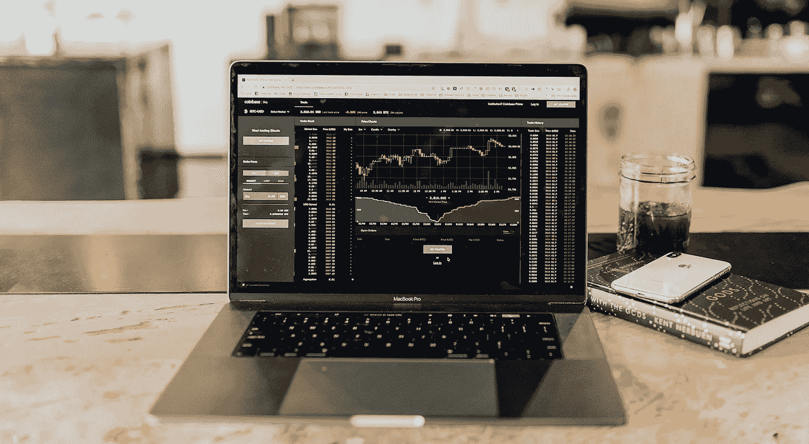
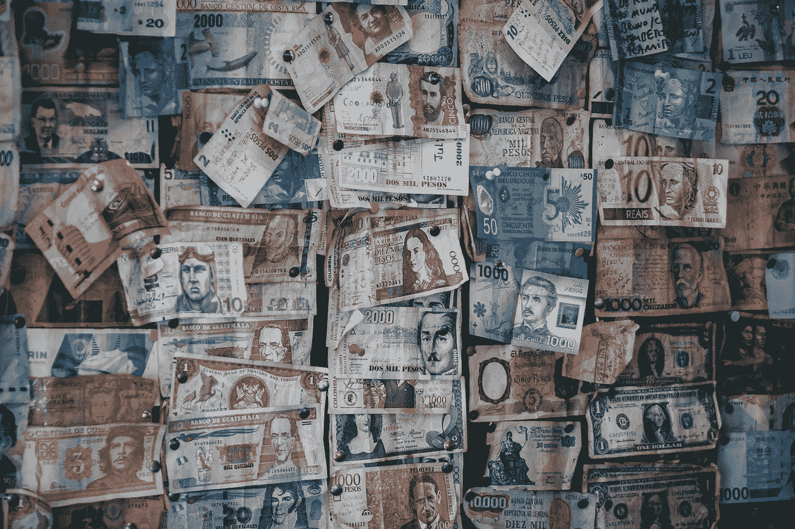

# 关于期货交易你需要知道的 6 件事

> 原文：<https://medium.datadriveninvestor.com/6-things-you-need-to-know-about-future-trading-c6ed6dda8bb3?source=collection_archive---------1----------------------->

## 让你开始期货交易的简要指南

L 让我们开门见山:**期货**是利用基础资产或市场的看跌或看涨运动的伟大交易工具。这篇文章向您提供了入门所需的基本知识…

Photo by [Austin Distel](https://unsplash.com/@austindistel?utm_source=unsplash&utm_medium=referral&utm_content=creditCopyText) on [Unsplash](https://unsplash.com/s/photos/trading?utm_source=unsplash&utm_medium=referral&utm_content=creditCopyText)

# ***相关文章***

[为什么你伟大的交易想法一开始都是次要的](https://medium.com/datadriveninvestor/why-your-great-trading-idea-is-secondary-at-first-7282d206fd7a)
[我可以建立自己的交易系统！](https://medium.com/@thomas.reinecke/how-does-an-auto-trading-system-work-3baef2c67c84)

# 1 —什么是期货合约？

期货是衍生金融合约*(指它们的市场价格来源于基础工具)*使双方有义务在预定的未来日期和价格交易资产。换句话说:期货合约是在未来特定时间以预定价格购买或出售商品、货币或其他工具的协议。有两种主要类型的期货合同:

*   **商品期货**是进行实物交割交易的合约，如大豆( **ZS** )、玉米( **ZC** )和可可( **CJ** )
*   金融工具期货是以现金结算结束的合约。它们可以包括股票、货币、债券和指数中的基础资产，例如标准普尔 500 指数( **ES** )、纳斯达克 100 期货指数( **NQ** )、道琼斯指数( **YM** )

以玉米等**商品**为例，期货合约传统上用于(现在仍然可以)对资产的未来价格进行投机，包括在特定交割日期以约定价格进行商品的潜在实物交割(实物结算) :

然而，本文更侧重于**金融工具期货**，它在期货结算日进行现金结算。

 [## 算法交易的机器学习|数据驱动的投资者

### 当你的一个朋友在脸书上传你的新海滩照，平台建议给你的脸加上标签，这是…

www.datadriveninvestor.com](https://www.datadriveninvestor.com/2019/01/30/machine-learning-for-stock-market-investing/) 

在加密货币的背景下，**永续期货**是不会到期的期货合约。与传统期货不同，永久合约的交易价格通常等于或非常接近其基础市场。所以一个职位可以保持多久就保持多久。

# 2 —你能对未来合约做些什么？

在金融行业背景下，期货合约通常具有以下一些功能:

*   **套期保值和风险管理:**期货合约可以用来减轻特定的风险。举一个商品的例子:尽管市场波动，农民可能会出售他们产品的期货合同，以确保他们在未来获得一定的价格。或者，持有美国国债的欧洲投资者可以购买金额等于利率的欧元美元期货合约，以此将票面价值锁定在预定的欧元利率。这样他就对冲了美元风险。

 [## 股票指数期货的套期保值和风险管理-芝加哥商业交易所集团

### 了解有关计算股票指数期货名义价值的更多信息，以帮助您管理风险。

www.cmegroup.com](https://www.cmegroup.com/education/courses/introduction-to-equity-index-products/hedging-and-risk-management-for-equity-index-futures.html) 

*   **杠杆:**投资者可以用期货建立杠杆头寸。杠杆是用相对较少的资本控制较大合同价值的能力。杠杆意味着交易者在交易时不需要拿出 100%的合约价值。相反，经纪人会要求一个[初始保证金金额](https://www.investopedia.com/terms/i/initialmargin.asp)，这个金额是总合约价值的一部分。例如，50:1 的杠杆比率(以 **ES** 期货为例)允许交易者进入比他们实际交易账户余额大 50 倍的头寸。

 [## 杠杆的力量——CME 集团

### 杠杆可以让你用相对较少的资金控制较大的合同价值。学习如何使用…

www.cmegroup.com](https://www.cmegroup.com/education/courses/understanding-the-benefits-of-futures/the-power-of-leverage.html) 

*   **空头敞口:**期货合约允许投资者持有一项资产的空头头寸，这意味着即使投资者并不拥有一定数量的股票，也要卖出这些股票，并期望在价格理想地下跌后回补(通过回补)这些股票，从而获得总收益/利润。当投资者决定在不拥有标的资产的情况下卖出期货合约时，通常被称为[“裸”或“未覆盖”头寸。](https://www.investopedia.com/terms/n/nakedposition.asp)
*   **资产品种:**投资者可以对难以直接交易的资产进行投资。尤其是像大豆或油这样的商品，运输成本通常很高，并且涉及很高的储存费用。通过使用期货合约，投资者和交易者可以对更广泛的资产类别进行投机，而不必进行实物交易甚至拥有它们。
*   **价格发现:**期货市场是多种资产类别(如大宗商品或金融工具)的卖家和买家的一站式商店。例如，石油价格可以根据期货市场的实时需求来确定，而不是通过加油站的本地互动来确定。

Photo by [Carlos Muza](https://unsplash.com/@kmuza?utm_source=unsplash&utm_medium=referral&utm_content=creditCopyText) on [Unsplash](https://unsplash.com/s/photos/chart?utm_source=unsplash&utm_medium=referral&utm_content=creditCopyText)

# 谁交易期货，为什么？

期货合约被两类市场参与者使用:[套期保值者](https://www.investopedia.com/terms/c/commercial-hedger.asp)和[投机者](https://www.investopedia.com/terms/s/speculator.asp)。

**套期保值者**利用期货来保护基础[现货商品](https://futures.tradingcharts.com/glossary/a-c.html#cashcommodity)免受不利的未来价格波动。套期保值的基本原理是基于现金价格和期货价值同步变动的趋势。

投机者是期货玩家的第二大群体。这些市场参与者包括独立的场内交易者和投资者。独立场内交易者，也称为“本地人”，为自己的账户交易。场内经纪人为他们的个人客户或经纪公司处理交易。与其他投资相比，期货具有重要优势:

*   **流动性:**通常期货具有很大的流动性；特别是在金融工具期货上，供应和需求通常非常高，交易执行可以接近实时地进行，允许最小化滑点和执行等待时间。例如，在过去 10 年中，ES 平均每天有大约 43，000 个滴答。它给你 24 小时平均 12 点/分钟，或者每 5 秒钟一次进出市场的机会。当然，在正常的交易时间里，ES 的流动性要大得多，因为你每秒钟都有多次交易机会，所以你更有可能得到你想要的价格。
*   **杠杆效应** —杠杆意味着交易者只需投入少量资金就能控制大量产品。如果在任何方向持有头寸，金融工具期货上的每个点都会随着工具乘数移动未实现的业绩/损失(PL)。 [YM](https://www.cmegroup.com/trading/equity-index/us-index/e-mini-dow.html) 开 5(表示[上的一点 YM](https://www.cmegroup.com/trading/equity-index/us-index/e-mini-dow.html) 移动你的 PL 的金额为 5 美元) [NQ](https://www.cmegroup.com/trading/equity-index/us-index/e-mini-nasdaq-100.html) 用 20， [ES](https://www.cmegroup.com/trading/equity-index/us-index/e-mini-sandp500.html) 和 [RTY](https://www.cmegroup.com/trading/equity-index/us-index/e-mini-russell-2000.html) 自带 50。然而，乘数较高并不一定意味着这些工具风险更大，因为它们通常以 1 的约数变动。由于 [YM](https://www.cmegroup.com/trading/equity-index/us-index/e-mini-dow.html) 以 1:1 的比率移动，而 [NQ](https://www.cmegroup.com/trading/equity-index/us-index/e-mini-nasdaq-100.html) 以 1:4 的比率移动，因此对于最小的可能分笔成交点，两者的 PL 金额都是相同的 5 美元。这里重要的是，杠杆效应允许每天赢(但也输)几百美元。
*   **多样化—** 期货合约可以为股票和债券等传统金融资产的投资组合提供多样化，降低投资组合的整体风险，增加总利润。
*   **24x5 交易** —特别是金融工具期货是 24x5 交易，在正常交易时间后仍具有合理的流动性。对早或晚的消息做出反应，或者只是为了简化交易算法，这种品质是一个重要的区别。
*   **每日波动(也有很高的修正)**——双向波动，这使得期货非常适合做多和做空交易。每一个动作都创造了盈利(或亏损)的理论机会。
*   **佣金是合理的** —与其他投资相比，期货交易的佣金很少，投资者在头寸平仓后支付。

# 4 —期货合同的退出策略

在获得期货合约头寸后，期货交易者可以执行三个主要操作:

*   **抵消:**这意味着通过创建相同股份数量的反向交易来结清期货合约头寸。举个例子，如果一个交易者做空 YM 10 期货合约，开一个相同大小的多头头寸将抵消最初的头寸。[抵销](https://www.mtholyoke.edu/courses/sgabriel/securities1/futures/offsetting.htm)允许交易者在结算日之前实现损益。
*   **展期:**如果一个交易者想要延长一个即将到期的期货的到期日，在抵消他们最初的到期日之后，一个新的期货合约头寸可以在一个到期日更晚的期货合约(相同标的)上进行。例如，如果交易者做多了 3 月 20 日到期的 10 份 YM 合约，但希望将头寸延长到下一个季度，则可以关闭初始头寸，并在 6 月 19 日在 YM 开立相同规模的新头寸。
*   **结算:**如果有效的多头或空头头寸没有被抵消或滚转，合同将在到期日结算。此时，参与各方在法律上有义务根据其地位交换其资产(或现金)。

# 5 —期货和自动交易系统

期货实际上是自动化交易系统中最完美的工具。[每一个伟大的交易想法](https://medium.com/datadriveninvestor/why-your-great-trading-idea-is-secondary-at-first-7282d206fd7a)都是从工具开始的，关键是它有非常特殊的特性，非常适合交易系统。

 [## 为什么你伟大的交易想法在一开始是次要的

### 一个让你对个人算法交易的优先次序一目了然的指南

medium.com](https://medium.com/datadriveninvestor/why-your-great-trading-idea-is-secondary-at-first-7282d206fd7a) 

上面提到的杠杆效应、低佣金、高流动性、24x5 交易、最小滑点的直接执行是自动化交易方法成功的关键驱动因素。

# 6 —最受欢迎的期货合约

我只关注这里和美国市场的金融工具期货，这些工具都非常适合用于自动交易系统:

**ES :** E-mini S & P 500，GLOBEX，乘数 50
MES:微 E-mini S & P 500 股价指数，GLOBEX，乘数 5
NQ:E-Mini 纳斯达克 100 期货，GLOBEX，乘数 20
**MNQ :** 微 E-Mini 纳斯达克 100 指数，GLOBEX，乘数 2
**YM : 【T13 乘数 0.5
**RTY :** E-Mini 罗素 2000 指数，GLOBEX，乘数 50
【T21:**微型 E-Mini 罗素 2000 指数，GLOBEX，乘数 50

# 关闭思路和来源

期货合约是金融行业中最常用的工具之一，其各种功能使其适用于广泛的用例。尽管如此，在进行投机之前，很好地理解期货合约及其特定市场的基本机制是很重要的。

 [## 期货

### 期货是一种衍生金融合约，它使双方有义务在预定的未来交易一项资产…

www.investopedia.com](https://www.investopedia.com/terms/f/futures.asp)  [## 什么是远期和期货合约？币安学院

### 本质上，远期和期货合约是允许交易者、投资者和商品生产者…

www.binance.vision](https://www.binance.vision/economics/what-are-forward-and-futures-contracts)  [## 期货是如何用来对冲头寸的？

### 期货合约是用来对冲风险的最常见的衍生品之一。期货合约是一种安排…

www.investopedia.com](https://www.investopedia.com/ask/answers/06/futureshedge.asp)  [## 什么是永续期货合约？币安学院

### 期货合约是以预定价格买卖商品、货币或其他工具的协议…

www.binance.vision](https://www.binance.vision/economics/what-are-perpetual-futures-contracts)  [## 期货市场

### 目录|公司金融课程|该网页由 99 级 Julia Lee 创建，由教授维护

www.mtholyoke.edu](https://www.mtholyoke.edu/courses/sgabriel/securities1/futures/futuresmain.htm) 

如果你喜欢这个故事，并想在 medium 上阅读成千上万个这样的故事，你可以成为 medium 会员，每月仅需 5 美元。如果你愿意支持我的写作，请使用我下面的推荐链接，我将免费获得你的一部分会员资格。

[**https://medium.com/@thomas.reinecke/membership**](https://medium.com/@thomas.reinecke/membership)