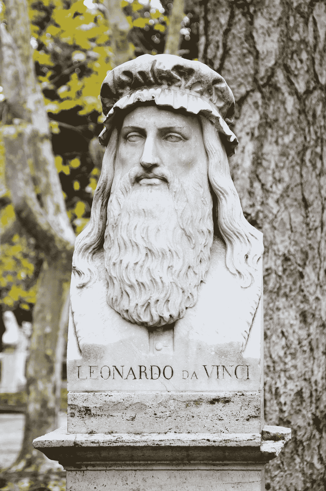

# 6 堂永恒的课，像达芬奇一样开发你的创造力

> 原文：<https://medium.datadriveninvestor.com/6-timeless-lessons-to-develop-your-creativity-like-leonardo-da-vinci-b3e996b24038?source=collection_archive---------13----------------------->

Photo by [Blaz Erzetic](https://unsplash.com/@www_erzetich_com?utm_source=medium&utm_medium=referral) on [Unsplash](https://unsplash.com?utm_source=medium&utm_medium=referral)

莱昂纳多·达·芬奇是文艺复兴时期最伟大的大师之一，他在艺术和科学领域的创新改变了人们看待许多事情的方式，由于他对人类不同领域的兴趣，成就使许多领域趋于完美，使他成为画家、雕塑家、作家、建筑师、哲学家和科学家。他的工作标志着一个前和后的方式构思世界和生命。

事实上，达芬奇患有严重的阅读障碍，尽管他能用双手写字和画画，但他也可以同时用双手写字，一只手向前，另一只手向后。尽管有阅读障碍，达芬奇有写作的天赋。

尽管列奥纳多·达·芬奇拥有所有这些学位，但在任何情况下，我们都无法想象他会拥有一个被公认为“视觉艺术或科学学士”的学位。更别说一个人说他在医学、烹饪、物理、工程或音乐方面的各种学位了。他比这要复杂得多，也是一个根深蒂固的自学者，他的好奇心和创造本能要求他想走多远就走多远。

在他的作品、著作、雕塑和论文中，我们可以在列奥纳多·达·芬奇的传记中看到，我们发现了一个非常有人情味的人，也就是说，一个有错误、不完美、矛盾和属性的人，使我们更接近历史上最著名的人之一。

让我们来谈谈列奥纳多·达·芬奇是如何发展他的创造力的:

# ***你可以分心***

列奥纳多·达·芬奇最受批评的是做了太多的活动，使他的头脑被占据，其中许多活动有时使他几乎发疯，尽管他总是抱怨自己没有足够的时间，然而，列奥纳多的这种需求和渴望设法创造了一种习惯，当一个想法出现在他的脑海中时，他很快就寻找一种方法来实现它。

我并不是说你也应该这样做，你必须坚持你所做的任务，但是总是花点时间分散注意力和放松，培养一个健康的习惯，让你变得优秀。

# ***不忽略任何细节***

列奥纳多·达·芬奇的个性中最令人难以置信的特征之一是他永不满足的好奇心，在他的手稿中有证据表明他是如何好奇的想知道塑造面部表情的肌肉是什么，眼睛内部是如何处理光线的，或者为什么人们会打哈欠。这种好奇心促使他寻求新的体验和解决问题的方法。

在你日常生活的小细节中寻找，并把它们变成壮观和特别的东西，无论你是绘画、写书还是献身于艺术，小心观察一切，你会发现事物的光辉。

# ***保护你的想法***

列奥纳多·达·芬奇一生中最有趣的理论之一是，他以镜子的形式写作，这有一个特定的目的:保护他未来项目的想法。这就像一个安全机制，以防文件落入坏人之手，尤其是对天主教会而言。

这种解释多年来一直被不同的学者保留着，但是这个假设有一个失败之处:即使是倒着写，在经文上放一面镜子并轻松阅读它们也不需要花费任何成本。

尽管如此，有趣的是，达芬奇只对某些文件使用这种写作方式:那些内容与新项目或想法有关的文件。

你有没有注意到，当你和你身边的人谈论你的项目时，他们看到项目完成时没有同样的热情？还是他们不同意你正在取得成就？把你的计划留给自己，直到它们实现。

# ***在纸上列清单、记笔记:***

很多时候想法浮现在脑海中，我们让它们过去，然后我们想记住它们以便能够使用它们，它们不再回到我们身边，这就是为什么我们必须养成习惯，写下所有浮现在脑海中的东西，即使是一些愚蠢的东西，也许在你的创作时刻，你会使用它。

列奥纳多·达·芬奇的作品、雕塑和绘画是历史学家和科学家灵感和快乐的源泉，不仅因为它们是绘画，还因为在这些页面的边缘，列奥纳多写了各种各样的清单和注释。他脑海中出现的几乎所有想法。他们中的一些人说:“问工程师他是如何建造这座桥的”，“调查为什么天空是蓝色的”，“观察蜻蜓的翅膀是如何工作的”只是其中的一部分。

# **不要成为现代天才**

许多理论认为，今天没有像列奥纳多·达·芬奇那样的头脑，因为现代天才往往只专注于一门学科，这就是为什么我们问自己以下问题:当某人对一门学科了解很多而对其他学科不了解时，或者当他对许多学科只知道一点点时，他被认为是聪明的吗？也就是说，现在的天才不具备将学科连成一体的能力。

然而，这并不意味着列奥纳多没有把他的聪明才智归功于他与老师和朋友的学习和交谈。

不要只专注于一个话题，因为了解其他话题会让你的思维更加开阔，你描述和看待事物的方式也更加开阔，了解背景中的事物会在我们的头脑中建立一个坚实的基础，有助于它的成长。

# **完美将是美好的敌人**

在列奥纳多·达·芬奇的传记中显示，当他不能完美地实现安格里战役的透视(目前已丢失的画，1503 年至 1506 年间画在佛罗伦萨 Vecchio 宫五百人大厅的墙上)或国王崇拜的相互关系(这是画在一个面板上的油画，可追溯到 1481-1482 年，未完成的作品)时，他放弃了它们，而不是完成一个仅仅是好的创作。

直到生命的最后一刻，他都随身带着一些名作，比如他的《圣安妮》、《圣母子》和《蒙娜丽莎》,因为他知道自己总能给它们增添新的色彩。

列奥纳多知道真正的艺术家总是关心美，甚至是那些看不见的部分。

最后，有些时候像莱昂纳多那样做是可以的，在事情变得完美之前不要放弃。

你可能也喜欢阅读:

*   如何在你的博客上赚钱——赚第一笔钱的有效指南。
*   [斯蒂芬·金:7 种实用写作教学。](https://medium.com/datadriveninvestor/stephen-king-7-practical-teachings-on-writing-b07860080c8d)
*   [在亚马逊上赚钱的 5 种杀手锏](https://medium.com/@Stoiccopy/5-killer-ways-to-earn-money-on-amazon-c665b8d6f1f1)
*   成功:这真的需要吗？
*   每个广告文案都能从《广告狂人》中学到的 5 个惊人的教训
*   [关于优秀作家的 10 个独特视角](https://medium.com/bulletproof-writers/10-unique-perspectives-on-what-makes-a-good-writer-f41340e6b4ee)
*   [加布里埃尔·加西亚·马尔克斯——7 堂写作课](https://medium.com/bulletproof-writers/gabriel-garc%C3%ADa-m%C3%A1rquez-7-lessons-on-writing-3c21a9b9389e)
*   [如何用 7 个简单的步骤做市场调查？](https://medium.com/@Stoiccopy/how-to-do-market-research-in-7-easy-steps-ab20c2f7a6f2)

在推特上打招呼[@ stoicocopy](https://twitter.com/stoiccopy)