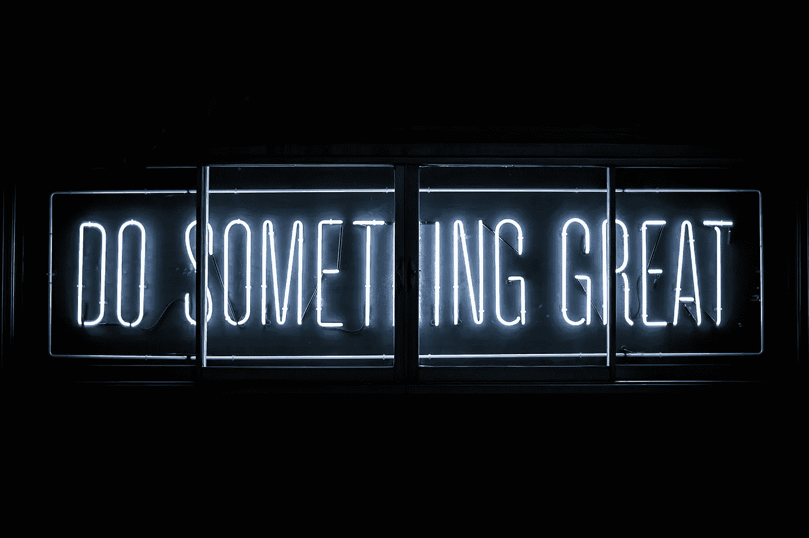

# 6 种方法来决定什么类型的网上业务开始

> 原文：<https://medium.datadriveninvestor.com/6-ways-to-decide-what-type-of-online-business-to-start-48c43d9616ab?source=collection_archive---------2----------------------->

## 如何在数字太阳下找到自己的位置

Picture by Clark Tibbs / [**Unsplash**](https://unsplash.com/photos/oqStl2L5oxI)

在线业务的诱惑从未如此引人注目。

可能性是无穷无尽的，灵活的自我雇佣的承诺现在促使数百万无聊的办公室职员去寻找他们的网上财富。

然而，许多想成为企业家的人不知道从哪里开始。

*我怎样才能进入这个独立于地点和个人日程安排的神秘宇宙？*

有很多方法可以开始网上职业生涯，人们经常在他们的路线的早期阶段跳来跳去不同的部门。

失败不是致命的，但是正确的起点可以帮助你带着更多的目标和毅力前进。

在网络生态系统中工作了 5 年多之后，我得出结论，正确的职业选择可以归结为 6 个*个人*属性。

在此基础上，这里有 6 个品质要考虑时，决定什么类型的网上业务开始。

# 1.你的性格

你是一个内向的人吗？你喜欢聚光灯吗？你在镜头前舒服吗，还是更喜欢在黑暗的地下室里表演 HTML 魔术？

当决定什么类型的网上业务开始，你首先应该好好看看自己。

如果你对网上创业很认真，你的性格将最终决定你创业的进程。

举个例子，如果你是一个谦虚胆小的人，写博客可能不是最好的选择。

是的，一些成功的 Youtubers 用户开始他们的职业是为了克服他们内向的天性。

在我的整个旅行中，我遇到过一些人，他们在摄像机前获得了成功，尽管他们最初很胆小。然而，这是*例外*，而不是常态。

如果你是一个沉思的内省者，脑海中浮现出无数复杂的想法，那么*写作*可能是一个更好的选择。

在这种背景下，许多著名作家都是糟糕的公众演说家，也不是最自信的社交名流。

举个例子，J.K .罗琳因害羞和尽可能不与人交往而出名。这并没有阻止她在未来几个世纪的英国文学史上留下自己的印记。

因此，每种类型的人格都可以在网络世界中繁荣发展。挑战在于识别你的决定性特质，并据此选择你的道路。

# 2.你推销自己的才能

根据你所处的行业，你推销自己的能力将对你的成长和收入产生重大影响。

影响者是一个典型的例子。

让我们快速了解一下 Instagram 的工作原理。顶级 insta grammer——即拥有数千甚至数百万粉丝的人——被粉丝视为名人，粉丝关注他们的一举一动，喜欢他们的图片，观看他们的故事，购买他们的商品。

作为回报，创作者在社交媒体上分享他们的生活。每一项活动、每一套服装和每一顿餐馆用餐都会出现在他们的个人资料上。

到目前为止一切顺利。现在，公司自然想分一杯羹。根据规模、财政资源和地位，品牌会联系某些有影响力的人来推广其产品。

一个知名的旅游影响者会入住某家连锁酒店领取报酬。一个时装模特会发布一张穿着品牌服装的照片，一个健身影响者会摄入某种品牌的蛋白质。

简而言之，影响者通过在某个平台上分享他或她对某个特定产品的使用来获得报酬。该公司希望这次促销活动能够影响大量粉丝的行为。

那么，有影响力的人如何获得获得高薪所需的地位呢？

靠营销*自己*。

如果你受到你最喜欢的旅游影响者、Instagram 模特或健身大师的启发，你必须找到一种方式来推销自己*。*

*影响者的品质通常需要特殊的技能，独特的经验来分享，模特的外表，或者接触大量人群的方式。*

*因此，成为影响力世界中的佼佼者的能力最终源于影响数百万积极追随者的可能性。*

*反过来，这通常是出色的*自我营销*的结果。*

# *3.你的技术知识*

*当启动一个在线项目时，你的技术知识起着重要的作用。*

*不要误解我。如今，在几年甚至几个月内学会几乎任何东西都是可能的。*

*问题是你是否愿意投入时间、精力和资源来培养一项新技能，而不是利用你已经拥有的天赋。*

*举个例子，2016 年我建了第一个网站。我以前没有技术技能，也没有 IT 或网站开发的背景。简单来说，我不知道我在做什么。*

*我花了 6 个多月的时间来理解 Wordpress、SEO 和联盟营销。获得基本的网页设计技能需要更长的时间。*

*这段试错之旅在当时似乎是不可避免的。今天，我意识到，如果我在开始之前就学会了枯燥的技术，我本可以加快网站的发展。*

*因此，缺乏你想要的在线领域的技术知识不会成为交易的破坏者，但会延长成功的道路。*

*这就是为什么在开始之前，你应该考虑你在各自领域的知识和教育水平*。*毕竟大学肯定是有所用的。***

*如果你有正式的写作能力——比如在法律职业或新闻业——你可以比学习生物学的人更快地了解内容写作的来龙去脉。*

*同样，拥有 IT 相关学位的人在神秘的编码世界里会比在闪闪发光的影响力泡泡里感觉更自在。*

*所有这些因素应该对你选择网上职业有重大影响，但它们不应该为你决定。*

*我从未受过任何摄影方面的学术训练。我只是喜欢唯美的图片，收集与设计相关的茶几书籍。我还在旅途中拍了数千张糟糕的照片。*

*2018 年，我决定提升我的摄影技巧。我想把它变成一个侧面的骗局。*

*几门在线课程和大量投资之后，我设法掌握了我的相机，并成为一名还过得去的摄影师。摄影现在占据了我网上收入的很大一部分。*

**

*Picture by James Adams / [**Unsplash**](https://unsplash.com/photos/t71BL2g78pc)*

# *4.你作为推销员/女推销员的技能*

> *“我一生中没有一天不卖东西。如果我相信某样东西，我会卖掉它，而且我会努力卖掉它。”— *雅诗兰黛**

*除了你推销自己的能力之外，你推广和*销售*某种产品的才能也会决定你对网上努力的选择。*

*几年前，我尝试过直运。即使我做了正常的销售，我也没有达到我想要的水平。*

*为了找到我不足的根源，我联系了一位在电子商务领域收入达 7 位数的朋友。你没看错。他每年挣 100 多万美元。*

**你更擅长解读写作中的复杂主题。你对产品的分析太哲学化了——只要告诉人们为什么应该买就行了。**

*他对我相对失败的评价很明确:我没有恰当地营销产品——我在错误的上下文中使用了我的作家思维。*

*几个月后，我的直运生涯结束了，我决定专注于自己真正的优势。*

*我的失败不应该使你气馁。电子商务有很多钱。*

*如果你能找到一种产品，在你所在的地理区域是昂贵和稀缺的，但在其他地方是便宜和容易买到的，你就能赚快钱。*

*例如，某些带有原装贴纸的复古游戏机在日本往往相对容易找到，但在欧洲却非常罕见。*

*你可以很容易地在日本订购，然后通过你的直运网站在欧洲销售。挑战在于说服人们在你的网上商店购买它们。*

*这同样适用于联盟营销。*

*所有这些活动都非常依赖你的营销技巧。你可能不是最好的作家、摄影师或时尚推广者，但却是一名优秀的推销员。*

*远离内容创作的过度宣传的世界，一个老式的商人的眼睛可能会帮助你在一个不同的在线商业领域蓬勃发展。*

# *5.你目前的财富*

*你可能拥有一家赌场，并聘请罗伯特德尼罗为经理。你可能继承了曼哈顿的顶层公寓。或者你可能只是在过去的 20 年里在一家公司拼命工作。*

*简而言之，你可能已经*富有*。*

*这自然会对你的网上职业选择产生影响。您的预算越高，您就可以在设备、员工和高风险项目上投入越多。*

*我遇到过一些人，他们在哥伦比亚买了房产，现在全职旅游。租金收入支付一切。*

**那是一个在线项目吗？*由于他们的大部分收入来自 Airbnb 和 Booking.com，这无疑符合在线业务的标准。*

*其他人只是投资在线业务，享受成果，而不是掌舵。和实体企业一样，在网络世界里，有很多方法可以让你的钱为你服务。*

*如果你已经有数百万美元，你可能不想从头开始一个像博客或 Youtube 频道这样的小项目。*

*在这种情况下，你目前的财富可能会决定你想开展什么样的在线业务。*

# *6.你对痛苦、耐心和不确定性的忍耐力*

> *“我确信，成功的企业家和不成功的企业家之间的一半区别在于纯粹的毅力。”—史蒂夫·乔布斯*

*在线业务是一个情绪过山车乘坐。在这条路上已经走了很长一段时间了，我可以有把握地说，你必须克服三种主要情绪。这三个将塑造你的网络命运。*

*第一种情绪是*痛苦*。*

*如果你无法忍受失败的痛苦，无止境的工作却没有实际结果的痛苦，以及缺乏社会认可的痛苦，有些在线职业还是不要管的好。*

*写作是痛苦的。不是过程，是环境。*

*在得到我的第一个自由客户之前，我已经写了一年多的博客了。在那之前，我至少被拒绝了 50 次。*

*摄影同样艰辛。竞争激烈，设备昂贵，废品率高。*

*博客、视频和影响力都有相似的缺点。如果说我的经历教会了我什么的话，那就是内容创作比一般的公司工作要痛苦得多。*

*其次，你需要有耐心。*

*许多在线企业在赚钱之前需要大量的时间投入。*

*因此，如果你没有耐心，你应该避免以下活动:博客、自由写作、Youtube 和媒体。*

*我见过没有耐心的人在网络世界取得成功，但他们中的大多数都是高技能的编码书呆子，他们已经通过大学获得了必要的联系。*

*最后，你在不确定性中生存和发展的能力也将是你选择在线职业的决定性因素。*

*我知道，不确定性存在于任何行业，但在线风险投资将它带到了另一个层面。*

*网上货币的世界变化如此之快，企业可以在几个月内兴衰。*

*如果你想成为一名成功的内容创作者、作家或老式投资者，不确定性将是你最常见的心态。*

*在这种背景下，业务不确定性与*财务*不确定性密切相关。*你准备好成为一名财务极简主义者并采纳严格的支出规则了吗？**

*你应对不确定性的能力也将[让你的在线业务在危机时期保持运转](https://medium.com/swlh/how-to-keep-your-online-business-afloat-during-a-crisis-a336c4d3e539)。除了削减开支，这还需要学习新技能和适应不断变化的环境的意愿。*

*如果这种不确定性没有吸引你，你可能想进入一个更稳定的在线职业，如在公司工作中进行远程活动或在线教学。*

*我并不是说这些工作没有不确定性——因为有*就有*。尽管如此，他们还是比大多数创造性职业提供了更多的安全感。*

## *加入我的电子邮件列表，获得更多关于如何建立理想生活方式的想法。*

# *你可能也会喜欢*

* [## 如果你想在网上赚取全职收入，10 条生活规则

### 如何为自己的网上职业生涯做准备

medium.com](https://medium.com/datadriveninvestor/10-rules-to-live-by-if-you-want-to-make-a-full-time-income-online-5a12effbcc1f)*