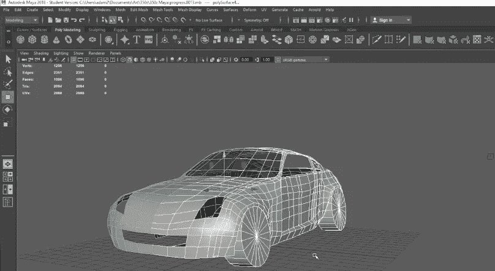

# 20 岁时赚 6 万美元，方法如下

> 原文：<https://medium.datadriveninvestor.com/60k-at-20-years-old-heres-how-a13bc160c742?source=collection_archive---------36----------------------->

## 从 2020 年依靠学生贷款生活，到 2021 年获得体面的收入

Photo by Author

我的名字叫亚当，去年我大学毕业时，我的银行账户上有一个大大的负数。我开始觉得我才 20 岁就有了中年危机，**我们称之为千年人生危机**！今天 21 岁，我将还清我的**3 万美元学生贷款**，这感觉再好不过了。

我想分享我是如何走到今天这一步的，即使我的收入并不算高。在我们赚到 100k 美元之前，我们必须赚到 1k，然后是 10k，以此类推。下面是我如何达到 60k 的，尽管一年前我根本不知道自己在做什么。

高中毕业后休息一年是我推荐给大家的。我尝试了很多事情，被选入了一个足球队，跟踪机械师，跟踪房地产经纪人，甚至一度试图成为一名**职业堡垒之夜流光**(这并没有成功，lol)。

Me last year streaming Fortnite

在那一年里，我知道了我不想做什么，但不是我真正想做什么。当时看起来没什么帮助，但确实有。

我一直热爱电子游戏，所以我选择成为一名**游戏开发者**。经过一年的紧张学习和 3 万美元的贷款，我掌握了一些技能！有些人说现在学校是浪费时间和金钱，但是我认为学校应该被看作是一种工具。如果你想为你的工作做些什么，但是你不知道该怎么做，那么学校就有意义了。另一方面，如果你有很多技能，而且你足够擅长这些技能，可以从中获得报酬，那么你就不需要学校了。

Photo by Author

谈到钱，我喜欢透明。在支付了 30，000 美元的学费后，我得到了一份起薪为 42，000 美元的工作。终于在这个行业找到了一份工作，这太好了，但我知道，以那样的薪水，我不可能在合理的时间内还清贷款。事实上，如果我回到零售业工作，我可以赚更多的钱…

Photo by Author

那时我知道我必须开始创造多种收入来源，所以这正是我所做的。

我通过在学校里学的自由职业技能又增加了 7000 美元。这不是一个长期的解决方案，因为我会花一整天的时间玩游戏，然后回家做同样的事情。这几乎是一个尽快达到精疲力竭的公式。这是一个很好的侧推，但我不得不替换它。

A freelance car project I worked on for a company (Nissan 350z)

尽管我精疲力尽，但我对努力赚钱有着真正的热情，即使它并不总是奏效..

我最后的 **$5k** 收入来自我的**两个 YouTube 频道**。其中一个专注于**生活方式和金钱**，另一个专注于**游戏**。到 2020 年，这些资源已经证明了自己的价值，而且随着时间的推移，只会赚得更多。

My Main YouTube Channel

My Second YouTube Channel

这些 YouTube 频道让我的收入增加到了 10 个不同的来源，仅这些渠道就有望让我在 2021 年收入超过 10 万美元……我将在以后的文章中分享和分解我的 10 个收入来源。

这就是我如何从在零售行业工作，每周 7 天每天 24 小时玩堡垒之夜游戏，到 20 岁时每年 6 万英镑的经历。

我非常感激能有今天，但这并不意味着我会安于现状。2021 年将是向前向上的伟大一年，不仅对我，对你也是如此！

*今年来拿吧~*