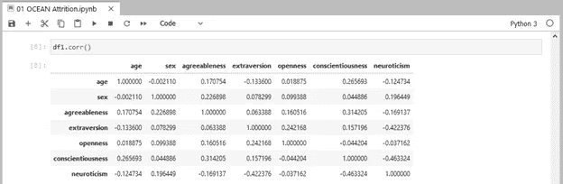
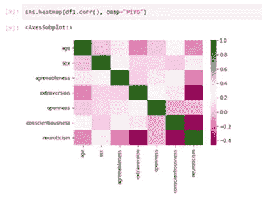
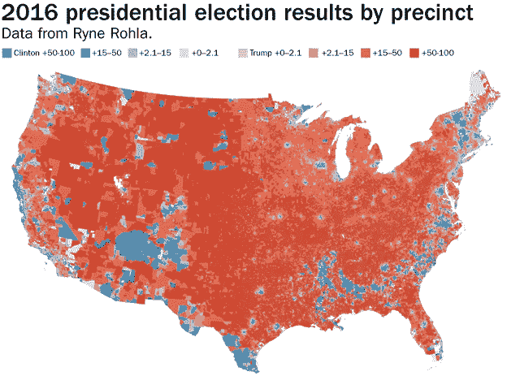

# 第六层——如果你能想象出来的话。你可以解释一下

> 原文：<https://medium.datadriveninvestor.com/6th-story-if-you-can-visualize-it-you-can-explain-it-d5b137ef0032?source=collection_archive---------31----------------------->

在最后一个故事中，我提到了一些我最喜欢的 python 库，以及为什么我认为它们很重要。对于那些已经开始学习数据科学的人来说，可能已经注意到我遗漏了最重要的一个:matplotlib。这不是一个错误，这完全是故意的，只是因为它值得自己的故事，这就是它。

换句话说，我们主要通过我们的眼睛来体验世界，这意味着当我们试图理解某件事情时，拥有它的视觉表现会让我们走得更远。

作为数据科学家，我们的角色是理解可用的数据，我们有时(或大部分时间)会忘记其他人没有我们的知识、背景，或者更糟的是，我们的俚语。尽管如此，我们必须确保其他人理解我们的见解和模型。

最近已经成为一个问题，有许多机器学习模型为我们做出决定，很少或根本不了解这些决定是如何做出的，有时是因为模型的复杂性(甚至连创造者都不了解它)，更常见的是，因为它从未向用户解释过。

所有这些都会对我们的工作产生巨大的负面影响，从我们的见解得不到理解，因此我们的价值变为零，或者花费数月甚至数年时间，构建由于缺乏可解释性而永远不会被使用的模型。

解决这一切的方法是在交流我们的发现方面变得越来越好，而最好的方法，因为人类的生物现实，是通过可视化。这里有一个简单的例子。这里有两种表示相关性的方法，首先让我们用表格来表示:

即使假设房间里的每个人都明白这个表格是关于什么的([查看我的#66DaysOfData 系列以找出答案)](https://medium.com/swlh/66daysofdata-day-1-asking-important-questions-2031fcf780ed)，人们也需要一段时间来理解这些数据，慢慢地查看这些数字，并花相当多的时间来找出哪些特征与其他特征更相关。如果我们把它转化成更视觉化的东西会怎么样？

正如我们所看到的，理解这种相关性的视觉表现要容易得多，我们可以忽略白色方块，专注于较暗的方块，很快理解最大的相关性在哪里。这只是一个相当基本的例子。想想看，你更喜欢一篇 1000 字的文章来解释一些事情，还是一张信息图？

可视化让我们用更简单的术语帮助他人理解任何事情。你可以这样想，编程是你和计算机交流的一种方式，有不同的语言，有的是低级的(更复杂，可读性更差，需要更多代码)，有的是高级的(不复杂，可读性更好，需要更少代码)。就人类而言，视觉信息是最高级别的代码。

现在你知道了，尽管我还想提一件事。数据和统计很容易被用来误导；因此，理解数据并确保它讲述真实的故事是我们日常生活的一部分。我们在政治中找到了最好的例子，在这种情况下，美国 2016 年的选举结果:

虽然共和党人(红色)以微弱优势赢得了选举，甚至输掉了普选(让我们不要进入过时的选举团制度)，但这张地图让你产生了共和党以压倒性优势获胜的想法。这与这一可视化的创造者的决定有关，他们将整个县涂成谁获胜的颜色，给予每个县的土地面积比选民数量更大的重视。众所周知，土地不投票，只有人投票。

这是地图的另一个版本:

这里我们看到代表选民自己的圆圈，它让你更好地了解选举有多接近。如果你比较两张地图，你会发现可视化的决定是如何对它真正想要解释的东西产生不可思议的影响。

让我问你:你会用哪张地图，为什么？

现在你知道了。这次是真的。下次见。

*希望我们在旅途中相遇…*

**杰克·雷弗·巴鲁克**

[**在推特上关注我:@JackRaifer**](https://twitter.com/JackRaifer)

[**在 LinkedIN 上关注我:jackraifer**](https://www.linkedin.com/in/jackraifer/)

*下一个故事:* ***到 SQL 和 NoSQL***

**关于数据科学之路系列**

今天，我正致力于基于数据科学和机器学习的非常有趣的人类发展项目的第一步。

但是不久之前(真的，一点也不长)，我对数据科学知之甚少，更不知道它意味着什么(我每天都在学习更多)。在我寻求将自己从行为经济学的心理学家重塑为数据科学家的过程中，我经历了一段非常有趣的旅程，学到了很多东西。这个系列主要是写给过去的自己的一封信，帮助像我一样的人走上这条神奇的道路，幸运的是，避免我在途中因缺乏知识或视角而犯下的一些错误。

希望你喜欢我的漫谈，就像我在通往数据科学的道路上找到快乐一样。

在旅途中需要帮助吗？

这可能是一条艰难的道路，所以请随时通过 [**LinkedIN**](https://www.linkedin.com/in/jackraifer/) 或 [**Twitter**](https://twitter.com/JackRaifer) 联系我。我开始这个系列是因为 Ken Jee 的#66DaysOfData 倡议，这是一个联系和获得支持的好方法，所以只需在 twitter 上查看 Ken[**@ Ken Jee _ DS**](https://twitter.com/KenJee_DS)并加入#66DaysOfData 挑战。

**我使用过的学习资源:**

[**Udemy**](http://www.udemy.com)

很多内容，有的免费，大部分付费。查看 cupon 网站，在那里你通常可以找到关于 python、R、数据科学、机器学习等课程的免费 cupon。

[**代号**](https://www.codecademy.com/)

有趣的地方学习，他们有一些免费课程，然后付费内容。很动手的编码练习，视频很少，大多是阅读。

[**Coursera**](https://www.coursera.org/)

我最喜欢学习的地方。成千上万的课程，大量关于编程、数据科学和机器学习的内容。密歇根大学有很多 python 编程的课程，从最基础的到复杂的都有。所有课程都是免费审核的，如果你想获得证书，你只需付费。

[**Freecodecamp.org**](https://www.freecodecamp.org/)

学习编码的最免费的地方。几乎任何语言的数百小时免费视频。他们现在也有认证，也是免费的。

[YouTube](https://www.youtube.com/)

学习一切的地方。所有这些都是免费的，可能需要一段时间才能找到你想要和喜欢的内容。

**数据科学的顶级网站，也举办许多竞赛。他们有很多免费的课程，但编程部分很少，一些基础的，都集中在数据科学和机器学习上。**

**[**data quest**](https://www.dataquest.io/)**

**类似 Codecademy，有很多路径和课程。部分免费内容，其余付费。非常专注于数据科学。**

**[**Codewars**](http://www.codewars.com)**

**我最喜欢的练习代码的地方，从初学者到高级的每个级别的挑战。这是一个挑战自我和检查自己进步的好地方。**