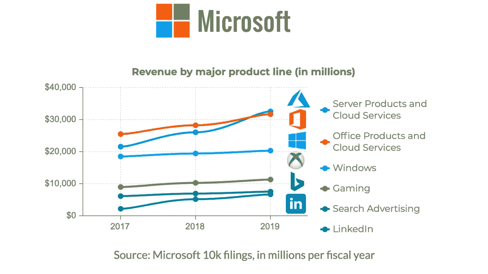
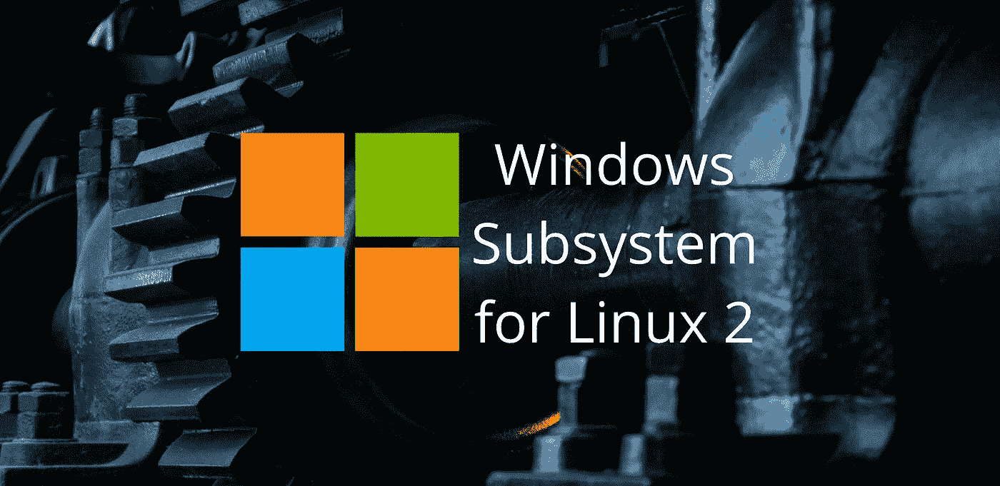
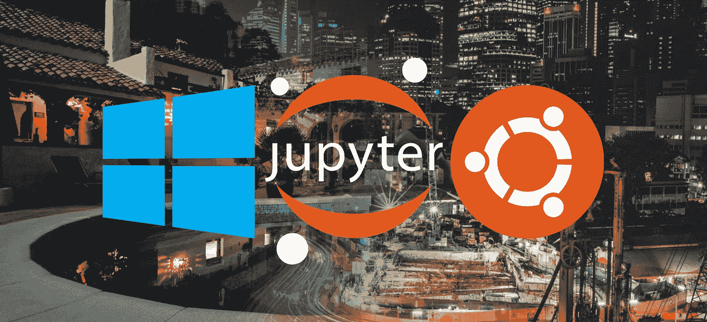

# 7.5 使用 Linux 2 的 Windows 子系统(WSL2)之前需要考虑的事项

> 原文：<https://medium.datadriveninvestor.com/7-5-things-to-consider-before-using-windows-subsystem-for-linux-2-wsl2-552662e7a4ee?source=collection_archive---------5----------------------->

## 创始人指南:

## 它实际上能为学生、开发者和创始人做些什么？


> " Linux 是一个癌症，从知识产权的角度来说，它附着在它接触到的所有东西上."
> 
> —史蒂夫·鲍尔默—

## 简介:

拥抱、扩展和消灭(EEE)是一种策略，指的是创建一种与开放标准兼容的产品，为产品添加新功能，并利用这些功能获得强大的竞争优势。它适用于那些利用其市场支配地位获得开放标准非官方所有权的公司。这是微软众所周知的事情，也是为什么许多用户怀疑它最近对 Linux 和开源的支持。



Image by Author

然而，也有其他人认为微软对开源有了真正的改变，这可能源于不断变化的市场。这可能与服务器产品和云服务已经成为他们最大和增长最快的收入来源(包括 Azure)有关。这很有趣，因为 Azure 被认为是其细分市场中的一大收入驱动因素，并且它运行的超过 50%的虚拟机都是 Linux。

## #1 微软想证明它对开源是 100%认真的:


Image by Author

微软已经实现了一些令人印象深刻的里程碑，这与他们关于拥抱 Linux 和开源的声明是一致的。它目前雇用了超过 35，000 名工程师参与开源项目，并维护着超过 3，800 个开源项目，如 PowerShell、Windows 终端等。NET 核心和 Visual Studio 代码。它还使用超过 150，000 个开源组件来构建其产品和服务。

微软也一直在开源社区中贡献和建立关系。它是众多开源相关组织和倡议的创始成员、加入成员、贡献成员和/或发起者。它还与 Canonical 等组织建立了持续的合作伙伴关系，Canonical 帮助将 Ubuntu 等操作系统带到 Windows 10 的 Windows Subsystem for Linux 2 (WSL2)中。

微软在开源社区也做出了一些值得注意的善意行为，比如向开放发明网络(OIN)捐赠了 60，000 项专利。它收购了 Xamarin，并将他们以前昂贵的产品和服务免费重新分配给开发者。它还收购了 GitHub 并升级了他们的免费计划，以包括无限数量的公共库、私有库和合作者。

## #2 微软在 WSL2 上实现了 Windows 与 Linux 的互操作:



Image by [Isis França](https://unsplash.com/photos/hsPFuudRg5I)

WSL2 允许用户从基于 Windows 和 Linux 的图形程序中访问同一组文件。它还可以使用命令行程序和文件资源管理器在两个文件系统之间打开、修改和传输文件。否则，这将要求用户设置一个与两个文件系统兼容的共享存储驱动器，这可能需要很长时间来配置，涉及第三方软件，并导致与文件损坏相关的问题。

WSL2 还可以从 Linux 命令行运行 Windows 程序，输出直接在 Linux 中处理和显示，反之亦然。它甚至可以在输出中使用 sudo、管道和文件重定向等特性。否则，这将需要像 Wine 或虚拟机这样的第三方程序在 Linux 上运行 Windows 程序，反之亦然，这仍然需要像 web API 这样的东西在操作系统之间传递数据。

## #3 微软在 WSL2 上实现了 NVIDIA CUDA 和 GPU 支持:


Image by [Nana Dua](https://unsplash.com/photos/aVeKubCF-48)

WSL2 可以像本地 Windows 程序一样访问计算机上的图形处理单元(GPU ),这允许它使用 CUDA 加速运行完整的工作负载。它与 Docker 容器和现有的人工智能、机器学习和数据科学工作流配合良好。它还支持与 DirectX 12 兼容的所有 NVIDIA、AMD 和英特尔 GPU，这有助于让学生和初学者更容易进行机器学习。

## #4 WSL2 可以访问仅在 Linux 上可用的程序:


Image by [Markus Spiske](https://unsplash.com/photos/iar-afB0QQw)

WSL2 提供了对 GitHub 上千种程序的访问，这些程序要么只在 Linux 上受支持，要么在多种操作系统上受支持，但其 Windows 程序无法运行。它可以用来用正常工作的 Linux 程序替换坏掉的 Windows 程序，从而减少修复错误和重写代码所需的时间。它还可以用于将所有 Windows 和 Linux 程序集成到无缝工作流中的脚本中。

## #5 WSL2 可以使用 Jupyter 笔记本在任何地方运行工作流:



Image by [Vita Vilcina](https://unsplash.com/photos/KtOid0FLjqU) and [Lily Banse](https://unsplash.com/photos/mjXf6po0TWs)

WSL2 可以运行一个 Jupyter 笔记本服务器，该服务器可以从家里本地网络上的一台单独的笔记本电脑或台式电脑上访问，也可以从公共的远程网络上访问。它可以使用主机上的物理硬件运行工作流，包括中央处理器(CPU)时钟速度、CPU 内核、随机存取存储器(RAM)、GPU 和存储驱动器。它还可以使用终端在主机上运行系统外壳中的任何内容。

## #6 WSL2 可以使用图形用户界面运行 Linux 程序:


Image by [Sean Foley](https://unsplash.com/photos/kMpbE_-jCeI)

通过在 Windows 上运行一个监听 Linux 上 X11 图形程序的 X 服务器，WSL2 已经可以运行带有图形用户界面(GUI)的 Linux 程序了。它可以在自己的窗口中运行一个或多个 Linux 图形程序，与同一桌面屏幕上的 Windows 图形程序相邻。这是微软计划集成到 WSL2 中的东西，使用非常相似的过程，提供无缝的体验，开箱即用。

## #7 WSL2 可以运行带有图形用户界面的 Ubuntu 桌面:


Image by Author

通过在 Windows 上运行一个监听 Linux 上 X11 图形程序的 X 服务器，WSL2 也可以运行带有 GUI 的桌面环境。它可以运行 GNOME 3，这是 Ubuntu 18.04 的默认桌面环境，但也有许多其他桌面环境可用。这不是微软计划集成到 WSL2 中的东西，因为他们的目标是将 Linux 程序添加到 Windows 10 中，而不是取代它。

## #7.5 学生、开发者和创始人的进一步阅读材料:

这篇文章是一个迷你系列的一部分，帮助读者设置他们开始使用 WSL2 进行人工智能、机器学习、深度学习和/或数据科学所需的一切。它包括包含复制和粘贴代码的说明的文章和帮助读者尽快得到结果的截图。它还包括一些文章，这些文章包含带有解释和截图的说明，有助于读者处理正在发生的事情。

```
01\. [Install Windows Subsystem for Linux 2 (WSL2)](https://thealtruist.medium.com/how-to-install-the-windows-subsystem-for-linux-2-wsl2-534598c73a25)
02\. [Install the NVIDIA CUDA Driver and Toolkit in WSL2](https://thealtruist.medium.com/how-to-install-the-nvidia-cuda-driver-and-toolkit-in-wsl2-46e2161c91d8)
03\. [Install Software From Source Code in WSL2](https://thealtruist.medium.com/how-to-install-software-from-source-code-in-wsl2-aa233707073a)
04\. [Install the Jupyter Notebook Home and Public Server in WSL2](https://thealtruist.medium.com/how-to-set-up-the-jupyter-notebook-home-and-public-server-in-wsl2-a8ceaff6c41c)
05\. [Install Virtual Environments in Jupyter Notebook in WSL2](https://thealtruist.medium.com/how-to-use-virtual-environments-in-jupyter-notebook-in-wsl2-60f6e150b841)
06\. [Install Programs With a Graphical User Interface in WSL2](https://thealtruist.medium.com/how-to-install-programs-with-a-graphical-user-interface-gui-in-wsl2-e8ea9476cb78)
07\. [Install Ubuntu Desktop With a Graphical User Interface in WSL2](https://thealtruist.medium.com/how-to-install-ubuntu-with-a-graphical-user-interface-gui-in-wsl2-5c188c0a261a)
```

> 希望这篇文章能帮到大家拿奖。如果你想帮忙，就拿着"👋”并点击“关注”以获取更多内容。感谢阅读！